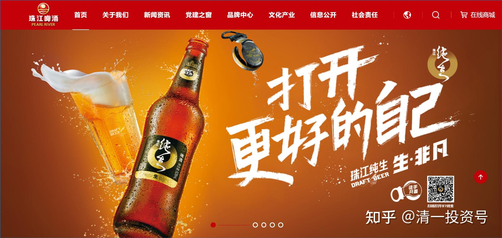
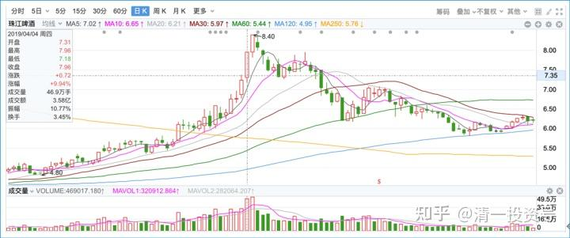
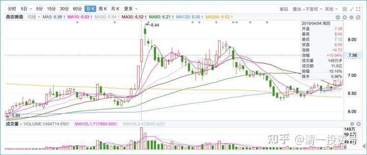

1篇.[涨停之际，谈我的啤酒股投资逻辑](http://link.zhihu.com/?target=https%3A//xueqiu.com/9310099567/124533350)

清一山长2019年4月4日

一、铺垫——四家啤酒销量和利润分析

[清一山长](http://link.zhihu.com/?target=https%3A//xueqiu.com/9310099567) 2018-06-26 11:04

$珠江啤酒(SZ002461)$

**过去的五年，是啤酒市场销量逐级下滑的五年。**

青岛啤酒从2013年的870千升到了2017年的797千升，

燕京更惨，下滑幅度更大。从571千升下滑到416千升，下滑的量，相当于消灭了一个半的珠江。

而珠江是两家这五年保持了正增长的啤酒企业，从2013年的110千升上升到了121千升。

另一家是华润，从1172千升上升到了1182千升。基本只能算是在同行下滑的情况下，勉强保持了销量没有跌。从绝对数值上，远远赶不上珠江10%的逆市增长。

**净利润率上，**

珠江从2013年的1.23%，上升到了2017年的4.93%。也就是说，珠江是五大啤酒企业中唯一在逆势环境中，保持了价量齐升的企业。

同期燕京从2013年的4.95%，下降到了2017年的1.44%。

行业龙头华润，净利润率，也从2013年的5.80%跌到了2017年的3.99%。**说明华润是牺牲利润，维持住了市场占有率。**

在千升利润这个指标上，珠江从2013年的37，上升到了2017年的153。与青岛啤酒的158差不多。而青岛在2013年是令人羡慕的高利润的227下滑到158的。拥有国内最有价值的啤酒品牌，啤酒中的“国酒地位”，却让这个品牌的价值逐年下降，到了2017年，**居然跟毫无根基的珠江啤酒利润差不多了**。青岛的品牌溢价是如何体现的？对于这五年的比赛结果，应该说市场太残酷，还是青岛太差？或者是珠江太优秀了？

同期，燕京从2013年的千升利润119，跌倒了2017年的39，业绩惨不忍睹，跟珠江完全反向运行。市场份额丢了，利润也丢了。

值得一提的是重庆啤酒，丢了市场和销量，但是维持甚至提高了利润。所以股价也节节高升。可以说，过去的五年，是燕京节节败退的五年，同时也是珠江不断逆势上升的五年。所以，珠江比燕京估值高也不奇怪。

当然，**燕京目前，是最佳的“困境反转”题材。未来如果行业有改善，可能燕京的业绩弹性会最大**。另外，燕京的销量第三地位，如果与其他任何一家强手（青岛和华润）并购联手，消除竞争，就会成为市场份额第一的企业。所以也许未来会有并购题材，提升燕京的估值水平。而珠江已经是外资百威英博控股（第二股东），不太可能有这种“改嫁的机会”。**所以燕京博的是“反转和并购”题材，珠江博的是行业的“优等生”今后继续优秀的可能。**虽然体量不大。知名私募买入燕京的理由是什么？我真不知道。但是我个人更看好珠江，虽然也买了一些燕京。以上分析，纯属个人观点，不构成投资建议。据此入市，风险自担。

**本人持有珠江、燕京和青岛啤酒。看好中国的消费升级。**

**二、正题——[涨停之际，谈我的啤酒股投资逻辑](http://link.zhihu.com/?target=https%3A//xueqiu.com/9310099567/124533350)**

[清一山长](http://link.zhihu.com/?target=https%3A//xueqiu.com/9310099567) [2019-04-04 21:14](http://link.zhihu.com/?target=https%3A//xueqiu.com/9310099567/124533350)

*珠江啤酒 2019-04-04*

*燕京啤酒 2019-04-04*

今天，珠江、燕京双双涨停，颇出我的意料之外。

首先是燕京昨天刚刚涨停，今天再度涨停，涨的太急了。有点像是大风来了，聪明的资金，不惜涨停价抢货，也要拿到足够的啤酒仓位。今天燕京成交超过了11亿，1.5亿股已经换手了。都是涨价抢的货，太不可思议了。难道十年不遇的啤酒股风口真的来了？尾盘的时候，我看珠江也跟着玩涨停，于是忍不住，挂了涨停价，卖掉了60万股珠江，加上7.99出的2000手燕京，以及早上7.49出的2000手珠江，**今天总共卖出了100万股啤酒股。大约占我啤酒股总仓位的13%左右。**我怀疑，有可能我是“中国啤酒第一牛散”，国内恐怕没有任何散户比我持有更多的啤酒股了。

去年我开始大量买入啤酒，虽然也买入了不少白酒股，但依然把大仓给了啤酒，白酒自减仓顺鑫之后，投资额就没有超过千万了——也因此失去了一波白酒上涨的行情。眼巴巴地看着自己的啤酒原地不动。为啥对啤酒这么“钟情”呢？敢于投入这么多资金买入十年不涨的啤酒？就不怕再等个十年吗？

其实，**我买入的主要逻辑，就是因为啤酒“十年不涨”。我买入的价位，基本上都是十年的底部位置。**这个位置，对我这个胆小的人来说，是“安全系数”极高的位置，不太容易让我亏钱。我一直有恐高症，看着上涨的股票，虽然自己也喜欢，但下不了手。比如茅台——我就一直挂眼科，光看不下手。当年觉得完全可以买茅台的价格到来的时候，我也被我认为更低估的14元的五粮液和16元的泸州老窖吸引，放弃了买入茅台的机会，有点傻气，但我感觉安全得多。其实现在看，涨幅也差不多。

**啤酒买入的另外一个逻辑，不仅仅是因为“十年低估”，而是我到泰国才发现：中国的啤酒价格好低喔。**一罐中国啤酒，我记得也就2元钱。可是泰国的一小罐最普通的啤酒，超市售价是36泰铢。一瓶最廉价的泰国玻璃瓶啤酒，价格是12元人民币。中国似乎才2～3元。我还知道中国啤酒的吨价，只是日本啤酒价格的16%。**实际上，中国的啤酒，几乎是卖得比水还便宜，是全世界最低的价格。**

**中国全部啤酒公司的市值，加起来还不如一家国际啤酒公司的市值高。**

这些指标，对我来说，**都指向了一个事实:中国的啤酒和啤酒股都太廉价了。**对于我这种喜欢捡便宜的人来说，这么好的机会，十年没涨的股票，干嘛不敢要？所以就一直买买买，直到买成了第一重仓股。然后——我就睡觉去了。管你涨涨跌跌的，反正我相信未来五年，我至少有一次卖出的机会，就够了。所以，我把珠江买成了第一重仓，燕京是第二重仓，还买了一些青岛啤酒。青岛没有成为重仓的原因，是青岛贵了一点点。（现在来看也不贵）。再有就是我觉得珠江和燕京，有独到的，青岛没有的题材。**比如我可以看到珠江很明显的主力进入痕迹（因此我珠江仓位远远高于燕京——跟主力共进退嘛），燕京是最差的业绩，但差到这个份上，也只有反转的份了。所以我才重仓了这两个一般人看不起的股票。**

**去年我从珠江冲高7.7元的高峰成功逃离出来之后，看着账面上远远超过上一次买入的珠江股票，我知道有一天，珠江重新回到7.7，我的账面盈利会比上一次多出很多来。为了庆祝这一天，我暗暗地想：我至少应该卖出一百万股，今天的卖出，就是兑现原来的“愿景”，**不想上涨后就耍赖，反正退出来的资金也是有用的。

**假如卖出后股价往下走，我会继续买入更多的股数，把超额的利润变成股票。**

**继续往上走？我就继续慢慢的卖掉，让啤酒仓位成为我的提款机。没必要一次性走掉。**

这个策略，让我从酒行业的股票上获得了超过中国建筑的收益。当然，投入也比中国建筑大一些。单只股票而言，中建依然是我赚钱最多的股票，如果珠江继续疯涨，有可能会超过中建的。

我的A股账户，主要是酒，其次是医药类，都是我不喜欢的东西。虽然顺鑫帮我赚到了比五粮液和泸州老窖更多的利润，但我连顺鑫的光瓶酒都没买过，也没喝过。啤酒也一样。其实我基本上不喝啤酒，当然也不喝白酒。春节买的六瓶泰国大象啤酒，现在还放在厨房里面，就节前陪朋友喝过一次。

未来啤酒股走向怎么样？说实话我不知道。我没有预测的能力。

但我知道的是：**珠江主力控盘程度很高，浮码较少。所以珠江股价的涨跌，全凭主力心意了。涨到天上不稀奇，跌到地上也不稀奇。**

至于燕京，很奇怪：似乎现在有人急吼吼地抢燕京，似乎有重大题材出现。下一步，应该是涨涨跌跌的吧？总要洗洗牌的。但从长期的位置来看，这两只股，都是刚刚起步罢了。它们甚至还没有走出历史高点。未来，应该会有很精彩的故事。我们就慢慢地看热闹好了。对我来说，8元以上，这两只股，我都愿意卖出了。**如果涨急了我就卖，卖掉了又跌，我就继续买回做T加仓。**白白地跟随主力捡钱。如果T飞了，算我没财运，就算了，不跟了，慢慢的下车就是。这样一路走下来，我相信利润会比傻傻地守住更好一些。就是说：明天假如下跌，不排除我会把今天卖掉的部分买回来。但我绝对不再加仓了。**高位只补仓，不加仓。**这是我的原则，以后我也不再做啤酒的操作示范了。怕你们看我买你也买，看我卖你也卖。但其实你我买卖的逻辑，是完全不一样的。**因为买入后套牢了，我摊低了成本。卖出后飞了，我还有仓位。**所以，别学我了，我也不再示范了。

祝福大家！
