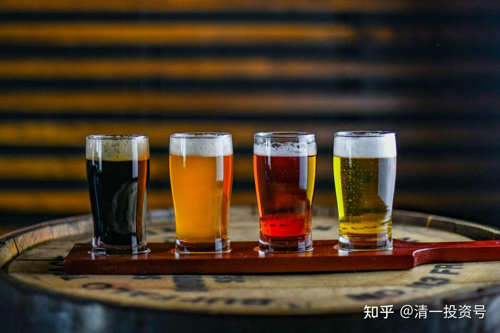
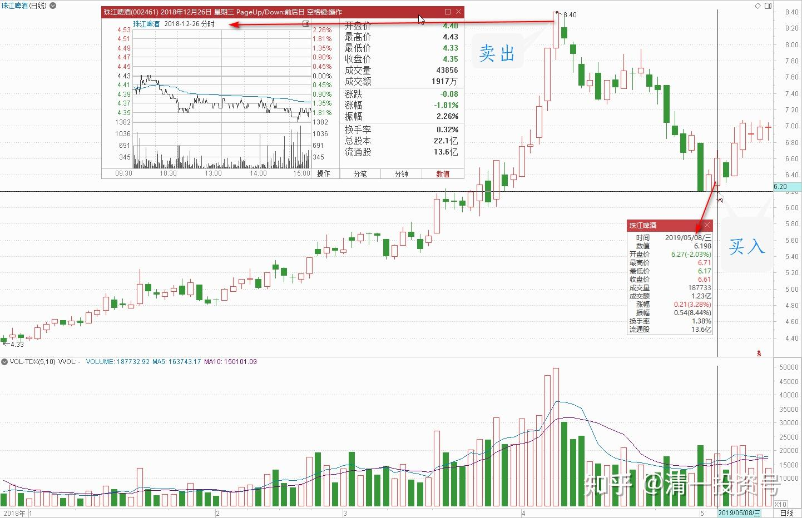
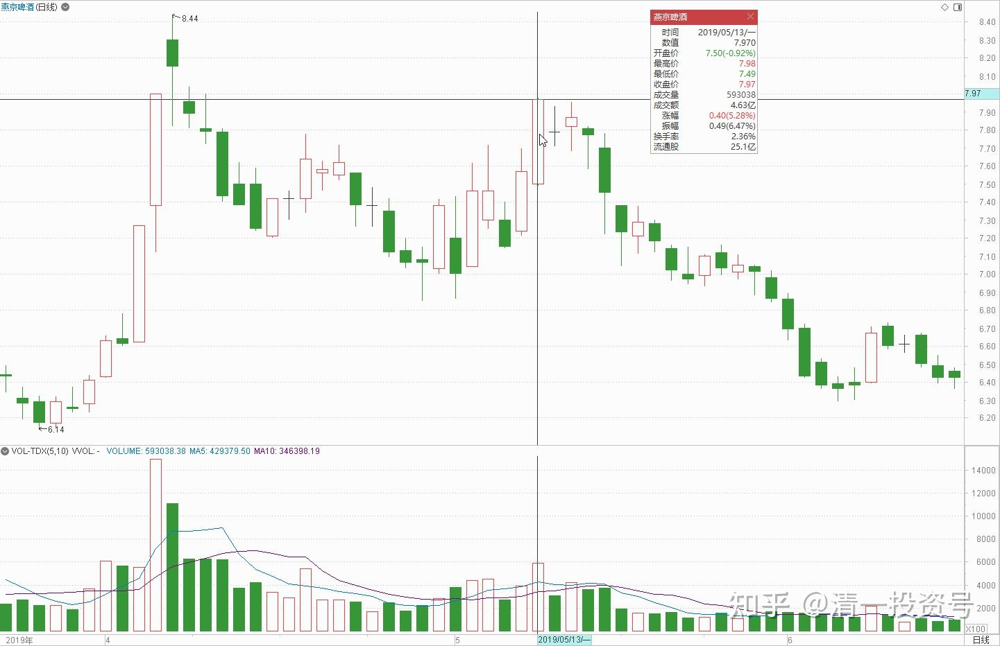
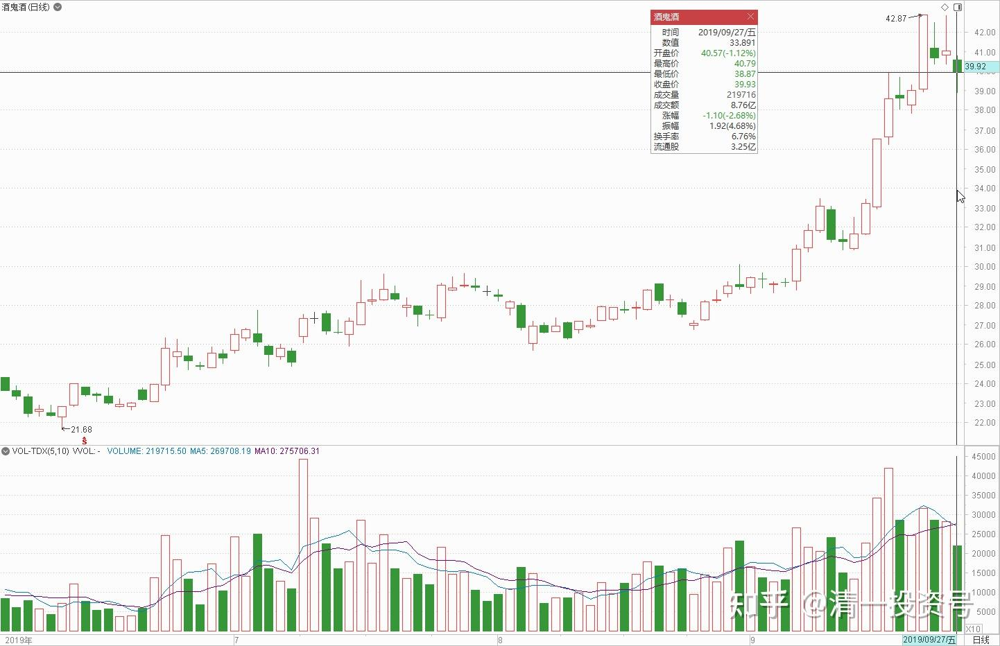
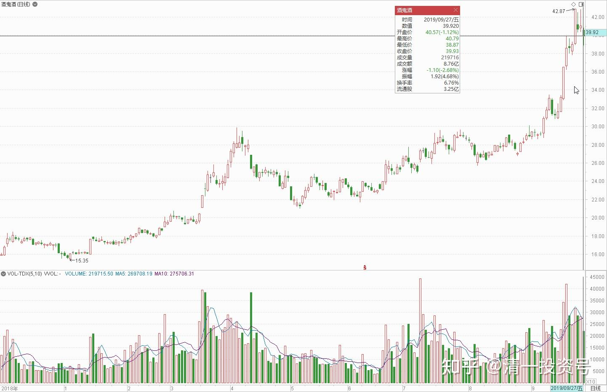
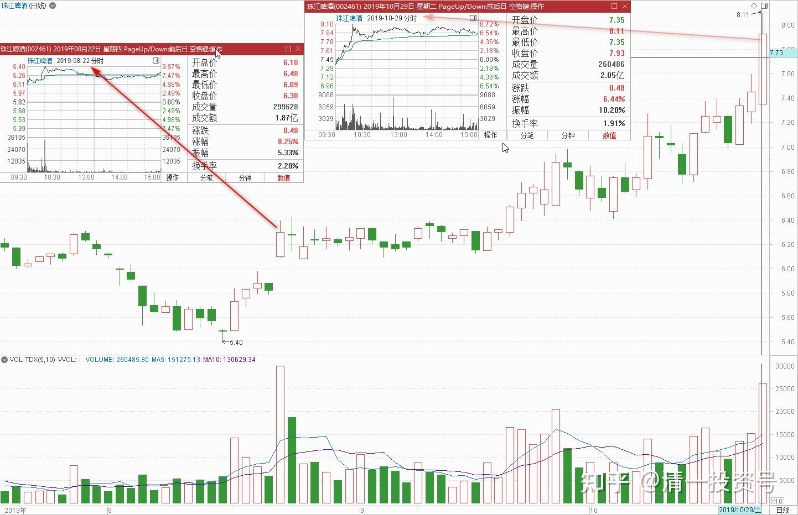

20篇.投资啤酒股是买困境反转的行业

清一山长 2019年5月8日～10月29日

**一、投资啤酒股，就是买困境反转的行业**

蓝莓财经 2019年05月07日 21:33

《后劲不足的燕京啤酒，能否打赢翻身之战？》

随着近三十年来产能和需求的快速扩张，我国啤酒工业得以迅猛的发展，在世界舞台中已成长为啤酒产销的第一大国。有数据显示，2016年我国啤酒产量达到4562.71万千升，占全球总量1.93亿千升的24%，超出第二名美国近一倍之多……

链接：[https://www.jiemian.com/article/3105805.html](http://link.zhihu.com/?target=https%3A//www.jiemian.com/article/3105805.html)

[后劲不足的燕京啤酒，能否打赢翻身之战？|界面新闻 · JMedia](http://link.zhihu.com/?target=https%3A//www.jiemian.com/article/3105805.html)

清一山长 2019-05-08 10:37:51评论上文

有数据显示，2016年我国啤酒产量达到4562.71万千升，占全球总量1.93亿千升的24%，超出第二名美国近一倍之多。

啤酒中国产量世界第一，利润呢？连零头都不到。只要有一天恢复正常的利润，中国啤酒成为利润世界第一，啤酒股市值世界第一，将来是毫无悬念的。茅台可以市值万亿，啤酒未来市值万亿也未必不可能。**所以，我投资啤酒股，就是买困境反转的行业。至于燕京是否龙头倒是不重要。**因为我错过了买入16元港币的华润，一直耿耿于怀。只好找珠江和燕京了，吃点啤酒的鸡肋，总比吃鸡毛好[大笑]。

以静为先2019-05-08 10:25

$珠江啤酒(SZ002461)$ 我真的是个绝好的反向指标，大家快参考我。买入必跌（8.18绝对顶部），卖出必涨（6.28绝对底部）。其它股也是一样的。不够不够，还不够。

链接：[https://xueqiu.com/2271198811/126287141](http://link.zhihu.com/?target=https%3A//xueqiu.com/2271198811/126287141)

[$珠江啤酒(SZ002461)$ 我真的是个绝好的反向指标，大家快参考我。买入必跌（8.18绝对顶部），卖出必涨（6.2... - 雪球](http://link.zhihu.com/?target=https%3A//xueqiu.com/2271198811/126287141)

清一山长 2019-05-08 11:25:40山长评论上贴

您真是太有财了[很赞][很赞]。“财布斯”降世，救苦救难吗？专门高买低卖？而且你似乎特别喜欢8，买进卖出价格都带“发”的。恭喜发财[主力]

我是穷人，就想通过股市多赚点教育费用，买点课桌啥的。所以呢，**价高就光想卖的事情了；看到价低了，又光想买的事情了**。**高不抢，低不卖。**真没法与各位富得流油的大爷们比出手阔气。本轮珠江，我的操作是：最高8.37元卖掉30W。最低6.20元买回40W珠江。这两次操作，没有多花钱，白捡了10W进来。

其实如果您8.18元买了珠江，就睡觉去，一两年之后，说不定就翻倍了[大笑]。**我就两年内都不想卖出啤酒的，有空了，无聊了，就做做T玩。**

**二、我认为我永远也不会卖光珠江啤酒的**

清一山长 2019-05-13 15:12:28

$燕京啤酒(SZ000729)$ 今日操作：**换股，分别于7.97元挂单卖出13.5万股燕京，之前与7.84元卖出10万股燕京，总共23.5万股。另外，分别以6.94元，6.96元买入23.5万股珠江。尽量保持我的啤酒账户不减仓。**目前燕京持仓略多于珠江。这是前期珠江涨高过燕京后换股的结果。这种换股方式，我以为是怎么都不会亏的。假如燕京继续涨，两者的股价距离拉开，我就继续换好了。（申明，请勿模仿我的操作。目前我的珠江持仓成本才4元多，不怕套。卖出部分燕京，是希望降低燕京的持仓成本。并不是不看好燕京。**主仓依然未动。**模仿买入者，万一下跌造成亏损责任自负）。

清一山长 2019-09-27 14:54:35 （主贴1）

$酒鬼酒(SZ000799)$ 酒鬼酒是我今年很失败的投资品种，原因是：虽然买入的时点，以及价格都很好，16～17元每股就买入了，而且一直没卖。失败的原因是买入数量太少，还不到10万股。迎驾贡酒17元多也在不断买入，买入了50万股，**原因是它是白酒股分红率最高的股。**酒鬼酒就因为过往业绩不佳，就不敢多拿，有点赌一把“内参”走红的心态才买的。但是，以百万股为单位买入的燕京，却创造了多年新低。给人的感觉，就是买白酒比啤酒要靠谱一些[哭泣]。要不就是今年的运气没有去年好了[捂脸]。

水深火热2018回复清一山长：（跟评主贴1）

酒鬼酒目标多少啊？

清一山长 2019-09-27 15:21:46 回复水深火热2018:

我跟你们不一样，知道自己**没本事去决定股票应该以多少价钱交易**。我定的酒鬼酒目标，就是：假如还跌破17元，我就继续多买一些。高于现价，可能会随时卖[大笑]。万一缺钱，我就卖掉土豪股，去买乞丐股。

珠江啤酒(SZ002461)发布于2019-10-24 21:22

《珠江啤酒 走不出来的“华南王”》

近日，国内啤酒资本市场端发生震颤，出现集体下滑的情况，其中作为“华南王”的珠江啤酒（002461）波动最为明显。截至北京商报记者发稿，珠江啤酒每股最新价为7.01元，涨幅-3.31%，总市值达155.71亿元。除在资本市场端遇冷，珠江啤酒在市场……

链接：[https://xueqiu.com/S/SZ002461/134571181](http://link.zhihu.com/?target=https%3A//xueqiu.com/S/SZ002461/134571181)

清一山长 2019-10-25 10:16:59（主贴2）

现在发这种文章，主力的意思就是公开表达：“别碰我。有危险"。友情提醒散户“股市有风险”。现在监管措施强，吹票有危险，质疑可以接受。作为珠江啤酒的大股东，我坚决支持珠江，看好珠江的未来[大笑]。我在香港，好好看珠江这两天股价窜上跳下的玩把戏[干杯]。特别提示：我的持仓成本才四元多，的确觉得现在股价有一定的风险，不支持各位买入。我也不支持自己卖出。到8元我就可能会开始卖了[大笑]。

Maxwell_Max回复清一山长:（跟评主贴2）

山长兄，古越龙山请问有目标价吗？

清一山长 2019-10-25 10:28:45回复Maxwell_Max:

珠江我也没有目标价。只是涨了之后，我一般会习惯性慢慢卖出一部分，愿意少赚一点，**我认为我永远也不会卖光珠江啤酒的，只是会跌出十大股东的名单罢了。**卖掉一部分，有了酒钱，我会再去买一些依然留在底部的股票。我是捡破烂的。**见不得涨得好的股票，越涨我越卖，越跌我越买，直到买成大股东为止**。如果古越就是不涨，就等我用高价啤酒换低价黄酒喝[笑]。

明达野老回复清一山长:（跟评主贴2）

赞同山长的观点。昨晚看到这个新闻，跟朋友打趣说，这俩记者你们可以“登记入册”了，标准的配合昨天做弱的新闻，主力越想这样玩，证明他越是在摩拳擦掌了，持有等等就好了，新开仓还是不要干了。

前几天故意做弱，今天上午的盘口挂出来的30万股一档的卖盘瞬时被收，这是真“弱”？我看不像，倒是感受到主力在屏幕的那一面笑呢！笑这些单子的主人真给面子。下一步应该是准备冲击7.4～8.3元的档口了。所以我暂时不动，先看戏，何时开始“秀肌肉”，我就撤一点。$珠江啤酒(SZ002461)$

清一山长 2019-10-25 10:38:52回复明达野老：

[赞成]。看来我们俩都对中国记者的职业素养和公开报道信心不足，内心有点阴暗面[大笑]。**反正我看到这种贬低我持仓股票的文章，持股就安心多了，知道可以安心睡觉。反而看到有吹票的文章，立马的反应就是：是不是该卖了？**当年就非常感谢摩根大通等国际券商，公开研报吹正通要到14元，害得我十元不到立马就全跑了，今天看2元多了[哭泣]。

清一山长 2019-10-29 18:19:38

$珠江啤酒(SZ002461)$ 挺有意思的。明明有拉涨停的实力，却就是不肯拉，为什么？8月22日成交接近30万手，也是不肯拉涨停。结果近期缓步升高。今天不拉，是不是希望持股的人失望一点？看衰一点？

实话实说，**今天如果涨停了，我喜欢照顾想买买不到的人，至少要出掉一百万股来“平抑市场”。但是如果就是没涨停，证明市场上没人急着要货，我就只能一股不卖了[俏皮]。**等着看戏吧！

(标题、图片为编者所加)

**参考链接：**

[YJ走势果然神鬼难料\[表情\]](https://www.zhihu.com/pin/1604810289215668226)

[发表今天的想法，就是非常的感谢，感谢这…](https://www.zhihu.com/pin/1604504352521158656)

[8篇.初谈燕京](https://zhuanlan.zhihu.com/p/594537053)

[9篇.起码十年不涨就值得一起守候了](https://zhuanlan.zhihu.com/p/596134341)

[11篇.啤酒系列4：连连出台的质疑文让我加紧了买啤酒的行动](https://zhuanlan.zhihu.com/p/598382916)

[12篇.啤早期珠江啤酒、燕京啤酒的换仓记录](https://zhuanlan.zhihu.com/p/602033762)?

[13篇.买卖操作后的富足之心](https://zhuanlan.zhihu.com/p/604162057)

[14篇.珠江的破位急跌，名曰跌停进货法](https://zhuanlan.zhihu.com/p/606062514)

[15篇.金融市场是考验心态和修为的地方](https://zhuanlan.zhihu.com/p/608010478)

[16篇.啤酒系列9：买入的理由不是因为要涨，而是因为没有多少下跌空间](https://zhuanlan.zhihu.com/p/609653689)

[17篇.只记住一件事：低价不卖，高价不买](https://zhuanlan.zhihu.com/p/611574943)

[18篇.炒股美德——亏赚两相宜](https://zhuanlan.zhihu.com/p/611564523)

[19篇.啤酒是一个难得的大潮](https://zhuanlan.zhihu.com/p/613467605)

