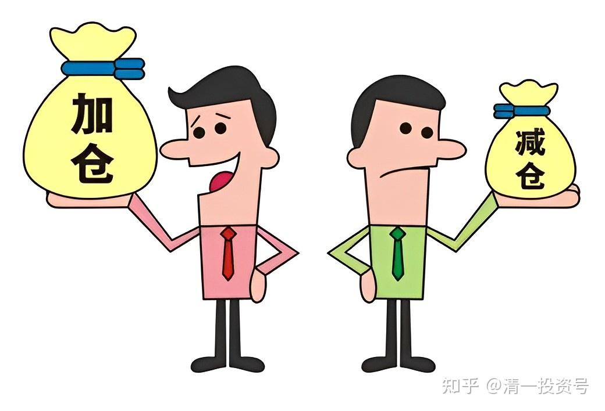
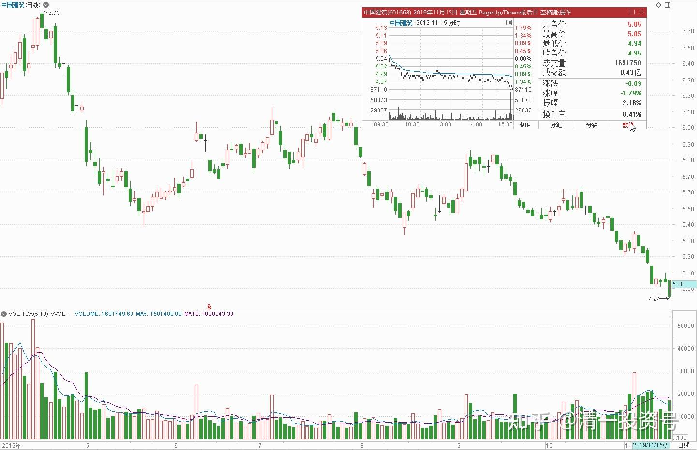
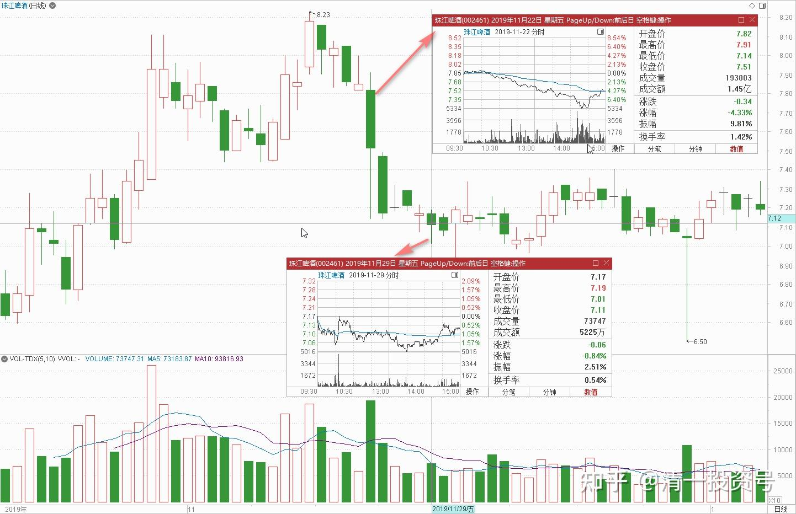
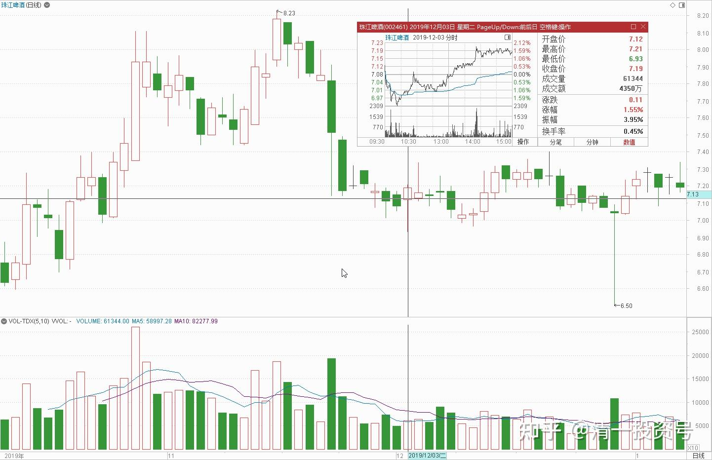
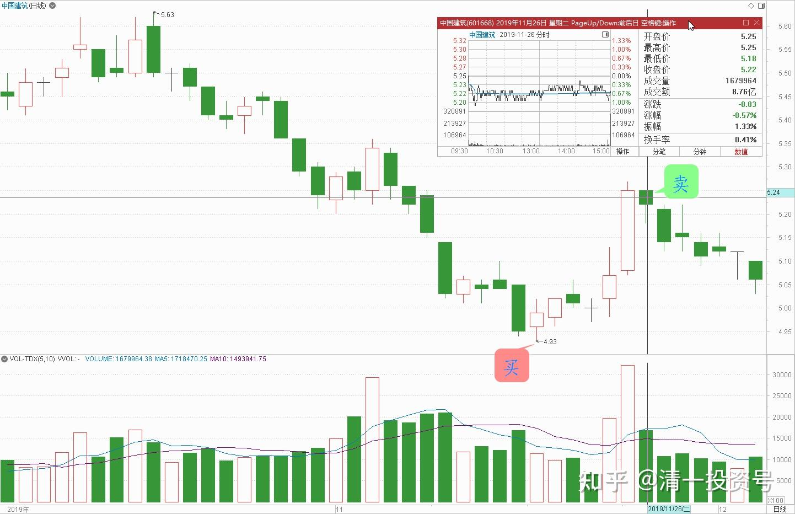

21篇.绝不买入超过卖出仓位的数量

清一山长 2019年11月15～26日

一、**谁是中国最大的庄家**

清一山长2019-11-15 18:14:09（主贴1）

$中国建筑(SH601668)$今天上了一整天的课，刚下课回来，中建居然真的破五了。该我实践诺言，下个交易日买入100万股先。看看自选股，正好我重仓的珠江啤酒今天意外涨了，只要卖掉60万珠江，钱够换换了。再跌就再换[大笑]

傻猫其实挺智慧回复清一山长：（跟评主贴1）

山长买完的股票一般会先跌几个点，我等再跌几个点再买，有山长在前面顶着，不怕[捂脸]

清一山长2019-11-15 20:08:42 回复傻猫其实挺智慧:

[很赞]。你说得对！其实不是才几个点啦！经常我买后还会跌20个点[哭泣]。瞧我我做十大股东的珠江就知道了：我买完后居然还继续跌了20个点，账面最多时亏了几百万。很多跟我的人，成本都比我低。我只是熬得住，低点没卖，才侥幸没亏的。这不，现在连本带利的，全都回来了，**关键是亏了要淡定**[笑]。

其实我知道：中建现在开买，很不理性。首先是现在比中建便宜的股票还有一大把，不一定要买中建。其次是中建带量突破多年的低点，除了安邦，不少基金都在卖出，很不吉祥。就算现在是相对低点，但什么时候起来，看起来遥遥无期的。所以，我现在决定买入100万股，绝非理性的表现。只是为了兑现原来的承诺罢了，我可不想说话不算数。**真心来说，短期内守住珠江（看样子风口刚起来），恐怕比买入中建等风来更靠谱一些。**

杭司嘉回复清一山长:（跟评主贴1）

中建确实是低估了，但不在风口，而且房地产趋势不好，弱势应持有消费股!

清一山长2019-11-15 20:12:18回复杭司嘉:

[很赞] 。同意您的观点。我现在只是看看盘面太惨，兑现承诺，进来陪原来的老战友们一起熬，有难同当[捂脸]。所以也不想多买。除非它跌破4元，才会考虑恢复原有仓位（我猜这不太可能）。

清一山长2019-11-17 22:59:53（主贴2）

近期，茅台等酒业股票不断地创新高，我持有的珠江啤酒也是创下了近几年的新高。上周五还在市场普遍下跌的情况下逆势上涨。但是，与此同时，数千家企业却创下了十年的估值新低，甚至出现比2013年的2000点更低的价格。中国神华、宝钢股份、中国交建、中国建筑、中国中车等所有大型央企，居然在历史最低估值区域都被一致做空。大家不觉得很奇怪吗？市场到底怎么了？

**其实，这就是中央政府，利用自己手中掌握的资源，针对未来要发生的世界级别的金融危机做的预先准备工作，未来将有很大的市场动作。**过去中国股民的投资经验将不再有效。能够跟上这个未来金融节奏的人，将成为新时代财富大爆发的资本赢家。走反路的人，将被洗干净，把几十年创造的财富都输个精光。**我看到这个部署（大蓝筹大跌）的时候，很佩服——这招真的太高了，中央已经在部署应对2020年极端金融乱局的变化了**。

回忆历史：30年前，我响应政府的号召，下海经商，跟上了政府的支持节奏，做公司办企业成功了，赚到了第一桶金（现在再要去创业经商的人，就是自寻死路[捂脸]）。15～20年前，我跟上政府做房市资金池的思路，以几乎接近建筑成本的低价，在武汉买了20多套房子。结果十几年后涨了十倍。2014年中，我卖掉这些房子，全部投入当时2000点左右的股市，买入政府鼓励的银行等大蓝筹，结果不仅在机构们哀叹“满仓踏空”的2014年赚到了翻倍的钱，还安然度过了2015年的股灾，账户还创造了市值新高。让我忘记了2015年的灾情严重到很多老股民被清盘的事情。所以，简单地说：**在中国，想赚钱就要了解国家的经济政策的动向。中国股市最大的庄家，是中国的政府。只有看准中央的金融政策和走向，才能赚大钱。**我希望这一次，我们也能抓住未来的世界金融动向，以及中央的金融对策，一句话，千万别跟主力走反了。不然就是跟自己的钱过不去！2020年元月，在清迈我们一起研讨展望未来的新财富走向[赚大了]

雪域清泉回复静心观水流:（跟评主贴2）

等着吧！会涨起来的，不要那么快下结论。山长看中的票不会错的。

清一山长2019-11-18 12:36:43回复雪域清泉:

此言谬也。我看中的股也有错的，甚至错得离谱的。**所以我任何股都不会满仓干，都是会分仓容错的。任何一只股做错了，都不会把我打光掉的。**对于喜欢用一时的涨跌来质疑我的人，我根本就不愿意搭理。这种人投机的心理严重，看不懂、看得懂股票，关我啥事？伊力特，只是我小部分配置，顺鑫之后，我的主要配置是在啤酒上。对于伊力特，我只会想：十年后这只股应该还在。（这只股的酒质，跟五粮液差不多的，只要有人喜欢五粮，也会有人喜欢伊力特的[大笑]。现在它涨不涨，其实我根本不关心）。

**二、涨跌无心：不以涨喜，不以跌悲，不以平忧**

清一山长2019-11-22 15:09:45（主贴3）

$珠江啤酒(SZ002461)$ 今天上午在清迈的公园做做运动，看看书，中午回家吃饭，然后看盘。当今天下午看到**珠江居然直奔7.1元去**的时候，我觉得好奇怪，什么人这么疯，拿钱乱砸呀？**正好前几天在8.03～8.06元减持了几十万股珠江**（我觉得持仓太重了，原来买入的时候，就说过再次过8元，要至少减掉一百万份的。没想到还没有完成任务，就又下来了。没啥，我就低价再买回来呗！结果珠江完全不给机会，急吼吼的又回到7.5元去了。看到珠江追不上了，就只好下单5.94元买入十万股燕京。目前我的账户上，珠江买入均价是5.687元（证明我买入的水平很低，实际上市场价有跌破了4元的记录），持仓成本是4.3277元（会买的人，不用做T也可以得到这个价格）。通过做T降低了1.35元的成本，作为现持仓量过百万的持股，能做到这个结果，我还是很满意的。就是燕京的仓位看上去还是很难看，亏损中！有谁愿意的话，可以抄我的底了。珠江想抄我的底，应该是做不到了[笑]。

清一山长2019-11-22 15:20:46（跟评主贴3）

今天珠江的下跌，我认为是**主力当善财童子，给机会一些人上车的。**从技术上说，**走出一根金针探底的形状**，8元附近的价格，其实是新主力的吸筹价，不太可能太大方。我觉得珠江突破8元区域，时间上已经快了。要特别感谢今天主力给的进场机会[大笑]。

狩猎者回复清一山长:（跟评主贴3）

山长的成本低[很赞]我在7.5附近把8元减掉的机动仓位全回买了，等待上冲继续做T，争取成本早日向山长看齐[笑]。

清一山长2019-11-22 15:28:15回复狩猎者:

当心，有这个心，有一天你会T飞掉的。**我只拿了极少数仓位来T，不然这几次下来，成本早就降到2元以下了。因为我怕T飞了，只好不断坐电梯。**

炒股有了一点尊严回复清一山长:（跟评主贴3）

我怎么感觉是那些机构目光太短浅，只知道做波段，不想做慢牛，长牛。我判断的依据是，前十大流通股东每次季报出来都换了一波，不像您这么坚定持有。

清一山长2019-11-22 15:36:36回复炒股有了一点尊严:

没有呀！我看比我排位高的股东，都是在长期持有的，往往T的痕迹都没有。比我低一位的大股东广发基金，最近一季度还增仓了100万股。至于其他股东，都算是投机意识强的小股东吧！进进出出也很正常。说不定他们做T是用全仓来做，不像我，卖掉了总想买回来。所以看上去仓位变动不大，其实也进出多次了。我很期待有机会能退出10大股东呢！给钱我就退[大笑]。

51nxp回复清一山长:（跟评主贴3）

山长可以称是我见到的股市这个江湖的真人了！每次发帖无论涨跌，也无论成败都是这么平平淡淡的语气，恬淡虚无的心态。

清一山长2019-11-22 17:27:33回复51nxp:

我做股票20余年，学到的真本事，**就是学会了“涨跌无心”：不以涨喜（一股没多，喜啥？），不以跌悲（一股没少，悲啥？），不以平忧（多点耐心就够了）。**我**只考虑市场涨了，跌了，我应该怎么办才正确**。比如今天，珠江狂乱下跌，就是买入补仓的时候[笑]。

**你的心态也很好，你很热爱生活，也热爱自己投资的企业，投资就当自己的事业来投，有当主人的心态**[很赞]**。**不想不少人，只是“炒股”而来，一副冲下山抢钱的“山大王”样子。这可不是富贵人的命[笑]

51nxp回复清一山长:（跟评主贴3）

您光明磊落，几次大卖出都发了帖的。

清一山长2019-11-23 20:23:46回复51nxp:

[赞成]。**只要说真话就不难。难的是说假话，时间总会让假话怎么也无法自圆其说。**

秋水时至百川灌河回复清一山长:（跟评主贴3）

刘生

清一山长2019-11-22 17:33:12回复秋水时至百川灌河:

目前，刘生已是两家上市公司的十大股东了。另一家是谁，你们得等过完今年，看上市公司的年报就知道了[大笑]。不过如果12月珠江大涨的话，不排除就会退出十大股东。你们就依然只看见一家——当然是另一家。珠江不涨，就是两家。

Sea121回复清一山长:（跟评主贴3）

想问山长仓位是怎么管理的？为什么你一直有钱补仓呢？

清一山长2019-11-23 08:19:28回复Sea121:

**高点不卖，低点咋补[滴汗]？涨了不贪，卖掉一些股份给别人，随时在账上留点余钱。跌了不惧，静静买入就行了。**有啥难的。

小强l5p回复清一山长:（跟评主贴3）

请问山长什么时间再在国内开财富课程？谢谢！

清一山长2019-11-23 21:32:29回复小强l5p:

第一：国内今年就没开过财富课。今年在国外开的财富课，等讲完已经全部报完名的最近一期后，以后在国外也不开财富课了。第二：未来的海外结缘课，改成“**大道医学与生命课**”。因为**中国人并不差钱，差的是身心健康**[大笑]。应该缺什么，就补什么。我每年就这点时间可以用，用来讲钱，赚钱，就太不划算了。

雪域清泉回复清一山长:（跟评主贴3）

报告山长，我是云南论坛后开始进入股市，买的第一只股票就是珠江，我是3.9买的，两次上8块都没卖，是我看到您的主力还没有走。请教山长，到8块左右出的理由能否跟我们分享一下。另外，健康元、万华我买了，现在也涨了快30%了，感恩山长指点。

清一山长2019-11-26 14:16:41回复雪域清泉:

你买的珠江价格比我好多了[很赞]。万华很好，我只恨买少了，所以不会用来做T。当初用格力换万华，现在看起来是一个很妙的转换，多赚了26%。这几只股，都是值得长期持有的[干杯]。珠江我过8元卖出一些，是因为我持股太多了，我并不知道过了8元它就一定会跌才卖的（不然我全部卖光多好）。好像它已经这样连续玩了三次了。这种钱，赚的是运气，不是能力，是不可复制的。你不用去学习[笑]。

清一山长2019-11-29 15:07:33（跟评主贴3）

下午看珠江在7.04元晃悠，就挂了10万股7.03元。看谁愿意卖，结果没有人给我[捂脸]。昨天在7.11元买进了一部分仓位，这是本次卖出珠江后的首次补仓。由于觉得其他啤酒跌得更惨，所以前几天，只是补了别的啤酒股。

**三、绝不买入超过卖出仓位的数量**

清一山长2019-12-03 10:47:59（跟评主贴3）

今天上午，总共买了10多万股珠江回来。离我上次卖出的空头仓位还有30万股的空余额度。看下午给不给机会继续买回来。**买够之后，再跌也不买了。因为我的规则是绝不买入超过卖出仓位的数量，避免被一只股彻底套牢。**上次挂单7.03元不给，今天挂单6.93元居然给了货，真惊讶！不过暂时只成交了一万多股这个低价格的，是目前为止的全天最低价。

清一山长2019-11-26 13:45:01

$中国建筑(SH601668)$ 把4.95元买的中国建筑，5.23元全部卖掉了，这里公告一下。原因：原来买入中建，是卖掉了8元多的珠江啤酒。买入4元多的中国建筑，我认为是不亏的。现在中建涨了，啤酒却跌了，我想把这笔资金再度换回来，买入低位的啤酒仓位。**长期（十年），我认为我的啤酒不会亏，**短期就不好说了。当然，这不是说中建就不会涨了。我不知道它会不会涨，涨了要祝福买了的人。如果中建再度给我机会，再次跌破5元，我会再度买入的。谢谢大家关注。

(标题、图片为编者所加)

**参考链接：**

[YJ走势果然神鬼难料\[表情\]](https://www.zhihu.com/pin/1604810289215668226)

[发表今天的想法，就是非常的感谢，感谢这…](https://www.zhihu.com/pin/1604504352521158656)

[8篇.初谈燕京](https://zhuanlan.zhihu.com/p/594537053)

[9篇.起码十年不涨就值得一起守候了](https://zhuanlan.zhihu.com/p/596134341)

[11篇.啤酒系列4：连连出台的质疑文让我加紧了买啤酒的行动](https://zhuanlan.zhihu.com/p/598382916)

[12篇.啤早期珠江啤酒、燕京啤酒的换仓记录](https://zhuanlan.zhihu.com/p/602033762)?

[13篇.买卖操作后的富足之心](https://zhuanlan.zhihu.com/p/604162057)

[14篇.珠江的破位急跌，名曰跌停进货法](https://zhuanlan.zhihu.com/p/606062514)

[15篇.金融市场是考验心态和修为的地方](https://zhuanlan.zhihu.com/p/608010478)

[16篇.啤酒系列9：买入的理由不是因为要涨，而是因为没有多少下跌空间](https://zhuanlan.zhihu.com/p/609653689)

[17篇.只记住一件事：低价不卖，高价不买](https://zhuanlan.zhihu.com/p/611574943)

[18篇.炒股美德——亏赚两相宜](https://zhuanlan.zhihu.com/p/611564523)

[19篇.啤酒是一个难得的大潮](https://zhuanlan.zhihu.com/p/613467605)

[20篇.投资啤酒股是买困境反转的行业](https://zhuanlan.zhihu.com/p/615531121)

