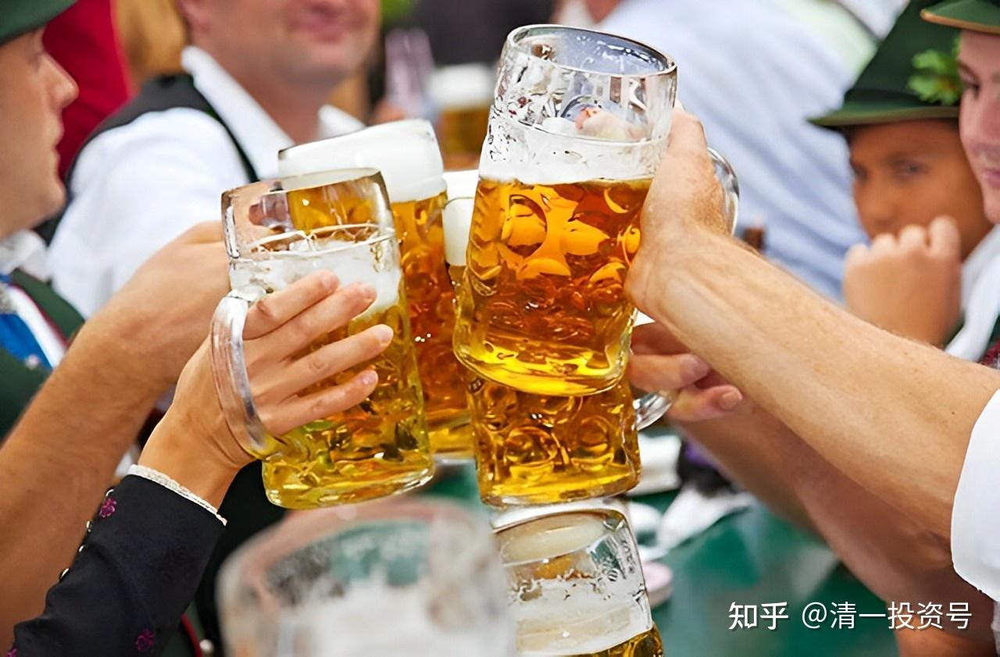
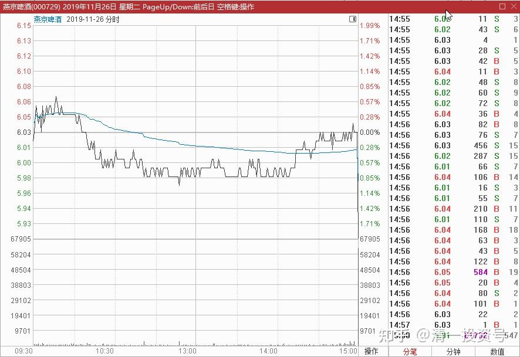
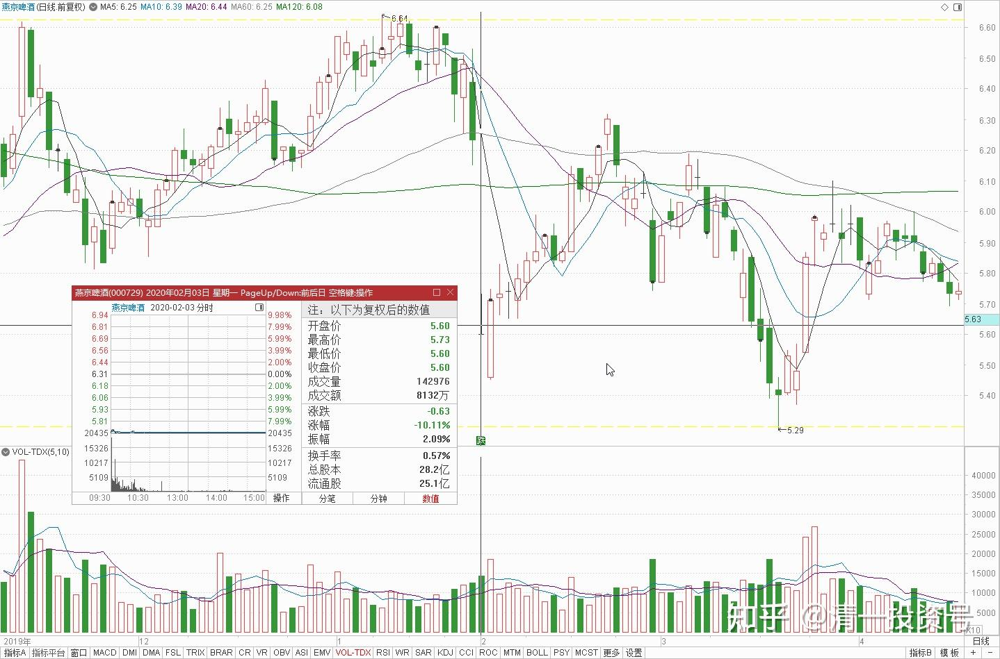
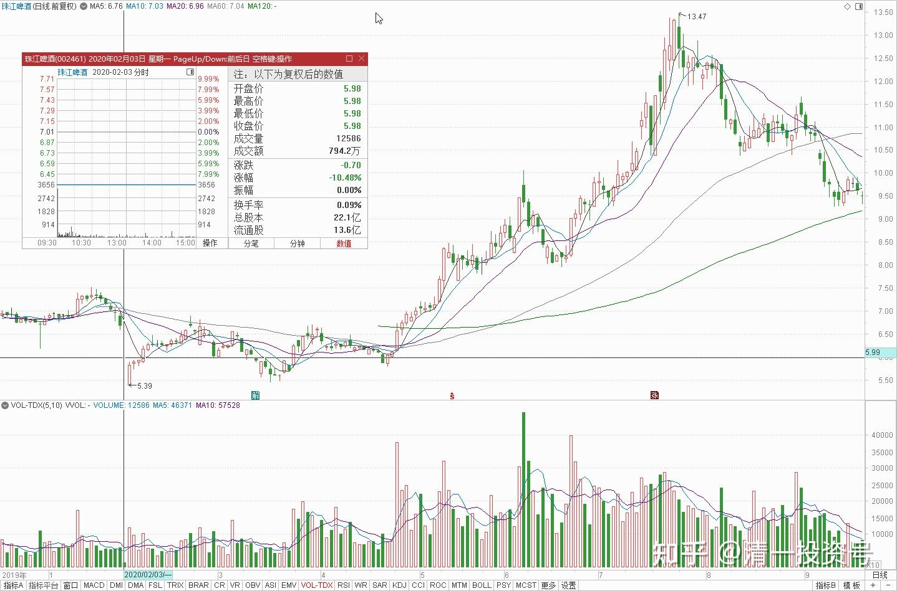
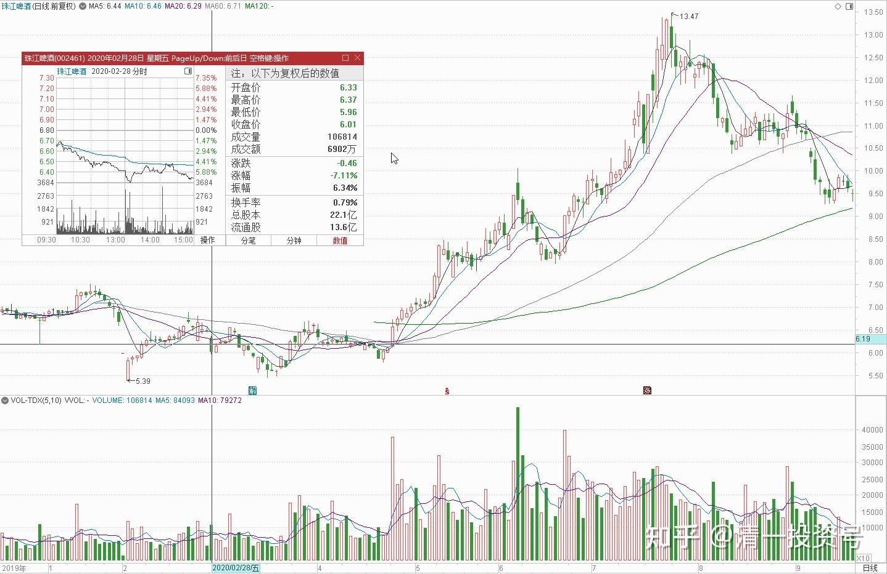
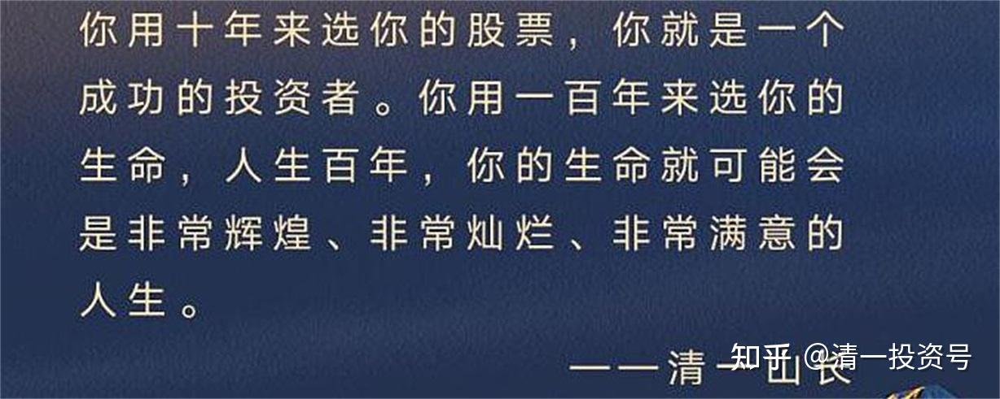
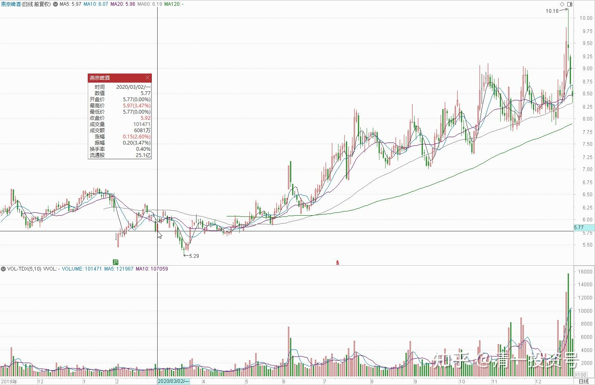

22篇.它很可能是下一个重庆啤酒

清一山长 2019年11月-2020年3月

**一、买成了两家啤酒上市公司的十大股东**

清一山长 2019-11-26 15:36:09

$燕京啤酒(SZ000729)$ 尾盘用1000万股报价5.91元来打压，成交617万股。占一天成交量的三分之一。真有意思。干嘛6.7元的时候不多卖一点？偏要等跌破6元才卖？跟钱有仇吗？[大笑]

清一山长 2019-12-31 17:31:43

$惠泉啤酒(SH600573)$ 今年交易已经结束。**目前已经买成了两家啤酒上市公司的十大股东，创了历史记录。**如其他股东四季度没有增持，用三季度的数据来比较的话，大约我现在是惠泉啤酒第五大流通股东，各位一季报就可以看到名字了[大笑]。我是本轮最低价附近开始买入的，最低6.04元的入仓价。现在已经停手了，**仓位接近2M。**珠江啤酒8元上方减持了50多万股。但后期因为跌的较多，又再度买回来了，**目前持仓略超过4M，**比广发基金多一点点。看样子，可以维持三季度的排名不变[大笑]。2020年，我的A股赢输，就看啤酒的表现了。**本次买入惠泉，没有其他的逻辑，就看它十年不涨，价格处在十年的最低位置附近。**我相信卖给我的人没赚钱，不耐烦给的货。我就接棒耐心等吧！继续持有十年试试？看惠泉能否创一个20年不涨的记录？可惜珠江掉价太快了，来不及换股。不然也许会多买一点惠泉。[大笑]

**二、它很可能是下一个重庆啤酒**

清一山长 2020-02-04 10:32:42

$中国建筑(SH601668)$ 中建涨了？很好**，中建就是稳。从昨天来看，就不愿意跌，所以我首先补他。**其他继续观望。今天继续买进珠江啤酒，6.11元，比昨天跌停补价格更划算（我可没本事去跟跌停板拼[俏皮]。我将最多补仓到不超过我去年三季度公开的持仓位（**也就是我不多买，只是补充高价卖掉的部分**）。迎驾贡酒也买入了，价格是16.02元。原因：我原来是17元多，快18元时候买的，22元多卖出了一多半。现在重新补回来，目前持仓成本11.046元。

清一山长 2020-02-04 11:02:13

$燕京啤酒(SZ000729)$ 昨日跌停，成交8131万元。今天仅仅上午，已经7千多万，这两天资金换手一个多亿。**总盘子差不多的珠江啤酒，昨天跌停成交才794万元。只有燕京的十分之一还不到。**说明什么呢？图形为啥这样走？呵呵，你们自己去回味一下吧！我倒是觉得——这后面的味道，真是无穷，有趣。

清一山长 2020-02-07 12:17:35

$珠江啤酒(SZ002461)$ 珠江啤酒涨了，但我却高兴不起来，倒不是后悔涨之前没有补仓，实际上这轮下跌中，我低价补进了1M多的仓位，继续巩固了我在十大流通股东的地位（虽然没有啥投票表决权，也没有人通知我开会，更没人请我去吃公司的工作餐，喝工作酒，连一个盒饭也没得到[哭泣]）。还是小散户的命，我也认了，好处是不承担任何企业责任。想买就就买，想卖就卖。不用发公告。

我不开心的原因，主要是有点小纠结：**按道理估值是燕京更低，跌下来应该买燕京，或者用珠江换燕京。但我就是不敢换，弄得有点内心冲突。**

另外我不看好这轮反弹，我认为肺炎对于中国经济的影响，似乎不是一个跌停板就能够解决的。所以，我手上的医疗股，如新华医疗乘机跑光了，健康元也在跑。珠江涨了，按道理也应该跑一部分的，**但我认为它很可能是下一个重庆啤酒。重啤可以有17倍的市净率，凭啥珠江只能有1.7倍？**这也太低了点。今天它们俩双双起舞，啥意思？所以，现在就算珠江涨了一点，我也不敢卖。继续放着好了，反正也攒了这么久！

明达野老回复清一山长：

支持山长医药股的操作，也恭喜山长收获满满[献花花]我的医药仓位也在快速缩水中。医药股大概率会重复去年“猪肉股”的模式——前期疯涨，往后则是漫长的阴跌之路；爆炒的结果就是筹码越来越分散，分散到“接盘侠”手中了，因此阴跌不可避免。当然，如果拿的优质廉价的医药股，不动倒也还过得去，因为通过一定时间的震荡消化还会重拾升势的，至于这个“一定时间”是多久就不知道了。

山长关于珠江的观点-【我认为它很可能是下一个重庆啤酒】我很认同，参照重啤估值，确实是非常值得重点“关照”的好标的。今天看了下市值，仍然是我的A、H第一重仓，所以这次下跌没有太“关照”它了**。另外，从盘面看，控盘程度很高。因此，从空间来说，我不认为会跑输重啤，**所以我现在还蛮舍不得在这个位置扔掉筹码的。和山长一起“锁筹”[赞成]

清一山长 2020-02-07 22:52:48回复明达野老：

你的盘感真好[很赞]。**主力其实早已控盘，今天涨近5%也不放量，说明盘子很轻。**但主力却不拉升，显然是志在长远，不愿意赚点小钱就走。估计是现在的企业基本面还不配合，需要时间去消化。所以，我们得只能慢慢陪他们磨时间了。比耐心，我们应该不会输给他们。经常忘记看盘就行了[笑]

**三、危急时刻，现金为王**

[https://xueqiu.com/4777797104/142449270](http://link.zhihu.com/?target=https%3A//xueqiu.com/4777797104/142449270)

洪上赞的经营之路：我刚刚在#雪球实盘交易#委托买入$珠江啤酒(SZ002461)$，委托买入价6.4元。

清一山长 2020-02-28 15:37:24 （评论上贴）

先别急着抄底。危机时刻，现金为王。便宜的货会突然冒出来很多，绝对安全的再下手。珠江我就与大股东共存亡好了[笑]。

水火既济g5g回复清一山长：

请问山长，因为自己信奉价投，所以买的都是大白马，都在20倍PE下，管理层靠谱，年前买的，有部分杠杆，目前有5%左右浮亏，但是并不太多，福耀、格力、招商和万科，这样都是准备十年长期持有的，自己很看好这些公司长期的发展，这个时候也要清仓吗？

清一山长 2020-02-28 17:43:17回复水火既济g5g：

谁跟你说要清仓了？我的仓都没清掉呢！天知道下一交易日涨还是跌。**我空出一些仓位，是为了可能有机会买到更多的股票**。买不到，我也认栽了。今天看起来是赢了，谁知道下一天可能又错了。如果用十年的眼光来看，我这周的减仓，就是错的，我肯定会在十年内某个时间加回来的。既然你想拿十年的股，就别受我这种投机人士的蛊惑。问我，我又不是神，怎么会知道未来的涨跌呢[滴汗]

朴拙投资 发布于2020-02-25 15:08

《对不起A股，我承认退缩了，先走一步！》

[https://xueqiu.com/7219112952/142107034](http://link.zhihu.com/?target=https%3A//xueqiu.com/7219112952/142107034)

$燕京啤酒(SZ000729)$今天以6.11元，卖出了几乎全部的燕京啤酒，是去年珠江啤酒在8元左右换股过来的，就应该去掉融资盘，无债才能一身轻；只用本金做多中国。

理由一：中国经济受到疫情打击比中美贸易战还要严重得多，很可能很多人会一夜变穷。别以为一切都过去了；我预估不少行业，今年第一季报表会很难看!

理由二：A股如果不调整，我可以买入其他港股中国宏桥，不用担心踏空。比如我不认为中国宏桥H就比燕京A更不值钱。用6.11元多的燕京A，换4元左右的中国宏桥H，我觉得是一笔很划算的买卖。

理由三：如果A股调整，我会在5.5元左右，考虑再度买入。

理由四：君子不立危墙之下，如果全球金融因疫情大震荡，A股产生波动也难免。国家队继续拉已经到了前期高位的创业盘来拉动人气，大盘再创新高，似乎不太现实。所以我这种小游击队，今天就先走一步，让强大的国家队来断后。等国际局面稳定一些后，主力部队重新杀回来的时候，我再跟上大队继续打仗[大笑]。

理由四：就算是因为我现在离队，在A股实在找不到让我低估的个股，我就去香港市场，买国家担保品个股，与国家队一起与外国鬼子打游击去。

所以，综合各种因素，今天我走了。谢谢燕京，也谢谢各位长久陪伴我的朋友。不是不看好A股，只是投机本性，导致我难以面对退缩[哭泣]。希望今天买了我卖掉的股票的人会赚钱。

清一山长 2020-03-02 16:41:49 评论上贴

多事之秋，退掉融资以保安全很重要。未来一定要做多中国，目前的风波只是暂时的。但万一目前的风波弄到自己的本金都没了，就没法做多中国了，只能当烈士去了。燕京是让我投资很没成就感的股票，目前亏损中，还不敢丢下它，你比我更勇敢！我就用本金陪它熬吧！反正都是酒上赚来的本钱。

朴拙投资回复清一山长2020-03-02 18:25

报告山长老师，因个人帐户全是啤酒，因此去年收益超高。那天以为珠江会有年报行情，故融资帐户部分全减了燕京，现在看来可能是看错！

(标题、图片为编者所加)

**参考链接：**

[YJ走势果然神鬼难料\[表情\]](https://www.zhihu.com/pin/1604810289215668226)

[发表今天的想法，就是非常的感谢，感谢这…](https://www.zhihu.com/pin/1604504352521158656)

[8篇.初谈燕京](https://zhuanlan.zhihu.com/p/594537053)

[9篇.起码十年不涨就值得一起守候了](https://zhuanlan.zhihu.com/p/596134341)

[11篇.啤酒系列4：连连出台的质疑文让我加紧了买啤酒的行动](https://zhuanlan.zhihu.com/p/598382916)

[12篇.啤早期珠江啤酒、燕京啤酒的换仓记录](https://zhuanlan.zhihu.com/p/602033762)?

[13篇.买卖操作后的富足之心](https://zhuanlan.zhihu.com/p/604162057)

[14篇.珠江的破位急跌，名曰跌停进货法](https://zhuanlan.zhihu.com/p/606062514)

[15篇.金融市场是考验心态和修为的地方](https://zhuanlan.zhihu.com/p/608010478)

[16篇.啤酒系列9：买入的理由不是因为要涨，而是因为没有多少下跌空间](https://zhuanlan.zhihu.com/p/609653689)

[17篇.只记住一件事：低价不卖，高价不买](https://zhuanlan.zhihu.com/p/611574943)

[18篇.炒股美德——亏赚两相宜](https://zhuanlan.zhihu.com/p/611564523)

[19篇.啤酒是一个难得的大潮](https://zhuanlan.zhihu.com/p/613467605)

[20篇.投资啤酒股是买困境反转的行业](https://zhuanlan.zhihu.com/p/615531121)

[21篇.绝不买入超过卖出仓位的数量](https://zhuanlan.zhihu.com/p/617161408)

