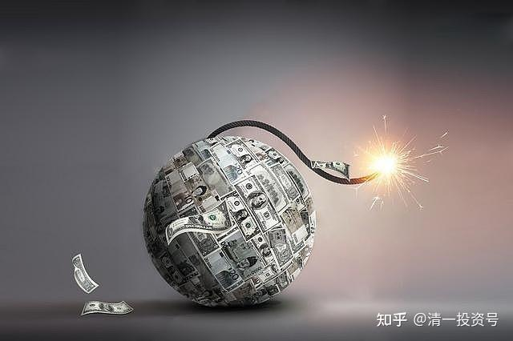
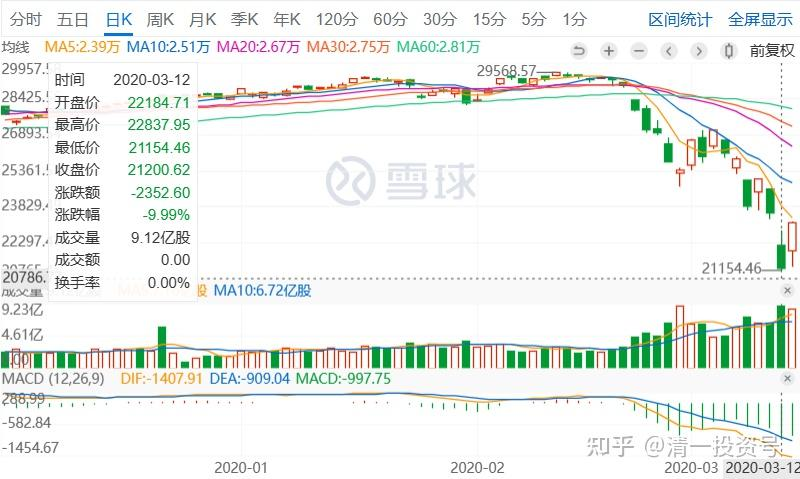
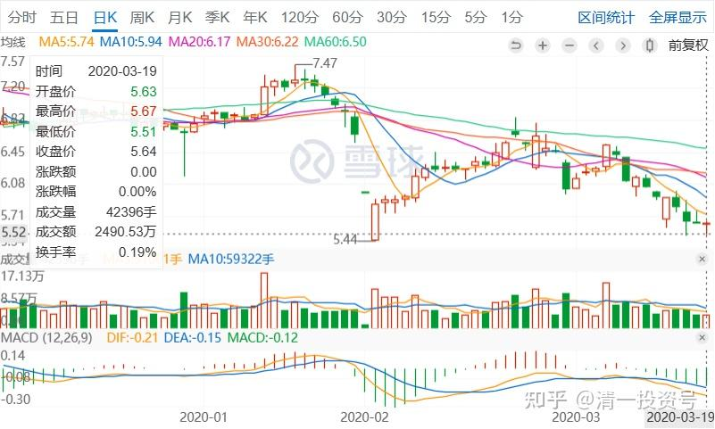

23篇.危机时刻好公司不用担心

清一山长 2020年3月13～27日

清一山长2020-03-13 09:53:49

$道琼斯指数(.DJI)$ 昨天再次跌了两千多点，我看不会有人出来救市了。过去两年每次千点大跌，都有人来救，还创新高。明显是操纵的痕迹，让我想不通——美股原来有人护盘的？现在，美股从29568点最高点，最近的短短几天，就跌了快9000点了。我两年前就在预备的美股狂跌开始了。我一直不敢买美股的原因就在这里——美股注定要狂跌，只是不知道会是什么时候，更不知道会因为疫情而跌（其实前两周我就预感美股要完了，世界金融危机模式要开展了，所以大叫要小心，要卖股票）。

DJI 日K线

未来一两年内，世界经济将受到重创。金融将不可避免地引起一轮大跌，世界金融危机模式已经开启。现在要保住你的本金，现在千万别乱买，会出现各种不可思议的低价。买入后就不再看价格，死守即可，不赚钱就是不走。**现在投资不要进取，要超级保守。要选择一些绝对不会破产的企业买入，有抵抗金融风险的硬资产的企业和股票才敢买入。**很多原来成功的企业，可能短期就会破产。一批新的，避过了风险的企业，又会站起来。形成洗牌。

股市也一样，原来靠精明赚小钱的投机客，敢于大比例借款上杠杆的人，会在这种大级别的资本狂潮中倒下。相反，一贯谨慎，特别是持有现金的人，可以在这个时候捡到破产价，很多价格是因为杠杆客爆仓被迫卖出的，相当于一只羊，现在的市场可能只用一对羊腿的价格出售，有眼力的人可以大赚钱了。

**现在是现金为王的时候。**巴菲特这两年，一直有巨量的现金，就在等这个机会。但大家要管住手，别觉得便宜就进去了。便宜之后，可能还有超级便宜。所以我计划下周再等机会出手。这两天都没动。最近以最低价买入的股票，已套牢[哭泣]。所以你们不需要知道我的买入股，不然跟买就一样倒霉。但我只动用了不到一成的现金。你们可能会全仓跟入，套牢就要骂我了。现在我不敢高告诉你们任何标的，就是任何标的都可能出现非理性的大跌。就像原来理性上就不值钱的股也会狂涨一样。

清一山长2020-03-13 10:43:29

提醒一下，原来跑掉了就算了。没跑的，现在跑也没意思了。只要没有上杠杆，死扛最多两年也就过去了。当然，前提是你的股票企业没问题！别买了问题公司。正通我低价买入，但最终没赚钱（也没赔钱）全出掉了，原因就是如果遇到金融危机，这种公司会垮掉，因为她居然借款12%利息的美金，证明这家企业现金流极差。经不起风险的。但如果世道正常运行，它的估值太低了，有机会涨回来的。所以，**危机时刻，干不下去的公司都要跑掉。但好公司不用担心的。可以放心持有。**

安然**回复清一山长:

感恩山长分享[握手]山长，会稽山8块8毛多，古越龙山8块6毛多，燕京啤酒6.09元，还有12块多的老白干，15.63元的伊力特，我的这些酒们需要跑路吗？[献花花]

清一山长2020-03-13 11:27;28回复@安然**:

长期看没问题，短期就不知道了。中国如果挺过来了这一关（没有二次疫情），国际大萧条下，出口会有问题。要发展经济，只能扩大内需，消费为主。**所以低位的消费股会有机会。这也是我买入消费股的原因。**原来高一些了的时候，可以跑掉，跌了再买进来。现在跑也晚了，只能挺住了。

清一山长2020-03-19 17:19:27

$珠江啤酒(SZ002461)$ 蛮抗跌的么。不错。这次撤资，珠江也只走了一M多。依然是十大股东。就是因为太不舍了。但看利润，从1500多万降到了400多万。真划不来。高位走掉的好处，就是现在可以再多买两百万股珠江。

清一山长2020-03-19 18:41:18

大家放心，其实我想走也走不掉。十大股东，这么好退出么[哭泣]，8元我的确在走，走了几十万就掉下来了。这一波上7元，我也在走，走了1M，就掉下来了。掉了就舍不得走了。结果只好继续当股东了。下次我还是买中建和兴业好了，一单走一百万股都很容易，几单就走完了，而且还不影响股价。

惠泉我也是十大股东，似乎也没咋跌。一堆啤酒，我的2020。

珠江啤酒日K线

清一山长2020-03-27 23:11:40

$珠江啤酒(SZ002461)$ 快被挤出10大股东了[俏皮]。两家新进基金抢货真多。这几天的上涨有点摸不清来路，是不是这些抢货的人多了？你们想要，就再拉涨点，我给你们彻底退出十大算了。

清一山长2020-03-27 23:16:39

差点变成吹牛贴——都快被挤出10大股东了[俏皮]。不过能成为十大股东唯一的自然人，还是挺自豪的。进来了两家新基金，抢了一千多万股。市场流动筹码更少了。这样子下去，恐怕一季报就当不成十大股东了[微笑]

(标题、图片为编者所加)

**参考链接：**

[YJ走势果然神鬼难料\[表情\]](https://www.zhihu.com/pin/1604810289215668226)

[发表今天的想法，就是非常的感谢，感谢这…](https://www.zhihu.com/pin/1604504352521158656)

[8篇.初谈燕京](https://zhuanlan.zhihu.com/p/594537053)

[9篇.起码十年不涨就值得一起守候了](https://zhuanlan.zhihu.com/p/596134341)

[11篇.啤酒系列4：连连出台的质疑文让我加紧了买啤酒的行动](https://zhuanlan.zhihu.com/p/598382916)

[12篇.啤早期珠江啤酒、燕京啤酒的换仓记录](https://zhuanlan.zhihu.com/p/602033762)?

[13篇.买卖操作后的富足之心](https://zhuanlan.zhihu.com/p/604162057)

[14篇.珠江的破位急跌，名曰跌停进货法](https://zhuanlan.zhihu.com/p/606062514)

[15篇.金融市场是考验心态和修为的地方](https://zhuanlan.zhihu.com/p/608010478)

[16篇.啤酒系列9：买入的理由不是因为要涨，而是因为没有多少下跌空间](https://zhuanlan.zhihu.com/p/609653689)

[17篇.只记住一件事：低价不卖，高价不买](https://zhuanlan.zhihu.com/p/611574943)

[18篇.炒股美德——亏赚两相宜](https://zhuanlan.zhihu.com/p/611564523)

[19篇.啤酒是一个难得的大潮](https://zhuanlan.zhihu.com/p/613467605)

[20篇.投资啤酒股是买困境反转的行业](https://zhuanlan.zhihu.com/p/615531121)

[21篇.绝不买入超过卖出仓位的数量](https://zhuanlan.zhihu.com/p/617161408)
[22篇.它很可能是下一个重庆啤酒](https://zhuanlan.zhihu.com/p/645392522)
