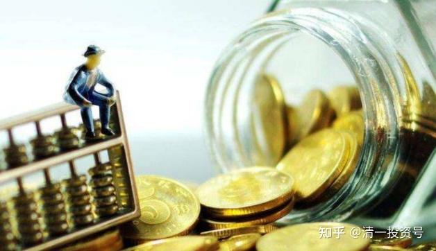
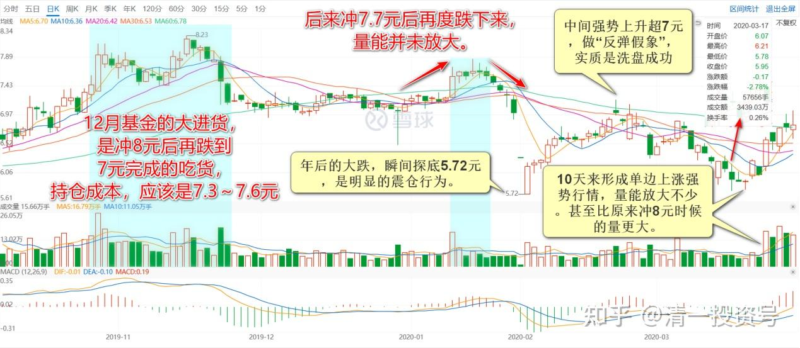

24篇.守住筹码很不易

清一山长 2020年3月28～31日

清一山长2020-03-28 10:03:16

$珠江啤酒(SZ002461)$ 刚才认真看了K线图，12月基金的大进货，是冲8元后再跌到7元完成的吃货，所以，这批基金的持仓成本，应该是7.3～7.6元，目前还是亏损的。看样子，基金是故意打压进货的，操盘水平不错。后来冲7.7元后再度跌下来，量能并未放大。应该基金还是在吸货。年后的大跌，瞬间探底5.72元，是明显的震仓行为。其实6元以下成交的很少。中间强势上升超7元，做“反弹假象”，实质是洗盘成功。3月17日再度跌破6元，完成最后的震仓，10天来形成单边上涨强势行情，量能放大不少。甚至比原来冲8元时候的量更大。**说明这一次主力利用金融危机导致的持股心态不稳，拉升进货成功。**本次上涨，散户们会认为是被套主力的“拉升出货”行为，大多数散户会借机跑掉的。新一批货的进货成本，成功降到了6.4～6.7元左右。预期一季报机构持股将更加集中，就算我持股不动，也几乎铁定会跌出十大股东，其实我现有的持股数量，是高于12月底年报数字的，**今年最高的时候，珠江是超过5M持仓的。7元以下，我持有一定要超过4M。8元以下，应该不会低于3.5M。9元以后，才考虑减到3M以内。其中1M是底仓，没准备卖的存货，计划是长期持有，假装自己是巴菲特买的可口可乐！持有25年？**

曾乐天回复清一山长:

山长操作认知与手法的无私分享，让人敬仰。

个人有个思考：如果基金（庄家）看到这些文字，会不会改变其操作手法？

清一山长2020-03-28 15:40:41回复曾乐天:

我发言会有影响吗？当然会

第一：他们肯定会很讨厌我的，察见渊鱼者不详。目前我作为唯一的自然人十大股东，肯定很扎眼。他们巴不得我早点退场干净一点。我把观察出来的信息告诉大家，是分享分析方法。但被分析的人绝对不会高兴。但总算让他们高兴的是：很多人其实并不相信我的分析。他们还是更喜欢跟着感觉走。

第二：他们肯定会改变一些办法。比如，发现我就是赖着不走，他们就不会好好的拉升，会设法消耗掉我的意志。也许等我受不了跑了，就会大幅上涨了。其实我都很后悔几次上8元我没有全抛掉。否则我珠江上赚到的钱可多了。总是坐电梯。**但我一想到重庆啤酒涨得多离谱，PB高珠江很多倍，就忍住了继续坐电梯。**所以，只要我还在里面，也许您就赚不到快钱。**我走了就会大涨了。（顺鑫农业似乎就是这样的，我走掉后涨到我都看不懂）。**谁让我讨别人不喜欢呢？

MX自由之路回复清一山长:

学习了，山长当初也是这样建仓的吗[大笑]?

清一山长2020-03-28 15:51:03回复MX自由之路:

当然不是。我没这资金实力，更没这牌照和资格去这样建仓。我只能跟庄建仓，赚点小钱。

不过，我现在仓位的成本才四元多，比这些基金低。这就是小散的优势。借庄家制造的波动来摊低成本。**只要能够看懂主力动向，可以在主力刻意亏本打压到不可思议的低价时，勇敢地进场。没理由乱涨的时候，潇洒地卖掉一些。**不断重复这个过程就行了。本次跌破6元的过程中，有一天我发现珠江居然有一笔十几万股的大卖单在故意压盘，结果我一笔就买进来了，之后就没见大单了。所以，我们是庄家最讨厌的人[大笑]！

天地**回复清一山长:

动不动这个股上前10大股东，那个股上前10大股东，好意思？对一对名字再说，证券市场是有历史记录可查的！

清一山长2020-03-28 23:06:31回复天地**:

你既然知道有历史，有记录，干嘛不先看看历史记录再出来叫呢？难道你真的是无脑的蠢货吗？十年前本人就当过十大股东了，有啥稀奇的。**现在当十大股东的也不多，就两家。珠江和惠泉**。年报出来，好好睁眼对对看。别再瞎了眼只管叫！今年的一季报，估计至少要退出一家了。有本事你预告一下？

另外，恭喜你，你下一秒就要被拉黑了！我最讨厌无脑吠叫的东西了，因为我喜欢清静[微笑]！

蛰伏**回复清一山长:

如果没有2017年底反复阅读山长关于啤酒持有逻辑，并进一步对整个行业的研究，就没有我今天持有的一榄子啤酒，更没有如今几乎满仓啤酒坚定的心态！目前仅燕京套着，珠江来回坐了三四次电梯都没舍得卖，惠泉5.8元附近几乎加到了珠江的仓位。感谢山长持续的分享，祝福山长平安顺利。[献花花]清一山长[￥200.00]

清一山长2020-03-28 23:09:06回复蛰伏2020:

抱歉，其实这两年啤酒并不是最好的标的[滴汗]。都不太涨。**我只是看未来可能会好，起码安全系数高。**

明达野老回复清一山长:

认同山长关于主力拿货的判断。同时，我在上周五6.95～6.98出掉了一部分头寸（主仓几乎没动），因为我看到这样一个有意思的现象：居然在势头正好时，尾盘上零散的挂了上百万的货，其中一个价格档位是50万股，但是偏偏没人摘，而昨天，经常会出现闪挂闪撤的零散的10-20万股为单位的卖单，当突然出现30万股+的货时，主力一口气就吃掉了，在买盘上，则是隔着价位分挂的10-20万股左右的单子。这种挂盘手法，让我在思考：

1、是否是主力还没吃饱，通过压盘继续拿货？同时等待着4月份不好看的季报继续洗盘、收货（不想自己砸）？而不想自己砸的原因是否是开始担心有人抢他手里来之不易的货（跟风卖盘近两个交易日已经弱下来了，贸然挂大卖盘压是容易丢货的），所以挂卖盘时有些疑虑？（近期高毅、重阳等多家机构都在调研珠江）

2、主力是空中加油式洗盘准备推升（跟风卖盘已经弱下来了），但是选择在当下这个变数较大的大时机下是否费力？是不是要再等等呢？

存疑中，出掉的头寸买不回来就算了，如果有机会，我会再买回。

清一山长2020-03-31 20:01:53回复明达野老:

解析很好[赞]！本次逆势上涨，放量，可以有两个可能：**一是机构逃跑了，散户被忽悠进来接盘了。二是散户被吓跑了，机构拉高给一点机会，就都赶快跑路了。**否则无法解释这段时间的放量情况。我认为是主力手中货不够，拉高一点继续进货。比12月进货的价已经低了不少。打压显然是无法进货的，跌的时候无量。说明本股的散户没有跟风的热情。

主力已经用了两年时间来折腾珠江，不断显示他们的存在。让珠江该涨不涨，该跌不跌的。到底想把珠江做到多少呢？我很好奇。**前一个类似这样折磨我两年的，主力超级有心计的，是顺鑫农业。**最终给了很不错的回报。正因为顺鑫把我折磨多了，所以30元以下我根本不考虑卖的问题，否则盈利也大大减少了。（19元涨到22-23元卖，两年大约有六次这样的“规律”，最最终多年的老鸟被成功甩掉下车了。珠江这两年，每次到了8元左右就必跌，跌幅20%以上。这样的规律，也有三次之多了。还要这样再冲高——回落几次？我也不知道，我就只敢拿一百万来陪他玩电梯游戏，剩下的老老实实的拿着算了）

珠江到底值多少？会涨到什么价？我不知道。**就是看见珠江有明显主力操控的迹象，才越买越多的。**但看懂了也烦，因为看到主力没出场也不敢走。如果没看懂，涨了就直接卖掉，跌了就直接买进，做了几次之后，成本现在也可以负成本持有大量股份了。**但也正因为守住筹码很不易，所以我也不会涨一点就跑掉的，死陪着他们耗吧。**

(标题、图片为编者所加)

**参考链接：**

[YJ走势果然神鬼难料\[表情\]](https://www.zhihu.com/pin/1604810289215668226)

[发表今天的想法，就是非常的感谢，感谢这…](https://www.zhihu.com/pin/1604504352521158656)

[8篇.初谈燕京](https://zhuanlan.zhihu.com/p/594537053)

[9篇.起码十年不涨就值得一起守候了](https://zhuanlan.zhihu.com/p/596134341)

[11篇.啤酒系列4：连连出台的质疑文让我加紧了买啤酒的行动](https://zhuanlan.zhihu.com/p/598382916)

[12篇.啤早期珠江啤酒、燕京啤酒的换仓记录](https://zhuanlan.zhihu.com/p/602033762)?

[13篇.买卖操作后的富足之心](https://zhuanlan.zhihu.com/p/604162057)

[14篇.珠江的破位急跌，名曰跌停进货法](https://zhuanlan.zhihu.com/p/606062514)

[15篇.金融市场是考验心态和修为的地方](https://zhuanlan.zhihu.com/p/608010478)

[16篇.啤酒系列9：买入的理由不是因为要涨，而是因为没有多少下跌空间](https://zhuanlan.zhihu.com/p/609653689)

[17篇.只记住一件事：低价不卖，高价不买](https://zhuanlan.zhihu.com/p/611574943)

[18篇.炒股美德——亏赚两相宜](https://zhuanlan.zhihu.com/p/611564523)

[19篇.啤酒是一个难得的大潮](https://zhuanlan.zhihu.com/p/613467605)

[20篇.投资啤酒股是买困境反转的行业](https://zhuanlan.zhihu.com/p/615531121)

[21篇.绝不买入超过卖出仓位的数量](https://zhuanlan.zhihu.com/p/617161408)
[22篇.它很可能是下一个重庆啤酒](https://zhuanlan.zhihu.com/p/645392522)

[23篇.危机时刻好公司不用担心](https://zhuanlan.zhihu.com/p/646998882)
