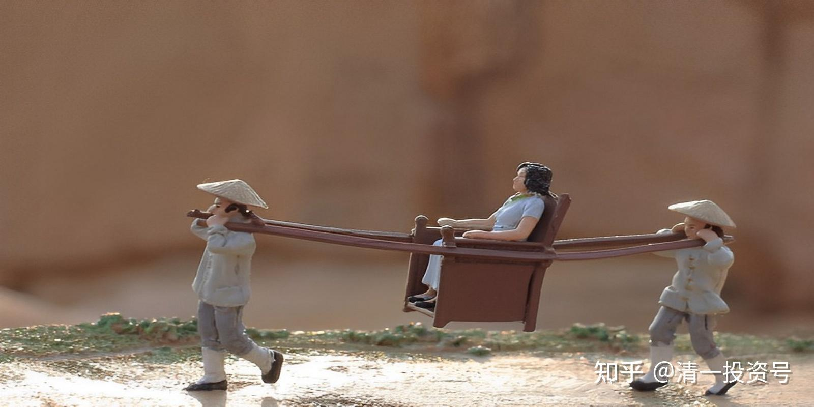
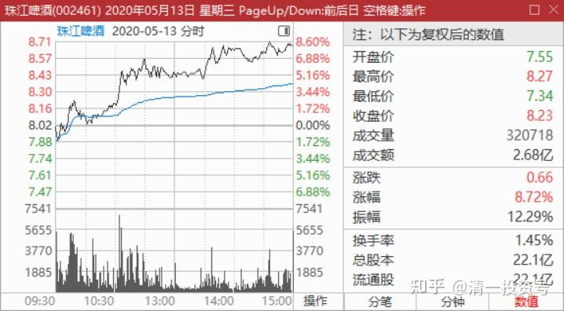
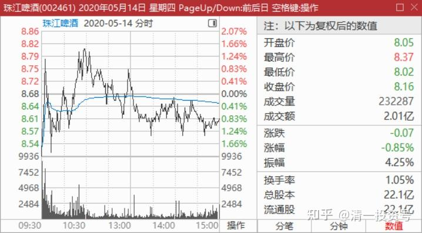
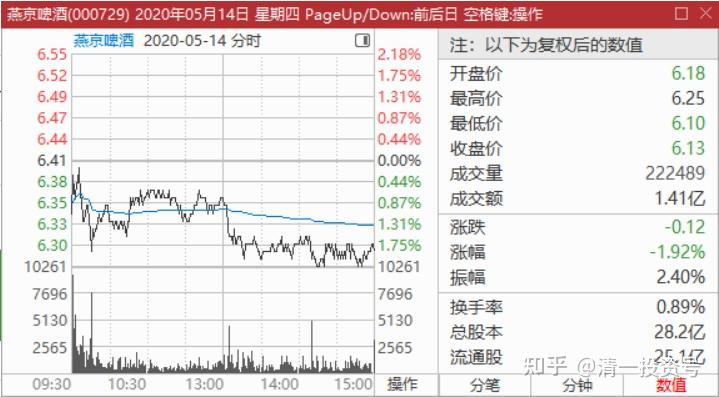
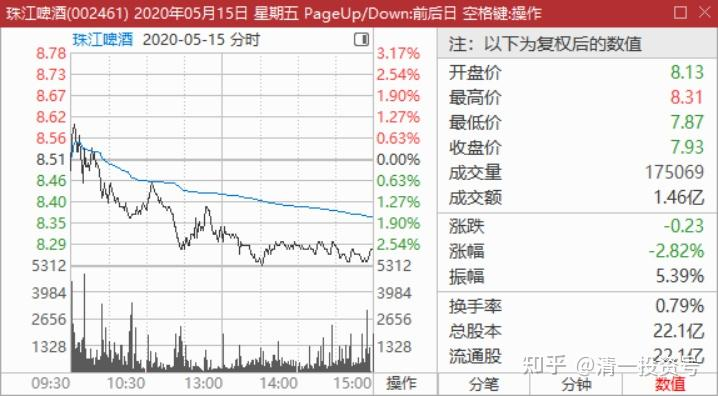
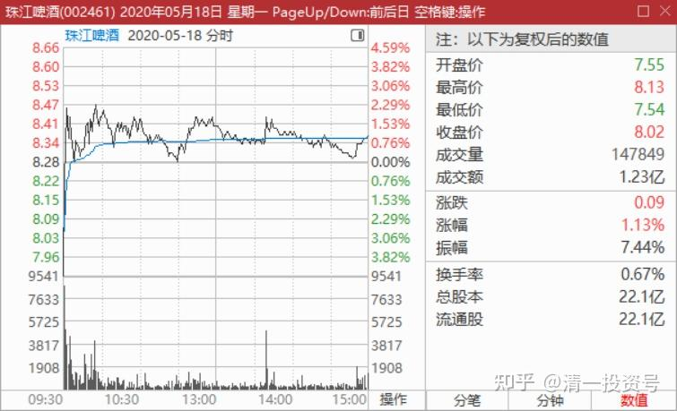
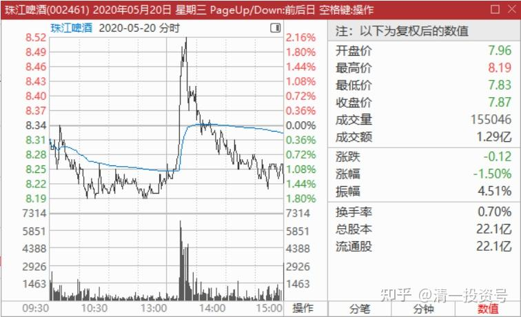

26篇.现在最应该做的，就是稳稳的做好轿子

清一山长 2020年5月13日～21日

**一、坐稳轿子**

清一山长2020-05-13 12:59:16

$珠江啤酒(SZ002461)$ 今天早上都没看盘，去外面练功去了，刚回家没多久。因为我看昨天的走势，如果是弱势需要继续调整的话，今天就会回档，也可以下午会起来，没啥可看的，我又不想买股。如果是强势的话，直接就脱离8元的原“顶部”区域了，也没啥可做的，我现在也不想卖股票，只想等着看热闹。我看以后的8元，就是“底部”了。技术上，8元原来叫做“压力位"，现在叫做“支撑位”。我把昨天试探主力是否要货而挂单卖掉的十几万股珠江，换成燕京了。两个股差价两元，如果我不想丢啤酒筹码的话，就换成没涨的啤酒，赚不钱，起码也不会亏钱吧？

珠江今天此涨，应该是主升浪开启了，寂寞地忍耐了两年，被嘲笑了两年，现在可以”扬眉吐气“了。**现在最应该做的，就是稳稳地做好轿子，不要被市场随便震荡两下就被弄下车了。**昨天的走势，其实是很稳的在推进，不急躁的，主力并没有大显身手的大规模推进股价。今天我看他也不急，不是来个涨停吸引眼球，这样我就要至少跑掉一个M了。而是推上个台阶，就慢慢的洗货，消化浮筹。高明[很赞]

【今天，珠江，燕京双双涨停，颇出我的意料之外。】

文章《1篇.涨停之际，谈我的啤酒股投资逻辑》[https://zhuanlan.zhihu.com/p/477911616](https://zhuanlan.zhihu.com/p/477911616)

清一山长2020-05-13 13:07:59（评论上文）

一年前的帖子，当时以为要启动了，没想到还要熬这么久。今天的珠江冲8.50元过了，我持有珠江，已经创造了超过顺鑫农业的盈利（我买啤酒的本钱，来自于卖二锅头的收益）。可是燕京却还是趴在6元多不动。**不过我相信我跟啤酒的缘分更好，坚持下去吧。**别人买茅台赚了钱，我买珠江，也许比一些茅粉赚的更多呢！只要能赚钱，就是好股[俏皮]。

水木方成回复清一山长:（上贴续评）

买啤酒就只能喝啤酒，买茅台天天有茅台喝

清一山长2020-05-13 13:59:23回复水木方成:

你以为：我买二锅头两年多，我就喝了两年的牛二？我连一口都没尝过。但不妨碍我赚顺鑫的钱。纠结了：万一买的是新希望，这饲料还吃不吃？喔，是吃猪肉吗？[大笑]。吃多了，都不好。激素太多。

欢乐马6l6回复清一山长:（上贴续评）

6.1元没有进，8.5元跑进来的韭菜前来膜拜一下[哭泣]

清一山长2020-05-13 14:03:27回复欢乐马6l6:

我最佩服你们这些8.5元买的人。感恩有你们这群勇敢快乐的人，这个市场才有更多的欢乐！才这么有趣！

另外，我很有自知之明：你不可能膜拜我的，你只是膜拜我持仓的价格罢了。我的珠江持仓价是4.329元，你想拜的这个吧！[俏皮]

清一山长2020-05-13 14:10:23

$燕京啤酒(SZ000729)$ 燕京主力今天表示对珠江主力很生气！我好不容易把燕京压得死死的，慢慢收货。昨天就让你们的珠江涨也白涨，我就是不动如山。可你今天珠江继续这样疯涨，弄得这么多人来抢啤酒，俺家都按不住价格了[俏皮]

清一山长2020-05-13 14:57:01主贴2

$珠江啤酒(SZ002461)$ 下午挂了个8.67元的单子，休息去了。刚回来看已经成交了。本次上涨，已经出了10%的仓位。既然这么多人抢珠江，俺也大方一点，分点赚钱的机会给人[滴汗]。看有啥困难户需要救济的。

看中国建筑今天挺困难的样子，就5.16元补了1M。也留点现金，准备明天有机会做T玩。

明达野老回复清一山长：（评论主贴2）

不带这么同步的[大笑]。我的出货价是8.68元，首笔出货价是8.58元[献花花]祝贺山长在珠江上大赚。

只是，我出的比例比您多不少（看这两天这么去狂摘，我就送点货出去，做做贡献），出来的资金买了些中建还有其他啤酒股，剩下的资金继续补充我的备用金头寸，因我始终感到不对劲，不知是否有大事要发生。说回珠江，我其实很怀疑最近的拉升非真正的“大买家”所为，更像短炒的敢死队干的活（如果龙虎榜出来，我得看看去，直觉告诉我前期收货的资金和这次拉升的资金风格不相似，这次更像是搅局的快庄资金）。如果是主力，不必要如此去全盘上摘，如果货拿足了，缓推到8元附近，做个缩量回踩假装冲不过去，再快速推上去吃掉8.3元附近的压盘点火即可，又轻松，又能推得更高，做得长远，顺鑫就是这么干的。不过毕竟我不是主力，希望我是错的，这样持有没卖的同学短期可能能赚更多，我就少赚点，学贝莱德的大股东和巴菲特，在这个时候多做点防守，不死就行了。

**二、两个啤酒的筹码对比**

清一山长2020-05-13 16:17:02回复明达野老:

真有意思，双方再次同步[赞成]。的确心有灵犀。

你卖得比我好，进出点掌握得特别漂亮。

跟你一样，我觉得现在的势头很不正常，燕京不跟也很不正常。我想的版本跟你的不一样，你认为是游资炒作一把就走，所以避险情绪重。**我认为有可能是强庄来抢筹。**因为市场上没多少浮码了，只能拉升，强行介入。如果未来真走上重庆啤酒之路，现在多花一两元抢货没啥感觉不好的。

我的依据是：燕京和珠江的市值差不多（今天珠江市值还高了12亿），**但珠江花个两千万，就可以进入十大股东，甚至是进入到第五大股东。但燕京至少要1.2多亿，才有可能进入十大。**第五大股东，差不多三个亿。两者的市值差不多，**说明珠江市场上的浮动筹码很少，大多数筹码已经被锁定了**。主力不一定在十大里面。

还有：两家公司的十大股东，燕京是一股独大，持有51%的股票。珠江是三家机构，占有82%左右的持股。这些持股，理论上是打死也不卖的。市场上能够买到的股票，总共只有17%左右。这些流动的市值，算算才三十多个亿，加上一些长期的大户锁定了筹码。所以珠江的盘子其实很小。我认为拿3-5个亿来坐庄，就足够目前这样级别的拉升了。所以，我原来一直说：**珠江的价格是多少？取决于这笔资金来决定，爱给多少就多少。**我猜想他们以后会涨涨跌跌的，实现控盘利益的最大化！这几天，只是在秀身段，吸引跟风盘罢了，不会轻易罢手的。

所以，我只出了10%。手上还有不到4M的货，准备跟随主力坐过山车!

(以上判断纯属猜想，不作为投资依据。本人未来处于不断减仓中，不会加仓，除非做T补仓）

清一山长2020-05-13 17:54:54

$珠江啤酒(SZ002461)$ 这两天的大涨，是敢死队干的吗？炒一把就走？我有点不敢相信。如果真是敢死队冲上来短炒的话，我认为这两天，怎么都该弄一个涨停来秀秀身材的，特别是今天最该弄。明明有拉涨停的能力却不冲，一级一级的慢走，还故意让买盘显得空虚，买气不足的样子，没有护盘稳扎稳打地秀肌肉。感觉是真心想要货的样子。当然，可能我判断错了。去年燕京涨停两天，我也以为是主力抢货，没想到当时急急忙忙地拉了两个涨停买进的货，后来慢慢的又出了，股价早回到涨停前的位置。不知道谁在干这种活雷锋的事情。现在我都没弄清楚。

**不管怎样，说明涨停就是危险信号！**下次珠江涨停，至少出掉1M。

清一山长2020-05-14 08:15:34

$珠江啤酒(SZ002461)$ 珠江快涨停了，成交32.07万手。燕京只涨了4个多点，成交却比珠江还多，共34.87万手。而珠江的总市值，比燕京的还高12亿。**由此细节，可见燕京的筹码锁定情况远远不如珠江。**操盘珠江，已经得心应手。我们要注意观察珠江会不会出现持续放量的时候，这应该就是主力吸引跟风盘成功，开始出货了。**放量之后，跌的概率就大大增加了。**怎样比较呢？与盘子相似的燕京相比，更容易得到盘子轻还是重的结论。

反思：到底是中国股市闯出来的人，一看就知道股票背后的猫腻。我现在也在买泰国股票，却表示看不懂股票背后的这些猫腻了，只好老老实实地买高股息，用叠加的市盈率、市净率、市销率，连续五年的分红率，以及股价在五年内算是高还是低等，加在一起来判断泰股是否可靠，是否值得一买。然后就买入一揽子的股票，接着就不管了。现在连一次卖出都没做过。已经失去了T的能力，都是买入长期持有。在中国，做股票的收益就大多了，可以长期持有，也可以短炒。因为我总能看清主力的意图，知道该坚持还是该跑，毕竟A股上混了二三十年了。A股其实没有吃过太多亏，就算买错了不太好的股，也赚钱，甚至超额赚钱。比如2014～2015年我做招商和浦发以及兴业的轮动，轮了好几次，反复赚钱。2015年开始，华夏银行涨幅落后，赚到的利润就用来大买华夏，赚了8位数，不比我买招行、浦发、兴业赚的少。记得最高是17元出掉了华夏之后，我说能够一股华夏换一股换招行就好了。果然一两个月后，就得到了低于17元换招行的机会。当然又大赚一笔。这就是A股的好处，什么股都会涨，分红高低，市盈率市净率，都未必有作用。港股这一套就不灵了[捂脸]

清一山长2020-05-14 14:33:30

$燕京啤酒(SZ000729)$ 用8.67元卖掉一些珠江，换入6.29元的燕京，这笔生意是赚了，还是赔了？我不知道，今天换了几十万股燕京进仓。

燕京的啤酒销量，是珠江的三倍呢！这笔市场资源，难道就这么不值钱？大贱卖？重阳投资就是个大笑话？

清一山长2020-05-14 15:05:39

$珠江啤酒(SZ002461)$ 今天跟随大盘回调，成交23.23万手，下跌幅度不到一点。燕京这两天就没咋涨，今天跌得更深，快两个点了。成交22.25万手。谁强谁弱，一眼就看出来了。

**三、震仓洗盘**

清一山长2020-05-15 13:25:06

$珠江啤酒(SZ002461)$ 我8.24元挂了个一千手的单，看谁想卖给我。成了就当做T成功，每股多赚了四毛多。不成嘛，你就别出来吓人了。你自己就舍不得卖货给人！

小翼小雯的爸爸回复清一山长:（跟评上贴）

这次我们同步了[鼓鼓掌]，我8.29元买的。

清一山长2020-05-15 14:14:09回复小翼小雯的爸爸：

同步？[不屑]！我M级持仓，每股成本是3.97元，您是多少？当然，早说过了，我佩服的，就是你们这些8元多敢买的主[很赞]

小翼小雯的爸爸回复清一山长:

3.51元，今天用分红的钱进了，两天前的截图留念的[滴汗]查看图片

清一山长2020-05-15 14:40:10回复小翼小雯的爸爸:

这还差不多[大笑]，比我的持仓价更低。我最讨厌8元多才跑来追买珠江，还偏说是跟我买的二百五。

我今天买一千手的目标，不是真的想买股，而是试盘。如果主力真想卖货。一定不放过这种1000手的大单。未来的趋势不良。如果主力不卖，是小散在卖，我就继续安心持股。真的是用钱来买教训，随时准备挨耳光的（现在持仓成本已经上升成了4.03元了[哭泣]）。你们说是跟买，偏说跟我一样，真一样吗？

清一山长2020-05-18 11:28:46

$珠江啤酒(SZ002461)$ 上周五8.24元买进来的1000手（当天已成交），**今天一开盘就被7.9元的开盘价套牢了，不过只套了一分钟，下一分钟就涨到了8.33元。证明这个价格主力并不想卖掉**，验证了原来判断主力持仓价不低于7元的估计。

今天的图形，**就是非常典型的“洗盘”，就是“震仓”。**你们好好见识下，持有的人，特别是8.5元上方高位追进的人，看到今天的开盘价，小心脏都要跳出来的。够“震”的吧？然后看到涨了一点，就急不可待的跑掉了（上午半小时成交比较大）。这就是他们要实现的目的。小散的命，就是掌握在庄家手中的。不懂的人，就别来玩这游戏。不看盘，你收益会更好。

覺清2020回复欢乐马6l6:（跟评上贴）

去年山长是十大股东，是主力来着。

清一山长2020-05-18 12:02:03回复覺清2020:

别瞎说，我只是大散户。我可不敢犯“操纵市场罪”。我敢像今天的主力一样去买和卖的话，马上就有人要找我罚款，取消交易资格的。我8.67元卖，8.24元买入，是没问题的。如果反过来买卖（就像我的对手盘做的一样），我就是“操纵市场罪”。在这个社会上，有执照，你杀人都不犯法。俺可没拿到杀人执照[捂脸]！

清一山长2020-05-19 09:55:33

$珠江啤酒(SZ002461)$ 这节奏好。出了个疫苗，美股疯了似的上涨。中国股市表示不跟。自己走自己的[很赞]。珠江今天继续调整，能破8元就算是打我脸成功[笑]

清一山长2020-05-20 13:58:16

$珠江啤酒(SZ002461)$

瞧：这就是洗盘的图形。先压低，制造心理阴影。突然拉升近5%，引出大量“聪明”的抛盘。成交快速放大。上方其实没啥抛压，就是不吃，等你主动卖压。展现在软件上，就是“主力卖出迹象”。有趣。

清一山长2020-05-20 20:38:22跟评上贴

怎样看今天这种做盘？就是不是正常走出来的盘？他一定是有意图的。比如很像是出货模式。什么价格都不想买，只想卖。一路下跌。勉强快速拉升，却维持不住。因为抛盘太多。不过，股市需要反过来想。反过来想就对了。因为：如果真出货，走得这么艰难的样子，谁都想跑了。主力还怎么出货？**主力真正出货，都是制造一副“突破，向上”的图形，让散户们积极参加。**今天这种图形，你想买股票吗？还是想：“我干嘛冲高的时候没有卖，我真傻，真的！我不知道后来又会跌下来的”？

答案自己选吧！

文章链接：

[10家啤酒上市企业成长能力排行：华润啤酒第二 青岛啤酒第五](http://link.zhihu.com/?target=https%3A//xueqiu.com/2715675448/149853173)

[https://xueqiu.com/2715675448/149853173](http://link.zhihu.com/?target=https%3A//xueqiu.com/2715675448/149853173)

清一山长2020-05-21 18:19:31评论上文

珠江满分，第一名。估计这就是一大批机会调研的原因吧？啤酒行业，怎么冒出了一匹黑马[大笑]。

(标题、图片为编者所加)

**参考链接：**

[YJ走势果然神鬼难料\[表情\]](https://www.zhihu.com/pin/1604810289215668226)

[发表今天的想法，就是非常的感谢，感谢这…](https://www.zhihu.com/pin/1604504352521158656)

[8篇.初谈燕京](https://zhuanlan.zhihu.com/p/594537053)

[9篇.起码十年不涨就值得一起守候了](https://zhuanlan.zhihu.com/p/596134341)

[11篇.啤酒系列4：连连出台的质疑文让我加紧了买啤酒的行动](https://zhuanlan.zhihu.com/p/598382916)

[12篇.啤早期珠江啤酒、燕京啤酒的换仓记录](https://zhuanlan.zhihu.com/p/602033762)?

[13篇.买卖操作后的富足之心](https://zhuanlan.zhihu.com/p/604162057)

[14篇.珠江的破位急跌，名曰跌停进货法](https://zhuanlan.zhihu.com/p/606062514)

[15篇.金融市场是考验心态和修为的地方](https://zhuanlan.zhihu.com/p/608010478)

[16篇.啤酒系列9：买入的理由不是因为要涨，而是因为没有多少下跌空间](https://zhuanlan.zhihu.com/p/609653689)

[17篇.只记住一件事：低价不卖，高价不买](https://zhuanlan.zhihu.com/p/611574943)

[18篇.炒股美德——亏赚两相宜](https://zhuanlan.zhihu.com/p/611564523)

[19篇.啤酒是一个难得的大潮](https://zhuanlan.zhihu.com/p/613467605)

[20篇.投资啤酒股是买困境反转的行业](https://zhuanlan.zhihu.com/p/615531121)

[21篇.绝不买入超过卖出仓位的数量](https://zhuanlan.zhihu.com/p/617161408)

[22篇.它很可能是下一个重庆啤酒](https://zhuanlan.zhihu.com/p/645392522)

[23篇.危机时刻好公司不用担心](https://zhuanlan.zhihu.com/p/646998882)

[24篇.守住筹码很不易](https://zhuanlan.zhihu.com/p/648860208)

[25篇.筹码收集完毕，正在养股](https://zhuanlan.zhihu.com/p/650255857)
