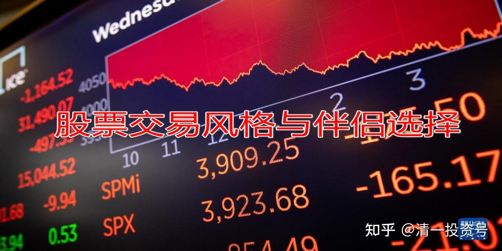
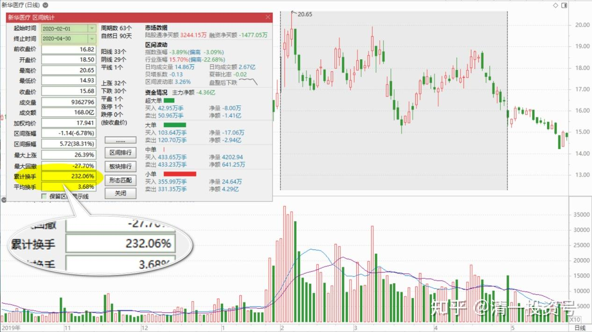
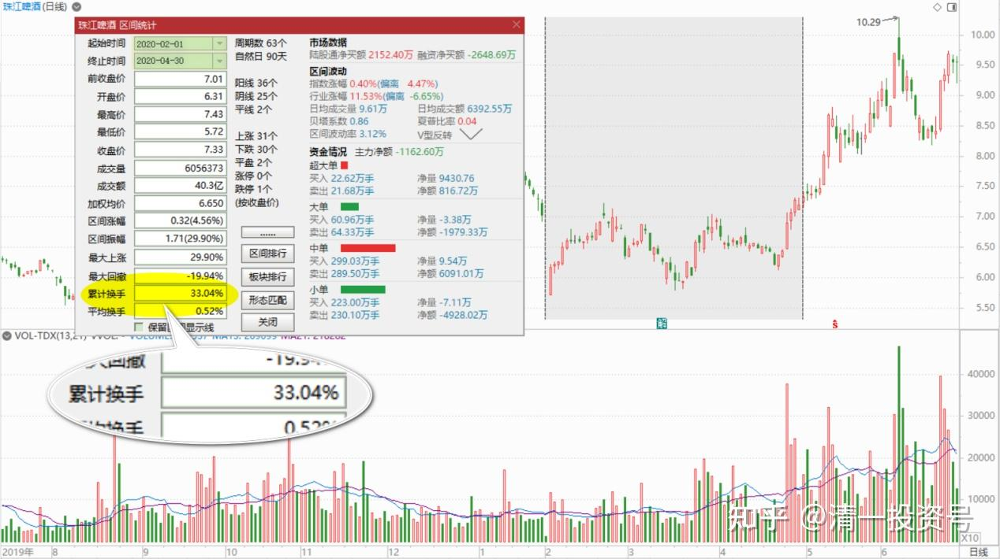
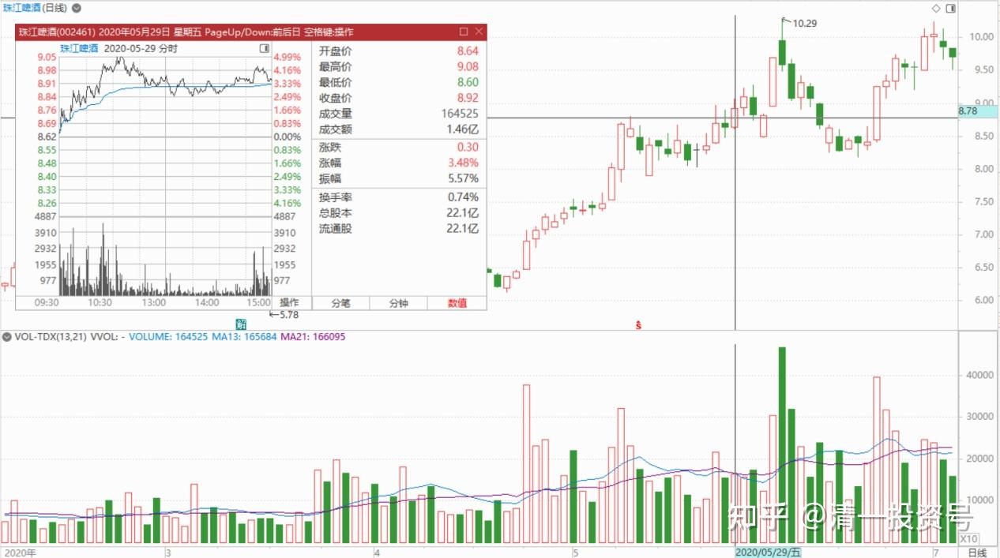

27篇.股票交易风格与伴侣选择

清一山长 2020年5月27日～29日

**一、对比“主力出货”和“弓满待发”**

清一山长2020-05-27 23:04:13

$新华医疗(SH600587)$ 这个股我19元走掉了，居然还赚了钱，真不好意思。今天来看，好危险，2、3、4三个月的成交总额，超过230%。换手很充分——可是股价是下跌的。而珠江啤酒同期三个月的总成交额，不过30%多一点换手，只有新华换手率的零头。就已经涨了50%以上。——**这意味着新华是典型的主力出货图形，而珠江是弓满待发。**新华更恐怖的是价跌量升（2015年新华爆发时，价涨量也升，主力玩得最舒服，最终货卖完了，韭菜还可以反复割多次，才会有这么巨量的成交额。所以后来才有长期多年下跌的新华。新主力最近也出局了）。现在看样子，2月份之后，新华主力借疫情概念完成了出货任务，股价未来将陷入长期低迷，成交低落，股民士气涣散。股价将跟随大市波动，别指望什么惊喜了。除非牛市启动，或者牛人再度降临，否则本股没希望了。

我要反思自己的投资思维——当初怎么会买这种妖股。虽然我是看出了有主力进出的迹象买的，但万一主力也被套，我不一起赔死吗？幸亏出了一个疫情爆发概念行情，让我在股灾中还获取了卖出新华的本利去购买难得跌价的好股。但这属于运气，不是确定性。以后基本面不好的股，还是尽量远一点。这个股很妖，但别指望妖股赚钱，除非你更妖[俏皮]

塔布朗回复天涯2017：

五块钱出货?茅台500出货吗[亏大了]？

清一山长2020-05-28 06:37:45回复塔布朗：

他说对了。中建的主力安邦，正在5元亏本出货[大笑]。你们跟不跟？

**二、卖掉强势股，买入弱势股**

清一山长2020-05-27 19:30:42

$珠江啤酒(SZ002461)$ 今天没看盘，外出做事去了，刚回来看到珠江突破，古越涨停。

今天对珠江是一个重要的日子，宣告对前期高点8.52元一线的有效突破。花了两周的时间，这段时间每天的盘面上都是在做“冲刺”的假动作，手法很完美，弄得我动都不敢动。知道随时可能被甩掉。笨人笨办法，就是趴下不动，也不看。今天上午的上涨中，8.9元的阶段新高，让这些聪明的浮动筹码高高兴兴的下车。不太甘心的，下午给了8.7元的价格，也算不错了。后来也慢慢走掉了，主力没有强买，只是维持不跌。主力的主买时刻，是上午拉升的主动上涨吃筹行为，常常出现一些大单，一单上千手的买入，突破。下午陷入垃圾交易时间。虽然是前期新高，但抛压并不重。未来8.5元将成为支撑位，不再是昨天以前的技术上的“压力位”了（这段时间真有趣，每次碰到“压力位”就快速下来了，显得压力很有效！所以，大家都知道8.5元是压力线，到了就要赶快走。今天之后，8.5元变珠江的支撑线了，9.0元前后成为压力线。是不是又需要两个星期来突破呢？等着瞧好了。

我一直在等珠江的涨停秀，一直没等来。以后就继续慢慢等。**真有涨停，至少卖掉2M，换中国建筑去，免得看盘太累。我常常卖掉强势股，买入弱势股**，证明我不是一个聪明的人。傻人傻办法。只要降低亏损可能性，我就会这样犯傻，去买不涨的弱势股。买入后就套牢很久很久等解套

清一山长2020-05-29 16:24:58

$惠泉啤酒(SH600573)$ 最后半小时差不多是前面3个半小时的成交量。7元整数关就这样轻易过了？是不是该冲击去年没过的高点了？

清一山长2020-05-29 10:45:19

$珠江啤酒(SZ002461)$ 一早就挂了个9.04元卖出10万股珠江的单，没想到真给吃掉了。挂这个价，是因为这批货是8.24元买进的试手盘，前几天公告过的。目前这个差价正好0.8元，好算账。这个价格敢于高价买入珠江，是因为更早以8.67元卖出了珠江。这十万股珠江，目前等于多卖了1.2元的差价，很满意了。感谢主力给的赏钱！

剩下的大批珠江继续等待卖出的机会。从今天的盘面上看，珠江的上涨冲动越来越强了。拖着前几天买入的燕京也涨了一些。**现在继续跟着中国啤酒的风口当飞猪，只是小心规划降落的方式。**

今天还挂单买入了1M的中国建筑，价格4.99元。奉行破五就买的策略，应该不会大错的[大笑]。

**三、股市、伴侣的左侧和右侧**

看惯秋月春风回复清一山长:

这操作反人性啊！卖掉一个连续上涨的买入个连续下跌的，看不懂

---

清一山长2020-05-29 12:12:03回复看惯秋月春风:

我是左侧交易者。你是右侧，当然看不懂[大笑]。**左侧的人笨，也自认自己笨，所以用最笨的方式来交易。**右侧交易者天资聪颖，看得懂什么时候是最佳的进出时机，这种交易手法，可以短期内获得最大的回报。短平快操作，特别节约资金和时间。左侧交易者，获利特别困难，买入后往往套牢，需要等很长时间才能得到回报（比如我的珠江，2018年就当了十大股东，现在才开始兑现一点收益，赚钱速度太慢了）。**左侧交易者，买入的时候常常套牢，卖出的时候常常踏空**（我经常这样干），一看就是傻人一个。但右侧的人绝对不会踏空，热门股一启动，他们就会马上追上，甩都甩不掉。他们也绝对不会套牢，一看风向不对，就会果断割肉离场，绝不留恋。他们没有”爱股”一说，不会做任何股的粉丝。所以，他们才是市场上最善于呼风唤雨的炒股高手[很赞]。

给大家一个建议：**嫁人，还是嫁左侧交易者更好。**虽然傻一点，闷一点，但是他“买入你”之后，一般不会换股，除非你变心了。右侧交易者，他如果比原来更有钱了，就会换比你“更好的股”。如果你变得比原来老，比原来烦人，开始贬值了，他也会换新股的[大笑]。

女人也分左侧、右侧的。左侧的女人痴心一些，认为看中的男人未来有价值，早早就会买入，陷入情网。买入后也愿意长期持有，对外面风光无限的热门股男人，她看也不看。直到自己的男人成名为止，不成名她也认命。如果男人成名了要走，她也愿意放行，不会强留。右侧女人不一样，她们不会嫁给年轻的男人，除非你是富二代。你还是潜力股的时候，这些女人绝对不会理你的。她们只要热门股男人，老一点也没关系。当你红起来了，就算你老一点，身边有女人，有孩子，甚至你孩子跟她年龄一样大，她们也会热情地拥抱你的，一点也不在意你的身边的女人，她们不会嫉妒的。不过，如果你过气了，破产了，不再是热门股了，这些原来你赶都赶不走的女人，会第一时间离开你，你用你最大的爱和热情来挽留，都不起作用的。所以呢，**男士娶老婆，还是死心眼的左侧女人更好，这种傻女人，才会不弃不离地守着你到老。**

我年纪大一些，身边的老板朋友又多，看过太多的财富故事和人生故事了。**股市，人生，一样一样的。最靠谱的总结就是：既然知道自己是笨人，就别去跟聪明人混了。**别自己找抽！

清一山长2020-05-29 16:20:28

今天的盘面研读，主力似乎还在买买买，今天是主买的走势。特别是最后20分钟，很典型的压盘偷吃。9.00元的价格压了十几万股，一直不吃。比9元高的卖单也没多少量。给人感觉就是主力压盘不让涨的样子。后来看到更多的卖单涌出，8.99元、8.98元卖单都堆到30多万股了。奇怪的是买单有一笔20万股的横在8.97元，买卖都不是太积极。但8.97元的卖单突然消失了，只留下小买单。然后8.99元的单子被吃掉，一丝毫都没碰9.00元的单子，就掉下来了，逐级调整到8.92元收盘。我感觉9.00元就是压盘的单。目的还是为了吃货。只是——什么样的主力今天跑来吃？原来没吃够？还是新人加入要吃？估计是新的机构吧！但老主力显然没有卖的想法。所以今天创新高的成交量，与昨天调整的成交量差不多。浮筹越来越少了。

我9.04元卖出的10万股珠江，原以为是主力一单子买掉的，后来查看是分十笔成交，中间隔了10秒。第一单看样子是主力单，吃掉了5万多股。然后是两张小单，然后10秒钟之后是一张4万多的买单，跟了六张小单。300股、500股的，全吃光了。然后就冲上9.08元后自然回落。看样子某些小股民跟盘跟得很紧，动作很快。是不是机器设置的多联动账户?我就不知道了。

结论：看样子珠江10元是可以期待的。什么时候可以等来珠江的涨停秀？早一点来，我恐怕会早点走，失去了后面赚钱的机会。晚一点来，我可能会赚更多。到底我该希望她早来，还是晚来呢？[俏皮]。有点纠结！

**四、学最傻的办法，拿住价值股等分红**

借股修行回复清一山长:

感恩山长分享！财富课的时候，您以“亿安科技”为案例讲技术操作，真是没咋听懂！但是这次全程跟着您做珠江，您的技术分析的“实操课”，让人大开眼界！感恩您！

不过，还是希望别太快涨停，慢慢来吧！都已经厮守两年了，还怕再等一年半载嘛！

清一山长2020-05-29 16:51:57回复借股修行:

我知道很多人来上财富课，特别想听我讲技术分析。我一直不愿意讲技术分析（你们这期算好的，还给你们讲一点），是真心照顾你们。讲了对我最好——老师真高明，真牛。但你们真学不会有啥用？**还不如学最傻的办法，拿住价值股等分红。**（学得会的人，根本不会来找我上课的，他们正忙着每天追涨杀跌呢！）。不讲，弄得你们有人还不满——老师是不是不懂？

我在雪球上分享一点技术，主要是留一点我的投资记录给有缘人，以后大盘的行情好了，牛市来了，我就消失了。但我认为大多数人也一样学不来的。看着的时候，觉得很过瘾。但下次遇到别的股，一样还是看不懂，做不到，跟不上。这需要学【金融心理行为学】才能懂。一般体制教育出来的人，只善于跟风[滴汗]。

正萁回复清一山长:

一波儿买卖我现在珠江成本不到4.2元，谢谢山长大大，那些跟您反着的都是脑子进水了

清一山长2020-05-29 17:00:15回复正萁:

不能这样说。8.67元买我珠江的人亏了吗？到今天一样赚钱。未来我大概率一路卖出，但我相信珠江会一路上涨，一路买的人，都是正确的。今天9.04元买了我珠江的人，未来一定是赚钱的。而我一路卖掉，都将是“错误的操作”。正因为我判断珠江是这种走势，我才会说留1M尽量不卖，但肯定是负成本持有。

上涨卖掉珠江的原因，是让我的资金有更好的用途（起码我这样认为），或者是我达到了我看懂的珠江的前途，看不懂的部分，机构正在调研。他们敢9元来抢货，一定有他们的道理。并不是我卖掉是一定是正确的。珠江可能就是不该卖的股。起码今年是不该卖的。

海妮5233回复清一山长:

我这批珠江8.15入，今天8.8、8.89、9.05元分别出了半过，打算如果跌回一些再买回来，或者买燕京或中建。

清一山长2020-05-29 19:06:12回复海妮5233:

**建议你们买了中建就睡觉去，睡个五年再来卖。省心，省事。**别凑热闹了。我现在偶尔买珠江，是做T的需要，多高都套不住。你们高价买，就要当心了。我现在都改邪归正，买中建计划睡五年了。

**参考链接：**

[12篇.早期珠江啤酒、燕京啤酒的换仓记录](https://zhuanlan.zhihu.com/p/602033762)

[13篇.买卖操作后的富足之心](https://zhuanlan.zhihu.com/p/604162057)

[14篇.珠江的破位急跌，名曰跌停进货法](https://zhuanlan.zhihu.com/p/606062514)

[22篇.它很可能是下一个重庆啤酒](https://zhuanlan.zhihu.com/p/645392522)

[23篇.危机时刻好公司不用担心](https://zhuanlan.zhihu.com/p/646998882)

[24篇.守住筹码很不易](https://zhuanlan.zhihu.com/p/648860208)

[25篇.筹码收集完毕，正在养股](https://zhuanlan.zhihu.com/p/650255857)

[26篇.现在最应该做的，就是稳稳的做好轿子](https://zhuanlan.zhihu.com/p/651196882)
