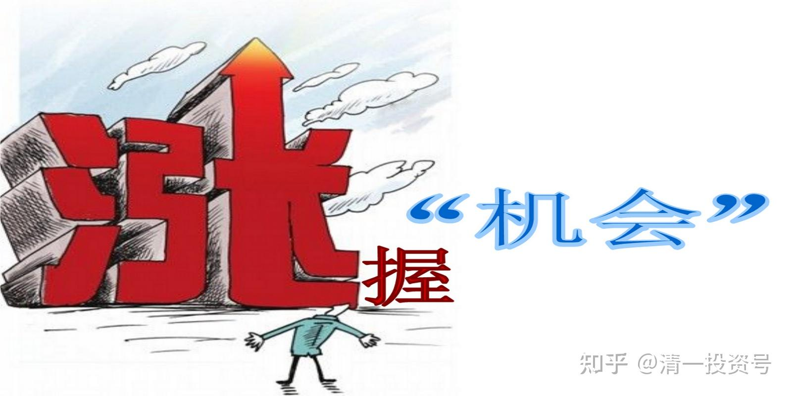
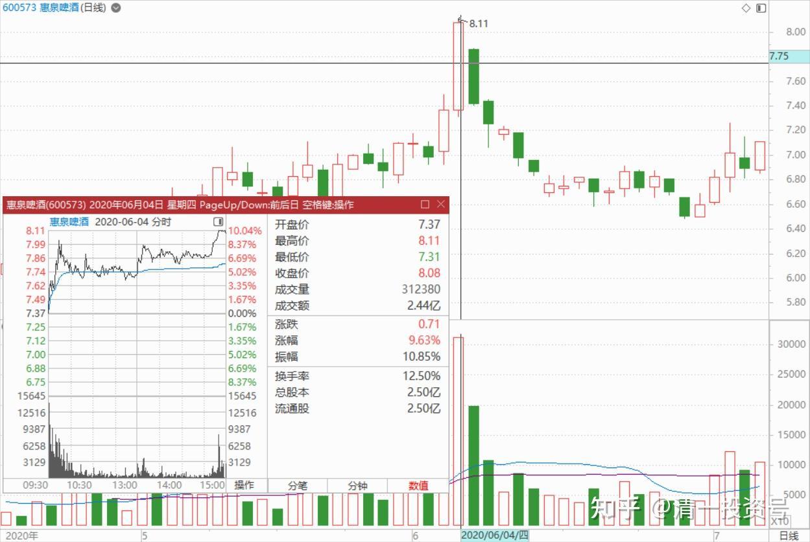
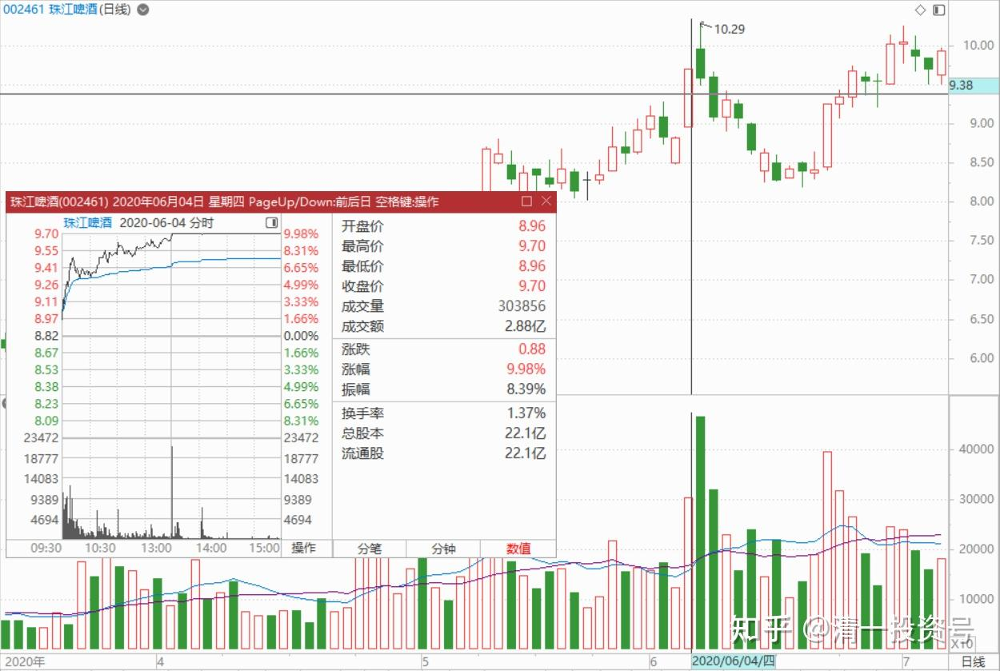
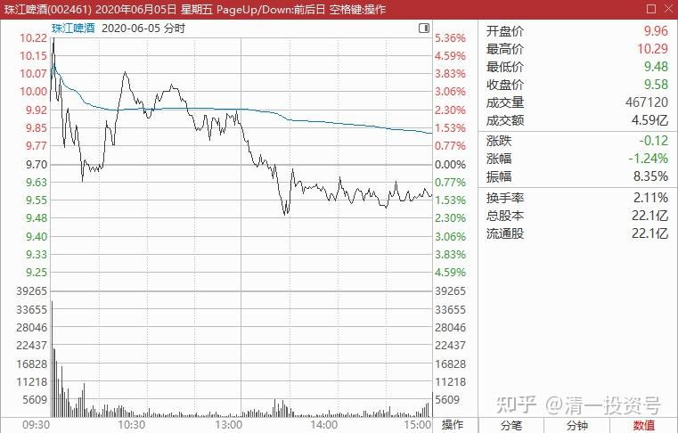
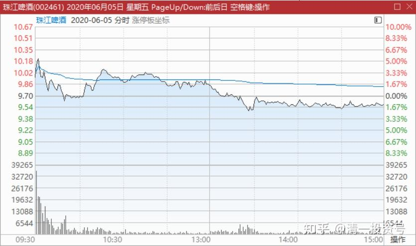
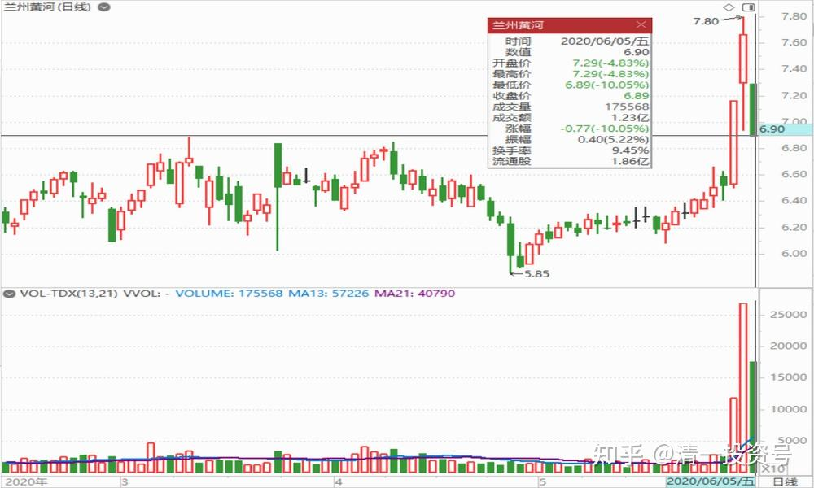
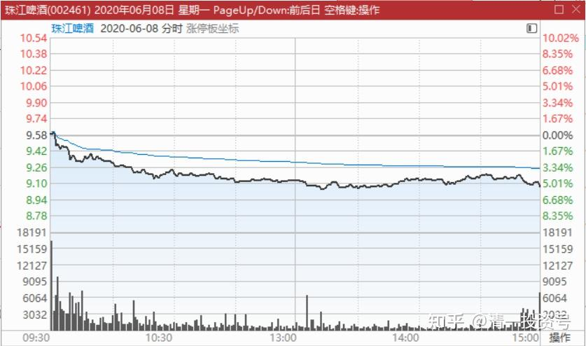
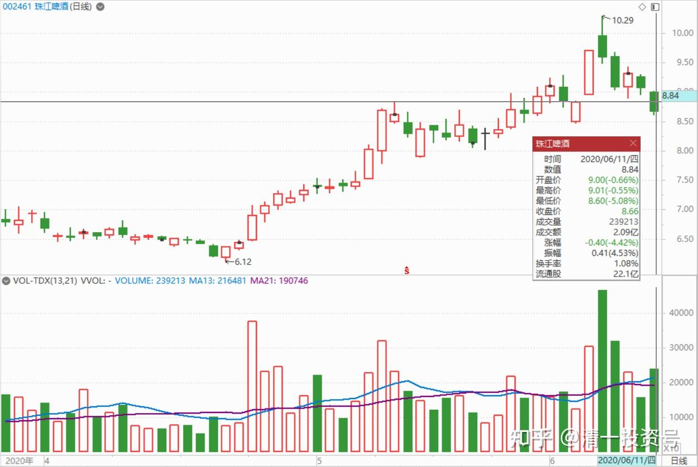

29篇.行情还没完，后面还有大机会

清一山长 2020年6月5日～11日

**一、培养群中基础**

清一山长2020-06-05 10:18:39

$惠泉啤酒(SH600573)$ 昨天8.11元卖出20万，今天7.53元买进，数量就不足够了。做T差价6毛多，可以了。**涨停价就是卖的时候很容易，但要想买回来就不好办了。**虽然买点能够把握，但数量无法把握。除非是中建这种不愁买卖的股。不给就算了，算是降低成本了。

今天来看，珠江不卖是对的，调整非常强势。燕京，特别是惠泉，就弱得多。昨天量最大的惠泉（相对股本的比例），今天最弱。所以告诉大家一个我20多年的老经验——**尾盘涨停的，一般第二天维持不住。第二点：关键看量，量能放大的，第二天维持不住。**珠江涨停，其实没啥量。**上午就2.2亿了，下午冲涨停，才2.8亿，说明涨停也没啥抛单，不用着急跑掉。**所以今天继续强行冲高。但早盘冲高，倒是跑了不少单。可能是主力的主动抛单，摊低成本的。说明未来10元一线有争夺战。有热闹看，做对了方向有红包拿。绝对有吸引力。

双人鱼5ad回复清一山长:（跟评上贴）

惠泉啤酒昨天追入今天就被套了，楼主后市走势如何？谢谢！

清一山长2020-06-05 12:10:41 回复双人鱼5ad:

您是跟我反向而行的人，我卖你买。你怎么能够问我这种问题呢？应该是我要好好地请教你？为啥您要高价追惠泉？是不是看到了我没看到的前途？为啥你以为涨停之后还有涨停？

我不知道后市走势如何的，所以我只敢低价的时候买。昨天我卖货了，说明我对涨停不看好。当然，我也不知道会不会跌，所以没卖完，想卖完也做不到，没人接。今天跌了，我买回来一部分。也不知道会不会套牢，套牢了就算了，当我昨天没出。我是糊涂派的，傻瓜投资法。您问错人了[俏皮]

清一山长2020-06-05 14:18:59

$珠江啤酒(SZ002461)$

**这个图形是出货的图形，主力卖出昨天买进的一部分单子，给小散接盘。**不过不用慌，主力很在意价格维持在昨天的高价范围（9.5元以上）出货的话，用意就不是真的出货，而是派红包。实际上主力也在把一些获利盘继续的吃掉，消除未来上涨的压力。我认为昨天上午甩掉一批做T高手的跟班之后，基本上珠江的跟风盘全都傻眼了，下午的成交就很少，看着涨停价也没脾气了，我偷偷地卖出了20万股，不想嚷嚷的原因，是我看到实际上主力在涨停价也依然大方的要货，故意不多挂推单，造成买气不足够的负面印象，吸引技术派赶快走人。但实际上主力并不想真正的卖出（对比就是惠泉，我差点没赶上涨停卖出，**一挂单他就开始撤掉涨停价**，当然成交的只能算了，显然不想多要）。如果我发现秀肌肉的动作，就会赶快地丢一百万股给他了。实际上我看了盘面语言就不敢卖了。因为他想要我卖（昨天说了）。实际上珠江涨停卖出的单子很少，因为想卖的都没有筹码。今天继续拉高一点问题也没有，但这样玩，跟班太少了，浮动筹码太少了，以后就不好玩了。**主力需要一些人加入进来一起玩，不然一路绝尘而去，就自弹自唱了，没有群众基础。**所以今天在昨天的涨停价上方大量地派货出来，满足了追风者的要求，估计又要套几天了。

我认为：**今天的派货用意，是提供小散上车的机会，培养群众基础。**并不是恶意派货，主力走人的样子。昨天既然已经成功地夺走了小散的低价筹码，现在让他们追涨买入，就不会成为未来拉升的压力了。也让主力的资金得以腾挪，反正他们相信以后还会拿回来的。换换手，更健康。未来肯定还是会突破十元的。什么时候？就看主力的心思了，我们只能慢慢等。

被七宗罪影响的赌徒回复清一山长:（跟评上贴）

主力会不会对你这样的人很无语？

清一山长2020-06-05 14:40:14 回复被七宗罪影响的赌徒:

他们都想砍我了[吐血]。我是冒着生命危险来教散户赚钱的喔！真划不来。我就等主力给我点封口费，可没人找我。估计我说啥，小散户也不信。说了白说[俏皮]

**二、主力惜售**

清一山长2020-06-05 16:28:19

$惠泉啤酒(SH600573)$

这张图是今天的珠江走势图，明天就看不到了。所以特别发在这里做个纪念。上午是主力派货，很成功。**可以断定是短炒的游资成功出逃了。**最后的一个多小时，却并不是出货，**而是长期的主力在慢慢收货。**我注意到9.50元有30万股的买单，下面两分钱下方9.48元，还有20多万股等着。估计是昨天涨停出货的人想低价买进来。但一直没有被打掉。如果有人急于出货的话，绝不会放过这种大单派货机会的。但交易却一直在9.50元上方不断出现几万股的成交，就是不碰9.50元小买单不断地吃掉抛盘。如果上方有较大的抛盘（五万股以上的），就会主动上浮10个价位去快速吃掉，然后有退下来，这种挂的卖单时间都不长，往往很快就没了。最后的一单也是上移吃货接盘的（9.58元）。尾盘的买卖挂单还看得到，可以看到上面都是小卖单，没有大卖单。因为有了就会被定点收掉。这个就说明：**珠江的主力惜售**。9.7元上方，特别10元以上，高兴地派货，9.5元上下却在吸货。说明此波行情还没有完。后面还有大的机会。

**三、快进快出的“小李飞刀手法”**

清一山长2020-06-05 18:13:01

$兰州黄河(SZ000929)$

这就是游资——快进快出的“小李飞刀手法”。徐翔的老乡们发明的战法。第一天涨停，量不大。因为别人还没反应过来。但他们消息灵通，知道第二天的风口是啤酒。所以，第二天拉珠江做龙头，宣传机器跟上，团队作战，这一天看起来黄河啤酒是跟涨，其实是出货。长长的上下影线，说明这一天很精彩（可惜我昨天没看）。今天是收尾了。底仓都全抛光了。就算是第一天涨停拿的货，也可以盈利跑掉。绝不恋旧。资金利用率极高。但是，昨天和今天才跟新闻——夜市要喝啤酒，因此跑来接盘的侠们，就只能老老实实的站在高岗上等解放军了。继续等下一个风口。

处理方式：如果你没有持仓，就看看就行。如果你正好持有，昨天是跑掉的最佳时间，实在来不及，今天接着跑[大笑]，你还要感谢宁波“解放军”的到来。

这个股市值真低。涨了也才12亿，真心不贵。不如把啤酒业务直接卖掉算了，可能指标和市场都比自己做更值钱。估计是没人接盘。

清一山长2020-06-08 19:33

$珠江啤酒(SZ002461)$

**今天的图形，还是主力出货。**下午维护一下盘面。跟上个交易日类似，上午出货，下午维护盘面，抛盘多了买一点进来。不让价格掉得太快。至于目的是什么？不太清楚。在控盘很好的情况下，主动放弃筹码，要么就是聚集人气，给甜头吃。然后一起上攻。要么就是2018年一样的燕京，来了两个涨停，急拉上涨，然后——悄然退走了。

不得不佩服主力的操盘手法，原定冲涨停一定出一M的决定，在看到它冲涨停毫不费劲的样子，所以并没有大举出手，又被迫坐了一回电梯[大笑]。现在想：是不是明天要考验8.5元的支撑位了？

明达野老2020-06-08 21:38 回复 清一山长 （跟评上贴）

[献花花]赞同山长关于出货的判断。今天好奇，特意抽空收盘前看了眼主力的“直播”：下午1点半左右之后的反弹应该是故意做出来的，手法很巧妙，直线杀到9元支撑位以及十日线的位置就开始制造“超卖”的图表技术趋势。从手法上看，应是前期抢建仓的资金无疑，因他有一个非常大的做盘特点——目的性极其明确、大开大合、心思细腻。做这种超卖信号，无非是吸引接盘资金，目前看，他的目的达到了，买盘上也是很踊跃的，尾盘集合竞价成交了7000手左右，买盘（到9.00元）累计还有1.1万手。另一个有意思的点是收盘集合竞价前一分钟，主力一改有承接盘就送货的举动，而是在卖一挂同等货量的卖盘，买一立马撤掉单上浮一个价位摘掉了，几乎是同时完成的撤和摘的动作。

综上，我推测：1、主力已经达到他做出跟风承接盘的目的，人气没丢；2、主力手里还有货，这个货量他可进可退，所以已经开始“调皮”了；3、无论是选择出清还是准备下一波的拉升，明日很可能要做个“触底反抽”迎合市场情绪预期。

小梁业余回复清一山长:（跟评上贴）

大师，大家现在特别需要你的意见，请帮忙点播指引一下。

清一山长2020-06-10 10:38 回复小梁业余:

商场上，只有赢家和输家，没有啥大师，如果持有啤酒导致血压增高，受不了的话。建议各位买入中国建筑。然后睡觉去。对于我来说，**啤酒只是逢高减仓的品种，不是现在追高新买入的标的。**

**四、别想赚到所有差价**

清一山长2020-06-11 13:54

不幸言中，真要考验8.5元的支撑位了。

明明已经控盘，却释放出大量筹码。不合常理。但主力绝对有意图。这个样子，显然不能期待短期上升，继续陪着熬了。

我承认被成交量骗了，涨停当天，一直想要不要出掉1M，正好有这么多的承接盘。但终于没下手。继续坐电梯吧！

唯一值得安慰的是：涨停当天出掉了几十万股的啤酒，迟迟没有拿回的原因，就是觉得走势怪异。后来换中建了。这个价换中建觉得很划算。持仓成本降低了一些，就继续陪着主力熬一段时间。**别想赚到所有的差价。**

昨天出掉了泰国银行KBANK的股票，赚了接近30%。跌破90B的时候果断买进，昨天116B出掉。腾出资金等下半年再进。目前泰股赚的钱，已经够团队在泰国生活几年了。**现在逢高出货是本能。等待可能的金融萧条带来的打击。**预期是难看的中报结果，可能会带来世界范围内的忧虑和恐慌，现在大家都蛮有激情的，居然追涨。

再说一遍：**中建可能是下半年疫情影响下世界范围内经济萧条的资金避风港。**如果还有其他类似的避险股，请推荐下！**现在不求多赚，只求不赔。**仅仅持有现金也很危险，因为全世界都在印票子。

(标题、图片为编者所加)

文章音频：

[270篇.行情还没完，后面还有大机会_清一投资号文章同步音频_免费在线阅读收听下载 - 喜马拉雅](http://link.zhihu.com/?target=https%3A//www.ximalaya.com/sound/665443445)

**参考链接：**

[12篇.早期珠江啤酒、燕京啤酒的换仓记录](https://zhuanlan.zhihu.com/p/602033762)

[13篇.买卖操作后的富足之心](https://zhuanlan.zhihu.com/p/604162057)

[14篇.珠江的破位急跌，名曰跌停进货法](https://zhuanlan.zhihu.com/p/606062514)

[22篇.它很可能是下一个重庆啤酒](https://zhuanlan.zhihu.com/p/645392522)

[23篇.危机时刻好公司不用担心](https://zhuanlan.zhihu.com/p/646998882)

[24篇.守住筹码很不易](https://zhuanlan.zhihu.com/p/648860208)

[25篇.筹码收集完毕，正在养股](https://zhuanlan.zhihu.com/p/650255857)

[26篇.现在最应该做的，就是稳稳的做好轿子](https://zhuanlan.zhihu.com/p/651196882)

[27篇.股票交易风格与伴侣选择](https://zhuanlan.zhihu.com/p/653139189)

[28篇.看图要反着看](https://zhuanlan.zhihu.com/p/654521213)

