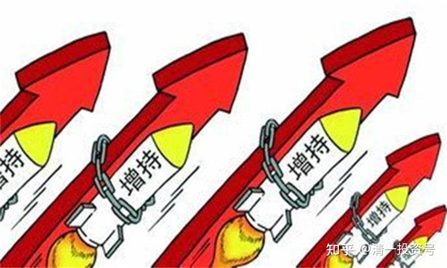
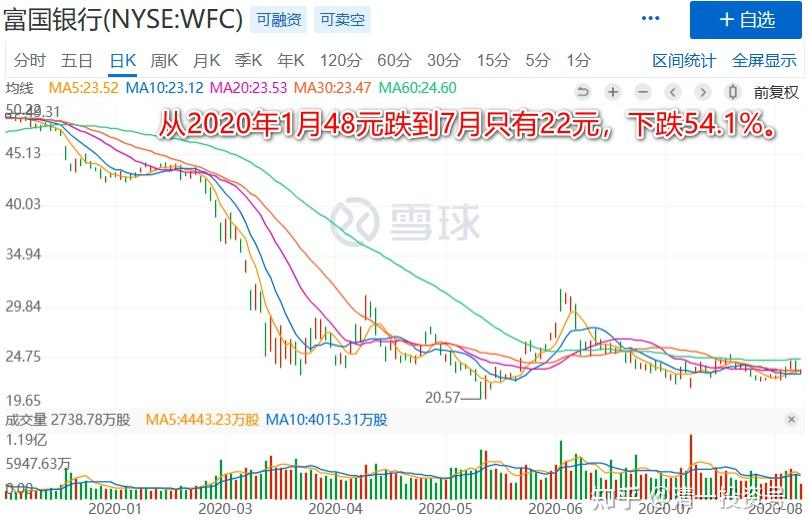
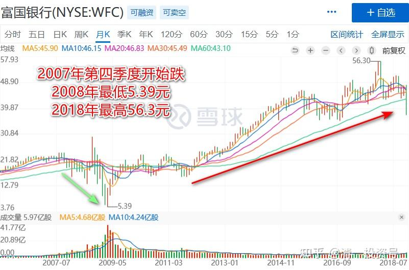
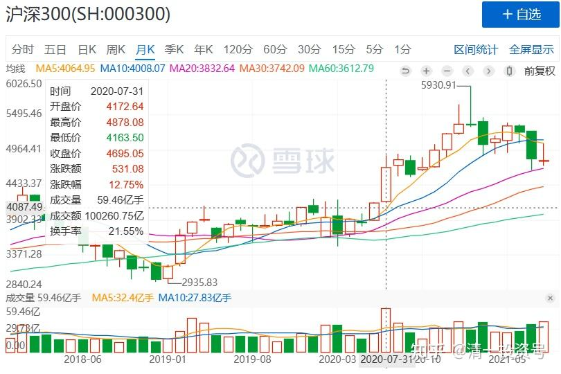
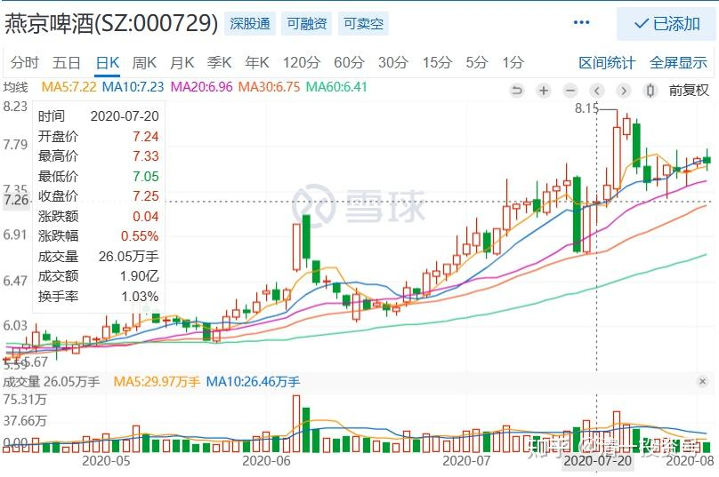
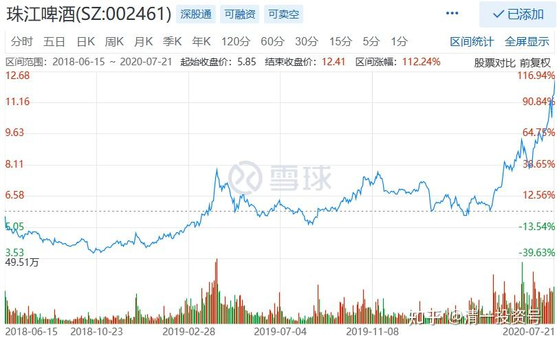
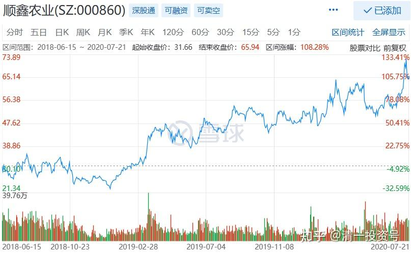
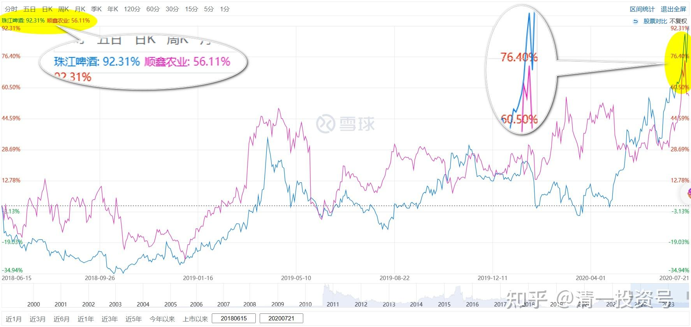

33篇.宁愿套牢也不想踏空

清一山长 2020年7月20～21日

**一、宁愿套牢也不想踏空**

清一山长 2020-07-20 11:08:41

$富国银行(WFC)$ 这是老巴的第四重仓股。今年以来，按仓位计算，老巴在富国上“亏掉了”100亿美金（700亿人民币）。这算是他的失败投资吗？我们要学会他亏几百亿依然不动心的心理素质，不会因此被负面情绪左右。他如果想：“如果年初我卖掉富国就好了”，他就不是老巴了。而是一个小散户了。

中国的银行股，其实比美国的银行股好得多。现在的利润要压着一点，不是虚的要装一点出来。这就是实质性的中国银行竞争力，远远胜过西方银行。我是肯定不会买西方银行的。

但指望银行股上涨，我预期今年是没戏的。也许明年会好一些？我买的泰国银行头寸，是相比去年，已经跌了50%以后才买入的，都是5年，甚至十年的最低价。我的计划长期持有的。没多久，居然来了一波跟随美股的走势，30%以上幅度的大反弹。我清仓式减持之后，现在，已经再度跌回原地了。很庆幸我不相信这种世道之下，银行股票还会涨，不然乐观之下，我相信了市场先生的疯狂逻辑，以为还会涨回原地的，我就坐过山车了。

今年首次赚到泰国人的钱，来自于银行和地产，很高兴。我一直都是在泰国花钱的。如果这些股继续跌，我会继续买入的。我认为：二季度，以及三季度的企业报表，会像富国一样难看的（2008年度首次亏损）。会让大家都知道——这一次就是金融危机。估计会吓得快跑，我就继续买进我认为不会破产的银行股，死守几年算了。

清一山长 2020-07-20 11:36:02

$富国银行(WFC)$ 研究一下历史，觉得很有意思。世界是2008年发生的金融危机，富国2007年四季度股价开始下跌（先知先觉者开始退出）。2008年一季度，二季度，富国都在下跌，总共跌了40%左右。很奇怪是的，金融危机最强的2008年第三季度，富国却涨了，跟上季度相比，大涨了70%，还创了新高。2008年第四季度开始跌了，把三季度的涨幅全部回吐了。巴菲特开始唱多，买进富国。告诫周围的人：持有现金是不对的。但没人理他，股神出来说话都没用的。美股随后加速崩盘。二季度，富国疯狂下跌，从2008年三季度的最高价44.69元，跌倒了创纪录的7.8元，跌掉了80%之多。真够凄惨的。如果你等富国从最高点跌了50%进场，22元买入富国，你买入后不久，就腰斩了还有多的。如果你没有动用融资，持有10年，到2019年的高点，你赚了三倍以上。即使到了现在，你依然赚了一倍（复权）。如果你敢于动用融资，一倍的杠杠，你还有钱补仓，没爆仓的话，到了高点，你就赚了6倍以上，跌到现在，你也有两倍的收益。如果你用了2倍以上的融资？就完了，今天你赚到的是零元。所以——巴菲特劝告是有用的，千万别借钱炒股。就算买到富国这样的长期看好的公司，你也有可能一夜清零！更别说坏公司了。不用杠杠，本金都会亏光的，比如乐视。

我记得巴菲特金融危机期间，是在30元左右开始买进的富国。但是没查到他在10元左右继续买入的记录，估计钱已经用完了？

如果历史会重复，是不是意味着。今年开启的危机，美股现在居然创新高，是正常的，符合美国历史惯性的。**美股和政府机构，都习惯用“大幅上涨”，甚至“创新高”来“抵抗世界经济危机”。**如果抵抗无效，就一年后彻底跌一回，彻底洗盘。到2021年才会出现最恐怖的一跌？

看了这段历史，各位是不是认为我国的领导很英明？现在就压住A股不让涨。不然到了今年下半年，或者明年，美股开始像2009年一样大跌的时候，A股也跟着一地鸡毛（正如2008年～2009年的中国A股），然后跟随美股慢慢的恢复，十年也恢复不了元气，就太没劲了。**不如在美股大跌的时候，中国股市反向而行，稳定上涨，就把全世界的眼球都吸引过来了。这比啥宣传和广告，都能说明：中国变强了，美国要衰落了！**而美国人面对节节下跌的美股，一句话都说不出来！呵呵，想象的未来情节！

清一山长 2020-07-20 12:55:29（跟评上贴）

强调一下：别以为我现在是卖掉股票，甚至会去做空的。我的A股，是看空不做空，我是满仓。啤酒和中建是主仓（只有泰国账户是空仓在等待）。A股下跌后，如果满仓怎样买入呢？别担心，我计算的极限低价，中建可能会破4元。万一真的如果出现了，就是天上撒钱，干嘛不要？我就上融资买中建就行了。融资额度，是我一直留着备用的总预备队。所以，下跌的时候，我永远有钱来补仓的，因为我不动用只在紧急状况下才出动的“预备队”。但现在我就担心金融危机，全部卖掉股票持有现金，万一A股涨上去，我就踏空了。**我宁愿套牢也不想踏空——因为这么便宜的股，干嘛放过？长期来看，A股长牛是必然。所以别空A股。选择最保险的、肯定有未来的股票买入，才是你最应该做的事情。**

曾乐天回复清一山长:（跟评上贴）

山长老师对看不懂他文章的球友真的是用心良苦！让我们感动。

我想问，山长老师如果没有今日新教育宏大的事业目标，还会对球友这么无私，真诚的传递自己成功的投资理念与实际操作手法吗？

清一山长 2020-07-20 14:14:30回复曾乐天:

喜欢问“如果”的人，都是一群梦想家。都没学会”活在真实世界“中。

试试看你们的问题吧：

问题一：山长，如果你把原来9元多卖掉的珠江，放到今天早上12元多再卖掉，是不是显得更有本事些？

问题二：如果你很早就买燕京啤酒的仓位，全部换成珠江，你会不会更成功？

问题三：如果你把啤酒，全部都换成茅台，会不会投资更成功？

如果……如果……可惜这些如果，都没有一丁点的”理性和思考之光“。

**真正的问题是：这样跑来问“问题”的人，其实根本就不关心自己怎样才能提高。只关心看看别人的热闹，去幻想别人的故事。他们不知道什么叫“智慧”。只知道“玩聪明”，而且是玩“事后聪明”的游戏。[俏皮]**

**二、重仓两个啤酒的逻辑**

清一山长 2020-07-20 14:41:25

$燕京啤酒(SZ000729)$ 上一交易日，啤酒逆势大涨。本交易日，大盘强劲反弹，啤酒却止步整顿。均线修复良好，也不费啥劲。这种走势，大将风度[赞]。完全是独立行情。

清一山长 2018-06-15 11:08

$珠江啤酒(SZ002461)$ 40.55元卖出一部分顺鑫农业，现在持股成本已经降到0.22元一股了[大笑]。今天大量买入珠江啤酒，理由就是：顺鑫很可能涨到80元。但顺鑫涨到80元的难度，估计比珠江涨到12元的难度高，所以用顺鑫换珠江，只留下顺鑫的利润继续奔跑。其中一单是以5.79元挂进去十万股买入珠江，查看已经成交。现在在继续买入中。不知道下午会不会破位下跌。今天豁出去了[加油]。珠江本来都快到一千万的利润了，现在跌到只剩200多万，惭愧。应该7.71元出光的，锁定利润[大笑]。不过，我本来就是买入就套牢，卖掉就上涨的命。还是认命吧。我不入地狱谁入呢？我就在珠江的地狱里慢慢做吧！没钱了就去清迈山里面玩去。有钱就看看盘。

清一山长 2020-07-21 10:14:27(评论上贴)

两年前，珠江5元多，是“恐慌”的对象，我却抛出正在上涨的顺鑫农业，当年这个时点，顺鑫只剩一半的仓位了，后来上涨中也在逐步卖出。资金在大量的买入珠江，半个月后，就成为珠江唯一的自然人十大[大笑]。除了你们看到的十大账户，我还有其他账户买入的珠江，所以持仓比十大显示的还高。今天的珠江，12元多，已经实现了我的预期，成为了我赚到最多利润的酒类股，也是除了中建以外，赚钱最多的股。当年我说要大买珠江的时候，心中看到的是12元的价格，是不是像是一个远不可及的梦幻？我这次买入后，后来还掉了20%以上，跌倒了4元多。让我的珠江账面都出现了亏损。所以，抄我的底，可以赚到比我更多。也更安全。不过珠江最安全的时候，却是散户们最恐慌的时候。今天的12元，却是大家认为最安全的，最惹眼的时候。珠江已经是市场“贪婪”的对象。大量的机构调研，资金介入，每天的成交都很热络。今年的顺鑫农业65元，涨得也不错，真的没有到80元。我这次用大量资金来“算命”的结果，两年后来看，算是算得很准的了[俏皮]。

晕娜回复清一山长：（跟评顺鑫贴）

山兄，我那是开个玩笑。

实话说，两年后，中建就是到了12元，也就是10xPE。中建好歹也是行业绝对龙头，这个估值，是在合理范围，也谈不上是高估。

好，还是回归您的主题吧。看您对啤酒很有独钟，我也谈谈燕京啤酒。

燕京啤酒，在北京很受欢迎，北京人不认青岛啤酒，都喜欢喝燕京啤酒。

我没记错的话，高瓴资本曾经进入过燕京啤酒的十大股东，后来又退出了。我当年还收集一些燕京啤酒的资料，看高瓴资本退出了，就没再关注他。燕京啤酒近些年的业绩很烂，这是事实。

清一山长 2020-07-21 21:04:55回复晕娜：

我知道中建，就算明年就给你12元，你也不会走的[笑]。

**买燕京，不是拿股息的逻辑。而是认为这个行业有机会走出来。**燕京的确是很烂，但燕京的销量是珠江的3倍。能把销量做出来，就绝对不简单。可是它的市值比珠江更低。这就不合理。重阳重仓燕京，而不是珠江，有他的道理在。肯定不是赌博的。他的投资逻辑我认同。**但我还是重仓了珠江，是因为我看懂了盘面语言。**我其实是在研究燕京的时候，才关注到珠江的。我发现两年前，珠江有人在进。我不清楚珠江到底好在何处，但看到有资金明显流入的痕迹，价格还被人为的打低，我当然要买了。否则，如果只是看啤酒行业的大逻辑，应该要买燕京的。很庆幸我赌对了，珠江果然先涨。由于我知道我的持仓价，是低于主力成本价的，所以，珠江跌到四元多，我也不怕，知道是有人故意做出来，吓人用的。我见到低价就不断买（投机，交易者[俏皮]）

**在啤酒这个赛道，销量就是互联网的“关注度”，就是“市场占有率”，就是“国土面积”。**销量是应该给含金量的。没有利润，关系不太大。一旦上涨了，利润就来了。因为基础费用是基本固定的。而且——啤酒的行情，似乎已经开启了。建筑还不知道。所以——我把啤酒赚到的钱，拿来买中建，把浮盈做实，就是最好的选择。珠江换了一批，未来还有要继续换的，燕京也在等待上场机会。所以，如果中建一直不涨，对我倒是很有利[大笑]。涨了，就要另选候补人了。不过，中建现在已经恐怕等不久了。我觉得有迹象不会比燕京更晚走强。**如果选不出来“替补队员”，我的啤酒就只好长持不卖了。因为啤酒年年都要喝的，50年后，估计也是这些品牌的变种。**但我相信市场下半年，会给我换股的机会。

(标题、图片为编者所加)

**文章音频：**

[382篇.宁愿套牢也不想踏空](http://link.zhihu.com/?target=https%3A//www.ximalaya.com/sound/672329549)

**参考链接：**

[12篇.早期珠江啤酒、燕京啤酒的换仓记录](https://zhuanlan.zhihu.com/p/602033762)

[13篇.买卖操作后的富足之心](https://zhuanlan.zhihu.com/p/604162057)

[14篇.珠江的破位急跌，名曰跌停进货法](https://zhuanlan.zhihu.com/p/606062514)

[22篇.它很可能是下一个重庆啤酒](https://zhuanlan.zhihu.com/p/645392522)

[23篇.危机时刻好公司不用担心](https://zhuanlan.zhihu.com/p/646998882)

[24篇.守住筹码很不易](https://zhuanlan.zhihu.com/p/648860208)

[25篇.筹码收集完毕，正在养股](https://zhuanlan.zhihu.com/p/650255857)

[26篇.现在最应该做的，就是稳稳的做好轿子](https://zhuanlan.zhihu.com/p/651196882)

[27篇.股票交易风格与伴侣选择](https://zhuanlan.zhihu.com/p/653139189)

[28篇.看图要反着看](https://zhuanlan.zhihu.com/p/654521213)

[29篇.行情还没完，后面还有大机会](https://zhuanlan.zhihu.com/p/655878269)

[30篇.给做短线人的建议](https://zhuanlan.zhihu.com/p/657061174)

[31篇.股票也分贫富，贫富会换位](https://zhuanlan.zhihu.com/p/658569494)

[32篇.主力志在长远](https://zhuanlan.zhihu.com/p/659254835)
