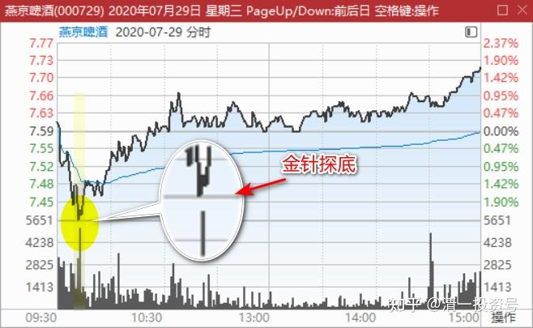
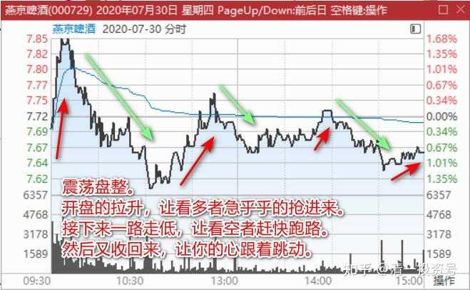
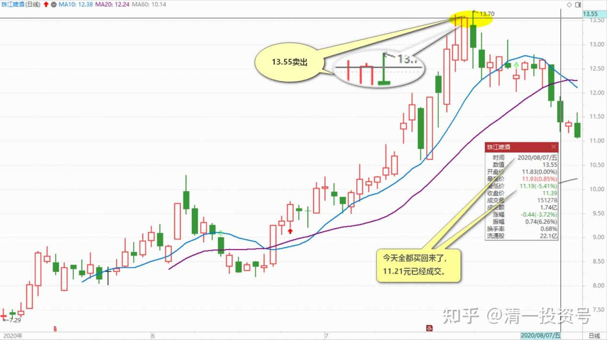
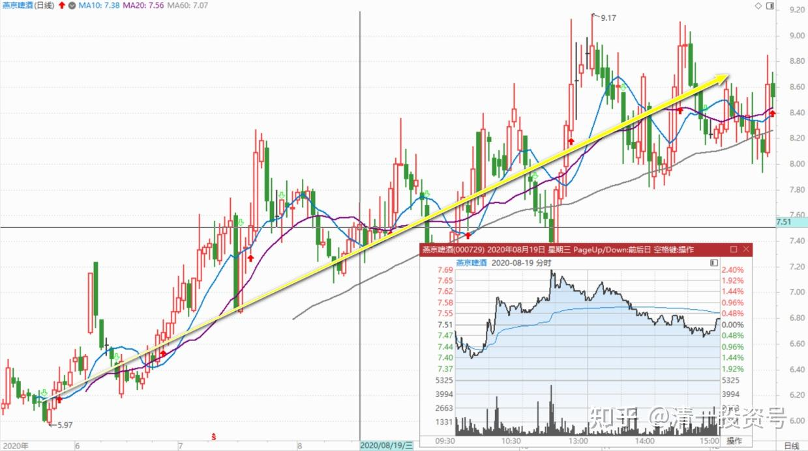
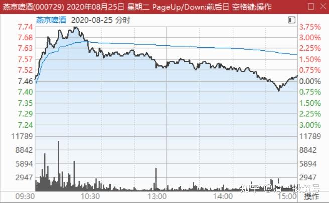
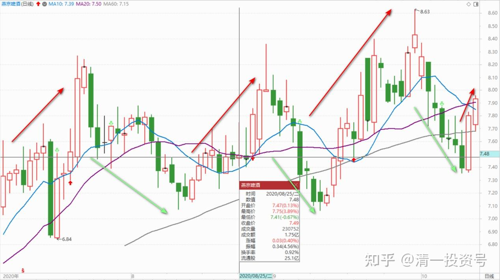
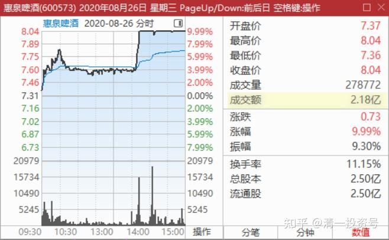
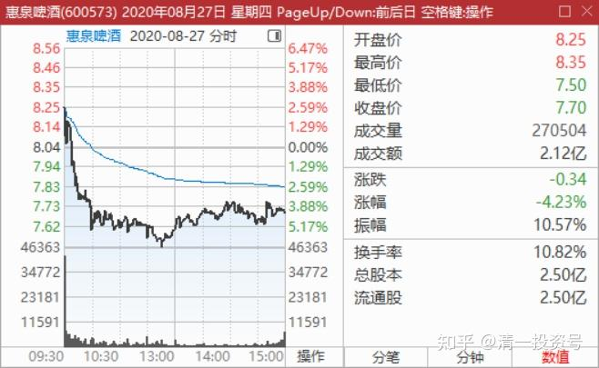

35篇.明显是市场的错误定价

清一山长7月29日～8月27日

**一、明显是市场的错误定价**

清一山长2020-07-29 21:24:29

$燕京啤酒(SZ000729)$ 今天走势的日K线技术图形解——金针探底。留个今日走势的分时图做纪念。

---

清一山长2020-07-30 22:47:20

$燕京啤酒(SZ000729)$ 今日走势，十字星！震荡盘整。开盘的拉升，让看多者急乎乎的抢进来。接下来一路走低，让看空者赶快跑路。然后又收回来，让你的心跟着跳动。唉，小散户玩的倒是兴奋了。可都是白费心机。

览富财经网发布于2020-07-28 17:59

来自雪球《为了“人间烟火气”，“干了这杯”燕京啤酒》[https://xueqiu.com/5757044191/155173506](http://link.zhihu.com/?target=https%3A//xueqiu.com/5757044191/155173506)

自从地摊经济复苏以来，啤酒迎来“干杯”机会，相关啤酒企业或可借此机会提升盈利能力……

清一山长2020-08-03 17:04:38（评论上文）

结合公司2019年报，燕京啤酒（桂林漓泉）股份有限公司2019年进一步优化产品结构，实现净利润约4.56亿元，在广西市场占有率达85%以上，进一步巩固市场地位。

一家的桂林分公司，利润就堪比珠江啤酒。其他的公司，全部加在一起，反而是亏本的。总利润剩下2.3亿元。

**所以，买燕京的逻辑在于：只要桂林漓泉一家，就足以跟珠江拼。**其它都是送的——虽然是亏本再卖酒，但啤酒的市场占有率，本身是值钱的，而且很值钱。**燕京的销量是珠江的三倍，市值也应该是三倍，至少给了两倍吧？比珠江还低，明显是市场的错误定价。**

当然，我说了不算，要等市场先生来定。总有一天会有结果的，就看什么时候市场认同我说的这个逻辑了。

柚道回复@清一山长:（跟评上贴）

山长，我就是桂林人，天天喝漓泉，所以也重仓燕京了[大笑]

清一山长2020-08-03 21:13:45回复柚道:

每天喝自家的啤酒，感觉很充实[笑]。可惜我啥酒都不喝，偶尔尝尝。我从来不认为要通过喝酒的口感来买股票。如果是这样，广西人85%都应该买燕京。最近十年来，都快熬死了，根本没赚钱。酒再好喝，口感再好，根本就没用。不如我一个外行赚的酒钱多。

**二、“狼来了”的游戏**

清一山长2020-08-07 13:46:32

$珠江啤酒(SZ002461)$ 今天终于忍不住补回了珠江。把我上次在13.55元卖掉的头寸，今天全都买回来了。还多买了一万股（把卖出的利润，也搭了一部分进去），刚才买的，查看11.21元已经成交。我不会多买的。其实，原来卖掉珠江的头寸，前几天，因为珠江没跌多少，我已经补充跌更多的6.99元惠泉。今天算这种补不吃亏。如果卖掉惠泉重新换入珠江，**正好做T满足了每股超过两元的利润差。**但我觉得惠泉价格并不高，只赚了几分钱，就算超买算了，过几天惠泉涨了再平衡回去，因为惠泉也没有补充到我原来的存量。但珠江就算是以后跌破10元，我都不会再买进来了。除非跌破9元，我会考虑买一些。因为我是9元多，卖掉了一批珠江，可以考虑把这些头寸重新补回来。亏本的生意（高价追进去的生意），我是不做的。珠江已经涨到高位了，如果买入，仅仅只限把原来高价卖掉的买回来，做短线投机生意，保证持有成本不上升，免得被聪明的庄家给割了。（目前持仓成本是负数，跌到零都是赚的）

珠江此轮下跌，是控股股东减持的消息。有意思的是：**一直嚷嚷减持，却一直没见动静。**数量其实也不多，4千多万股，五个亿就可以转手了。这里面有啥猫腻呢？主力赚到的钱，应该不止五个亿了。多拿点按道理也没啥。不过看来，珠江是不希望继续涨的，可能不会配合以上的消息和走势了。现在调整一下，很正常，也很有必要。调整多深，就不知道了。

炒股易上瘾回复清一山长:（跟评上贴）

山长，说说燕京吧。

清一山长2020-08-07 13:56:00回复炒股易上瘾:

有啥好说的，没涨就拿着，涨了就卖一点。分享利润给别人。说啥？燕京我的账上持仓，每天盈亏多个百万，少个百万的，我都不当个数，你慌个啥？

一切有道回复清一山长:（跟评上贴）

山长，减持是从8月27才开始，所以现在没动静也不奇怪吧？

清一山长2020-08-07 19:48:44回复一切有道:

6月份就宣布减持了，你居然不知道？第二天涨停，一直涨到13元多，结果到现在都没有减，又来公布一次。他现在完全可以直接减不用公布的，故意的又来公布一次，干啥？所以，**答案是：他不想减。只是喊着要减。**只是上次没人相信，这次大家都以为真要减了。**我估计这是在玩”狼来了“的游戏**。你们都不相信的时候，狼就来了。所以我又买了进来。当然，我也怕狼真的来了，所以只把卖出的部分买回来了，没多买。

清一山长2020-08-07 15:26:27

$中国建筑(SH601668)$ 今天居然涨了？难得。只买到了啤酒。珠江买入做T的部分，买到了比最低价仅高两分钱的价格，很满意了。中建计划是破五就继续买入的。就是没等到机会[大笑]。

昨天美股继续涨，接近前期新高了。今天A股跌很正常。兴业又破16元了。**只是中建应该配合一下盘面的，居然玩独立行情，虽然只是涨了5分钱，但意味深长。好好琢磨一下。原本是大盘涨了它不涨，大盘下跌它必跟的。**

**三、啤酒的差异化程度不高**

清一山长2020-08-19 10:44:08

$燕京啤酒(SZ000729)$ 燕京今天走势——抢筹图形

昨天重庆啤酒涨停，燕京只跟了一个多点，实在是小气。今天开盘还往下砸盘，实在是怪异。重庆啤酒40倍的PB，已经是疫苗股的价格了。茅台也就16倍的PB。估值上，重庆啤酒比茅台高多了。为啥去追40PB的重庆啤酒，不买1.65PB的燕京？**啤酒的差异化程度，消费者的忠诚度，远远不及白酒。**没听说喝啤酒的人，就只喝某牌的。往往是有什么啤酒都行，没啥特别挑剔的。所以，本地人都习惯喝本地产的啤酒。

**差异化不高的啤酒，股价差异这么高，**你们就去捧高的吧！我继续坚持拿低的，起码安全感比较足，重庆啤酒不是我的菜。就算是我原来买了它，也早就跑掉了。不可能等到它80多元。我从来不相信一个搞啤酒的企业可以搞出疫苗来。我也不相信一个不专心去做啤酒的企业，还去搞疫苗，骗股民的企业，会是用心做好啤酒的最佳企业。所以，重庆啤酒我不会跟的，多少价格我都不要。因为我怕数据都是假的。背后什么人在炒？肯定不是我这种人。

清一山长2020-08-25 11:30:33

$燕京啤酒(SZ000729)$ 感觉，燕京快涨了。**这段时间都在试跑。脉冲式拉升，然后自由下落。**现在是做T的最佳时段，几乎天天有两毛钱差价的机会，让聪明人稳稳的赚到手。但是——要做好随时踏空的准备。我小资金的时候，最爱这种走势了。跑进跑出的，很快乐，很刺激。急涨了就溜，跌下来赶快补，稳稳的每天有小钱赚[大笑]。

原标题：民族燕京，“质”造奇迹——以创新实力酿造千亿品牌力！来源：生活在线2020疫情“黑天鹅”席卷全球，中国经济逆势而上呈现出极大韧性和活力，8月5日，中国500最具价值品牌在京发布，500强榜单蕴蓄...（链接：[民族燕京，“质”造奇迹——以创新实力酿造千亿品牌力！_凤凰网(ifeng.com)](http://link.zhihu.com/?target=https%3A//finance.ifeng.com/c/7zC6gpFsYs4)）

清一山长2020-08-25 11:47:14（评论上贴）

燕京旗下漓泉啤酒209.26亿元、惠泉啤酒(7.360,0.00,0.00%)158.19亿元、漓泉的品牌价值，低估了。占有广西市场85%的市占率，绝对龙头。以200亿元能够买下来这个公司，绝对划算。但是，惠泉福建市占率15%左右，排名雪津、青岛之后，根本就没法与漓泉比。品牌价值差不多。所以，这种榜单，也就是笑笑，跟拍脑袋也差不多的。大家别当真了。真以为燕京品牌就值得2000亿元，你们就涨十倍？也许有这一天，但绝不是今天[大笑]。

**四、惠泉是妖股，不按常理出牌**

清一山长2020-08-25 21:00:23

$惠泉啤酒(SH600573)$ 我做三大的这家公司，出半年报了。它这半年，用十几个亿资产，还有156亿的品牌价值，加上一大堆的员工，辛苦做生意，也就赚了几百万[吐血]。它卖啤酒的总利润，还不如我用几千万也卖啤酒（股票）的收益多。说明啥？说明现在干活的，不如玩键盘的。社会对财产的分配机制很有问题，怪不得企业家都不愿意投资做实业了。

肯定什么地方错了，我希望是我错了。如果惠泉赚钱了，比我玩键盘的更赚钱，我才真正像个能挺立腰杆的大股东，谁让我是惠泉的傻三大呢[大笑]！虽然近两个季度都在减仓。也许三季度会增仓的，被你们看出来了？我其实真的在做T。

分析：**半年报十大换了四个新面孔，进入门槛只有75万元，越来越少。说明：惠泉散户化很严重。**上海启均说不定就是惠泉的主力了。目前看，惠泉的上涨希望不大。起码大股东就没一个像样的，包括我在内[大笑]。燕京好歹有个重阳集团。

清一山长2020-08-26 15:23:42

$惠泉啤酒(SH600573)$ 这走势，存心就是来打我的脸的。昨天看十大股东持股数下降，我说它散户化，上涨没希望。今天就来个涨停[吐血]。所以各位千万别听我的。我说不会涨的偏要涨。我说要涨的，看来就会偏不涨了。

不过，正好证明了我这傻三大不是白当的，主力还是听我提意见的[大笑]。一般是反着听的。研究了半天，到底是真涨停，还是上次一样的假涨停呢？一直快到收盘了，都没得出结论。正好燕京啤酒下跌了，就卖掉一些8.04元涨停的惠泉，去买了下跌的燕京，居然7.41元买到了40万股。心想：我这种换股，神仙都没办法让我亏：如果连惠泉的业绩都不错，燕京怎么可能差？说不定我捡了个宝。拿业绩公布后涨停的换不涨的，过几天燕京公布业绩，说不定也涨一回。如果啤酒不好卖，惠泉的啤酒业绩是假的——反正我出掉了一些涨停的票。换了没指望业绩好的，按照公司亏损来估值的燕京。我也没吃亏！

不过，由于**惠泉是妖股，不按常理出牌，**而且我看盘面上，惠泉是很想要吸引人卖掉手中股份的，不断在涨停板上加加减减的制造恐慌情绪。所以，我没有利用今天这个难得的清仓机会，把货全部倒给主力，而是留个大部分头寸（除了换燕京的部分），想接着继续看戏——如果跌了，活该我看不懂，赚不到送上手边的钱。怎么办？——再重新花钱买回来我今天卖掉的部分。气死主力。[俏皮]

清一山长2020-08-26 16:14:48

$惠泉啤酒(SH600573)$ 今天成交量，比市值高它十倍的珠江还高。要么说明主力大量收货，换手充分，明天要涨有点难，要么就是还要盘整一段时间。一般来说，上涨放量，不是好事。多空分歧太大。但主力强横的话，可以借机逼空，迈过这关，就可以上涨了。历史上，惠泉的涨跌幅度远远超过燕京。这就是我买惠泉的理由——**在相对的底部（6元左右），买入比燕京价格更低的这种股票，很大概率可以涨到比燕京更高。**这让我们获得了更多的相对机会。**所以惠泉的价格在低于燕京的时候，是非常值得买入的。**高于燕京——就只具有良好的投机价值了。看得懂K线的，会赚死，傻傻持有燕京的，会气死！[俏皮]

清一山长2020-08-27 10:29:20

$惠泉啤酒(SH600573)$ **今天走势，证明是游资手法。**没有长远的规划，吃相特别难看。早盘一个小时，已经成交一个多亿。游资应该已经顺利脱身了。证明昨天涨停，出掉一些仓位，换燕京是明智的。可惜没有全出。今天出，也没机会了。我的持仓其实比二季度显示出来得到高，因为上次卖出后，后来全补回来了。这一次卖出，是否要补仓，我慢慢看看再说，不急。游资这样大进大出，造成的扰动，会造成较长时间的沉寂期。因为已经换了燕京在手，心中不慌。也许燕京继续涨，惠泉继续跌，又给我最佳的换仓机会呢[俏皮]。

(标题、图片为编者所加)

**文章音频：**

[387篇.明显是市场的错误定价_清一投资号文章同步音频](http://link.zhihu.com/?target=https%3A//www.ximalaya.com/sound/677447296)

**参考链接：**
[12篇.早期珠江啤酒、燕京啤酒的换仓记录](https://zhuanlan.zhihu.com/p/602033762)

[13篇.买卖操作后的富足之心](https://zhuanlan.zhihu.com/p/604162057)

[14篇.珠江的破位急跌，名曰跌停进货法](https://zhuanlan.zhihu.com/p/606062514)

[22篇.它很可能是下一个重庆啤酒](https://zhuanlan.zhihu.com/p/645392522)

[23篇.危机时刻好公司不用担心](https://zhuanlan.zhihu.com/p/646998882)

[24篇.守住筹码很不易](https://zhuanlan.zhihu.com/p/648860208)

[25篇.筹码收集完毕，正在养股](https://zhuanlan.zhihu.com/p/650255857)

[26篇.现在最应该做的，就是稳稳的做好轿子](https://zhuanlan.zhihu.com/p/651196882)

[27篇.股票交易风格与伴侣选择](https://zhuanlan.zhihu.com/p/653139189)

[28篇.看图要反着看](https://zhuanlan.zhihu.com/p/654521213)

[29篇.行情还没完，后面还有大机会](https://zhuanlan.zhihu.com/p/655878269)

[30篇.给做短线人的建议](https://zhuanlan.zhihu.com/p/657061174)

[31篇.股票也分贫富，贫富会换位](https://zhuanlan.zhihu.com/p/658569494)

[32篇.主力志在长远](https://zhuanlan.zhihu.com/p/659254835)

[33篇.宁愿套牢也不想踏空](https://zhuanlan.zhihu.com/p/660596526)?

[34篇.我的投资不需要别人来打气](https://zhuanlan.zhihu.com/p/661931571)
