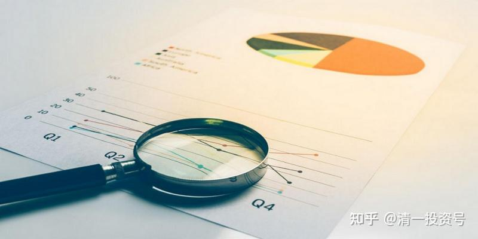
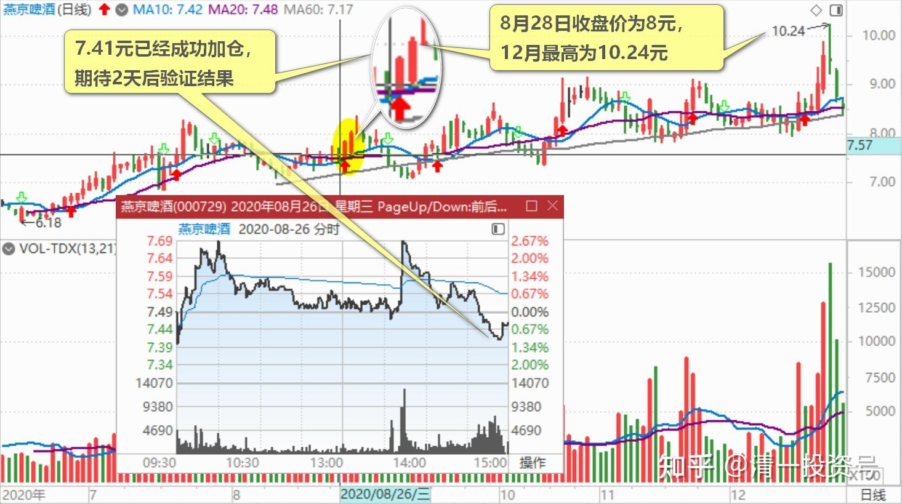
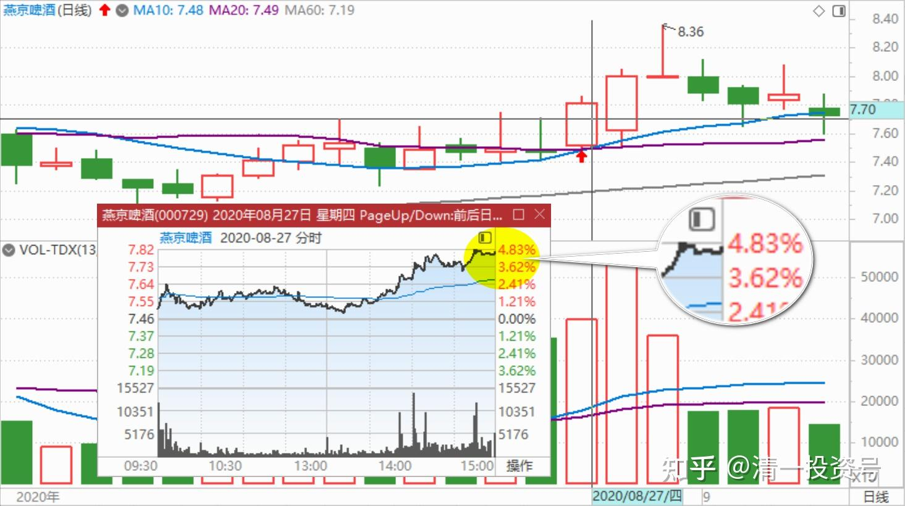
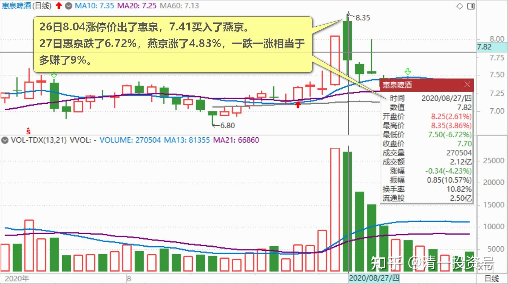
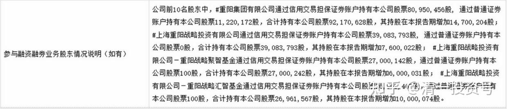

36篇.研报的几点信息

清一山长 2020年8月26日～28日

**一、明显是吸筹行情，预热，拉人，送钱**

清一山长2020-08-26 19:37:32

$燕京啤酒(SZ000729)$ 记录一下今天的K线图，惠泉今天涨停，燕京脉冲式上涨，最终下跌。明显是主力操盘痕迹。**非自然成交状态。主力当然此举有明显的目的。**这个目的是什么呢？两天后就知道了。看起来像是出货，但目前的价位，以及手法，不是出货的模式。成交有效放大，证明今天影响市场判断是成功的。7.41元已经成功加仓，两天后验证结果。如果判断错误，继续套牢就行了。

何适投资回复清一山长:

钓鱼线很明显啊!一波急拉，吸引跟风盘（那时惠泉啤酒涨停），手慢的挂单没成交急了，撤单追高套死，谁知下面的挂单都成交了。放量了，出了不少货。[吐血]

清一山长2020-08-26 21:21:41 回复何适投资:

对呀，走势的确是你说的样子，所以，简单看盘面，就是今天出货的样子，吓出了很多筹码。但是

1：燕京的这个价，还不到主力出货的时候。

2：尾盘就暴露目标了，大单居然急打，一点耐心也没有。

7.5元，其实是没啥多空交锋的，往下跌，就需要送出更多筹码。但卖相太难看了，还破坏了图形。干嘛不尽量在7.5元上方出货呢？真出货，今天惠泉拉高，假装跟随的样子，拉得更高一点，缓步一点一点的震荡下跌，7.5-7.8元反复冲高几次，假装冲高压力太多，需要缓缓再冲，这样子的盘面，更吸引跟风盘。这样货可以出更多。今天这种出货法。与拉货买进的筹码相比，减掉进出差额后，其实也出不了多少货的。甚至可能是平衡的仓位，不多不少。所以，我尾盘就果断杀进去了，**明显是吸筹行情，预热，拉人，送钱的手法。**

当然，我的判断不一定对，看明后天的走势了。

清一山长2020-08-27 15:36:26

$燕京啤酒(SZ000729)$ 昨天的研判正确，很开心，不是因为赚了钱，惠泉一跌换燕京一涨，多了9%的利润，而是因为此战证明我的看盘能力并没有消退，判断燕京两天内必涨的判断也证明了正确性。我一次性就把这两只股票的主力手法，都基本上看透了。而且加仓燕京的时机，以及仓位，把握都还不错。

思考：青岛啤酒可以有6倍的PB，重庆啤酒可以有43倍的PB。那么，燕京的漓泉，应该也有43倍的PB。因为漓泉的市场占有率更高，具有更强的垄断地位。**综合一起来算，燕京最差，也应该有3.5倍的PB。所以，目前来看，燕京向上的空间还很大。**惠泉不知道该给多少PB，投机的空间也不错，至少2PB是低估了。

反省：昨天的惠泉盘面上，不断看到买盘堆积从几万手，降到几乎零，又很快的恢复上去。这是主力换单，让跟风者有机会去接抛盘的手法。我应该发现昨天的跟风接盘并不特别的多，虽然抛盘也不多。所以我应该借机全部抛售是难得的机会，考虑过一单就卖出一百万股的，两次就全部卖光了。但我没有这样做的原因，是因为我误判为是主力故意示弱，制造接盘不足的恐慌。所以没有彻底抛空。不过，已经走了不少仓位了，更买了不少燕京，比抛出惠泉更多的仓位。所以，我已经很满意了。

祝贺各位啤友，大家一起hi啤！

---

淡然无极24回复清一山长:

还以为和前几天一样，准备做个T, T飞了。不过没事，还剩一半，两手准备。

清一山长2020-08-27 15:47:03 回复淡然无极24:

前两天我发帖出来，就是告诉你们：现在随时会T飞。看不懂我说话会丢钱的喔[吐血]！

**二、研报的几点信息**

[燕京啤酒：2020年半年度报告摘要](http://link.zhihu.com/?target=http%3A//vip.stock.finance.sina.com.cn/corp/view/vCB_AllBulletinDetail.php%3Fstockid%3D000729%26id%3D6566369)

清一山长2020-08-28 08:48:50 （评论上文）

$燕京啤酒(SZ000729)$ 研报的财务数据，我没仔细看。只知道一个关键点：一季度的几亿元的亏损，二季度全部补充回来了。二季度的盈利，基本上相当于去年上半年的盈利总和。说明很简单：**燕京的市场经营没问题，盈利能力没问题。一季度的巨亏，是“财务洗澡”。**半年报利润大幅减少，其实并不是真实的公司经营状况。公司经营非常的正常，良好。

还有一个重要的看点就是：重阳继续增仓，十大中有四大，都是重阳的基金。这些基金，都是独立管理的。基金经理人都一致看中重阳，都进了十大，意味着重阳对燕京的研究结果，未来前景判断，是得到了内部团队一致认可的（当然，我们看不到这些报告和追踪**，但可以从结果来看，是最真实的，而我们知道重阳的各团队都是一致看好，而且是极度看好燕京，才会如此集中的买入燕京。**在其他的重阳概念股里面，没发现如此集中的买入现象。这几家重阳基金，本报告期（上半年）都全部增仓了，总共增仓三千多万股。我也是，在二季度，三季度都在增仓燕京，共增加了一百多万股。比我当珠江和惠泉十大两个最高的峰值加起来还高。今年是我的啤酒年，现在的啤酒仓位，只增不减！板块内换仓增加利润），我建议各位一个偷懒的看财报的方法：重阳的团队，绝对是最会看财报的，他们一致看好，问题就不大，基本上没有雷。当然，如果半年报出台后，燕京已经大幅上涨，说不定他们现在就已经走了。但是，目前为止，燕京并未大幅上涨。价位还在原地盘桓。2016年9元都没走，后来的两次8元也没走，难道现在会走吗？所以，可以肯定重阳团队都还在，他们对燕京经营状况，以及燕京的前途判断，依然是有效的。你我认为自己的脑子不够用的，财务分析能力，市场分析能力不够的，就借用重阳用多少亿的现金买出来的答案就行了，您还一分钱的咨询费都没费。就等什么时候重阳撤退了，我再跟着撤退好了。由于持仓数量巨大，他不太可能一个季度就撤退光的。实际上，我的判断是：燕京将是重阳长期持有的一个股票。我也跟着长期持有好了，只是一路上做一点T，飞了就下车认输！这叫做“跟随国王散步”。

还有：我的一个怀疑。恐怕就因为重阳几年了，还没有吃够，所以燕京不涨。每次涨，可能都是重阳打下来的。打下来之后，又继续吃进更多的股票。现在他可能基本上吃够了，应该开始涨了。

**第二个重要线索：重阳的这些基金，很多是通过信用账户来持有的燕京。**也就是说，很可能是通过融资买入的。重阳的基金经理们，愿意用融资每年都要增加5.5%左右的持仓成本，来重仓一个不赚钱的股票吗？除非重阳是傻瓜！两年多前，重阳买入的燕京成本是7元多。现在如果算上资金成本，依然是亏本的。所以，各位可以放心持有，我一股不卖，跟定这个国王了。

正通服务回复清一山长:

感谢山长，马上加仓！

清一山长2020-08-28 09:13:13回复正通服务：

跌的时候不买，涨了才买。要不就是脑子有病。要不就是嫌钱太多，烧手[吐血]

阴阳两面杀手回复清一山长:

一季报重阳的加仓和财务大亏本，让我百思不得其解。后来在山长的指点下才真正思考燕京的市场地位，所以我已经将惠泉2天前的涨停果断换成了燕京，非常感恩山长的分享，让我很幸运地抓住了机会，纠正上一次惠泉涨停没换燕京的错误。同时感谢重阳基金经理为我免费做的市场调查研究！

清一山长2020-08-28 12:45:21 回复阴阳两面杀手:

【一季报重阳的加仓和财务大亏本，让我百思不得其解。】

其实，我就是看到这个消息，才敢又再度加仓一百多万股的。你们看以为是坏消息，我看是好消息。你们认为是代表燕京不行了，落伍了。我认为是“财务洗澡”，以及庄家洗盘。**说明燕京的盘整快结束了，快要进入拉升期了。但到底是什么？万一真的是营销出问题呢？我也不敢真的太确定。**所以，只敢加了一百多万。不然的话，可能就看到燕京出现才6元多的价格时候，我就满融杀入了——因为这个价格，是低于重阳持仓价，不用太担心。

(标题、图片为编者所加)

**文章音频**：

[389篇.研报的几点信息_清一投资号文章同步音频](http://link.zhihu.com/?target=https%3A//www.ximalaya.com/sound/680157550)

**参考链接：**
[12篇.早期珠江啤酒、燕京啤酒的换仓记录](https://zhuanlan.zhihu.com/p/602033762)

[13篇.买卖操作后的富足之心](https://zhuanlan.zhihu.com/p/604162057)

[14篇.珠江的破位急跌，名曰跌停进货法](https://zhuanlan.zhihu.com/p/606062514)

[22篇.它很可能是下一个重庆啤酒](https://zhuanlan.zhihu.com/p/645392522)

[23篇.危机时刻好公司不用担心](https://zhuanlan.zhihu.com/p/646998882)

[24篇.守住筹码很不易](https://zhuanlan.zhihu.com/p/648860208)

[25篇.筹码收集完毕，正在养股](https://zhuanlan.zhihu.com/p/650255857)

[26篇.现在最应该做的，就是稳稳的做好轿子](https://zhuanlan.zhihu.com/p/651196882)

[27篇.股票交易风格与伴侣选择](https://zhuanlan.zhihu.com/p/653139189)

[28篇.看图要反着看](https://zhuanlan.zhihu.com/p/654521213)

[29篇.行情还没完，后面还有大机会](https://zhuanlan.zhihu.com/p/655878269)

[30篇.给做短线人的建议](https://zhuanlan.zhihu.com/p/657061174)

[31篇.股票也分贫富，贫富会换位](https://zhuanlan.zhihu.com/p/658569494)

[32篇.主力志在长远](https://zhuanlan.zhihu.com/p/659254835)

[33篇.宁愿套牢也不想踏空](https://zhuanlan.zhihu.com/p/660596526)?

[34篇.我的投资不需要别人来打气](https://zhuanlan.zhihu.com/p/661931571)

[35篇.明显是市场的错误定价](https://zhuanlan.zhihu.com/p/663378280)
