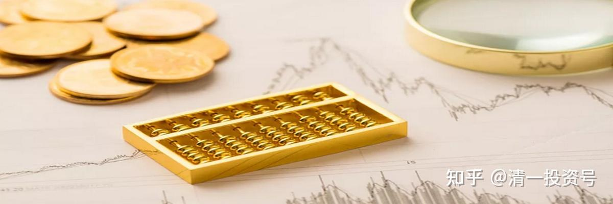
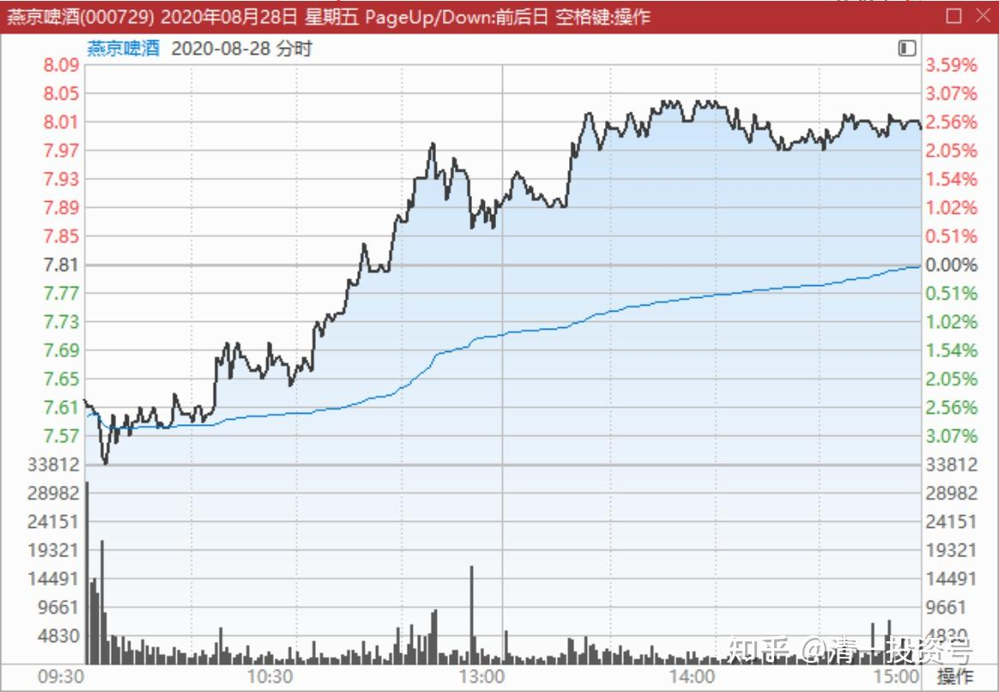
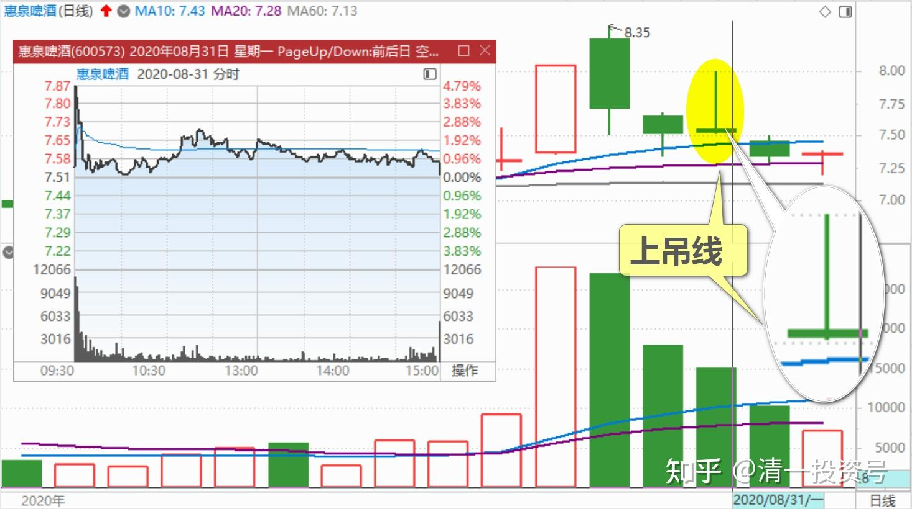
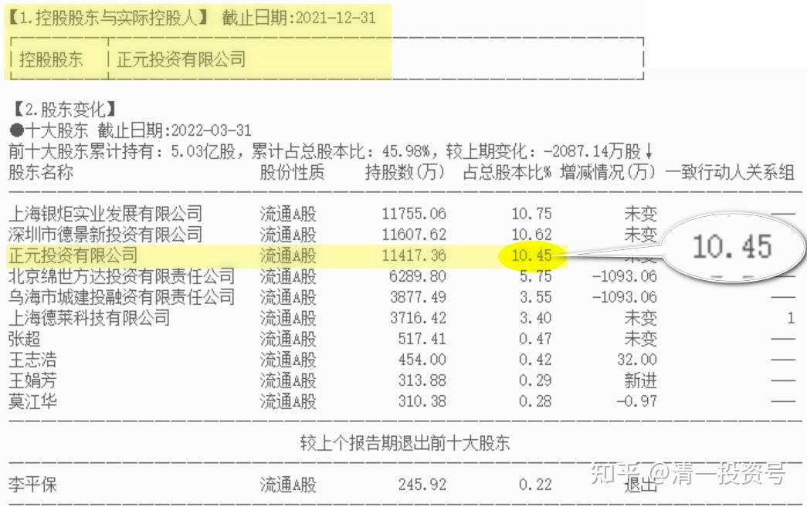
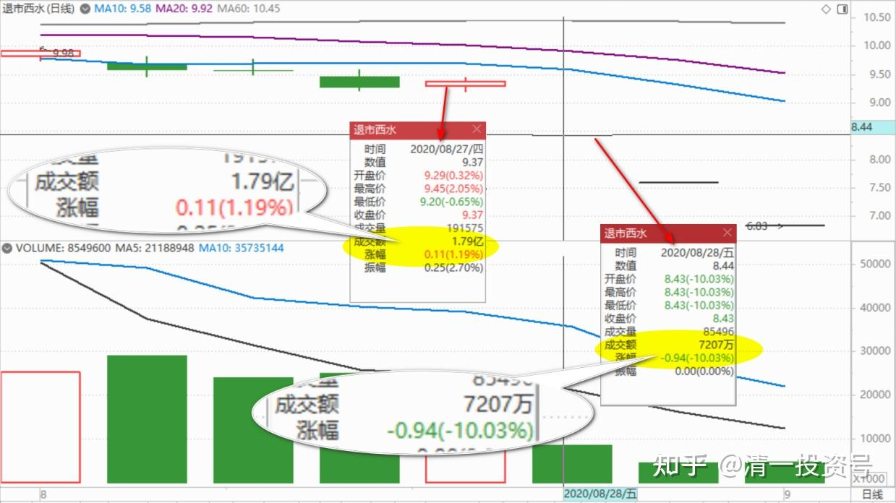
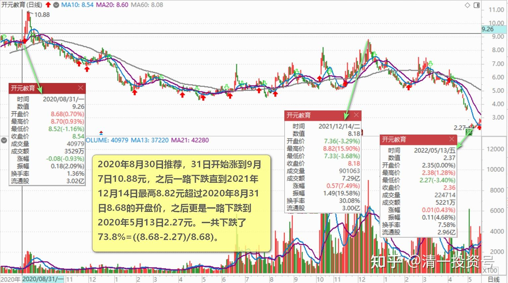

37篇.啤酒生意不简单，不是投钱就可以弄

清一山长 2020年8月28日～31日

**一、没有敲锣打鼓的庆祝，就继续等**

清一山长2020-08-28 15:30:00

$燕京啤酒(SZ000729)$ 今天走势异常的稳健。早盘低开，我看就感觉今天要涨了，甚至可能大涨，最终结果是稳步的涨。这样好，财不入急门。成交创近期新高，四个多亿。三天前发帖，提醒未来两天我看涨，的确是连涨了两天，涨幅7-8个点。看懂照做的人有福了。做T的，这两天估计都T飞了，我提醒了也没用。

既然是稳健上涨，其实就没啥可做的，睡觉去就行了。**等某天敲锣打鼓了，再来卖掉一点。没有敲锣打鼓的庆祝，就继续等。**

基本面上：三月份到六月份，其实疫情有一半时间是没有过的，国内形势依然很严重，很多商店也不开门的。天气也不热。燕京取得这个成绩，虽然看同期业绩下跌，**其实是很靓丽的报表了，一个季度赚了五个多亿。**去年一年，才赚了两个多亿呢。三季度，我的预期应该比二季度好，初步估算应该超过6个亿。第四季度，继续亏掉两个多亿。这样至少也有6个多亿的利润。万一第四季度居然不亏了，业绩就马上大变脸了。有这种可能的，业绩提升，是啤酒行业的主旋律。原来是苦日子，比谁撑得住，现在大家都撑下来了，就比谁活得好。

borlan回复清一山长：我刚打赏了这个帖子￥100，也推荐给你。希望您也有赚钱的福报，拿得住，没有T飞。

跟随学习山长多年，最近不到一年，关注雪球较多。跟随山长在珠江赚到约80%，之后珠江切换燕京，傻傻持有。

清一山长2020-08-28 17:43:28 回复borlan:

多谢大侠打赏[大笑]。分享与付出，是致富之道。祝福你家庭和睦，旺财旺人[干杯][干杯]

安然自在的小妮子回复清一山长:

感恩山长分享[献花花]

看了您前两天的发言，7.52元加了一万股。总成本6.64元，我每次都是毛估估[捂脸]谢谢山长，股市上所有盈利的都是跟您买赚的。[赞同][献花花]

清一山长2020-08-30 16:10:54回复安然自在的小妮子：

看你打赏了200元。太大方了。不如多买点股票，祝福你吉祥如意[献花花]。能赚钱到，是你自己的福报。我只是一个引子。

**二、搞啤酒厂需要多少钱**

清一山长2020-08-31 14:54:05

$惠泉啤酒(SH600573)$ 今天这个走势，就是说：我还要继续跌，俗称上吊线。不过我不卖了。成本4元多，没啥好担心的。

清一山长2020-09-01 12：05：00 （跟评上贴）

上个交易日的“上吊线”出现后，今天果然“上吊”了。今天继续跌。把这次涨停的幅度，已经全部跌回来了。证明这次游资袭击，果然是快进快出。我比上次涨停多出了4倍的量，算是学乖了一点，从庄家身上捞了一把。加上燕京上涨赚到的双方差价部分，此次操作算是很成功的，差价有15个点了。我继续看空不做空。如果继续低迷，不排除重新买入筹码。

晕娜回复清一山长：（跟评上贴）

惠泉啤酒 总市值：18.80亿。请教山兄，搞这么个规模的啤酒厂，要投资多少钱？

清一山长2020-08-31 17:41:03回复晕娜：

我还真不知道。我只是个假三大，没人找我汇报工作情况[滴汗]，反正我也不懂啤酒制造，外行也指挥不了内行。

不过，资本市场我还懂一点点。2006年，比利时英博集团以58.86亿元的天价受让雪津100%股权，10PB。这算是参考价吧？一个地区性的小啤酒企业，其实很值钱。做一家啤酒公司，绝对不是投钱买设备，工人，做出产品来，就够了。没这么简单的。所以溢价高很正常。我知道当初，大概20年前，武汉的本地啤酒公司，与德国投资的中德啤酒公司抢市场，是动用了黑道的力量，双方拼杀得刀刀见血。最后强龙斗不过地头蛇，德资公司宣布退出市场，武汉本地啤酒公司完胜。可惜了，当初我上大学时候爱喝的，地道德国味的“中德啤酒”，从此就没了。

您说：啤酒这生意，真的很简单吗？不是投钱就可以弄的，它有“地域文化”特征。这些都是潜在的资产[俏皮]

**我买的惠泉，才一倍多PB。扣掉硬性的建设投资，近乎于白送品牌、地位、商誉、市场占有率，销售配套等等，外加上市公司壳价值。**所以，我认为起码我出的价格，不比这些行业巨头更傻。将来赚不赚钱，我就不知道了。老天赏饭吃，我就有钱赚。不然，就熬着呗！跟你一样，拿6年也行。只是别指望拿股息，我利用波动做T，比股息收入高。所以我也满意了[赚大了]。

**三、比乐视更乐视的公司**

清一山长2020-08-29 16:53:45

$西水股份(SH600291)$ **比乐视更乐视的公司出现了，奇文大观：半年亏掉市值的3倍，市净率是负值。**看看大股东，也就10%持股。没有实质性的控股股东。这种公司，居然有人敢买。前段时间，居然还从6元多股价涨到15.99元。真不知啥人会买这种股[滴汗][滴汗][滴汗] 。

**想赚大钱的小股民，不愿意买稳定可靠的大蓝筹，却去追这种莫名其妙的股。**前一天周四的成交还有1.79亿，昨天封死的跌停板，居然还有7200万的成交。都是敢死队吗？炸弹都爆炸了，昨天还敢去抢筹？跌停版出货原来真的会有[俏皮]。

国人的疯狂，实在难以预期。我等胆小的人，就拿着啤酒、建筑，这些肯定亏不掉的公司好了。涨不涨，不期待，起码知道不会这样跌和没边。

另外，大胆设想：赚钱可以做假账，会不会亏钱也可以作假？把真实的资产吞了，说是亏了就完了。买单的，还是小屁民。

陈翔十点半回复清一山长:（跟评上贴）

*链接：*[回复@陈翔十点半: 你自己偷偷挣就好，说给我们跟你抢钱多不好意思//@陈翔十点半:回复@昆山法律:低调说一只股开元股分，... - 雪球(xueqiu.com)](http://link.zhihu.com/?target=https%3A//xueqiu.com/8299124052/157931074)

**四、“吹股手”的样子**

清一山长2020-08-30 16:06:49回复陈翔十点半:

来来来，大家瞧，大家看：**这就是“吹股手”，到处找人垫背的。**到处到热帖跟帖，把八杆子打不着的“绝密消息”，拿来到处忽悠人。要真有这事，也轮不到你们这些素不相识的小股民去得到内幕消息。什么大股东不断卖出，二股东早就悄悄吸筹，也不会跌成这样子。假装装进教育培训，让你想象可以飞天。说穿了，无非是：快来抢呀！有钱赚，翻倍的。

**越是吆喝和厉害的，就越是要你钱，要你命的。**专门让一些贪婪而缺乏思考能力的傻瓜上当的。好股票，就没有见过这样吆喝的，出来使劲吆喝的，都全是骗子。我怎么没见茅台170元的时候有人出来吆喝说快买？倒是看见一大堆人说茅台现在不行了，快垮掉了。我买五粮液的时候，才14块钱买的，还战战兢兢的，研究半天——这公司不会倒闭吧？珠江啤酒五元的时候，有人跑出来让你快买吗？

说不定，以后还有消息传出来：惠泉的三当家，要接手做大股东了。以后就把惠泉换成教育股。他要把三语大学的优质资产都装进去，然后——股票要至少连涨20个板。现在惠泉不涨，就是三当家要压着股票不让涨，迫使燕京低价让股份出来，要低价吸筹的。你居然相信了，脑子就是有病！别以为是我背后操盘的，这事肯定跟我没半点关系！

(标题、图片为编者所加)

**文章音频**：

[391篇.啤酒生意不简单，不是投钱就可以弄_清一投资号文章同步音频](http://link.zhihu.com/?target=https%3A//www.ximalaya.com/sound/682258325)

**参考链接：**
[12篇.早期珠江啤酒、燕京啤酒的换仓记录](https://zhuanlan.zhihu.com/p/602033762)

[13篇.买卖操作后的富足之心](https://zhuanlan.zhihu.com/p/604162057)

[14篇.珠江的破位急跌，名曰跌停进货法](https://zhuanlan.zhihu.com/p/606062514)

[22篇.它很可能是下一个重庆啤酒](https://zhuanlan.zhihu.com/p/645392522)

[23篇.危机时刻好公司不用担心](https://zhuanlan.zhihu.com/p/646998882)

[24篇.守住筹码很不易](https://zhuanlan.zhihu.com/p/648860208)

[25篇.筹码收集完毕，正在养股](https://zhuanlan.zhihu.com/p/650255857)

[26篇.现在最应该做的，就是稳稳的做好轿子](https://zhuanlan.zhihu.com/p/651196882)

[27篇.股票交易风格与伴侣选择](https://zhuanlan.zhihu.com/p/653139189)

[28篇.看图要反着看](https://zhuanlan.zhihu.com/p/654521213)

[29篇.行情还没完，后面还有大机会](https://zhuanlan.zhihu.com/p/655878269)

[30篇.给做短线人的建议](https://zhuanlan.zhihu.com/p/657061174)

[31篇.股票也分贫富，贫富会换位](https://zhuanlan.zhihu.com/p/658569494)

[32篇.主力志在长远](https://zhuanlan.zhihu.com/p/659254835)

[33篇.宁愿套牢也不想踏空](https://zhuanlan.zhihu.com/p/660596526)?

[34篇.我的投资不需要别人来打气](https://zhuanlan.zhihu.com/p/661931571)

[35篇.明显是市场的错误定价](https://zhuanlan.zhihu.com/p/663378280)

[36篇.研报的几点信息](https://zhuanlan.zhihu.com/p/664613658)
