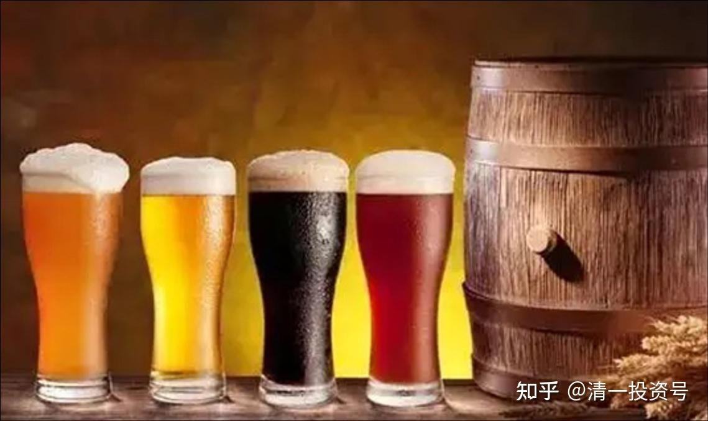
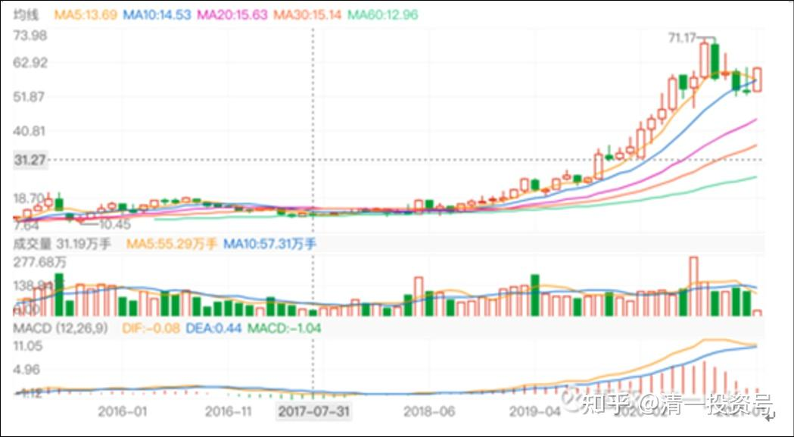
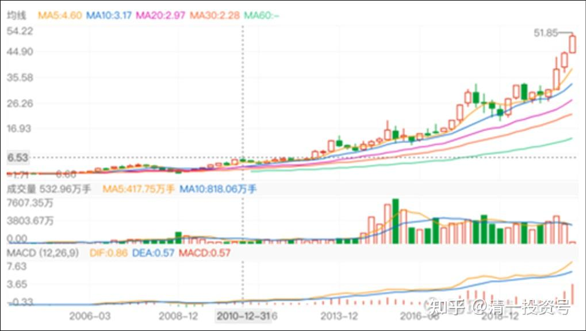
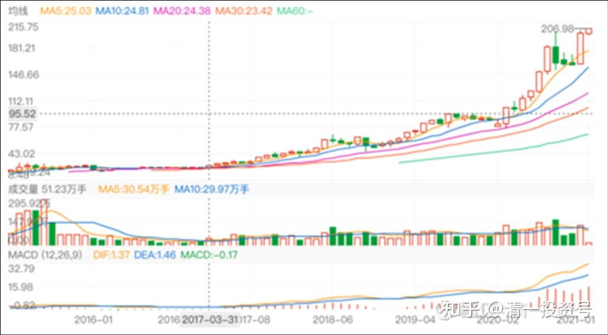
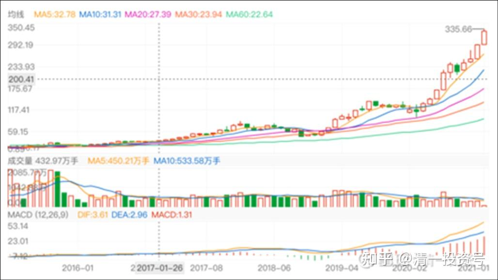
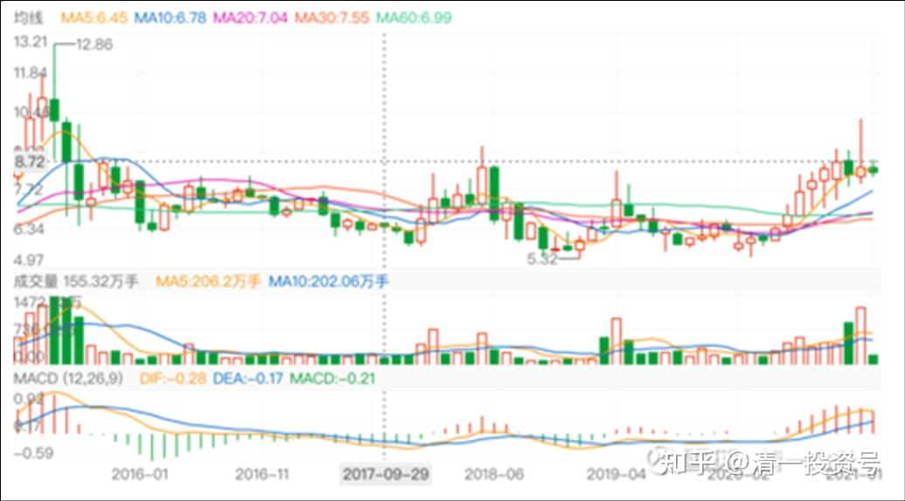

3篇.基本面判断：抱住不放

清一山长 2021年1月6日～22日

**一、最好的生意是吃的生意**

[清一山长](http://link.zhihu.com/?target=https%3A//xueqiu.com/9310099567) 2021-[01-06 21:30](http://link.zhihu.com/?target=https%3A//xueqiu.com/9310099567/167840367)

[$燕京啤酒(SZ000729)$](http://link.zhihu.com/?target=http%3A//xueqiu.com/S/SZ000729) 据说，世界上最好的生意，就是吃的生意。

可口可乐的历史，大家都知道了。现在看看中国的一些吃货们，走势如何？

这是洽洽食品的走势图，70元的价格。

下图是伊利股份的走势图:

下面是海天味业的走势图：

下图是五粮液的走势图：

接下来是燕京啤酒的走势图。**这样趴下已经有20年了。您认为，燕京还要趴多久？继续趴在地上20年呢？还是像某些东西一样，突然就”热“起来了？**

**答案我不知道。也许您会选择去追上面的股。我选择抱着冷门股睡觉！**

**二、黄金套：卖高点的珠江惠泉，买不涨的燕京**

[清一山长](http://link.zhihu.com/?target=https%3A//xueqiu.com/9310099567) [2021-01-22 21:23](http://link.zhihu.com/?target=https%3A//xueqiu.com/9310099567/169595916)

[$珠江啤酒(SZ002461)$](http://link.zhihu.com/?target=http%3A//xueqiu.com/S/SZ002461) 我是2018年中报进入珠江十大股东的，以后一直在增仓。这个账户并不是我唯一买入珠江的账户，还有其他账户。所以，我买入的实际数额，是高于十大股东显示的股数的。

1. 2018年三季度的收盘价是5.08元，此后继续下跌。

2. 三季度、四季度最低跌到了3.85元，给我账户造成数百万的浮亏。

3. 四季度收盘在4.29元。你们也可以看到十大股东数据，我有明显增仓的动作。2019年一季报我这个账户就增了50万股左右。中间有做T。

同期，燕京啤酒是啥情况？

1. 2018年半年报，收盘价是6.67元。整整比珠江高一元多。

2. 年底燕京跌倒了5.6元，也比珠江的4.29元价格高1.31元。

所以，当初我认为珠江更低估，所以主要的持仓就买了珠江。后来是珠江涨了之后，燕京才越换越多的。

也就是看历史走势，珠江高于燕京其实是“异常”的，正常情况下，是燕京高于珠江的。直到今年1月份，燕京收盘价是6.29元，珠江6.93元，珠江开始有一点点反超，但两者的股价，还是差不多的。

今年的珠江，大家已经看到了，率先上涨，大起大落的。停顿下来修整六个月期间，这几个月，是惠泉表演上涨。而燕京，一直是温吞水一杯。现价跟三年前也差不多。至今，惠泉、珠江，股价均远远超过燕京。坚持持有燕京的人，估计这一年过得很窝火，拿的就是假酒！

我的运气特别好。2018年开始看中珠江，买入了很多股。2019年年底，看中了惠泉，这一年我成为珠江和惠泉两家公司的十大。今年惠泉还不断增仓，最高到了三大位置。这两只股，均大幅上涨，给了我比上涨幅度更大的回报（因为我做T）。其中我记得买惠泉的相当一部分股票，是因为燕京的价格一度比惠泉高，我卖掉燕京买入的惠泉。惠泉和珠江涨高后，我就卖出了。高点看到燕京依然不涨，所以买了燕京，这部分筹码导致了套牢。但要说起来，也是“黄金套”，相比惠泉，珠江持仓不动跟随下跌的话，可能损失更多。

将来燕京恢复地位，股价高于惠泉珠江的时候，我的啤酒利润就更精彩了。**因为我的燕京目前持仓，比惠泉、珠江加起来都要多不少。目前是酒类第一持仓股。**

算一下帐 :

2018年年中，燕京比珠江高1.3元每股。

现在的珠江，比燕京高3.7元每股！

如果市场恢复2018年年中的定价估值，燕京的价格跟现价的珠江比价的话，应该相当于13元以上。

现价以一股珠江，换一股燕京，您得到的“差价空间”大约是7元！您认为，现价是拿着珠江好，还是燕京好？

如果用销量来定价格，燕京销量是珠江的三倍，总市值也应该是三倍吧？

所以，这就是我拿燕京的逻辑。这就是基本面判断。至于依然持有不少珠江和惠泉啤酒的逻辑，就是：**这两只股，从技术面上来说，是具有上涨的动力。而且主力动作明显。燕京，技术上是空头排列。**所以，短期来说珠江和惠泉的趋势良好，股性更活。要炒股的话，目前是珠江最优，惠泉也不赖。当然，炒股很危险。所以，我只拿一部分资金来玩，反正有厚厚的利润垫底，做T补仓高价买入也不怕。

**如果我是新资金，估计就是抱住燕京不放了。**

