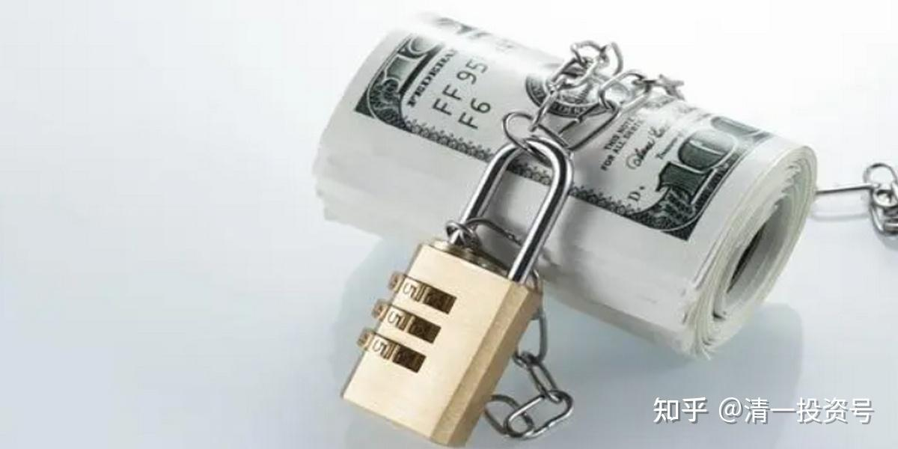
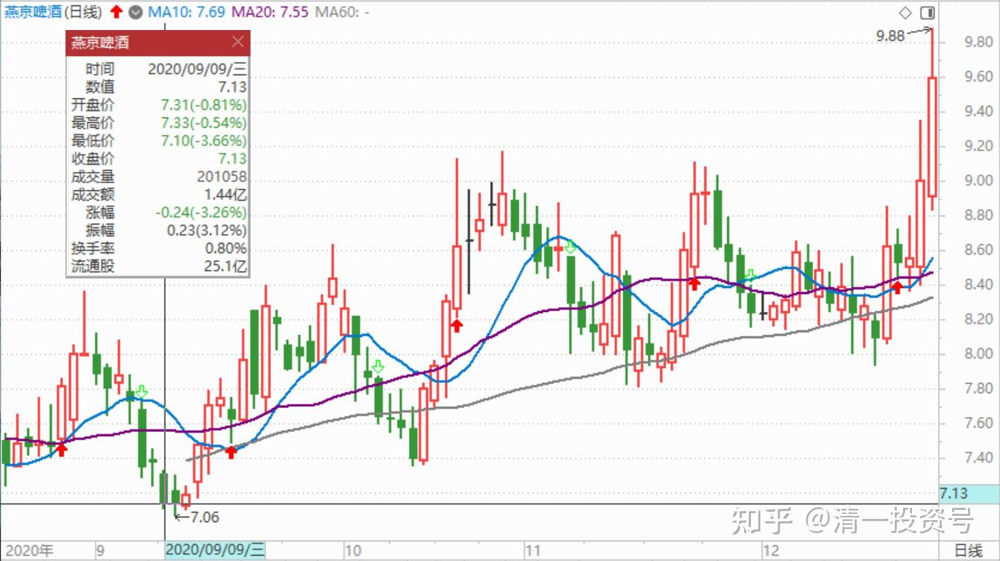
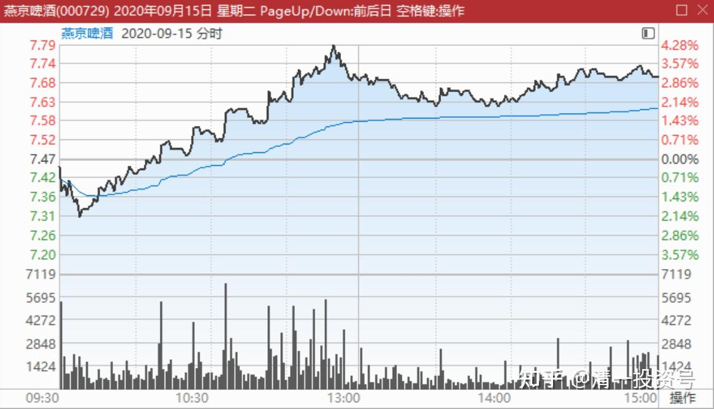
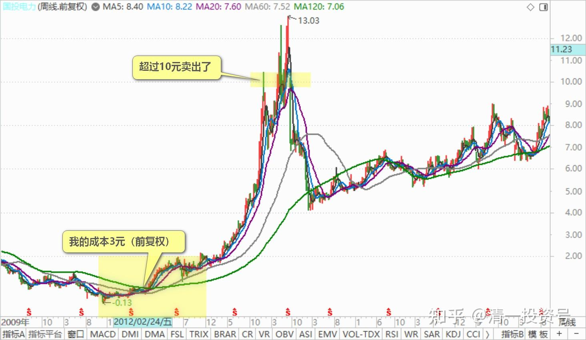

41篇.持有期限最少3年最长15年

清一山长 2020年9月9日～15日

**一、主动买套，准备继续套牢3年**

清一山长2020-09-09 15:15:02

$燕京啤酒(SZ000729)$ 今天收盘了。在7.12～7.13元不断买进，今天买入了90多万股燕京。**主动买套，准备继续套牢3年。**

检查成交单，很多小单。100股、200股、300股的。奇怪这些人拿个几百元来耗精神，追涨杀跌的。有这精神，不如去干点活。工地搬砖，一天还有几百元挣呢！犯得着在这盯着电脑费精神？说实话，要我只要这几文钱，我真去工地搬砖了。**拿了工资就来买点5元的中国建筑，7元的燕京啤酒。**我才不看盘呢！天天埋头工地搬砖，省吃俭用买股票。最多干十年，这辈子就再也不用搬砖了。可以搬股票玩，像我现在一样。

如果每天就只有一两百股，在股市上玩，我认为玩一辈子，都无法财富自由的。每天涨停了也不过赚几十元，真不如去搬砖。天天拿十个涨停的工资，攒起来再继续买股票。几天就可以买一千股了，几十天就可以买一万股了。**如果我是去工地搬砖的话，我就别想啤酒了，只买中国建筑。**天天抱着一个信念：我不是搬砖的小工，我是中国建筑的老板之一。用这种信念和态度搬十年砖，感觉真的好极了。然后——就财务自由了[大笑]。

潍柴黄金银行创50回复清一山长：（跟评上贴）

但是近4年无脑买中建也还是亏损的啊！

清一山长2020-09-09 16:08:27回复潍柴黄金银行创50：

**1：破5就买中建的人，真有亏损的人吗？2：您拿十年再来看，还会亏损吗？**

晕娜回复清一山长:（跟评上贴）

山兄，中建真涨到6元了，您跑不跑路，最好跟您的粉丝也说一句。有几个粉丝能持有中建十年。

清一山长2020-09-09 18:29:26回复晕娜：

原来如果到了6元，我肯定都是跑路。破五进，近6出，我原来就跑了好几次了。现在，我也被您的2030规划忽悠成功了，我就不跑了。想跟您到2030，看您说的对没[为什么]。当然，如果提前实现了2030计划，我还是提前跑吧！[大笑]

**二、高位没减仓就低位增仓**

清一山长2020-09-15 12:30:58

$燕京啤酒(SZ000729)$ 真的启动了吗？这两天都在无放量上涨，抛盘并不多。这一轮下跌，实在是玩出我意料之外。每次到8元就跌下来，已经玩了很多次了，都成规律了。最近一个多月就来了两次破8元后下跌10%的行情。做T简直就是完美标的。我以为，这一次应该不同了。而且到了8元多，8.38元也没有放量。也没有大幅拉涨的主力动作，只是稳步推进。

结果8元以上，我这做T高手，居然一点仓位都没减，又再度跌回7元多磨叽。实在是完全想不到会这样子打压。**说明燕京的主力，比珠江的主力更狡猾，让我完全看不透。**跟不上。承认自己是笨蛋。但是我也不吃亏**，高位没有减仓，我就低位增仓。**本次燕京，7.36元就开始大量接回，7.12元更是大量买入。虽然高位没有赚到减仓的差价，但低位增仓150万股以上，我还是很满意了。

燕京目前已经持仓超过一千万。远远超过珠江的最高仓位。会比珠江赚更多吗？还是一个笑话？3年后再看吧！起码我不会比重阳更惨。如果哪天重阳走了，我亏本都要走（我亏本，重阳就要亏惨了）。重阳如果不走，我就咬定重阳不放松，死跟到底（虽然跟重阳，真不如我自己抓的珠江更赚钱[大笑]）。但珠江已经涨了，早就退出十大了。现在跟重阳，我在时间上是划算的。重阳持股，每年0.35元的资金费用不会少。我算起来成本比他们还低。怕啥？

申明：前几天跌的时候，我不断买买买，你如果跟买了，就算是跟的我。现在已经涨了。现在这个价格，我是不会买的，当然我也不卖。你们如果现在要跟进的话，就是来抬轿子的。我不反对，也没资格反对你抬轿子。但你千万别说是跟我的，直接明说你们是来抬轿子的就好，我会感谢你们抬的！但你假装是跟我买燕京的，我就拉黑！因为这种人太不自尊。一跌又要骂人的货。**燕京是我的长持品种，持有期限最少三年，最长会是15年。**就看市场给什么价格，我值不值得换股了。**如果不涨，我就这样一直拿着，就是不放手。**

郑小均回复清一山长：

山长是猎人，主力是狐狸[俏皮]。紧跟山长！

清一山长2020-09-15 14:32:56回复郑小均：

你说反了，主力才是猎人，是狮虎。我是小狐狸，还是不聪明的小狐狸。要等他们都吃够了，吃饱了，我再偷偷去吃点他们不要的残汤剩饭。

何适投资回复清一山长：

重阳套牢太久反而不利，一涨重阳就想走[抠鼻]

清一山长2020-09-15 14:37:52回复何适投资：

好像你真知道重阳会怎么想一样[为什么][笑]。我傻一些，承认我不知道。燕京关厂，开厂，我也不知道，我也不关心。这是厂长的事情。我只管跟定重阳不放松就行了。简单锚定！还不费脑！

51nxp回复清一山长:

天士力重阳亏钱也走了。

清一山长2020-09-15 18:52:22回复51nxp:

重阳2017年中报进入，2018年中报就走了，只有一家基金（燕京是四家重阳基金都重仓进十大），持仓一千万股。我看他应该没亏钱，似乎赚不多，就走了，因为2018年一季报还在的，从25元涨到30元了。之后就一路下跌，最低14元，几乎腰斩。淡水泉反应比重阳慢，他应该是真的亏钱走掉的。

奇才8008回复清一山长:

山长，重阳重仓投资国投电力，您怎么看？目前他浮盈50百分之左右。

清一山长2020-09-16 08:52:18回复奇才8008:

你肯定算错了涨幅帐，我是跟裘国根买了国投，2012年之前他就买好了。我的成本是3元。他的成本，2元左右吧（前复权）。你居然认为才50%？你太瞧不起重阳了！抄作业，最好抄认真一点。别涨了三倍后，你才跑出来说你在抄作业。我猜一堆人会在燕京涨破12元后，跑出来说抄我作业的[吐血]。

我的国投抄作业的失误是：我跟少了，没看懂裘国根的逻辑，才买了几十万股。后来涨过十元了，就走了。

(标题、图片为编者所加)

**文章音频**：

[399篇.持有期限最少3年最长15年_清一投资号文章同步音频](http://link.zhihu.com/?target=https%3A//www.ximalaya.com/sound/691109991)

**参考链接：**

[12篇.早期珠江啤酒、燕京啤酒的换仓记录](https://zhuanlan.zhihu.com/p/602033762)

[13篇.买卖操作后的富足之心](https://zhuanlan.zhihu.com/p/604162057)

[14篇.珠江的破位急跌，名曰跌停进货法](https://zhuanlan.zhihu.com/p/606062514)

[22篇.它很可能是下一个重庆啤酒](https://zhuanlan.zhihu.com/p/645392522)

[23篇.危机时刻好公司不用担心](https://zhuanlan.zhihu.com/p/646998882)

[24篇.守住筹码很不易](https://zhuanlan.zhihu.com/p/648860208)

[25篇.筹码收集完毕，正在养股](https://zhuanlan.zhihu.com/p/650255857)

[26篇.现在最应该做的，就是稳稳的做好轿子](https://zhuanlan.zhihu.com/p/651196882)

[27篇.股票交易风格与伴侣选择](https://zhuanlan.zhihu.com/p/653139189)

[28篇.看图要反着看](https://zhuanlan.zhihu.com/p/654521213)

[29篇.行情还没完，后面还有大机会](https://zhuanlan.zhihu.com/p/655878269)

[30篇.给做短线人的建议](https://zhuanlan.zhihu.com/p/657061174)

[31篇.股票也分贫富，贫富会换位](https://zhuanlan.zhihu.com/p/658569494)

[32篇.主力志在长远](https://zhuanlan.zhihu.com/p/659254835)

[33篇.宁愿套牢也不想踏空](https://zhuanlan.zhihu.com/p/660596526)?

[34篇.我的投资不需要别人来打气](https://zhuanlan.zhihu.com/p/661931571)

[35篇.明显是市场的错误定价](https://zhuanlan.zhihu.com/p/663378280)

[36篇.研报的几点信息](https://zhuanlan.zhihu.com/p/664613658)

[37篇.啤酒生意不简单，不是投钱就可以弄](https://zhuanlan.zhihu.com/p/665812265)

[38篇.低位吹票和高位吹票](https://zhuanlan.zhihu.com/p/666484929)

[39篇.我用钱来赌啤酒赢、赌中国建筑会赢](https://zhuanlan.zhihu.com/p/667678766)

[40篇.这种企业，以后一定成为现金牛](https://zhuanlan.zhihu.com/p/668283112)
