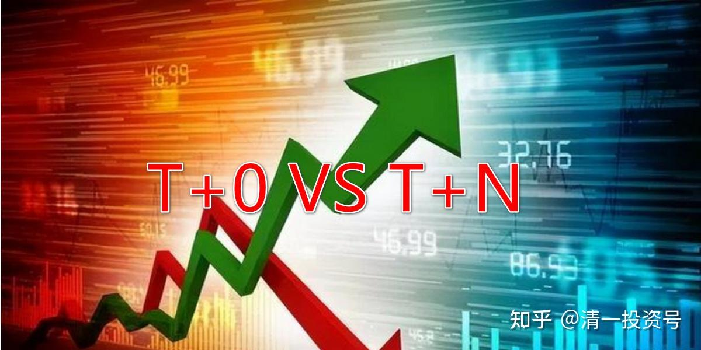
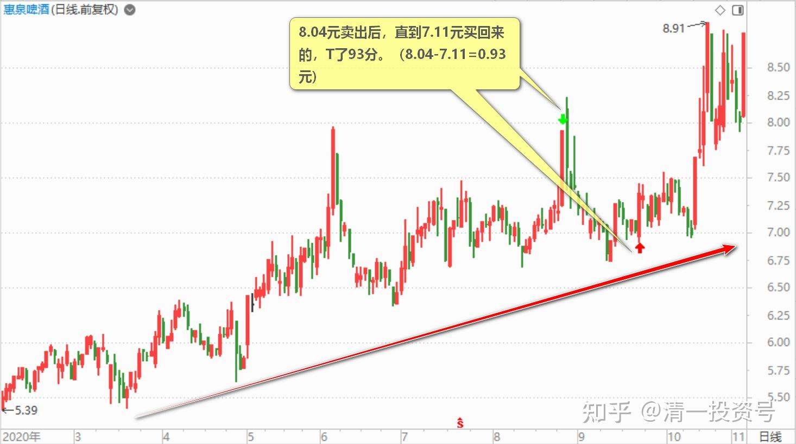
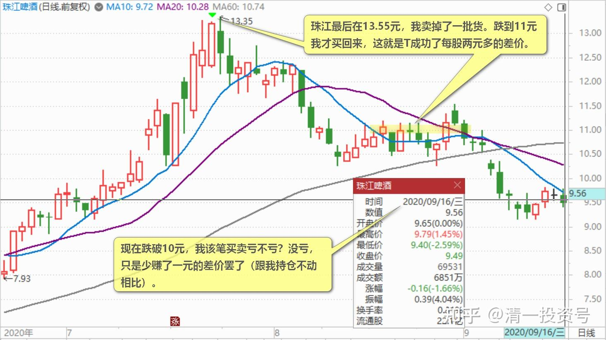
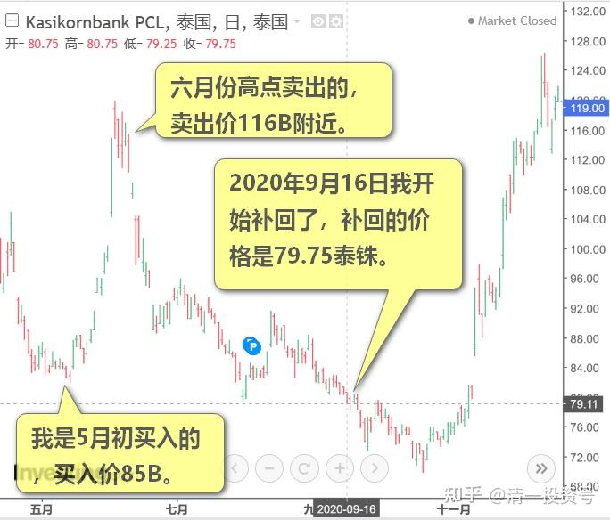
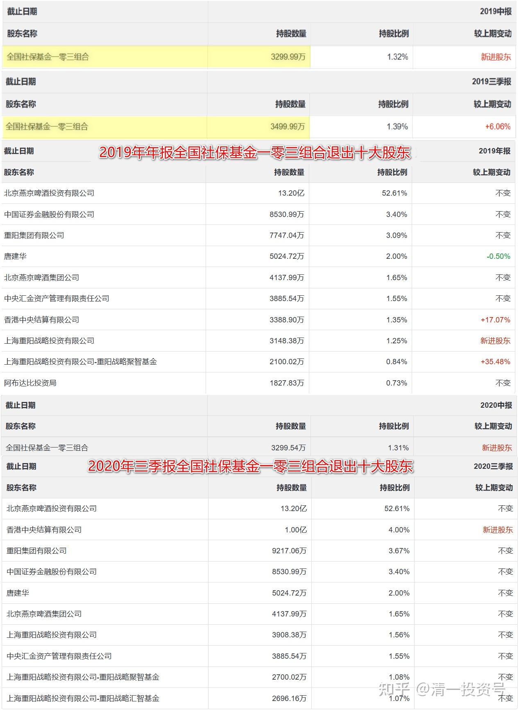
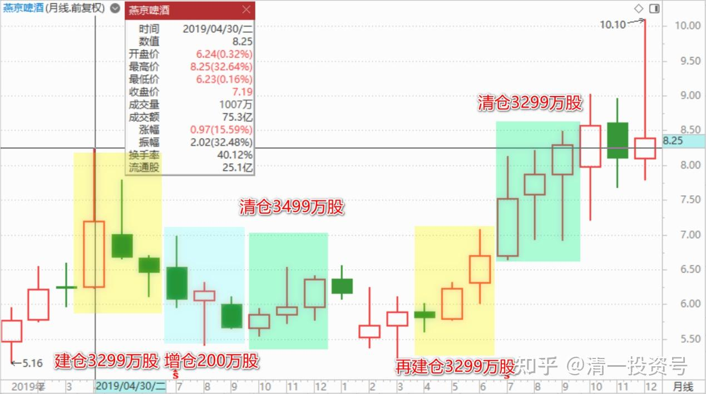

43篇.短线T、高级T和反向做T

清一山长 2020年9月16日～28日

清一山长 2020-09-16 18:02:53

$珠江啤酒(SZ002461)$ 什么叫做T？这段时间，总是一直看到一个“高手”，在我持仓的几个啤酒股上做T，几乎每天都要分享一下他的操作，花名还是一个武侠的名字。如果这人是真高手也就算了。问题是：他的示范毫无价值，简直就是垃圾。自己经常T飞。他每次做T，有个三分钱，就赶快T了。做成了，还得意洋洋地分享出来。燕京他做了几次，每次赚了几分钱。然后，就T飞了，眼看燕京涨了几毛钱。这伙计，就又跑来珠江“示范T操作”，结果又被套牢了两毛钱。我看得实在是扎眼，就直接拉黑了，为了保护我的眼睛不受污染。我认为，长得丑，就别出来吓人了。**要分享，一定要看你的分享是否能够帮助大家，否则就是制造垃圾。**我一看到制造垃圾的人，在我看的股票页面上，就会拉黑。有时我的页面上只看到两三个评论，我纳闷为啥？因为其他被我拉黑的帖子，都不出现了，所以看起来就稀稀拉拉的。这样真好！

**这种几分钱的T，做起来难度极高。**我知道有一些短线高手在做。面前放着8台电脑，专门的操作软件，要一键进出。最快的时候，我一个朋友告诉我：他的两笔相反的买卖，是同一秒成交的。两分钱，他们都可以设法搞到手。每天清零，坚决不持股过夜。全是T加零，每天不增加股份，也不减少股份。他们不投资股票，只是拿账户来做差价。**高手的话，一天挣个几万，也没问题的。不过要超过十万，就很难了，**所以这种买卖有头寸限制。仓位大了，没办法T的。所以不适合大资金来做，拼的就是力气活。他自嘲——他们这群人，提高了股市的流动性。

说实话，他这本事我可没有。但我赚的比他多。我做T，都是大头T，**利润超过10%我才做**，少了我觉得没劲做。

小散户，来啤酒这里做几分钱的T，难度极高，基本上就是亏本正常，套牢正常，但赚钱不正常。有钱你也赚不到。为啥？你判断正确了，只赚两三分钱。如果你判断错了，亏多少？啤酒一天上下几毛钱。**只有看准趋势，做长波段的T，才是可以赚钱的。**你们已经看到我惠泉8.04元卖出后，直到7.11元买回来的了？T了93分。这种T，才过瘾。一次搞到你几十次都搞不到的利润。

再比如：珠江我9元多走了一批货，T飞了。我就放弃，去买入燕京了。这些燕京持仓，已经赚钱了。珠江最后在13.55元，我卖掉了一批货。跌到11元我才买回来，这就是T成功了每股两元多的差价。现在跌破10元，我该笔买卖亏不亏？没亏，只是少赚了一元的差价罢了（跟我持仓不动相比），我如果耐心等到现在，利润更高。但如果你11元一样跟我买入，你就亏了1元多。

**再给您示范一个高级T的例子：**

今天，我开始回补我泰国卖出的股票，今天买回来KBANK。我是5月初买入的，买入价85B。六月份高点卖出的，卖出价116B附近。已经卖出几个月了，我的数千万资金，就一直躺着不动，一直在等机会。我公开说过的，我认为下半年，会给我有机会补回来的。这只股我卖出以后，就慢慢开始跌了，我一直耐心等着，一直坚持不动，跌了10B不动，跌破100泰铢不动，跌破90泰铢还是不动。今天跌破80泰铢了，我开始补回了。补回的价格，是79.75泰铢。我挂单就放着，自然成交的。今天买了两千多万的货回来。差价多少？超过36B。现在我的成本，每股扣除赚的利润，只有40B多。我认为它不可能跌到这个价。

如果我不做T，一直死守在现在，我的这笔投资是亏损的，因为现在创了新低。当然，我买入的时候就准备了亏损的，这个股，是从230B的高价跌下来，我85B左右买进，已经是打了三折的价格了，而且是十年来的最低价。上次2008年的金融危机，才跌破过这个价。所以，我拿在手里之后，它跌到50B，我也不会放手的。不放手，我就不会亏，每年拿利息就可以了。没想到，一个多月后，它奇迹般的上涨了，所有的银行股全都上涨了30%以上。我一看：不跑白不跑，长持变做短T，就赶快卖掉了。没多久，就下跌了。

为啥我要卖掉？因为泰国经济一两年内，没有反转的可能。甚至我认为下半年经济会更惨。所以我才不跟涨，反而把泰国人惶恐的时候低价卖出买进来的仓位乘机反手卖出，一个多月，就赚了五年的利息。我可以继续持有五年，没利息都安心了[大笑] 。（实际上它依然会给我发利息的，泰国股票利息稳定性很好）。我算过：仅仅靠这批股票的利息，我的团队成员，就可以在泰国正常生活下去了。所以，股票赚不赚钱就不重要了。关键是持有这些肯定不会倒闭的，可靠的泰国上市企业。

我在国外生活，原来一直靠国内的资金过日子，现在开始，我可以靠泰国的投资过日子了，用泰国赚的钱在泰国生活。我认为只有这样，才能“扎根海外”，而**做股票，是最容易进入海外的方式。**而且受欢迎！（去打工是非法的，他们不欢迎外国人抢泰国人的工作，我就利用泰国人帮我打工好了[俏皮]）。

清一山长 2020-09-28 16:10:57

$燕京啤酒(SZ000729)$ **我发现一个燕京反向做T高手：**全国社保基金103组合。2019年1季度，5.32～6.37元之间的低点，没有见到他进入。反而是2季度的高点，**6.29～8.39元，他重仓3000万多股，成为十大。**3季度跌回5元多，他加仓了200万股。四季报涨到6元多，他就走了[滴汗]。干嘛8元多不走，反而进场？6元多走了？这个103组合基金，精准地在2019年二季度高点买套，买点极佳。5～6元的低点走掉，大公无私。后续两个季度，燕京继续在低位徘徊，该基金不见踪影。2020年二季度，6～7元期间，该基金再度进入十大。持仓量与一年前一样多（3299万股）。这一次，三季度再度拉上破8元，可以说社保基金103组合这一次总算走对了步子！当然，是否今年三季度冲高走了？这样的话，应该赚了5000万左右。如果真走了，可能算是他本轮抄底成功。雪了上一次高点买入的耻辱！不过，我从K线图上看，他这一进一出，似乎并没有占到便宜。可能还增加了成本。只一次的上涨，是否补回了上一轮亏的，未必真补回来了。**我的是盈利的状态。因为我低点亏损的时候，没有出货，反而买了货。他反向而做，恐怕账面未必好看。**目前赚到的5000万，还要弥补上一轮的损失。

(标题、图片为编者所加)

**文章音频**：

[405篇.短线T、高级T和反向做T_清一投资号文章同步音频](http://link.zhihu.com/?target=https%3A//www.ximalaya.com/sound/696140093)

**参考链接：**

[30篇.给做短线人的建议](https://zhuanlan.zhihu.com/p/657061174)

[31篇.股票也分贫富，贫富会换位](https://zhuanlan.zhihu.com/p/658569494)

[32篇.主力志在长远](https://zhuanlan.zhihu.com/p/659254835)

[33篇.宁愿套牢也不想踏空](https://zhuanlan.zhihu.com/p/660596526)?

[34篇.我的投资不需要别人来打气](https://zhuanlan.zhihu.com/p/661931571)

[35篇.明显是市场的错误定价](https://zhuanlan.zhihu.com/p/663378280)

[36篇.研报的几点信息](https://zhuanlan.zhihu.com/p/664613658)

[37篇.啤酒生意不简单，不是投钱就可以弄](https://zhuanlan.zhihu.com/p/665812265)

[38篇.低位吹票和高位吹票](https://zhuanlan.zhihu.com/p/666484929)

[39篇.我用钱来赌啤酒赢、赌中国建筑会赢](https://zhuanlan.zhihu.com/p/667678766)

[40篇.这种企业，以后一定成为现金牛](https://zhuanlan.zhihu.com/p/668283112)

[41篇.持有期限最少3年最长15年](https://zhuanlan.zhihu.com/p/670833407)

[42篇.赔钱至少是有缺陷的](https://zhuanlan.zhihu.com/p/672139277)
