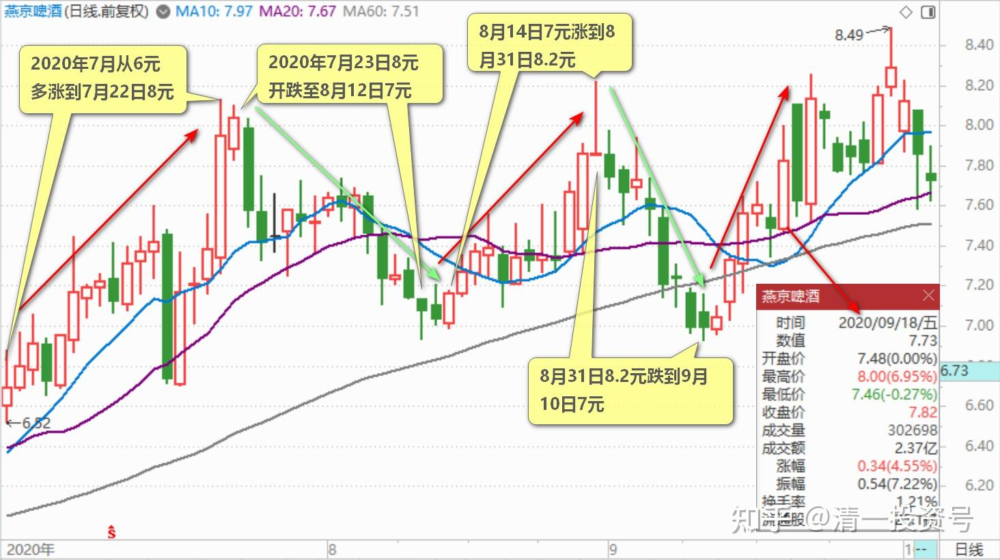
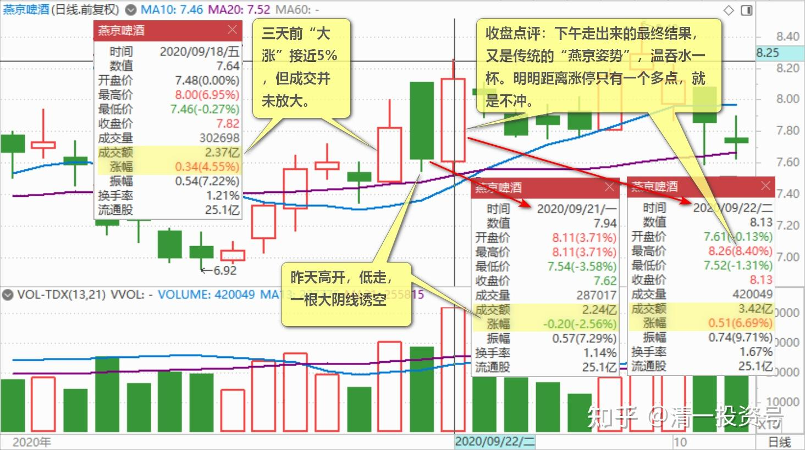
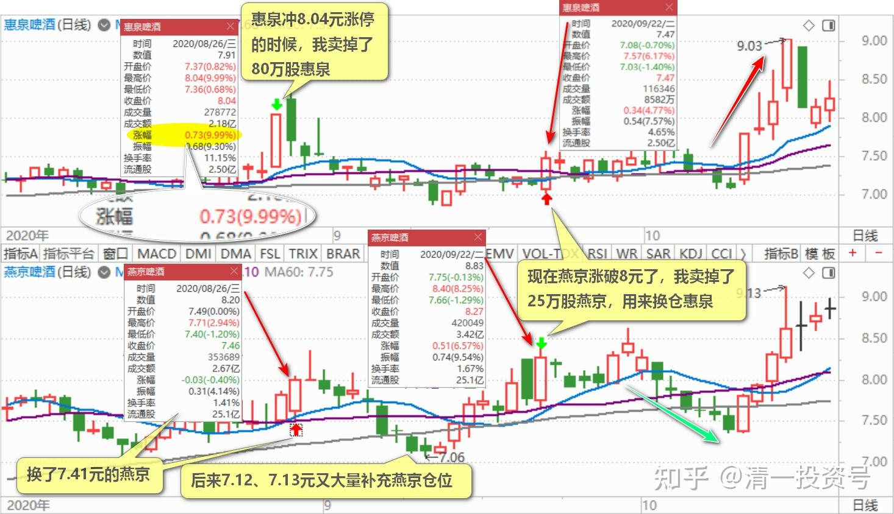
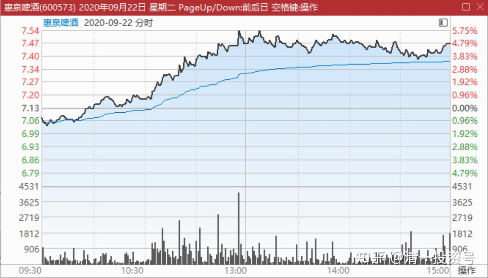

44篇.没有等来秀场时间，依然要拼耐心

清一山长 2020年9月18日～22日

**一、没有等来秀场时间，依然要拼耐心**

清一山长 2020-09-18 17:43:23

$燕京啤酒(SZ000729)$ 燕京7月、8月，每个月都要玩一次冲破8元，然后跌到七元出头的游戏。所以冲破8元就卖，跌回7元再买。主力每个月就稳稳地送一次钱给你。假如你拿20万股来做T，每个月主力都让你赚二十来万元的机会，要比打工强多了。估计主力对您，比燕京对自己的员工都更好吧？燕京高管，每个月能拿这么多不？

现在，9月份，燕京又来了一次突破8元的行情，你们今天走了吗？原来燕京破8，我多少总要走一些货。但8月、9月这两次，就是傻傻的没走，傻呼呼地坐电梯。这次又跌到7元多的时候，不仅没走，我又狠狠地吃了燕京一大口，都吃撑了。你们的想法，现在破8了，你走不走？[大笑]

潇洒走一回啊回复清一山长:（跟评上贴）

坐了两次电梯今天忍不住走了，希望下周跌，不跌就买惠泉[鼓鼓掌]

清一山长 2020-09-18 18:22:31回复潇洒走一回啊:

**希望别人倒霉的人，往往自己会先倒霉！**[俏皮]

**如果我卖了，我会真心实意地希望接我货的人赚钱。**我自认苦命，辛苦一些，再去找别的股赚钱！

清一山长 2020-09-22 13:11:18（跟评上贴）

我这个几天前发的帖子，就是提醒各位坐稳了，别自作聪明。凡是想在8元就跑。7元再进的，我估计这一次是没希望了，走势不是这回事情。这一天，明明可以站稳破8的，故意跌几分钱下来。第二天高开，摆出“拉高出货”的架势，其实是诱空。当然，当天我不敢肯定他要怎样走。但我的行为（坚决不跑），代表我认为秀场刚开始，做T很可能T飞。今天来看，这两天8元前后的聪明人的T单，全都T飞了。为了赚一点小钱，丢了大钱。谁让你看不懂我的贴说的什么呢[俏皮]！

最近三天盘面非常微妙。三天前“大涨”接近5%，**但成交并未放大。说明浮动筹码不多。**昨天高开，低走，一根大阴线诱空，做得特别的漂亮。估计把很多原本8元不想跑的小散全都震出来了，以为“历史要重演”，要跌回7元去，所以赶快跑掉。这一天的成交，与前一天（上周五）居然是一样的，两个多亿。说明震仓很成功。所以——今天就拉升了。

下午会不会涨停？不清楚，按道理涨停很容易。现在的成交，也就2.57亿。从3%拉涨到8%，只花了一个亿。下午会有多少单子呢？

如果下午不涨，而是震荡下跌，就有点问题了，趋势就不对。主力居然派货才会这样子，说明实力不够强，或者时机没有到，赚点小钱就走。说明现在还没有到真正的涨升时刻，还要慢慢磨一段时间。如果下午涨了，而且没涨停，或者最后才封停。可能就是燕京的真正上场的秀场时刻到了。我们静静地等“燕京秀”开演。**个人认为，这是一场比“珠江秀”场面更大，参与人数更多，应该也更精彩的大戏。**当然，上窜下跳可能更厉害。自以为是追涨杀跌的人，会更惨！因为主力不是一种人，**燕京主力更是狠角色！杀人不见血！**

清一山长 2020-09-22 15:25:34（跟评上贴）

收盘点评：下午走出来的最终结果，又是传统的“燕京姿势”，温吞水一杯。明明距离涨停只有一个多点，就是不冲。说明主力根本就不想冲，而不是不能冲。为啥？主力还不想秀强势，只想让小散看不起，自己走人。下午的走势，走出了我预测之外的第三种走势。没有涨，也没有跌。表面上看跌了一毛钱，其实不算跌了。主要看量，一直没有放大。下午前一个小时，才2000多万。以后一个小时多一点，6000万左右。这种走势，算是震荡平盘了。意味着还是**没有等来燕京的秀场时间，依然要拼耐心。**只要不涨停，我就不需要跑。燕京慢慢走，我就慢慢跟着走。

总结：今天换惠泉，算起来今天没吃亏，惠泉换后的涨幅比燕京还高一些。如果去换珠江，就吃亏了。说明：珠江走势很独立！

一个股，如果需要出货，就需要群众基础。燕京、惠泉上涨，珠江不跟。跟青岛和重庆。这两个啤酒很明显是派货的架势。涨太高了。青岛就像是冲10元跌到7元的燕京这种走法，难看！为啥珠江要跟衰，不跟旺？值得思考[俏皮]！

**二、跨股做T，动态再平衡**

清一山长 2020-09-22 10:26:14

$惠泉啤酒(SH600573)$ 今天一大早就开始买惠泉。不断用小单买入，每单一万到3万不等，今天总共买入了20万股左右，今天的买入平均成本是7.086元。加上前段时间买入的，我继续巩固了惠泉三大的位置。预期三季报，三大持股数超过2M了。**我的目标主要是换股，**没打算抢二大的位置。除非燕京给我足够的机会不断换入。惠泉冲8.04元涨停的时候，我卖掉了80万股惠泉，换了7.41元的燕京。后来7.12、7.13元又大量补充燕京仓位。现在燕京涨破8元了，我卖掉了25万股燕京，用来换仓惠泉。因为惠泉又跌回7元出头了，这个差价，换回来是值钱的。差不多可以说，这样一来一回，四次买进和卖出，制造了每只啤酒股接近2元的差价。所以——我认为是划算的。**这种跨股做T，动态再平衡，让我的啤酒仓位越来越多。**不知是祸还是福。反正去年说了，今年是我的啤酒年。喝啤酒会不会喝太多，喝醉了闹笑话？不知道。是祸是福都认了。

清一山长 2020-09-22 10:58:54

$惠泉啤酒(SH600573)$ 开始发飙了？我今天已经换够26万股了，就坐等你表演。**目前成交量仅仅2千多万，证明浮筹并不多。**主力可以随意（涨或者跌）。燕京成交2个亿，十倍。不过珠江也才两千多万，耐人寻味。

(标题、图片为编者所加)

**文章音频**：

[407篇.没有等来秀场时间，依然要拼耐心_清一投资号文章同步音频](http://link.zhihu.com/?target=https%3A//www.ximalaya.com/sound/697571370)

**参考链接：**

[30篇.给做短线人的建议](https://zhuanlan.zhihu.com/p/657061174)

[31篇.股票也分贫富，贫富会换位](https://zhuanlan.zhihu.com/p/658569494)

[32篇.主力志在长远](https://zhuanlan.zhihu.com/p/659254835)

[33篇.宁愿套牢也不想踏空](https://zhuanlan.zhihu.com/p/660596526)?

[34篇.我的投资不需要别人来打气](https://zhuanlan.zhihu.com/p/661931571)

[35篇.明显是市场的错误定价](https://zhuanlan.zhihu.com/p/663378280)

[36篇.研报的几点信息](https://zhuanlan.zhihu.com/p/664613658)

[37篇.啤酒生意不简单，不是投钱就可以弄](https://zhuanlan.zhihu.com/p/665812265)

[38篇.低位吹票和高位吹票](https://zhuanlan.zhihu.com/p/666484929)

[39篇.我用钱来赌啤酒赢、赌中国建筑会赢](https://zhuanlan.zhihu.com/p/667678766)

[40篇.这种企业，以后一定成为现金牛](https://zhuanlan.zhihu.com/p/668283112)

[41.持有期限最少3年最长15年](https://zhuanlan.zhihu.com/p/670833407)

[42篇.赔钱至少是有缺陷的](https://zhuanlan.zhihu.com/p/672139277)
