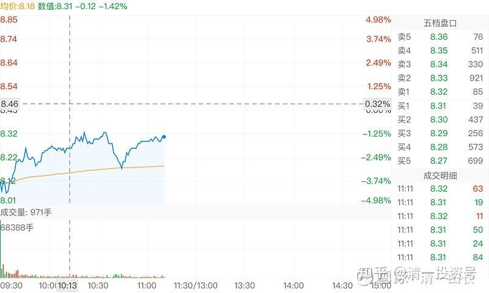
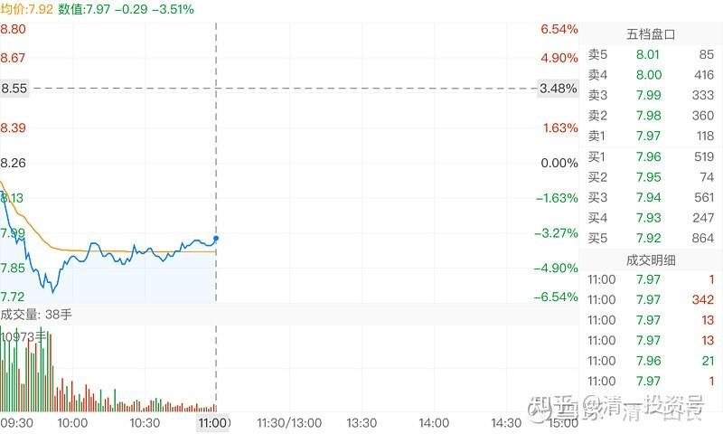

47篇.主力的动向，说明了此股的利空利好

清一山长 2020年10月9日-12日

清一山长2020-10-09 00:59:48

$燕京啤酒(SZ000729)$ 董事长被抓，一堆人跑来问我有何影响？你买了燕京，这种国资公司的好处，就是：董事长并不是真正的老板，老板是“国家队”。如果你买的私人企业，比如乐视。董事长如果被抓，你的股票，大概率就完蛋了。但国企的董事长、总经理，也就是个打工的。被抓了，说明有人帮你管企业，你这个小老板，跟着发财就是了，操啥心！还应该开心才对。

（[燕京啤酒董事长被立案调查，70后新帅上任三年业绩增长乏力，年薪70余万](http://link.zhihu.com/?target=http%3A//finance.sina.com.cn/wm/2020-10-09/doc-iivhuipp8646816.shtml)）

至于股价涨跌？我是长线投资，才不关心这个问题呢！今天开盘涨跌，都不是我的卖点，也不是买点（除非跌停，会考虑买入的）。

两种可能性：开盘后下跌，开盘涌出恐慌性卖盘，主力乘机洗筹。这种可能性大一些。

开盘后惯性下跌，然后主力出来护盘，如恒大一样，不但不跌，还拉升上涨，甚至大涨（这种可能性小）。燕京这种这几年根本就不急于拉升的股票，似乎不会有资金出来护盘的。

**放长一点看，燕京该怎么走，还会怎么走的。**也许：走了一个原来就没干啥提升燕京业绩的总经理，换来一个新官，反而让燕京焕发生机呢！毕竟原来燕京的业绩、利润，还超过青岛啤酒的。现在距离越拉越远，也该换个人来管管了。

另外，极端一点来说：也许换人，就是燕京股东最好的方案了。中国啤酒要成长，注定要购并壮大，换人之后，消除购并的卡点，也许燕京会成为三强的争抢对象。谁得到了燕京，谁就是中国的老大。燕京这个购并价值，可不小。

清一山长2020-10-09 11:22:05

$燕京啤酒(SZ000729)$ 今天居然没跌停？有点失望，不然可以创一个我账户单日损失最高纪录[大笑]。盘中观察，今天显然有主力资金入驻。开盘就接近700万股的成交，可不是一般人能接走的。**一上午成交两个多亿，浮动筹码基本上洗空了。**大多数人是赚了钱走的，主力很良心，给钱走路。而不是趁机压盘。半小时之后的成交，就是垃圾时间。没啥量能了，多空交战，已经结束。空方无力，未来可期！

另外传闻董事长不是过节才抓走的，而是上个月就抓走了。主力显然是知道这个内情的，所以不能算是“黑天鹅”，只是对我们小散是“黑天鹅”。所以，**主力的动向，说明了此股的利空利好。**节前是月尾拉升，创多年来新高。特别是港资大量涌入，似乎董事长被抓一事，对燕京是利好。**这里所谓的港资，其实是国内有资本实力的企业和老板的境外资产，并不是外国人。**他们对国内的企业掌握情况，比我们这些散户更深入，跟企业、政府的背景关系也更密切。所以他们的进出动向，也许更能够说明一点实质性的问题。

今天既然没事，没啥好操作的（原以为会跌停，准备把原来为了换惠泉卖出的一百万股买回来）。现在看没事可做。今天就带孩子出去玩了。整个节日期间我们家都没出去，猫在家里读书练功。因为我不想给孩子造成“节日就是吃喝玩乐”的概念，这个概念很害人。想玩，什么时候都可以，不必非要在节日。

---

清一山长2020-10-12 11:05:20

$燕京啤酒(SZ000729)$ 今天上午逆市下跌，很多小散吓坏了赶快跟跑。不过用脑子想想就知道了，出货哪有这样出的。坏消息出台，然后砸盘出货。这出的掉吗？**真要跑，肯定是拉高诱多再出货呀！**记录下这个图形，纪念一下这种精彩的日子。也许下午就拉红了。

金太郎的银子90980回复清一山长：（跟评上贴）

现在还能大量入吗？老师。

清一山长2020-10-12 11:37:04回复金太郎的银子90980：

股市准则：如果你需要问别人能不能买股票的时候，正确的答案就是：你肯定不能买！[俏皮]

(标题、图片为编者所加)

**文章音频**：

[413篇.主力的动向，说明了此股的利空利好_清一投资号文章同步音频](http://link.zhihu.com/?target=https%3A//www.ximalaya.com/sound/702982059)

**参考链接：**

[40篇.这种企业，以后一定成为现金牛](https://zhuanlan.zhihu.com/p/668283112)

[41.持有期限最少3年最长15年](https://zhuanlan.zhihu.com/p/670833407)

[42篇.赔钱至少是有缺陷的](https://zhuanlan.zhihu.com/p/672139277)

[43篇.短线T、高级T和反向做T](https://zhuanlan.zhihu.com/p/673874352)

[44篇.没有等来秀场时间，依然要拼耐心](https://zhuanlan.zhihu.com/p/674885494)

[45篇.燕京的“传统”——总是令持仓者失望](https://zhuanlan.zhihu.com/p/677136646)

[46篇.风险是涨出来的，机会是跌出来的](https://zhuanlan.zhihu.com/p/677785950)
