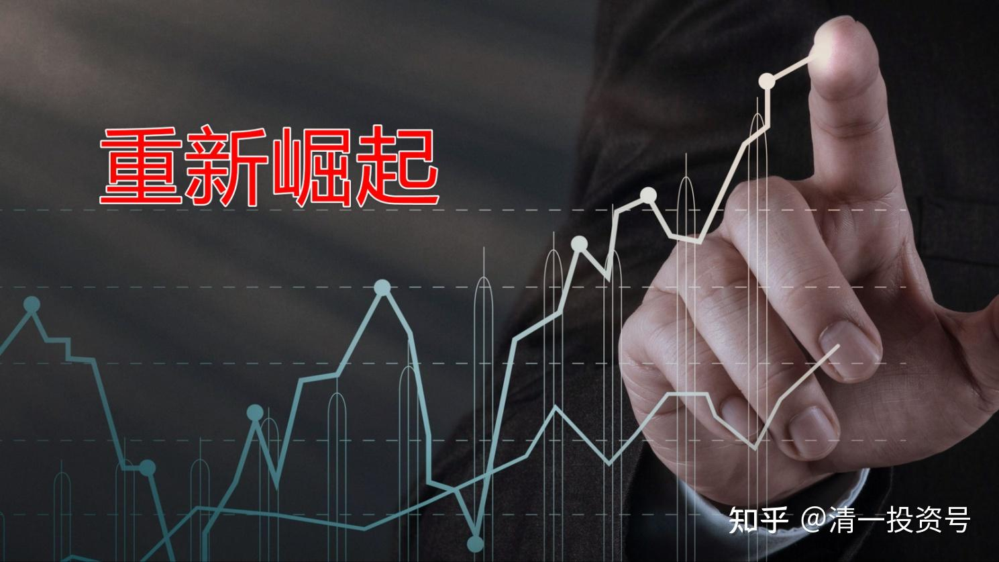
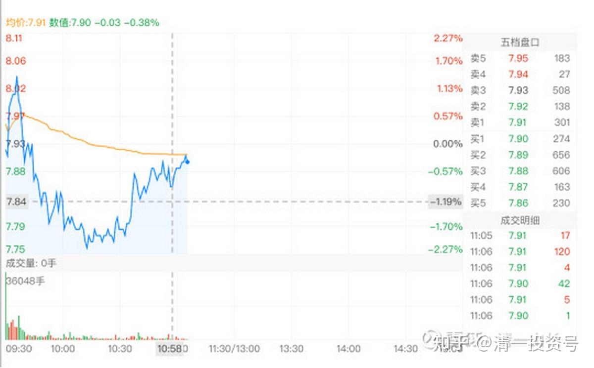
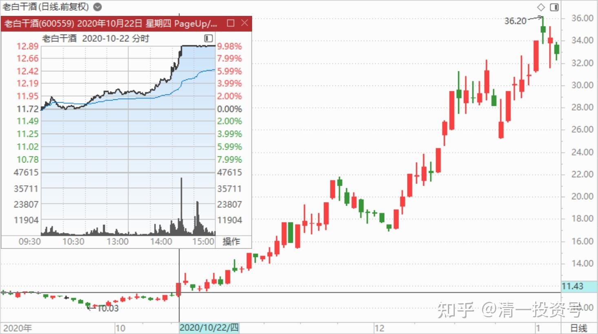
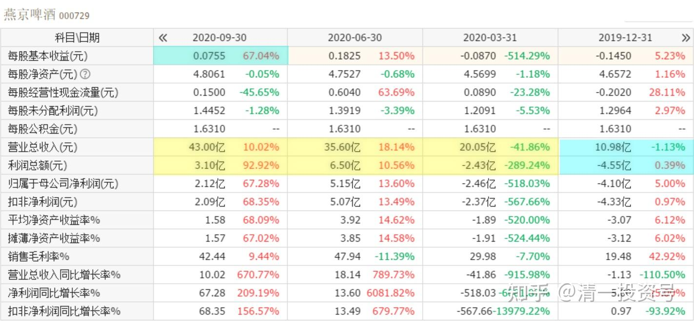

49篇.报表已经证明燕京正在重新崛起

清一山长 2020年10月22日

**一、报表已经证明燕京正在重新崛起**

清一山长2020-10-22 11:17:54

$燕京啤酒(SZ000729)$ **燕京三季报业绩亮眼，原来亏损的子公司也大幅减亏。盈利子公司（如漓泉）继续向好，说明燕京拐点已到。**燕京的业绩表现，要比惠泉的好得多。今天开盘，却一路下跌，滑不滑稽？难道资本市场失效了吗？没有，只是有人想骗你罢了。如果你没头脑，缺乏思维能力，就会吓得赶快跑掉。这是多年来燕京一直等待的拐点，怎么可能是逃跑的时间？所以，今天跌到7.77～7.78元，我继续大买，就是不卖给你。今天买了几十万股啤酒，气死做市的[大笑]！

一个简单的思维：仅仅漓泉一家子公司的业绩，就可以比珠江。燕京的其他公司，整体算起来是亏损的，所以拖了整个公司的后腿。如果燕京其他公司开始盈利，燕京的业绩将明显超越珠江。曾经的燕京，超越过青岛，近年来慢慢掉队。**现在报表已经证明燕京正在重新崛起，**有什么理由抛弃它？除非你疯了！主力装疯做傻，是想勾引你上当。我反向操作，拿定自己的主意，就是不受你的骗！

清风紫悟回复清一山长：（跟评上贴）

山长每次都能买到最低点，佩服！

清一山长2020-10-22 12:22:08回复清风紫悟：

我可以教你们心法，让你们也可以做到低价买入，高价卖出了。

我的格言是：**看多不做多，可能还做空。看空不做空，可能还做多**。原因就是；我觉得这个股还会涨的，但我不因为看多就买入。我不但不买入，可能还会卖出。只要我觉得已经赚了不少钱，就会拿一部分落袋为安。比如今天，我是看多燕京的，账上也有钱，但我开盘没涨多少，我就是不追高。反而我有相反的计划：如果今天的燕京，像惠泉一样玩涨停游戏，我一定要卖出一百万股做纪念。让我的资金池，更加充裕一些。虽然我认为8元多的燕京不应该卖出的。以后肯定要涨，**但涨停就是我卖出一百万股的标准，无论今后涨跌都会这样操作。**如果惠泉跌，就换惠泉，或者换珠江。这就是——看多不多做！比如上一次惠泉的涨停，我就卖掉了一半的仓位。这一次涨停，本来我的习惯是要卖的，但是该涨停了也没到上次的价格，就没卖。昨天卖了一点换燕京。

另外一句话：我看空不做空。前段时间，我公开分享，看到盘面明显出现主力卖出的迹象。8元多的燕京。我公开地看了空，但我没做空。宁肯满仓陪跌也不卖出。如果跌惨了，我还多买一点。这就是看空不做空，可能还做多。

你们跟我不同，你们是：看多就做多，看空就做空，所以你们都是追涨杀跌。玩个不亦乐乎！

一句话：你们更贪心，所以经常被主力反杀。**因为主力，经常是与大众反向思维的。**比如今天就很典型。因为我不贪心，所以跌得不像样了加买一些，反而能抄底！因为无意中与主力的反向调子合上了。他拉高的时候，我就卖给他（比如涨停的时候，以及11.35元大量卖中建的时候等等）。反之，主力有意地打压股价的时候，我看到了空的威胁，但我反而会做多买入。我跟主力的反向，再反向一次，我就会赢！**这就是道家智慧“三反昼夜，其利万倍”的道理（《阴符经》）。**

各位学会了没？我已经真心地分享了我赚钱的奥秘！[加油]

混沌的猫回复清一山长:（跟评上贴）

山长，你这种策略散户学不了的。其实说白了还是“坐庄策略”，当然行为是合法的。看你交易惠泉啤酒，然后一出手就100万股我就明白了。我几年前一样做过惠泉啤酒等小盘股，基本上我一买就是底，因为有足够的钱，当然也使用的是你的看多做空的思想。其实是用手中的筹码消耗盘面的买气与卖气。但是如果一次出手只有10000股，那这些都是瞎扯，只能猜你这种大鱼什么时候在什么价格折腾。而不是主动影响市场。我参与直接主动影响市场是这个策略的精髓。

清一山长2020-10-22 23:25:57

我真没你这本事，你一买就是底，我常常一买就套牢[滴汗]。我也没法影响股价涨跌，上一次惠泉涨停，8.04元，我卖了80万股出去，都没有影响一分钱的价格。小盘股都做不到影响价格，大盘股就更做不到了。我两年多前，19元多卖出兴业银行，一单100万股。也一分钱都没影响。仅仅一秒钟就换手了。还是您牛[赞][献花花]。

清一山长2020-10-22 17:37:53跟评上贴

$老白干酒(SH600559)$ 燕京没涨停，这个涨停了。可惜我不想卖。这个价不想卖，而且持仓不多，百万不到股级。因为低才买的，相信它买入的丰联酒业，是很有潜力的。需要慢慢地挖掘。未来是消费时代，不存一点白酒，不好过资本市场的冬天。所以，不破前高，都不想看它，也不想短线操作。结果已经错过好几个涨停和跌停了。我一直在坐老白的电梯[滴汗]。

**二、高级黑案例**

清一山长2020-10-22 13:02:53(跟评上贴)

$燕京啤酒(SZ000729)$ 看了一个燕京的高级黑案例：有趣！这篇文章看后，感觉基本上就是赶快卖掉燕京，一分钟都别等了：[网页链接](http://link.zhihu.com/?target=https%3A//finance.sina.com.cn/tech/2020-10-22/doc-iiznctkc6998647.shtml)

[https://finance.sina.com.cn/tech/2020-10-22/doc-iiznctkc6998647.shtml](http://link.zhihu.com/?target=https%3A//finance.sina.com.cn/tech/2020-10-22/doc-iiznctkc6998647.shtml)

我用该文一样的数据材料，写出来，你看看，是否会得出完全不同的结论：

收入端：前三季度，燕京啤酒实现营收98.65亿元，一季度实现营业收入20亿元。二季度共实现营业收入55亿元。单季35亿元。三季度44.64亿元，三季度单季啤酒销量上升了25%。创近年来燕京单季营收最高记录，最近三季的销售而从20亿跳到35亿，再跳到44.64亿,收入呈现快速加速的状态，似乎燕京已经焕发了生机。

利润端：燕京第三季实现净利润2.12亿元，同比增长67.28%。而2019年全年净利润才2.30亿。燕京前三季实现净利润4.82亿元。燕京四季度因为销量增长，费用降低原因，如果不再大幅亏损的话，全年利润将大幅提升。说明燕京可能已经走出了拐点，前途可期。

另有分析家指出：燕京品牌，市占率销售量较高，但苦于利润无法释放。除了漓泉之外，燕京自有品牌，占啤酒销售大头的市场，净利润居然是负数。可谓增收不增利。今年燕京强推燕京U8，不仅让老品牌年轻化，抢占了其他品牌的市场。线上营销，还打破了啤酒品牌的区域限制。此举最终一定能够让燕京的品牌，不再是“亏损”品牌。新品效应如果延续下去，燕京利润将迎来彻底释放的时刻。未来可期！

您看看：明明是一样的数据，但可以给出完全不一样的结论？

谁对？都对！

谁错？都错。

一句话：主力就是——他想让你听什么，你就得听什么！而且他不是谎话！没头脑，没分析力，活该处处被反杀！

我只是多想了一点：这个报道，急乎乎的出来，想要干什么？谁给记者出钱写这种调调的？难道记者真心出来帮小散吗？还是记者其实是无利不起早？写这种文章另有他意？我的文章，就没有媒体愿意发，愿意推的。**别人推送给你的，就是想要影响你的。千万小心推送的信息！**

不过，既然主力，记者都出来说空。走势，就一定会空的。不空也得空！各位看来就别指望燕京的业绩浪了[大笑]。

(标题、图片为编者所加)

**文章音频**：

[417篇.报表已经证明燕京正在重新崛起_清一投资号文章同步音频](http://link.zhihu.com/?target=https%3A//www.ximalaya.com/sound/705147532)

**参考链接：**

[40篇.这种企业，以后一定成为现金牛](https://zhuanlan.zhihu.com/p/668283112)

[41.持有期限最少3年最长15年](https://zhuanlan.zhihu.com/p/670833407)

[42篇.赔钱至少是有缺陷的](https://zhuanlan.zhihu.com/p/672139277)

[43篇.短线T、高级T和反向做T](https://zhuanlan.zhihu.com/p/673874352)

[44篇.没有等来秀场时间，依然要拼耐心](https://zhuanlan.zhihu.com/p/674885494)

[45篇.燕京的“传统”——总是令持仓者失望](https://zhuanlan.zhihu.com/p/677136646)

[46篇.风险是涨出来的，机会是跌出来的](https://zhuanlan.zhihu.com/p/677785950)

[47篇.主力的动向，说明了此股的利空利好](https://zhuanlan.zhihu.com/p/677786129)

[48篇.涨停是否要减持：时机、成交量、基本面配合情况](https://zhuanlan.zhihu.com/p/680828476)
