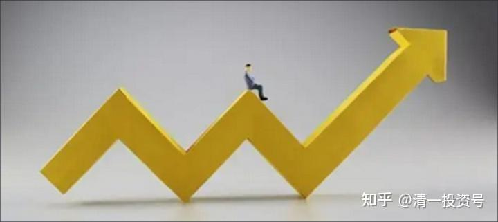
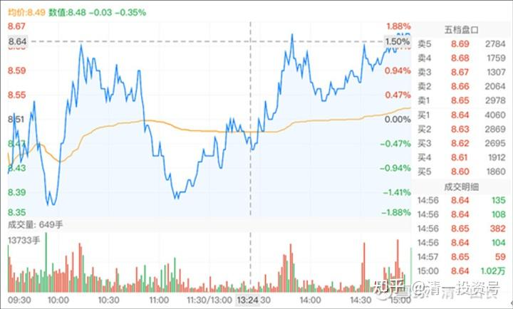
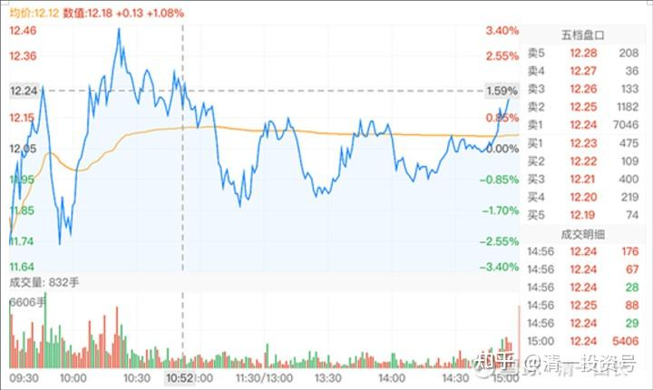
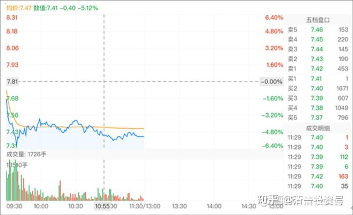

4篇.中国啤酒业将迎来困境反转？

清一山长2018年6月26日～2021年1月11日

一、啤酒行业的基本面分析

[清一山长](http://link.zhihu.com/?target=https%3A//xueqiu.com/9310099567/124533350)2018-06-26 10:24:26

$珠江啤酒(SZ002461)$过去的五年，是啤酒市场销量逐级下滑的五年。青岛啤酒从2013年的870万千升到了2017年的797万千升，燕京更惨，下滑幅度更大。从571万千升下滑到416万千升，下滑的量，相当于消灭了一个半的珠江。而珠江是两家这五年保持了正增长的啤酒企业，从2013年的110万千升上升到了121万千升。另一家是华润，从1172万千升上升到了1182万千升。基本只能算是在同行下滑的情况下，勉强保持了销量没有跌。从绝对数值上，远远赶不上珠江10%的逆市增长。净利润率上，珠江从2013年的1.23%，上升到了2017年的4.93%。也就是说，珠江是五大啤酒企业中唯一在逆势环境中，保持了价量齐升的企业。同期燕京从2013年的4.95%，下降到了2017年的1.44%。行业龙头华润，净利润率，也从2013年的5.80%跌到了2017年的3.99%。说明华润是牺牲利润，维持住了市场占有率。在千升利润这个指标上，珠江从2013年的37万千升，上升到了2017年的153万千升。与青岛啤酒的158万千升差不多。而青岛啤酒在2013年是令人羡慕的高利润的227万千升下滑到158万千升的。拥有国内最有价值的啤酒品牌，啤酒中的“国酒地位”，却让这个品牌的价值逐年下降，到了2017年，居然跟毫无根基的珠江啤酒利润差不多了。青岛的品牌溢价是如何体现的？对于这五年的比赛结果，应该说市场太残酷，还是青岛太差？或者是珠江太优秀了？同期，燕京从2013年的千升利润119万千升，跌倒了2017年的39万千升，业绩惨不忍睹，跟珠江完全反向运行。市场份额丢了，利润也丢了。值得一提的是重庆啤酒，丢了市场和销量，但是维持甚至提高了利润。所以股价也节节高升。

可以说，过去的五年，是燕京节节败退的五年，同时也是珠江不断逆势上升的五年。所以，珠江比燕京估值高也不奇怪。当然，燕京目前，是最佳的**“困境反转”**题材。未来如果行业有改善，可能燕京的业绩弹性会最大。另外，燕京的销量第三地位，如果与其他任何一家强手（青岛和华润）并购联手，消除竞争，就会成为市场份额第一的企业。所以也许未来会有并购题材，提升燕京的估值水平。而珠江已经是外资百威英博控股（第二股东），不太可能有这种“改嫁的机会”。所以燕京博的是“反转和并购”题材，珠江博的是行业的“优等生”今后继续优秀的可能。虽然体量不大。知名私募买入燕京的理由是什么？我真不知道。但是我个人更看好珠江，虽然也买了一些燕京。

以上分析，纯属个人观点，不构成投资建议。据此入市，风险自担。本人持有珠江、燕京和青岛啤酒。看好中国的消费升级。

**清一山长评价上贴：**

[清一山长](http://link.zhihu.com/?target=https%3A//xueqiu.com/9310099567/124533350)2020-11-12 20:42

两年半以前的这个帖子，分析啤酒行业的基本面。证明我还是看基本面的，我并不是完全的技术派。我自称“**价值投资派**”，肯定是讲基本面的，不纯看技术。但我最近一年的发帖，都是谈技术走势分析的，讲博弈心理学居多，很少谈啤酒股的基本面。因为，基本面很简单，就这点东西。看懂了，就够了。没必要天天看财报的，我没这耐心慢慢看财报。我只关心几个主要的指标，**市场占有率、现金流动比率，啤酒就是销量多大，不是销售额和利润。**啤酒一旦回复顶尖时期的赢利水平，涨上两倍是最起码的。所以，我选择重仓珠江。这些资金，来自于从顺鑫农业退出的资金。我记得当时顺鑫是40元。我认为顺鑫涨到80元的机会，不如珠江从5元涨到10元的概率大。现在，结果是完全应验了我的判断。其实，顺鑫我当时卖出后就跌了，跌到了30元左右又重新起来的。只是我没有及时买回来。不然也可以涨一倍。

当时燕京、珠江的价格，是燕京比珠江高1.5元。燕京大约6.6元每股，珠江是5元多一点。我当时评估下来，认为珠江潜力更大，所以重仓了珠江。你们也看到，2018年中报以后，我就进入了十大（当时我还不知道十大居然几百万股就进入了，总共买入了珠江五百多万股，有三个不同的账户持有珠江，还有一个我家老人的养老账户，珠江也重仓了）。

当时发帖，觉得珠江买入后赚钱的概率很高。就分享给大家，希望大家都赚钱。结果引得一堆人出来黑我。珠江不但没涨，还继续跌，这群人笑话我“打脸”。甚至认为我就是来拉票填坑的吐血。没错，现在回头来看，当时就是**黄金坑**。发帖后，几个月珠江都在跌。每股最多跌了一元多，让我都看不懂。因为**我估算的主力成本跟我是差不多的。跌到4元左右，他们账面上也是赔的。当时这个价格，十年来买入珠江的没有人能够赚钱。这是主力故意制造的坑。但别人只要股数，不管账面盈利的。自然，当时我的账面也很难看，可以说是惨不忍睹，珠江的账面亏损是好几百万元。**但我越跌越买，后面就涨了。我在珠江上，来回做T都很成功。结果就赚到了比顺鑫农业几乎多一倍的利润。是目前啤酒利润最高的股。目前，以零成本持有7位数的珠江。珠江成为了我赚钱最多的股票（除了中国建筑外），盈利额超过我对珠江的投资总额。其实，珠江我也有一些小失误。赚钱出来的大多数资金，我用去买低迷的燕京了，结果燕京一直低迷到现在。如果我咬定珠江一直做，不切换燕京，只换惠泉，估计利润会比现在更好。当然，这话已经是后话了。

你们看一个人，只会看现在的股，几天的股，这是靠不住的。**看一个人几年前说的话，一个人几年拿的股，是不是靠得住？这才考验人的真实盈利能力。抓个涨停，谁都可以抓的，运气好点就行。能够抓住一只股几年，一直盈利，就一定要有一点投资思维和投资逻辑。否则做不到的！**

用这个贴，来纪念我已经进行了两年半的珠江啤酒的投资。虽然我现在的账户上，还有不少珠江，都是零成本持有的，大家就别去比了。我以后也不多说我的珠江操作，进出了。但我对珠江的看好，依然不变。会一直持有一部分，看中国啤酒业的变迁。万一它走出一个重庆啤酒的行情呢？我也不想错过。我用零成本持仓，来守护珠江的未来大笑。

[蓝莓财经](http://link.zhihu.com/?target=https%3A//xueqiu.com/1191990433/126261521)[2019-05-07 21:31](http://link.zhihu.com/?target=https%3A//xueqiu.com/1191990433/126261521)

后劲不足的燕京啤酒，能否打赢翻身之战？

[https://xueqiu.com/1191990433/126261521](http://link.zhihu.com/?target=https%3A//xueqiu.com/1191990433/126261521)

[清一山长](http://link.zhihu.com/?target=https%3A//xueqiu.com/9310099567/124533350)2019-05-08 10:37评论上帖：

有数据显示，2016年我国啤酒产量达到4562.71万千升，占全球总量1.93亿千升的24%，超出第二名美国近一倍之多。

啤酒中国产量世界第一，利润呢？连零头都不到。只要有一天恢复正常的利润，中国啤酒成为利润世界第一，啤酒股市值世界第一，将来是毫无悬念的。茅台可以市值万亿，啤酒未来市值万亿也未必不可能。所以，我投资啤酒股，就是买困境反转的行业。至于燕京是否龙头倒是不重要。因为我错过了买入16元港币的华润，一直耿耿于怀。只好找珠江和燕京了。吃点啤酒的鸡肋，总比吃鸡毛好。[大笑]

[第一食品网](http://link.zhihu.com/?target=http%3A//www.foods1.com/)[2007-04-25 08:42](http://link.zhihu.com/?target=http%3A//www.foods1.com/news/192361)

燕京啤酒连续11年位居全国销量榜首

[http://www.foods1.com/news/192361](http://link.zhihu.com/?target=http%3A//www.foods1.com/news/192361)

[清一山长](http://link.zhihu.com/?target=https%3A//xueqiu.com/9310099567/124533350)2020-12-26 15:33评论上帖：

[$燕京啤酒(SZ000729)$](http://link.zhihu.com/?target=http%3A//xueqiu.com/S/SZ000729)老新闻了，看看：燕京并不是一直都是老三。曾经的王者，可以重整雄风吗？以老四、老五的价格（低于珠江、惠泉的价格），搏困境反转的老大、老二的可能，最不值的，搏一个保住老三的市值，会吃亏吗？

**二、燕京啤酒技术分析及实操**

[清一山长](http://link.zhihu.com/?target=https%3A//xueqiu.com/9310099567/124533350)2021-01-05 22:48:41

[$燕京啤酒(SZ000729)$](http://link.zhihu.com/?target=http%3A//xueqiu.com/S/SZ000729)今天图形是大力洗盘，最终是拿货模式。跟上次图形，我说是出货模式不一样。上次10元的图，我已经看是出货的走势，但我没有大量卖出的原因，是觉得这个出货太明显了，会不会是骗线？结果真的是出货了。今天K线是典型的扫货模式，低开震仓，最终几乎是走上了全天最高价。把今天的套牢盘全解救了。吃进的货，比卖出的货多得多，所以是扫货。正常情况，明天应该是涨的。留此贴坐等打脸！[俏皮]

今天燕京跟惠泉啤酒的震荡走势，也不一样。惠泉的筹码控制良好，走势是收敛模式，比燕京更漂亮的图形。

*（燕京啤酒2021-01-05）*

发一张惠泉啤酒今天的走势图，各位对照一下庄家的手法不同之处！看了这张图，你就知道惠泉跌破11元的时候，我公开出来示范你们加仓，就是送钱给你们的。居然还有人傻等它破10、破8的，就是贪心不足，要不就是脑子进水了。10元，是不可能的破的。主力没这么傻的，破了，他的筹码会被洗走很多的。我唯一不解的就是燕京，这种走法，其实主力的筹码应该丢了不少。不知道他打的什么主意。看不懂！

*（惠泉啤酒2021-01-05）*

[@爱玛生活笔记](http://link.zhihu.com/?target=http%3A//xueqiu.com/n/%25E7%2588%25B1%25E7%258E%259B%25E7%2594%259F%25E6%25B4%25BB%25E7%25AC%2594%25E8%25AE%25B0)回复[清一山长](http://link.zhihu.com/?target=https%3A//xueqiu.com/9310099567/124533350):

请教山长，我看您买股票经常提到股息，但是燕京的股息这么低，几乎没有，您是怎么看待它的呢?

[清一山长](http://link.zhihu.com/?target=https%3A//xueqiu.com/9310099567/124533350)2021-01-06 11:38:12回复[@爱玛生活笔记](http://link.zhihu.com/?target=http%3A//xueqiu.com/n/%25E7%2588%25B1%25E7%258E%259B%25E7%2594%259F%25E6%25B4%25BB%25E7%25AC%2594%25E8%25AE%25B0):

**这是两种不同的投资逻辑。买啤酒，是买行业的困境反转。**这种股，是不能谈股息的，但可以谈价格预期的反转，会带来更多的收入。

**我买股息，是买保险一样的股票**。用来保护我的资金净值的，不至于被我赌行业反转的冒险而伤害资产。

**啤酒在反转吗？的确是。啤酒行业的人，告诉我：现在一瓶酒的利润，是原来的十倍。**这很惊人吗？其实不惊人。原来一瓶酒，可能只能赚一毛钱，5分钱。现在涨价了，可以赚5毛钱，一块钱一瓶了，其实并不夸张，但利润就会快速的上升。这就是我买啤酒的理由。**不要静态地看过去的账务历史。这叫呆会计！**[俏皮]

[清一山长](http://link.zhihu.com/?target=https%3A//xueqiu.com/9310099567/124533350)2021-01-11 11:53:11

[$燕京啤酒(SZ000729)$](http://link.zhihu.com/?target=http%3A//xueqiu.com/S/SZ000729)权益变动报告书显示，2018年1月11日，裘国根的重阳集团买入1348万股燕京啤酒股票，买入均价7.285元。重阳投资及其一致行动人合计持有燕京啤酒股票占比达到5%。）今天的燕京，最低价7.31元。

真佩服重阳：拿了三年燕京，赚了每股0.12元。我想问裘总：您的资金利息，够不够支付的？

**燕京到底在玩什么？我们真不知道。在燕京啤酒销量、利润，都取得正增长的时候，股价却与3年前燕京根本没有啥好出路，一片茫然的时候相比是一样的。您觉得正常吗？**

也许，燕京真的会破五？

我不知道，但我决定坚守！我不亏谁亏？你们走吧，我负责善后，只要你们安全就好。[加油][笑]

*（燕京啤酒2021-01-11）*

[@51nxp](http://link.zhihu.com/?target=http%3A//xueqiu.com/n/51nxp)回复[清一山长](http://link.zhihu.com/?target=https%3A//xueqiu.com/9310099567/124533350):

很多人会非常在乎每一天的账户市值，这个毛病有，你就做不好投资。

你要真正的看清企业的经营前景和它共同成长才能够赚到属于你认知能力的钱，这个模式才能复制。

虽然山长更偏向于资产的保值，我更偏向于进攻，但是我觉得山长的投资是很靠谱的。燕京啤酒在消费股中绝对低估。

[清一山长](http://link.zhihu.com/?target=https%3A//xueqiu.com/9310099567/124533350)2021-01-11 12:56:54回复[@51nxp](http://link.zhihu.com/?target=http%3A//xueqiu.com/n/51nxp):

我们都是**善于逆势中苦熬的人**[献花花]。顺鑫农业，当年你也一样苦苦守候，面对的是种种的不可思议的低价、打压，以及种种坏消息满天飞。你就守住一条就是坚持不动：牛栏山的每年销量，都在上升中。作为中国销量第一的酒股，不应该是19元这个价格！

最终，坚持的赢了。但很多人，有些人坚持了一两年，都受不了庄家的磨叽，最后跑掉了。我记得，你当时还只有这一只股死拿！别的股都不看。[微笑]

啤酒，是我顺鑫创酒股大赚记录后转战的品种。现在看来，不如坚守白酒（比如当时去买入价格与顺鑫差不多的泸州老窖和五粮液更有价值）。但世界上没有后悔药，燕京依然不涨，就只能依然守候了。幸亏惠泉、珠江，都赚了不少。但目前，燕京是最有潜力的。

2019年，燕京啤酒四季度，销量已经提升了31%，明显走出低谷。2020二季度、三季度的销量提升，也明显提速。四季度应该也在去年大幅提升基数的情况下，2020还有进一步提升的空间。可惜查不到任何消息，可见封锁严密，就跟当年的顺鑫一样，好消息看不见，坏消息满天飞。

2019年，燕京的下属子公司，一南一北两个控股子公司，漓泉和赤峰，分别录得净利润共计4.81亿，同比分别增加25%和47%，连消费旺季很短的赤峰公司净利润率亦超过10%。仅此两子公司，净利润就超过[重庆啤酒](http://link.zhihu.com/?target=https%3A//xueqiu.com/S/SH600132%3Ffrom%3Dstatus_stock_match)（4.04亿）和[珠江啤酒](http://link.zhihu.com/?target=https%3A//xueqiu.com/S/SZ002461%3Ffrom%3Dstatus_stock_match)（3.66亿）。市值却相差巨大，特别是和重庆相比。燕京主品牌，一分钱不要，也不至于是现在这个价格。

所以，**我一直说：万一燕京主品牌开始亮点出现了，燕京的困境反转，可能是令人吃惊的局面。**我相信啤酒股，会让我获得比顺鑫农业更多的投资利润（不是指股价）。珠江目前已经实现了这个目标，惠泉也基本上实现了这个目标，就是燕京的表现还差一点。[微笑]

附录：参考文章

[清一投资号：第1篇.涨停之际，谈我的啤酒股投资逻辑](https://zhuanlan.zhihu.com/p/477911616)

