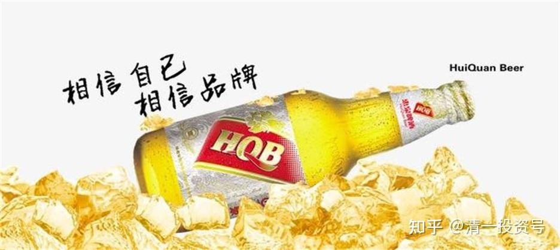
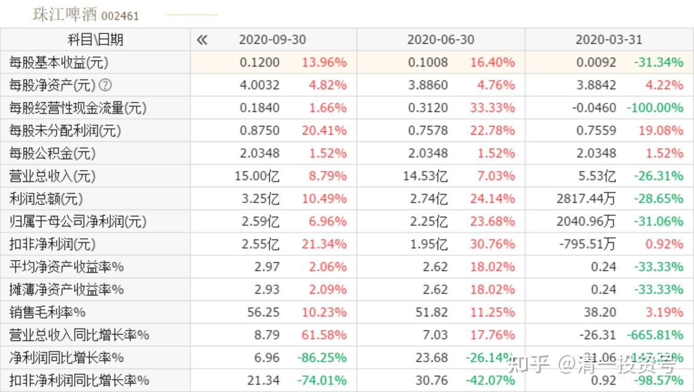
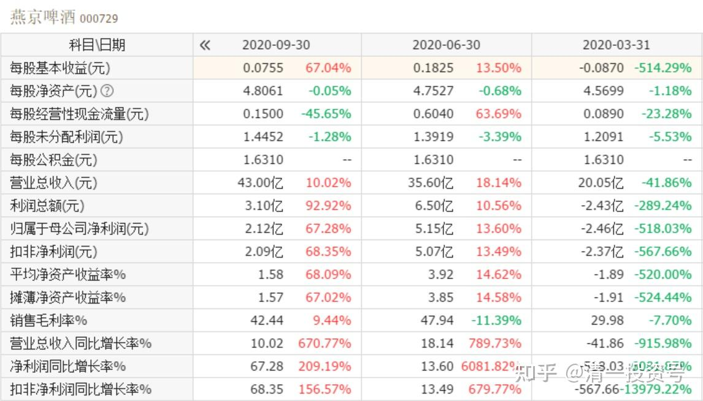
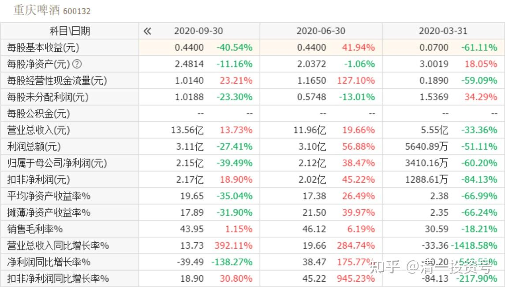
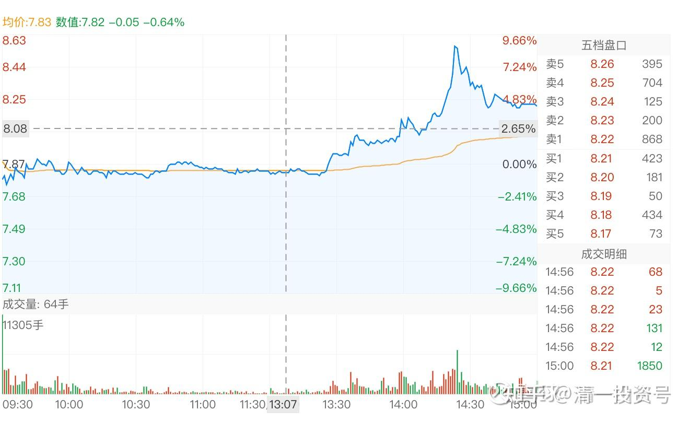
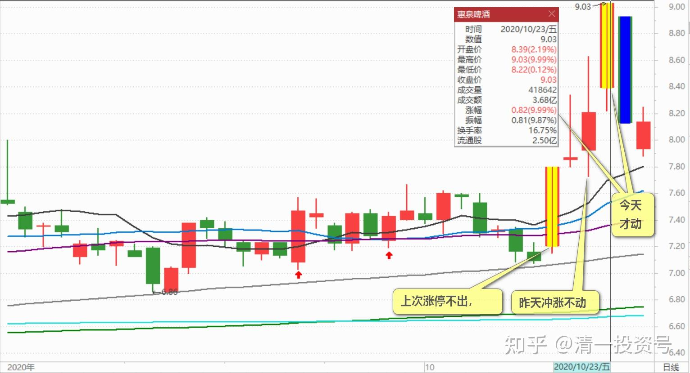

50篇.惠泉股性活跃，喜欢刺激的人有福了

**一、重庆、珠江、燕京啤酒的第三季财报对比**

清一山长2020-10-22 19:17:49

$珠江啤酒(SZ002461)$ 第三季度财报。宣布公司营收增长8.79%至15亿元，归属净利提升6.96%至2.59亿元，扣非利润增加值25.85%。不过，这是在去年扣非利润增加85%的情况下继续的内含增长，能够有25%，已经很不错了。我猜市场可能不会特别满意这个结果，市场总是期待太高。期待珠江营业收入能够有两位数的增长，利润有三位数的增长（2019年还真的达到了利润3位数增长，所以珠江的股价也就节节高了）

**燕京营收是珠江的三倍，**但第三季利润才2.12亿元。前三季珠江总利润是5.05亿元。但燕京前三季才4.82亿元。**珠江前三季总营业额才35亿（相当于重庆的一年营业额），燕京是98亿，三倍多的营收，**利润还不如珠江高。从这些静态指标来看，燕京简直弱爆了。但是从市场销量来看，燕京的未来还是很有期待的，如果燕京能够达珠江的啤酒销售的利润率，燕京的净利润，至少可以暴涨三倍。加上未来叠加的内循环消费意识，此时持有燕京，应该是一笔不错的长期资产。

当然，珠江也不错，相对燕京很绩优。相对重庆啤酒珠江就太便宜了。**重啤才区区35亿的年销量，还不如珠江高。**半年报的净利润跟珠江差不多。但市值比珠江、燕京要高一倍还多。500多亿的市值。PB更是高数十倍，达到了50PB。我手上拿着1.73倍PB的燕京，以及2.58倍的珠江，感到资本市场的神奇——万一有一天，珠江成为重庆啤酒第二呢？或者燕京成为超重庆啤酒呢？毕竟，白酒市场上太多上市公司了。啤酒，就这几家！难道大家不来追捧一下吗？[俏皮]

不过，本人不是来推啤酒股的。目前，我的啤酒不再有净买入，将来只会净卖出。过去的我，看啤酒是买买买。未来，我是逐步卖出啤酒股，逢高就一点一点的减仓。欢迎大家来抬轿。

**二、惠泉股性活跃，喜欢刺激的人有福**

清一山长2020-10-22 23:34:11

$惠泉啤酒(SH600573)$ 今天这图没看懂。下午费了不少资金推涨，但还差三分钱就涨停了，就直接跌了下来。从实力上说，惠泉拉个涨停不难。难道是试试盘？看抛压情况再决定后期走势？结论是抛压并不强。我这里先留个图，以后观察验证吧！**惠泉股性活跃，喜欢刺激的人有福了**。

清一山长2020-10-23 11:39:07 （跟评上贴）

昨天走势怪异，我就猜是主力试盘，今天一早守在电脑面前看，果然今天开启涨势。主力控盘能力极强，进退节奏非常好，操盘的人是高手。一路洗了很多筹码出来。冲涨停蓄而不发，逗引浮动筹码不断涌出。真是操盘高手，实力也超级强。今天涨停，已经被主力成功洗出来了。心甘情愿退出三大！**上次涨停不出，昨天冲涨不动，今天才动，**说明基本上跟上了主力的步伐。不过下周就跟不上了。只看远远看主力表演了。我就拿着燕京和珠江安慰自己好了。惠泉太牛，我驾驭不了。认怂下车！

锦鲤777回复清一山长:（跟评上贴）

请问下后市如何操作，我想跟着你[很赞]

清一山长2020-10-23 12:05:18 回复锦鲤777:

您跟我干嘛？我又不是主力。我已经走了。账上留了一点负成本的惠泉，只剩下一二十万股，就是看看热闹的分了。卖不卖都无所谓了。您还是去跟主力去吧！他们才是您要研究学习的对象[俏皮]。

(标题、图片为编者所加)

**文章音频**：

[420篇.惠泉股性活跃，喜欢刺激的人有福了_清一投资号文章同步音频](http://link.zhihu.com/?target=https%3A//www.ximalaya.com/sound/707843503)

**参考链接：**

[43篇.短线T、高级T和反向做T](https://zhuanlan.zhihu.com/p/673874352)

[44篇.没有等来秀场时间，依然要拼耐心](https://zhuanlan.zhihu.com/p/674885494)

[45篇.燕京的“传统”——总是令持仓者失望](https://zhuanlan.zhihu.com/p/677136646)

[46篇.风险是涨出来的，机会是跌出来的](https://zhuanlan.zhihu.com/p/677785950)

[47篇.主力的动向，说明了此股的利空利好](https://zhuanlan.zhihu.com/p/677786129)

[48篇.涨停是否要减持：时机、成交量、基本面配合情况](https://zhuanlan.zhihu.com/p/680828476)

[49篇.报表已经证明燕京正在重新崛起](https://zhuanlan.zhihu.com/p/681475572)
