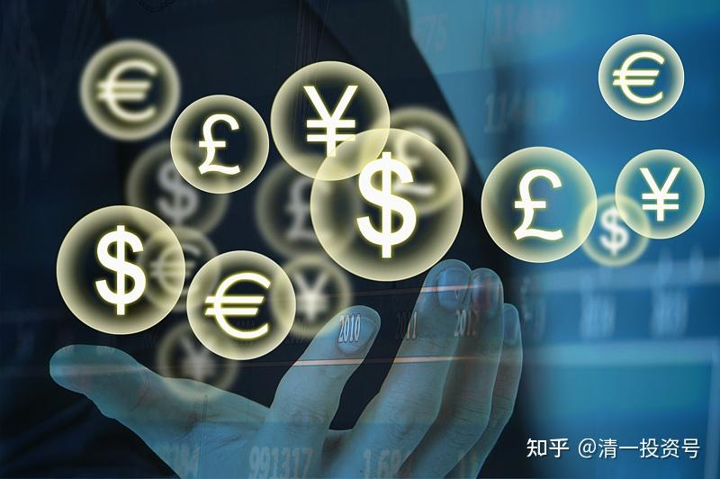
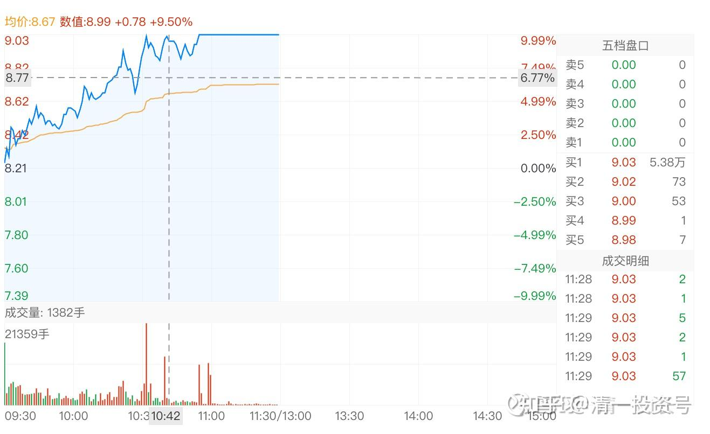
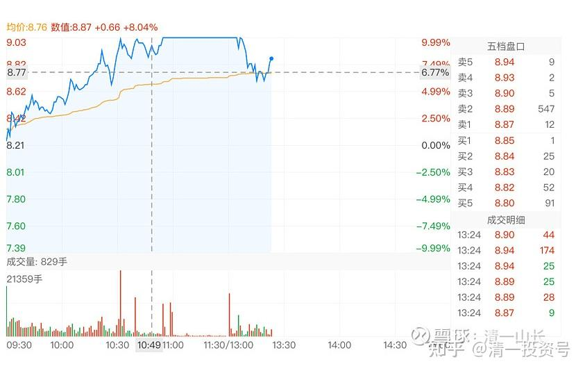

51篇.是风险赌博还是稳定投资？

清一山长 2020年10月23日

清一山长2020-10-23 11:31:32

$惠泉啤酒(SH600573)$ 真的涨停板了？好吧！算你狠！我就卖掉2.2M，连一分钱都没有打下来，我真没本事影响市场[吐血]。这个三大，我就让贤算了，无官一身轻。10.59元附近的两根卖单，就是我干的。我这三大，今天又被企业辞退了，今年年报，大家就看不到我了[哭泣]。去年俺还是两家啤酒公司的十大呢！现在都没了，凉凉。目前的燕京持仓，虽然比其他两家当十大的时候加起来都多，可别人太牛了，就是不给我当十大，都让重阳给抢了位置[滴汗]！

祝福各位买了惠泉的朋友们，恭喜大家大发财，祝福你们明天再收获一个涨停，我只会为你们坚守的人开心的，不会认为我没赚到钱。我已经赚到了我该得的这一部分，知足了。希望接手了我持仓的朋友多赚钱，赚大钱。今天我就走了：轻轻的我离开，挥挥手，不带走一片云彩。我只带走了一点利润——我要还账去了。这段时间，每次看燕京扭扭捏捏的作态就生气，生气就买股。**特别是最近两天，媒体胡乱出来乱黑燕京，乱忽悠人，我一怒之下，总共动用了几千万融资大喝啤酒。**现在惠泉已经涨停了两次，够意思了。上次涨停没卖就觉得对不起惠泉了。今天，再不卖就更对不起惠泉了。我就赶快卖掉，还惠泉母公司的欠账去，感谢惠泉主力帮助付账买了燕京。我不好意思再赚下周的钱了。今天看到涨停，还不愿意卖掉手上的持仓去还融资，还想拿着多赚，甚至还融资开仓追涨停，我就是太贪心了。我还是低调一点，把欠账还掉，这样心安。也让有钱的大爷有机会买入我喜欢的啤酒。毕竟我实力不足，借的钱短期已经收获了两个涨停，已经很满足了。也许将来有一天，市场凄风冷雨的时候，我再动用预备队买入来救市。

惠泉是个好股，前途无量，从6元买上来，就坚信它会有出息的。**它一直比燕京强势得多，出现比燕京价格更低的时候很难得的，当然要买。**历史上惠泉冲高达21元多，跟现价比，还有一倍的空间。但我胆子小，这钱就不赚了。把机会送给喜欢它的人吧！

惠泉啤酒2020年10月23日分时图

胡文青回复清一山长：（跟评上贴）

如果后面跌了今天这段文字就可以叫：山长割韭菜日记，后面继续大涨就成了：山长送大礼包日记[大笑][大笑][大笑]

清一山长2020-10-23 12:00:51回复胡文青：

所言差也[吐血]。如果下周跌了，是主力友情派大红包给山长。如果下周涨了，是山长友情送筹码支持主力拉升！我们双方互相合作共赢。难道您真的相信，今天是小韭菜们接了我这三大的盘子？我是不相信的。我这人，主要靠跟主力反向操作赚钱。主力打压出现低点，我跟着捡点残余。主力拉升，我跟着赚点擦边钱。当然，不排除某些小散跟风送筹码送钱的。刚才查了成交单，很多都是大单，十几万股一单的。也有一点几百股的小单，比例很少。最大一单，是44万股的一单成交。您说是小韭菜买的？真的太瞧不起主力了[俏皮]。

胡文青回复清一山长：

谢谢山长的回复，但是山长开融资是不是太贪了点，这算不算是刀口上舔血或者是在狼群里面抢肉吃？山长平时给我们的风格是保守不贪的，开融资这一点我是没想到，目前看结果是好的，就不怕万一？如果不是现在这个结果，该怎么应对？

清一山长2020-10-23 13:53:42 回复胡文青：

您说得对：融资来买没啥利润、也几乎没分红的啤酒股，的确是赌博！不支持大家这样做。

我这样做有我的道理：您是否还记得，我是卖掉8元多的燕京，出来的资金用来买的7元刚出头的惠泉吧？当时差价一元左右。现在涨了接近两元。这些惠泉，都是用卖出燕京的现金来买的。这笔差价和倒换，到今天额外的带来了每股接近3元的差价。

可是，后来燕京跌了，也跌到7元多了。我想补回原来卖掉的燕京。可是，此时惠泉也没涨，我想买燕京咋办？当然只能动用融资了，要让我卖掉7元多的惠泉来买燕京，我觉得太可惜了。等今天卖掉惠泉，正好等于把上次燕京的换购还掉了。保持了啤酒仓位的稳定（原来是增仓了）

我这种操作，是包赚不赔的。是用燕京、惠泉跨品种倒换，T出来的差价来做保底的，就算两者都不涨，价差也比融资利息高多了。我长持付利息也不亏的。但这种操作不具备示范性，所以我就没公开告诉大家可以融资买入，免得误导人。对我来说，我的融资，是免息，甚至贴息的（做T差价已经保障了），别人无法模仿。也**建议不要用融资买股。融资是双刃剑，如果功力不够，害人不浅。**

清一山长2020-10-23 14:17:01：

还有一个关键点：我判断啤酒今年会有一波业绩浪。因为从实业角度来了解，今年的啤酒销量特别好。燕京的销量在王一博的带动下很有人气。马上冬天，啤酒销量会变差，燕京会亏损。未来的大半年时间，一直到明年春季，啤酒的主力，都没啥事情好做的。因为基本面不配合拉升。所以，今年的三季报，很可能是啤酒行业的一个机会。所以，三季报之前，居然跌到没道理的时候，果断地融资买入，进行一点投机。万一报表不对，可以公布后亏本也退出，但这种可能性很低。所以，这种举动，其实是有很强安全边际的。索罗斯的话：**别人看上去是风险巨大的赌博，真正了解后，其实是确定性很强的稳定投资。几乎就不会失败的，特别是主力打下来的价格很合适，不买白不买。这就是反身性原理！**

清一山长2020-10-23 13:30:04

$惠泉啤酒(SH600573)$ 怎么破板了？差评！我卖的时候8M多的封单。上午收市前，还有5百多万股的封单。怎么下午一开盘，一百多万股成交就破板了？看样子，是主力自己撤了单，留下的顶住封单的，都是宁波的涨停板敢死队？还是让散户殿后，主力先跑了？反正我今天不买了。抱歉，我不做这几毛钱的T了。因为我也没钱买惠泉了，都拿去还融资了。惠泉，是融不到资的。

一点心得分享：为啥今天涨停，我几乎全卖了？原因就是惠泉成交量太大了，我看成交量大都不放心。**珠江现在才1.79亿，惠泉现在已经2.94亿了。今天铁定破三亿。而珠江总盘子，可比惠泉大十倍。**所以，相对成交量，惠泉比珠江多了差不多20倍。不过，**珠江85%左右筹码都是控股公司的，不会卖出。真正的流通盘，其实只有15%左右，这样算，流通盘跟惠泉差不多，很容易操控。**所以，珠江从趋势上来看，应该更有前途。所以，当初**珠江燕京惠泉差不多的价格时候（5～6元期间），我主要买珠江，因为它弹性大**。涨了之后换燕京，换惠泉，越换越多。现在其他两个涨上来了，价格差不多，我就会换珠江了。9元多，我补了不少珠江。如果同样是9元多，我当然要卖出惠泉了。两个货色如果一样价，我更看好珠江。如果惠泉更便宜，当然看好惠泉。

希望惠泉现在只是洗盘，尾盘主力发发慈悲，还是继续封回涨停吧！现在利用破板，彻底把浮动筹码洗光掉。也给持有啤酒的小散们一点希望-——对中国啤酒行业的希望。别以为中国只有卖白酒的，还有咱们的啤酒[俏皮]

(标题、图片为编者所加)

**文章音频**：

[422篇.是风险赌博还是稳定投资_清一投资号文章同步音频](http://link.zhihu.com/?target=https%3A//www.ximalaya.com/sound/709376120)

**参考链接：**

[43篇.短线T、高级T和反向做T](https://zhuanlan.zhihu.com/p/673874352)

[44篇.没有等来秀场时间，依然要拼耐心](https://zhuanlan.zhihu.com/p/674885494)

[45篇.燕京的“传统”——总是令持仓者失望](https://zhuanlan.zhihu.com/p/677136646)

[46篇.风险是涨出来的，机会是跌出来的](https://zhuanlan.zhihu.com/p/677785950)

[47篇.主力的动向，说明了此股的利空利好](https://zhuanlan.zhihu.com/p/677786129)

[48篇.涨停是否要减持：时机、成交量、基本面配合情况](https://zhuanlan.zhihu.com/p/680828476)

[49篇.报表已经证明燕京正在重新崛起](https://zhuanlan.zhihu.com/p/681475572)

[50篇.惠泉股性活跃，喜欢刺激的人有福了](https://zhuanlan.zhihu.com/p/682717047)
