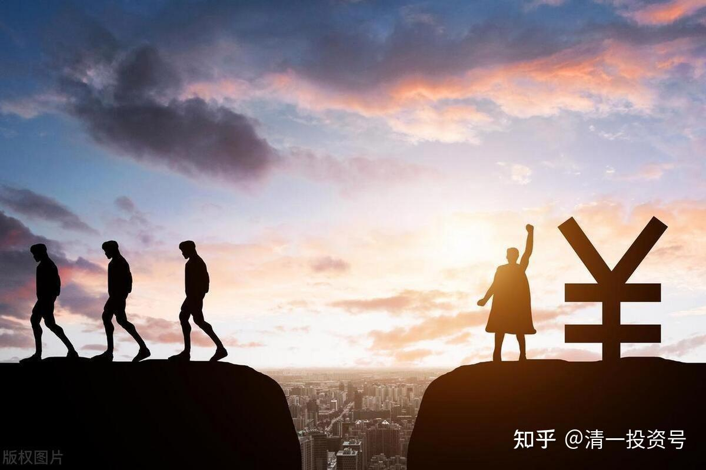
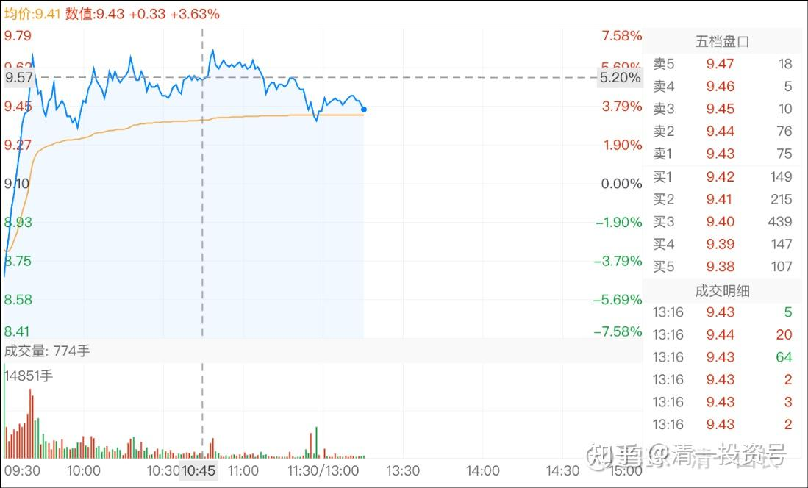
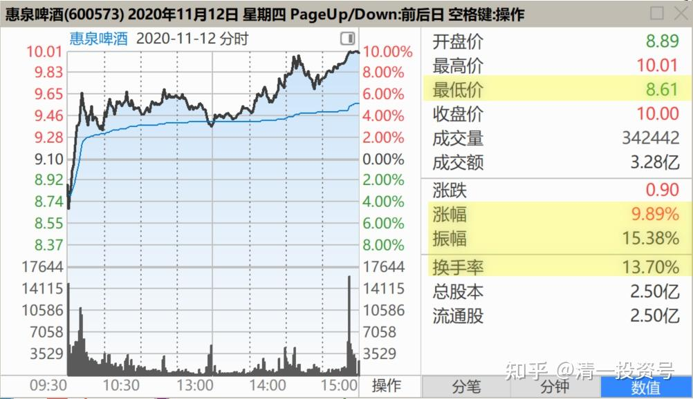
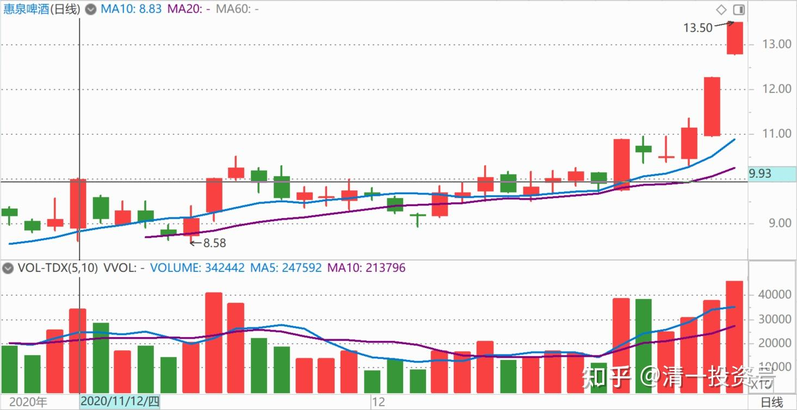

58篇.看股票就是跟人性作对

清一山长 2020-11-12 13:41

$惠泉啤酒(SH600573)$** 奉行过十元就不谈啤酒股的原则，也不示范我的啤酒股操作原则。**现在，珠江啤酒已经稳稳地过了10元，我就不点评珠江了。也不示范我的珠江买卖情况了。虽然我持有的珠江，比我当三大的惠泉还要多不少，珠江是目前我赚钱最多的股票，但我不多说她它了。只点评一下惠泉好了。因为看样子，惠泉过十元的日子也快到了。而且，惠泉啤酒给我创造的利润总值，好像已经超过燕京了。谁让燕京一脸死样子，就是不涨呢[俏皮]。但我相信燕京最终是不会让我失望的，将来它超过珠江，我一点也不奇怪。

今天惠泉低开，跌破9元到了不可思议的8.61元。如果这个价格能够维持，我会大买一气的。至少把涨停以上出掉的仓位买回来。可惜，很快就上去了。

为啥开盘会大幅低开？就因为今天要涨。**主力希望持仓的散户卖掉手中的筹码，所以要通过制造恐慌，让散户惊慌失措，急忙跑路，**主力拉升就把散户的筹码拿走了。前几天也不断有惠泉高开低走的图形，就是让你们聪明人做T的。但今天，你按昨天以前做T的方式，就T飞了。股价总是没有回调到你舒服的再次买入点就又上去了。

早市收盘的时候，股价突然下跌，从9.6元左右跌破了9.40元。其实在9.60元上下，是没有多少抛盘的，要拉上去很容易。不存在下压的压力。上午这个价格带，消化浮码情况良好。为啥不拉升呢？因为主力不想拉升，它还要你继续卖，所以就在收市前，打低股价。让你恐慌。下午，正常情况下，是应该会涨的。就算是今天不涨，一周内，也大概率是要涨的，要涨，就肯定是涨过十元了。所以，我今天静静地关注，看它怎样涨跌。**涨急了，我就卖掉。慢慢涨，我就不动。**

**“反者道之动。”看股票说起来并不难，就是跟人性作对。如果你吓得想卖的时候，就是你应该买进的时点；如果涨到你高高兴兴的，甚至懊悔自己买少了，恨不能追买一点的时候，就是卖点。永远与人性反着来，你就会赢。顺着走，你就会输。**这就是道家的智慧。道家说：“顺人逆己”——对外人，别人要什么，你就给什么。顺着大众的路子，支持大众。但对自己，恰好相反：自己想要什么，就一定反着做。**我买啤酒股，大家不想要的时候，我要；大家都想要的时候，我不要。**喝酒也一样：你们喝啤酒我喜欢，不反对你们喝。可我自己是不喝酒的，我只是买了很多酒股票。我跟人反向走。

我写完本贴，一看惠泉股价已经回来了，且创新高了——说明我上午对盘面的判断完全正确！这个价格，惠泉居然正在洗筹，吸筹。有意思！[俏皮]

[@](http://link.zhihu.com/?target=http%3A//xueqiu.com/n/%25E6%259E%259799)[林99](http://link.zhihu.com/?target=http%3A//xueqiu.com/n/%25E6%259E%259799)回复[@](http://link.zhihu.com/?target=http%3A//xueqiu.com/n/%25E8%258A%25B1%25E5%25BC%2580%25E5%25AF%258C%25E8%25B4%25B5wv3)[花开富贵wv3](http://link.zhihu.com/?target=http%3A//xueqiu.com/n/%25E8%258A%25B1%25E5%25BC%2580%25E5%25AF%258C%25E8%25B4%25B5wv3)：（跟评奉行十元不评）

瞎说，山长才不是8.07元成本，别误导其他人。

清一山长2020-11-12 20:54回复林99：

他说的也没错。我最新买入的这批惠泉，一共两百多万股，买入成本就差不多这个价。准确一点，是全部买入成本是8.11元（我的电脑上显示的买入成本）。但由于有些是8.13买的，有些是低于8.07买的。今天，我还卖掉了几十万股。成本进一步降低。现在的持仓，是一百多万股，依然留在十大里面。**持仓成本是0.8元！**你们就别跟我比成本了。，没法比的。

现在想追惠泉的，可以自己追去，为我抬轿，我自然不反对。未来惠泉如果跌到9元左右，我会继续买进我卖掉的部分，进一步降低持仓成本。至于10元多，我会干什么？如何买，如何卖？我就都不说了。这不归我说的[俏皮]。

(标题、图片为编者所加)

**文章音频**：

[436篇.看股票就是跟人性作对_清一投资号文章同步音频](http://link.zhihu.com/?target=https%3A//www.ximalaya.com/sound/723172307)

**参考链接：**

[50篇.惠泉股性活跃，喜欢刺激的人有福了](https://zhuanlan.zhihu.com/p/682717047)

[51篇.是风险赌博还是稳定投资？](https://zhuanlan.zhihu.com/p/684479170)

[52篇.惠泉、珠江、燕京的换手率](https://zhuanlan.zhihu.com/p/685682634)

[53篇.三只股轮动，谁涨停卖谁，谁跌停买谁](https://zhuanlan.zhihu.com/p/686904967)

[54篇.黑文滚滚或是粉红一片](https://zhuanlan.zhihu.com/p/687874750)

[55篇.啤酒行业，已经有大鳄进来了](https://zhuanlan.zhihu.com/p/689415289)

[56篇.高明的人，会用真实的事实来误导你的决策](https://zhuanlan.zhihu.com/p/690672420)

[57篇.持仓，减仓，长期持有](https://zhuanlan.zhihu.com/p/691822907)
