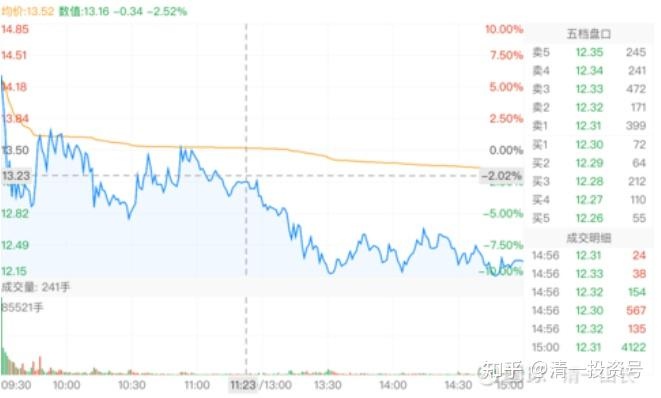
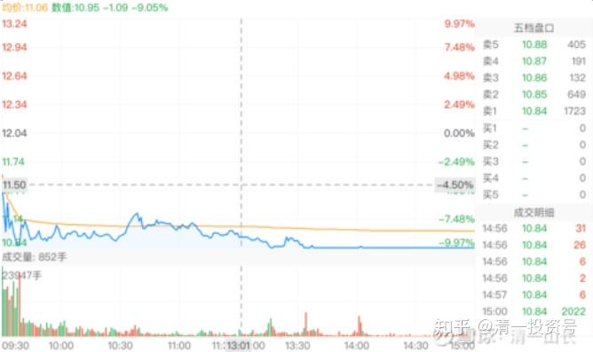
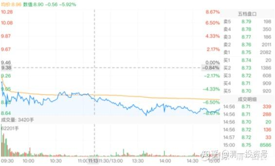
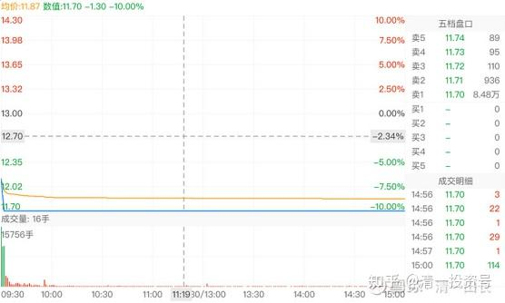
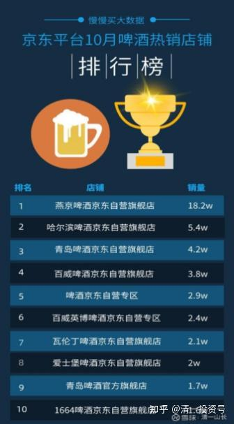
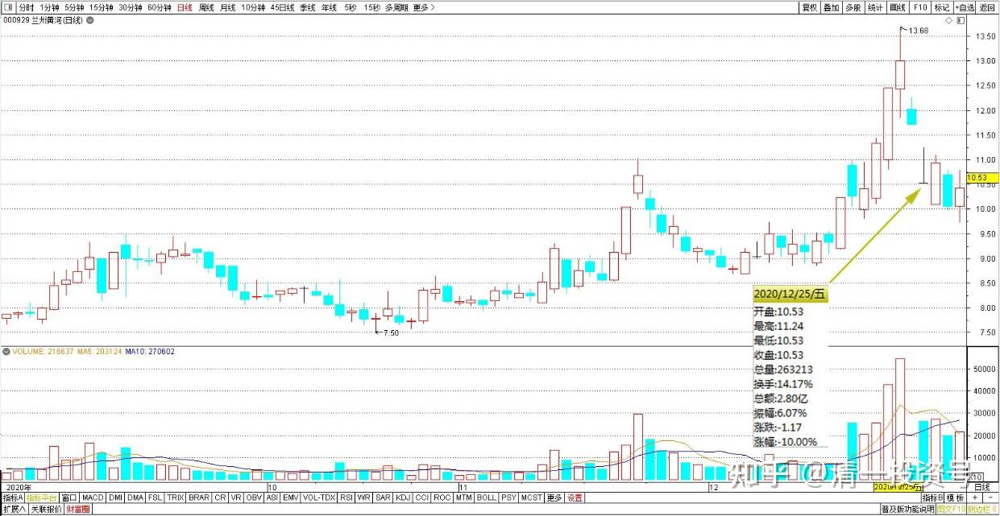
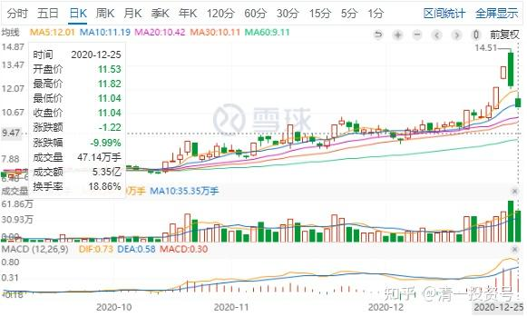
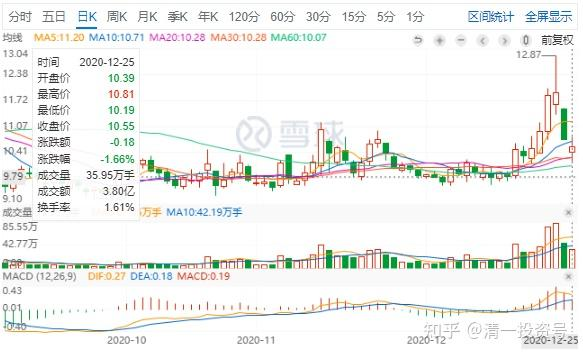
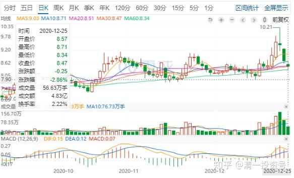

5篇.四大最庄家评比：最佳，最傻，最阴险，最无为

清一山长2020年12月24日

**一、出题**

[清一山长](http://link.zhihu.com/?target=https%3A//xueqiu.com/9310099567)[2020-12-24 16:08](http://link.zhihu.com/?target=https%3A//xueqiu.com/9310099567/166631231)

[$惠泉啤酒(SH600573)$](http://link.zhihu.com/?target=http%3A//xueqiu.com/S/SH600573)猜猜看，啤酒股，谁才是最惨的？哪只啤酒庄家套住了散户？哪只啤酒的庄家，反而被散户给闷了？因为现在是退潮时刻，今天我的市值损失超千万。但我看到有人已经裸泳了[大笑]！比我可要惨多了[哭泣]，几个亿砸进去都出不来了。太同情了！

你们自己猜猜玩，谁猜得好的，被点赞最多的帖子，我明天就按照你的回复的点赞数发打赏。来股市，丢了钱也要开开心心的。没事找点事穷作乐一下吧[大笑]。我今天丢了钱比你们都多，不过我也多买了股进来，心里也没觉得亏了啥！大家猜猜玩吧！

1、惠泉啤酒：成交量：8.21亿。

2、珠江啤酒：成交5.32亿。

3、燕京啤酒：成交量9.04亿。

4、兰州黄河：7303万。参考数据；昨天的成交，是7.04亿！前天成交5.02亿。总市值21亿。

周末游戏，看图说话，我们来一起评选：谁是啤酒股四大醉股里面的最佳庄家、最傻庄家、最阴险的庄家！

1、谁是坐庄做得最好，在大跌中让散户们纷纷涌进去买股，替庄家挡子弹，持股站岗的“最佳庄家”？

2、谁是坐庄做得最傻，富二代出来坐庄，毫无技术含量，只会用钱傻拉一气，自己对倒来制造虚假人气，妄图套住散户，结果最终把自己给套住了的傻庄？

3、谁是今天在借机洗盘，震仓，妄图把散户们吓跑，自己继续吸货的最狠毒、最阴险的庄家？

4、谁是无为而治，随波逐流，不显山，不露水的庄家？庄家之王？

请朋友们留下帖子，写出您的看盘心得。看您看到了多少“庄家的奥秘”。这是我们【清一技术分析课堂】的实战应用课。写得好的帖子，得到各位点赞数多的帖子，都可以得到我的打赏。根据您的点赞数量来打赏。这两天涨了，朋友们给了我不少打赏。现在跌了，我就再找个法儿用出来吧！[大笑]

对不对无所谓，都瞎猜。也许我们这群人就蒙对了呢？以后验证了，留个好玩的故事，讲给后人听。

**二、分析**

[清一山长](http://link.zhihu.com/?target=https%3A//xueqiu.com/9310099567)[2020-12-24 16:33](http://link.zhihu.com/?target=https%3A//xueqiu.com/9310099567/166640346)

[$燕京啤酒(SZ000729)$](http://link.zhihu.com/?target=http%3A//xueqiu.com/S/SZ000729)燕京很可能交出历年来四季度业绩最靓丽的财报，此消息将引爆燕京。因为原来的燕京，四季度一向是狂亏的，往往会把半年的利润都全亏掉。全年利润看上去一直很可怜。但今年，燕京一反常态，冬季销售做得很好，而且大量推广到了南方地区，很有可能燕京的四季报是同比增长最大的亮点。特别是燕京狂推网上销售，打破了啤酒企业的地域垄断。今年网上销售力压青岛啤酒，京东销量是青岛的四倍。

燕京超过青岛并不稀奇。历史上，很长时间燕京是中国的啤酒第一名，连续八年，销量是超过青岛啤酒的。燕京是后来不思进取，青岛又竭力追赶，华润大玩资本并购，又用价格战掠夺其他啤酒企业的市场，燕京才变成“老三”的。现在的燕京，似乎已经开始重整雄风，再度起飞了。我认为重阳系，就是冲着这个“重构市场”的机会来的。重阳大量买入燕京的野心，绝不仅仅拿一点点小利润就跑的。如果燕京能够“再度的重整雄风”，你们可以想象未来的空间会有多大。

退一万步说：就算是固步自封，燕京就只能当老三，但它的市值，也不至于连珠江都不如。它的销量是珠江的三倍。燕京旗下的广西漓泉啤酒，一家公司就差不多就可以获得与珠江相当的利润。燕京的主品牌，其实是亏损的，靠漓泉的利润来补贴的。今年，燕京的主品牌发力，抢夺是其他的品牌。一旦主品牌不但扭亏，甚至盈利，燕京的空间将有多大？肯定不是珠江能够比的。

当然，珠江也有珠江的优势，珠江的股权结构，非常类似重庆啤酒。也是外资大品牌控股的公司。要搞点“洋玩意”，珠江天然的有优势。珠江的底子，绝对不比重庆啤酒差。所以，燕京、珠江，是我拿得最心安的股票。惠泉啤酒，我持有量最少，拿的理由，就是看到有庄家在里面。跟庄起舞很好玩，就拿了2M多玩玩。的确利润丰厚，感谢庄家。但我押宝，还是押燕京和珠江。惠泉，我就怕庄家把我闷进去了，所以遇到高点就走，低点才上，来回赚点小钱就行了。

不说了，上数据。免得各位以为我只会技术面。这些基本面的分析，都是实实在在的数据支撑的，不是拍脑袋乱想的。

大数据监测的2020年10月京东平台“啤酒”类目销量数据出炉！

销量排名情况如下：

不同于9月，在京东平台，燕京品牌超越了一直以来霸占第一位的青岛啤酒，以18.3万+的月销量成为“啤酒”热销品牌榜中的第一名。青岛啤酒屈居第二，月销量为7.2万+。哈尔滨牌在10月份也有比较好的表现，销量排名仅次于青岛，月销量为5.4万件。百威和福佳则分别位于第4和第5，月销量分别为4.4万和2.9万。

而**从月销额看，燕京的月销额依然位列第一，虽然青岛啤酒、哈尔滨牌等品牌已经奋力赶超，但还是与燕京差距甚大。**

**三、答案揭晓**

[清一山长](http://link.zhihu.com/?target=https%3A//xueqiu.com/9310099567)[2020-12-25 10:34](http://link.zhihu.com/?target=https%3A//xueqiu.com/9310099567/166702131)

打赏金刚才已发了。祝福获得了打赏的十位参与者。也祝福其他一起参与的朋友。在这个惠泉冲击跌停，黄河封死跌停，燕京和珠江啤酒均下跌的圣诞节。我们用自己的啤酒玩笑，来庆祝我们的节日。

**下跌是一件很美妙的事情，让我们可以增加仓位。上涨也是一件很美妙的事情，可以让我们增加资产。上涨赚钱，下跌赚股。**

所以，无论上涨还是下跌，我们都要给自己留下转圜的余地，都可以让自己心情很快乐。虽然我的账户“蒸发”了超过千万，但我不仅一股未少，反而增加了不少持仓。这并不是真正的亏损，反而带来了将来更大的盈利可能。但如果你买了经营不善，注定亏损的企业，这才是真正的亏损。只要是买了不断进步的企业，涨涨跌跌，没啥可怕的。最多我们输时间，不输钱。所以我强调价值投机——在企业有价值的基础上进行投机。黄河这样的企业，我看盘看得再清楚，我都不玩的。因为企业的底子太差，我不知道会有啥后果。赚了是运气，赔了是正常。万一我就是被闷的那个人呢？

好的，现在揭晓答案：

**1、最成功的庄家**

最成功的庄家，我认为是黄河。它只是看起来很傻。今天两个跌停了，今天的跌停。还只有一千多万的成交，似乎已经被闷了。与两天前7个多亿相比，完全是天下地下。为啥说它可能是“最成功的庄家”？因为他也有可能，把筹码已经尽可能交给了散户，无法完全排除这种可能。

第一：前几天，每天成交额度，几乎是超过了流动盘的一半。说明庄家已经控股，而且是大进大出，完全是庄家对倒也不像的。因为12月17日开始涨停，但量不大，说明抛盘并不多。第二天调整，第三天继续涨停，连续三天，量都不大，但这三天，可能是庄家吸筹，把浮动筹码都吸光了。接下来两天，涨停以及三天前的冲高回落，这一天量很大，达到了总市值的三分之一。该参与的都参与了。我相信追逐热点的散户被带进来不少，我认为大量的筹码已经派发给了散户，何以见得？昨天盘面上8千多万股的压盘，太多了。**如果是庄家的筹码被套，为了不给市场造成压力，会减少压盘，反正也卖不出去**。就像珠江跌停一样。没多少筹码，才会有人敢抢货，抢一点，他卖一点。一把梭哈全压上去，像是**散户的思维：我要走，不管别人走不走，结果大家都走不掉**。当然，昨天未必全是散户的压盘，估计庄家先压盘，散户跟。今天压盘就少了三千多万股。也许今天庄家没有压盘，甚至可能破板。

我认为：如果我的判断是对的，下周最跌到9元区后，黄河就可能来个反转行情（刚才看了一下，黄河已经破板，但只有一个多亿成交，有点不解，比我想象的早，说明庄家介入还比较深，不够成功派发筹码）

黄河庄家只有一个最可笑的可能，就是钱太多，一个劲买买买，结果买死了自己（散户有钱的时候，就是买买买的。没钱只会卖卖卖）。但从盘面来看，他坐庄是有进有出的，而且是大进大出的，除非一个可能，全是他自己对倒的，否则就不会套住他。有没有这种可能呢？其实不可能。因为如果他真的是对倒的，昨天大跌，他可以不跌的。因为筹码全在他手里，昨天这个架势，肯定出不了货的。庄家不如再多对倒一天，维持强势盘面，或者学惠泉，先拉升在慢慢的出货，这样吸引的跟风盘最多。一开盘就封死跌停，恐慌情绪蔓延，把自己的退路全部封杀，这不符合庄家持仓的逻辑。显然是庄家前一天已经成功撤退，不在乎盘面表现的标记。

所以，**最多只有不到10%的可能，是傻庄。90%的可能，黄河是聪明的狠角色！**是成功套住了散户的庄。而且庄还没有走，还在里面，因为7个亿的拉升，他的货不可能全出来的。只是利润已经大笔到手，后面应该借助恐慌杀跌，再次进场。坐庄不可能这么快就出掉的，也不可能都拿在手里。除非太傻太傻！

至于什么可能性是真的？就等以后看盘面的走势了。今天就破板，让我上面的判断有些不对劲。今天封死跌停，才最符合庄家的愿望。除非庄家为了保护人气，出来维持。

兰州黄河2020年12月25日前后日线图

**2、最聪明的庄家**

最聪明的庄家，是惠泉！这几天不断涨停，肯定吃了不少货，不可避免的。虽然盘中他肯定一路买，一路卖（这是坐庄人与普通散户最大的不同，他们会在盘中高买，低卖）。但昨天一看趋势不对，要回调了，他居然拉高回调，摆出一副强势股的架势，吸引跟风盘，显然策略很成功。昨天成交量大增，很多人都冲进去了。成交额超过总流动值的一大半。盘面上看图，是**典型的的出货手法。急涨，慢跌，一路走低。**

所以我判断他已经成功出逃。其实从今天的盘面来看，也证实了惠泉主力昨天的确是成功高价出逃了。所以，今天一开始，就毫不客气地打压至跌停位。想想看：昨天这么大跌的局面，惠泉都没有跌停，今天至于来玩跌停的游戏吗？不就是昨天出完了，今天故意跌停，试图打压进货吗？但一看接盘强，他也不勉强压跌停位，顺手拉起来，证明惠泉的主力也不想破坏趋势，维护图形，维护人气，维护得很好，后期还有良好表现。

所以，操盘最好，**最聪明的庄家，是惠泉**。

惠泉啤酒 2020年10月至12月25日日K线图

**3、最阴险的庄家**

最阴险的庄家，是珠江。昨天根本没必要跌停的，它的成交量也是最少的，但它的市值是惠泉的10倍，成交是惠泉的二分之一，你就知道差距了。其实它根本就没啥抛压的压力。主力根本这个价格就是进货价附近（珠江从13元调整以来，主力重新进驻的进货价格，均价不低于10元）。但昨天急乎乎的上午就冲跌停价。而明显又不想多卖的样子（实话实说，昨天我在跌停价，买了超过百万股珠江进来）。收盘就十几万股压在跌停盘价。谁都可以一把吃掉。为啥就是压住不放？**希望散户记住和恐慌——跌停了，快跑呀！**还要为今天早上的下跌找理由的。其实这压盘十几万股，就说明庄家不想卖，怕来个有实力的人，一把吃了，抢庄就成功了。今天开盘，还继续往下打5%，算是预料之中。

珠江为啥在没必要打压盘面的时候，依然要拼命打压，就只能说明：珠江的主力，现在还不想涨，还想打压进货，多要一点货。这叫借势打压，乱中取胜，让你吓昏了头乱跑，主力就轻轻松松的把你的宝贵筹码纳入囊中了。这才会出现昨天、今天这样刻意的做作行为。我12元卖出的人，我怕谁？当然10元多我就照单全买了。其实昨天记得涨停是我打下来的吗？我的单子一放上去，就见主力快速撤单，然后破板[吐血]。说明他就不想要。所以，他12元不想要货，什么时候要？答案已经出来了，10元多，他想要。昨天今天就是他想要货。你想要，我也想，跟你一起抢。你不要？我也不要，我就倒给你。

**舍己从人。“粘连随，不丢顶”，是本派的武道秘诀，做事也一样的。这才是跟庄绝技！**

珠江啤酒2020年10月至12月25日日K线图

**4、最难磨的庄家**

至于**燕京：更厉害了，跟随大势，随波逐流，一路派发，痕迹都没有就完成了套住散户的任务。最会借力借势调整。是最难琢磨的庄家！**只能忍住等，总有一天会涨停吧？只要你涨停，我至少送两百万股给你作为献礼的礼物[大笑]，别担心买不到货[俏皮]

燕京啤酒2020年10月至12月25日日K线图

点评完毕！

**四、附录高点赞群友的回答（按点赞数字打赏）**

**1、¥80.00打赏回答**

[NETC](http://link.zhihu.com/?target=http%3A//xueqiu.com/n/NETC):回复[清一山长](http://link.zhihu.com/?target=http%3A//xueqiu.com/n/%25E6%25B8%2585%25E4%25B8%2580%25E5%25B1%25B1%25E9%2595%25BF):两天的成交额上来看:

惠泉:6.15亿和8.2亿。是近期啤酒股涨停次数最多，交投活跃，庄家和散户玩的上上下下，如漆似胶。今天成交超过昨天30%，今天啤酒股大跌中散户们依然纷纷献身，涌进去买股，替庄家站岗，人气最旺，最佳庄家。

燕京:15.2亿和9亿。是近期啤酒股里从来没封过涨停，走势随波逐流，显得很怂，很无能，不显山，不露水的庄家。

珠江:10.4亿和5.34亿。前期横盘不涨，最近啤酒耍酒疯，借机也跟随拉升，昨天股价从最高涨停到收盘只是微升，套牢大批人马，今天在借机洗盘，跌停震仓，继续制造恐慌，把散户们吓跑，自己低位继续吸货，最阴险的庄家。

兰州:7.04亿和0.73亿，这几天，庄家用钱傻拉一气，成交一天比一天大，制造虚假人气，妄图套住散户，今天只成交昨天的十分之一，从昨天的沸点直接进入冰点，直接被冰封、闷杀，结果最终把自己给套住，人傻钱多，最傻庄。

**2、¥60.00打赏回答**

[蛰伏2020](http://link.zhihu.com/?target=http%3A//xueqiu.com/n/%25E8%259B%25B0%25E4%25BC%258F2020)回复[清一山长](http://link.zhihu.com/?target=http%3A//xueqiu.com/n/%25E6%25B8%2585%25E4%25B8%2580%25E5%25B1%25B1%25E9%2595%25BF)：参与山长的游戏找找乐子：

1惠泉啤酒控盘最好，盘子小不会倒业绩靓线最美；

2兰州黄河把自己给套了，激进派无靠山无业绩都是荷尔蒙；

3珠江啤酒筹码未够，第一阶段走完后时间调整充分并借机洗盘，准备第二阶段，盘子适中靠山坚强业绩里啤酒最靓的仔，欲擒故纵；

4燕京啤酒无为而治，不想筹热闹被迫拉进来充人气，低估明显靠山无敌，盘子适中筹码稀少，好牌一手手不愿露半手，3年来用一句话可以描述完整：“我很烂我很颓我也没有办法。”

**3、¥46.00打赏回答**

[迷财道](http://link.zhihu.com/?target=http%3A//xueqiu.com/n/%25E8%25BF%25B7%25E8%25B4%25A2%25E9%2581%2593)回复[清一山长](http://link.zhihu.com/?target=http%3A//xueqiu.com/n/%25E6%25B8%2585%25E4%25B8%2580%25E5%25B1%25B1%25E9%2595%25BF)：惠泉拉高散套牢，黄庄反被散户套，珠江毒辣讹血筹，燕京随波逐流摇。啤酒板块从整体看，这一波才开始，作为消费板块，品牌集中度高，长线看好。

惠泉主力以小博大，首战告捷，不可能收手的。

黄庄也会继续为啤酒板块带来欢乐和热度，主力也只是暂时被套，毕竟新韭菜层出不穷，只要咬咬牙，黄庄一样能解套。黄河啤酒在兰州还是有市场的，2006年我在兰州摆啤酒摊子，黄河啤酒还有五泉啤酒，依然是兰州老百姓的首选。

珠江，本来就一枝独秀，前段时间等等后来者，现在都起来了，又可以兴风作浪。

燕京，骨子里天子命，韬光养晦，东山再起，指日可待。什么庄，操什么票。

**4、¥34打赏回答**

[ganen感恩一切](http://link.zhihu.com/?target=http%3A//xueqiu.com/n/ganen%25E6%2584%259F%25E6%2581%25A9%25E4%25B8%2580%25E5%2588%2587) [六月dek](http://link.zhihu.com/?target=http%3A//xueqiu.com/n/%25E5%2585%25AD%25E6%259C%2588dek)回复清一山长：

1、惠泉2、兰州黄河3、珠江4、燕京

**5、¥30.00打赏回答**

[老韭不再菜](http://link.zhihu.com/?target=http%3A//xueqiu.com/n/%25E8%2580%2581%25E9%259F%25AD%25E4%25B8%258D%25E5%2586%258D%25E8%258F%259C)回复[清一山长](http://link.zhihu.com/?target=http%3A//xueqiu.com/n/%25E6%25B8%2585%25E4%25B8%2580%25E5%25B1%25B1%25E9%2595%25BF)：

我从成交量和换手率来蒙：

1、惠泉今天成交超过8个亿，换手近25%，这个应该是最好的庄家，上午冲涨停，吸引散户抢货，之后放量下跌，然后又翻红，都是在诱多，让散户帮忙挡子弹。

2、最傻的是兰州黄河，拉涨的时候成交量很大，两天换手50%以上，今天下跌换手只有3%,跌停价只成交了这点，庄家根本出不来，这应该是最傻的庄，之前对倒，现在自己被套。

3、洗盘震仓的应该是珠江，因为从上午开盘就直奔跌停，可就不跌停，反而一直吃货，下午跌停后，还有大单吃货，这么猜的话，珠江应该是震仓洗盘，是最阴险的庄家。

4、随波逐流的一定是燕京，大家涨它也涨，别人涨停，它只涨6-8%,换手率基本在5%-6%，别人跌停，它跌7%多一点，换手率不到5%，我猜最牛的庄家是燕京。

**6、¥26.00打赏回答**

[财务自由ontheway](http://link.zhihu.com/?target=http%3A//xueqiu.com/n/%25E8%25B4%25A2%25E5%258A%25A1%25E8%2587%25AA%25E7%2594%25B1ontheway)回复[清一山长](http://link.zhihu.com/?target=http%3A//xueqiu.com/n/%25E6%25B8%2585%25E4%25B8%2580%25E5%25B1%25B1%25E9%2595%25BF)：

1.惠泉；2.兰州黄河；3.珠江；4.燕京。

看了大家评论，分歧大的是3和4.

为什么个人认为最阴险的是珠江，因为珠江从技术上来看处于上涨中，今天突然来个跌停，让人认为上涨结束，技术派纷纷出逃。并且结合前两年的历史来看珠江是调整最久、最出人意料，最磨人的股票。

燕京庄家最无为，前几天的上涨是在酒类狂欢的大背景下，散户看好买入，庄家也顺势买入推动燕京稳步上涨，今天的下跌也是在酒类狂跌的恐怖氛围下，主力并没有像珠江那样跌停制造恐怖气氛，而只是一个较大的下跌。

**参考链接：**

[清一投资号：1篇.涨停之际，谈我的啤酒股投资逻辑](https://zhuanlan.zhihu.com/p/477911616)（整理文）

[清一投资号：2篇.庄家入住操盘四个阶段](https://zhuanlan.zhihu.com/p/477773067)（整理文）

[清一投资号：3篇.基本面判断：抱住不放](https://zhuanlan.zhihu.com/p/507194954)（整理文）

[清一投资号：4篇.中国啤酒业将迎来困境反转？](https://zhuanlan.zhihu.com/p/517340065)（整理文）

