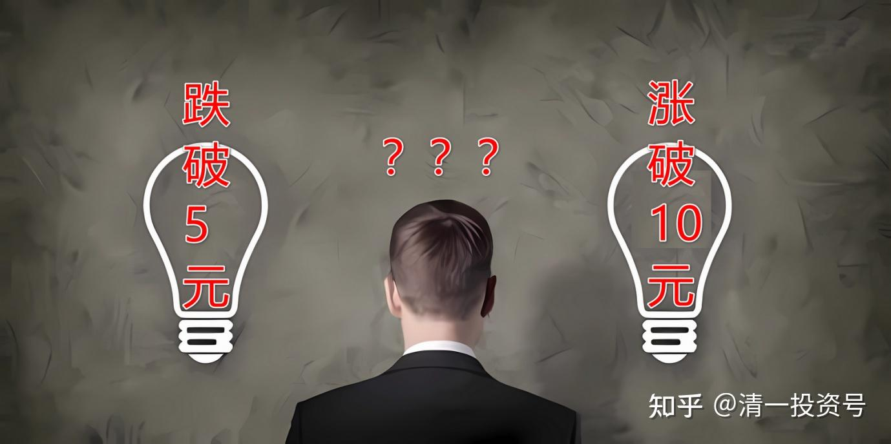

60篇.跌破5元的可能和上涨破10元的可能

清一山长2020-11-11 11:27

$燕京啤酒(SZ000729)$ 今天还想开盘8元拿点货的，居然马上就涨了，就算了，反正手上也不少了。

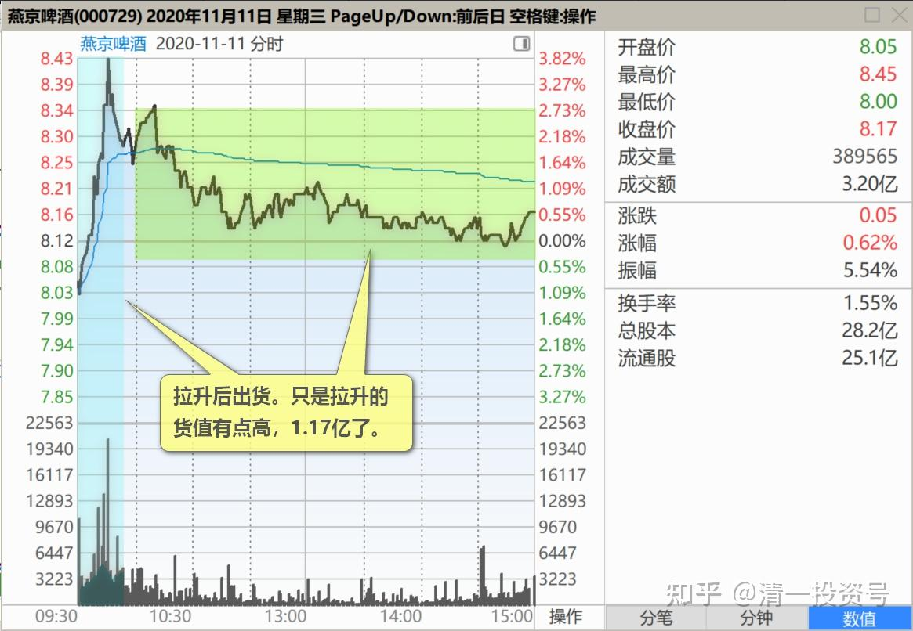

重阳又减持，今天居然不给面子大跌一波？真不够意思，反而涨了？这样操作不错，更像是主力出货的模式。拉升后出货，只是拉升的货值有点高，1.17亿了。高价买，低价卖？值吗？难道是重阳，真的要减持进5%以内吗？今后好彻底地减掉燕京的仓位，清仓燕京，退出啤酒行业？如果这样，燕京以后会跌跌不休吗？今天一早大幅拉涨，看样子要接昨天的架势，急涨慢跌，走出出货的图形。真出，假出？我就慢慢看吧！

我只是奇怪，**两年前，燕京基本面差到没法说的时候，重阳进入大买。今年一季度，燕京这么差，重阳依然大买。但今年二季度、三季度，燕京的业绩明显改善了，重阳却要公然退出了。**是他的大脑犯了病，还是看到了我们没有看到的燕京的弊端？董事长抓了，燕京就要垮了吗？我等小人物，就不知道这些内情了。“富贵险中求”，看起来，处处是风险的燕京，会带来富贵吗？还是带来贫穷呢？这真是一个问题[俏皮]。结论，个人自己决定吧！反正，**如果燕京继续跌，我会继续买的！涨了我就看着不动！直到出现切换股的机会。或者是卖出减仓的机会（10元以上，我才考虑减仓问题）。**

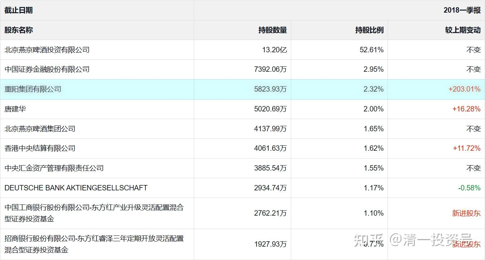

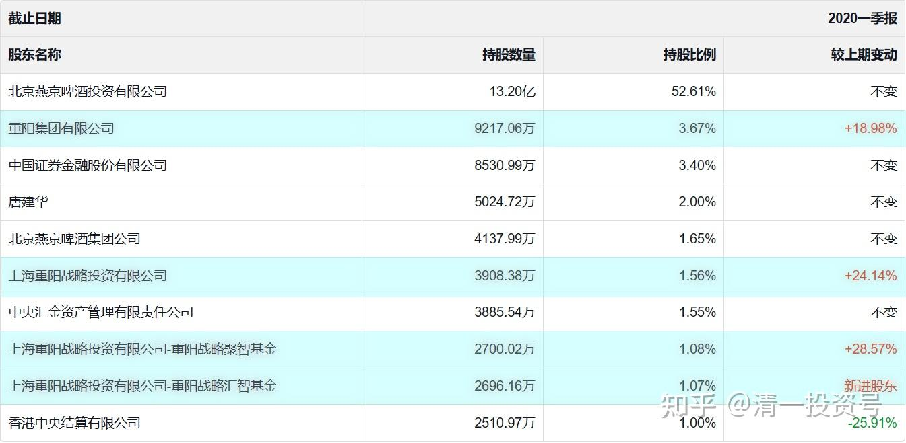

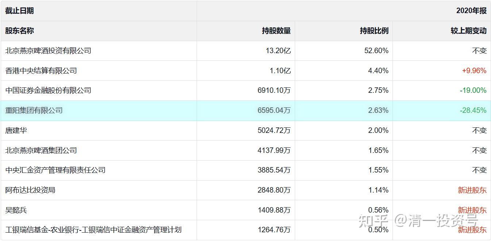

某球友：

今天燕京啤酒用实际行动狠狠地打了我的脸，昨天减仓到只剩利润了，今天啤酒股狂欢，我换到的中建今天卧倒了，修炼不够只能这样了，有赚就好，努力学习。

清一山长2020-11-12 21:16评论上贴

您正好跟我做反了[大笑]。**昨天燕京下午一直跌，我买燕京买到都没钱了，就卖了一百万股中建，腾资金出来来继续买，买了接近两百万股燕京。**现在，正在想找机会买回中建来呢！昨天燕京最低价是8.11元买入的。不过，由于容易让人误解我看不上中建，就没分享出来。**中建是我的资金库，**钱实在不够用的时候，就换一点出来。赚了钱，我又继续存进去。算是保险股。

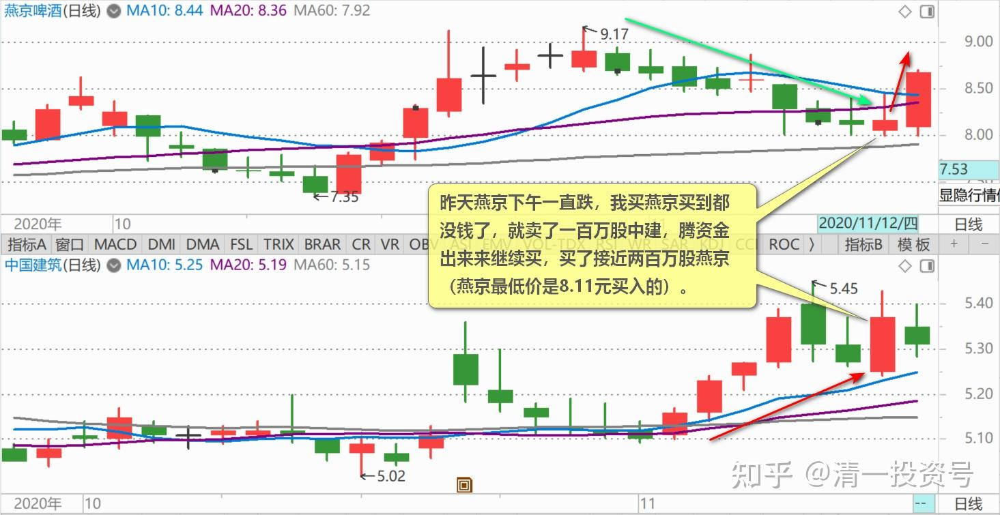

清一山长2020-11-12 21:34

**中建的内在价值，肯定是在燕京之上，长期回报率会比燕京高。**两者这样换股，肯定是错的。特别是现价的啤酒，内在价值，是远远比不上中建的。只是啤酒在风口上罢了，我只是玩的投机，很快会买回来的。不推荐你们模仿，你们别跟学。这种钱，就算赚了钱，也是错误的操作。只有对趋势、时机、股性都把握得特别好的人，才能偶尔做一做，其他人不要模仿。

清一山长2020-11-13 15:23

$燕京啤酒(SZ000729)$ 今天在7.86元和7.88元之间买进燕京，每单10万股，吃掉了就加上去。

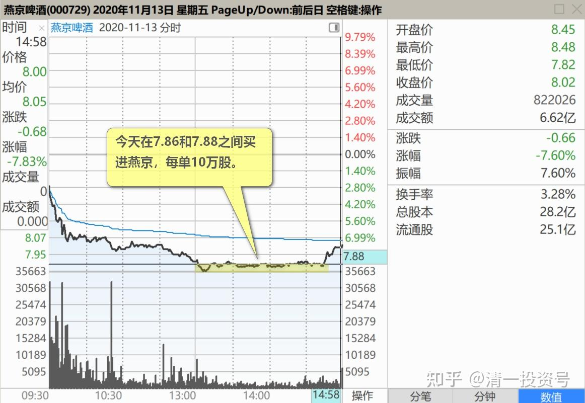

今天我的账面损失颇大，但昨天的卖出，让我获得了差不多80万元的差价。（注：清一山长 2020-11-12——我最新买入的这批惠泉，一共两百多万股，买入成本就差不多这个价。准确一点，是全部买入成本是8.11元（我的电脑上显示的买入成本）。但由于有些是8.13买的，有些是低于8.07买的。今天，我还卖掉了几十万股。成本进一步降低。详见《58篇.看股票就是跟人性作对》）我算是给我的1500万资金一年的利息挣回来了。未来是零利息持股1500万一年。我只要保持手里的股份不少就好了。所以，尽管今天账面大跌了，心里面，还是比较高兴的大笑。我今天最奇怪的是：昨天来抢筹的这伙人，今天怎么样了？他们才是抢了个高价被闷了，我无非是回到前天的状态罢了。今天的成交也异常的高，难道是昨天抢进的人，今天跑路了吗？答案我都不知道。

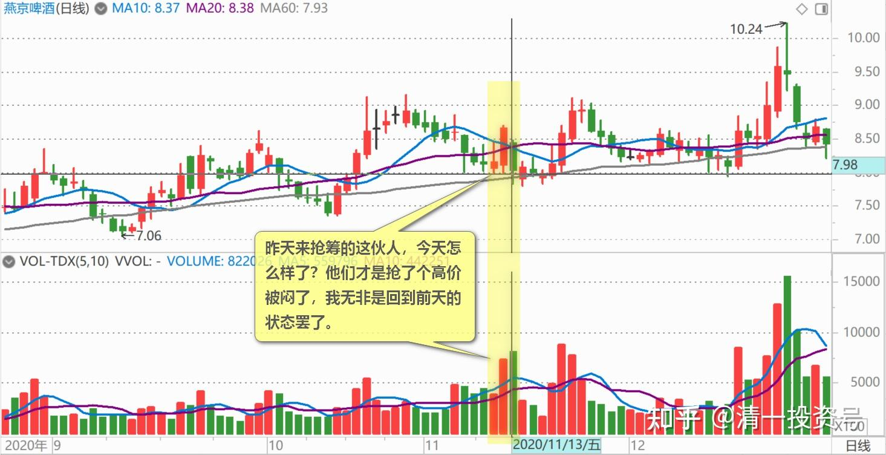

我只知道认死理**：燕京目前的价格，也不过是14来年的中位数。往下跌破五元的可能性几乎没有，往上涨破10元的可能性很大。**所以，傻傻地持有算了。

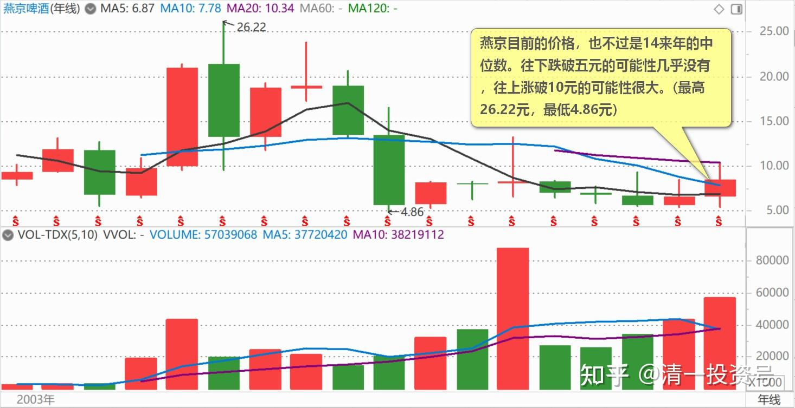

未来股性最活的，应该是珠江、惠泉。惠泉今日买进了，珠江昨天和今天的操作都不谈。只是你们看盘面，珠江的买卖单子都很稀少，几千股就来玩了。比市值小它十倍的惠泉都少。燕京的单子最雄壮，盘面上满是万股，十万股的单子，看起来交易者热闹得多。

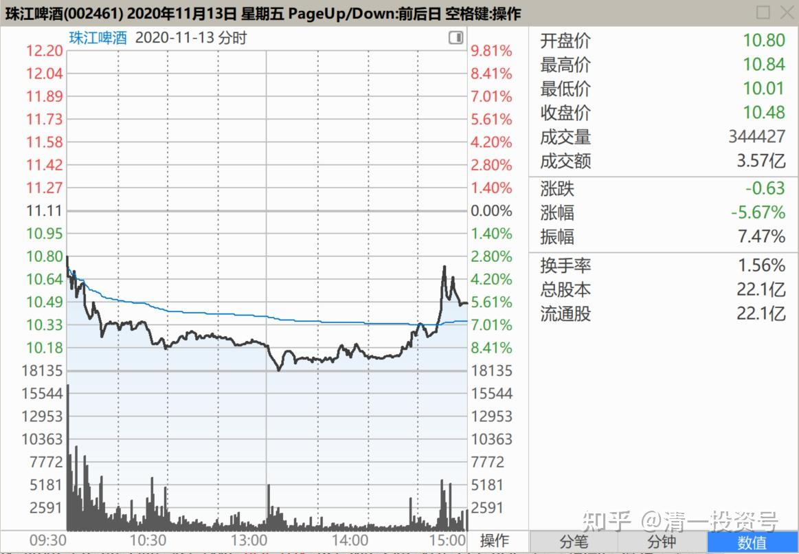

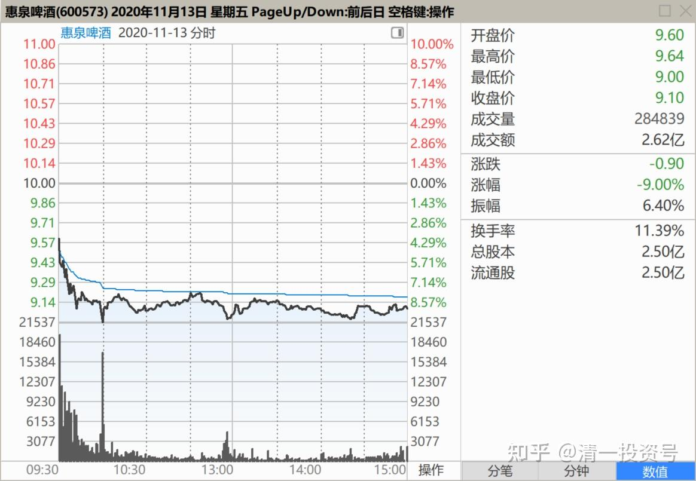

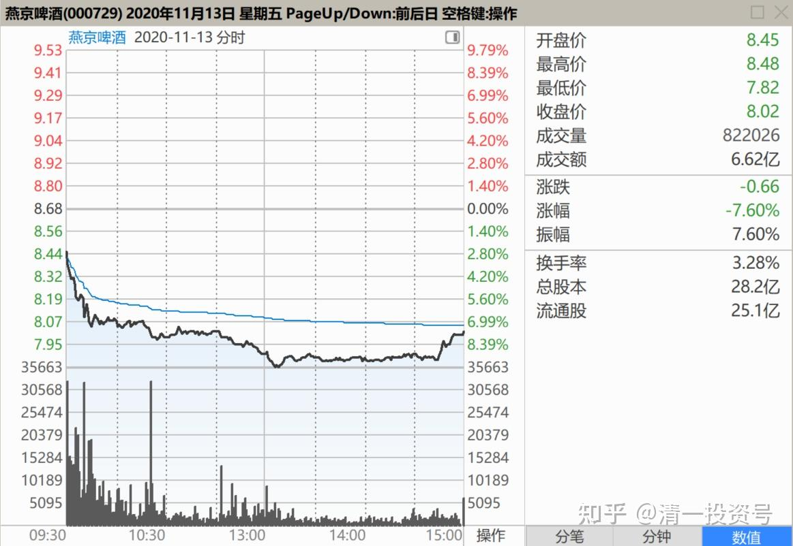

不过珠江啤酒股东人数，也就两三万，比燕京五万人，还是要少很多。所以，成交清淡一些很正常。

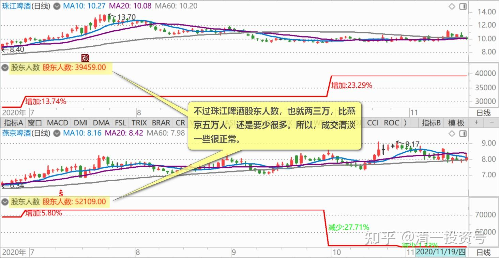

(标题、图片为编者所加)

**文章音频**：

[跌破5元的可能和上涨破10元的可能_清一投资号文章同步音频](http://link.zhihu.com/?target=https%3A//www.ximalaya.com/sound/726923190)

**参考链接：**

[55篇.啤酒行业，已经有大鳄进来了](https://zhuanlan.zhihu.com/p/689415289)

[56篇.高明的人，会用真实的事实来误导你的决策](https://zhuanlan.zhihu.com/p/690672420)

[57篇.持仓，减仓，长期持有](https://zhuanlan.zhihu.com/p/691822907)

[58篇.看股票就是跟人性作对](https://zhuanlan.zhihu.com/p/693094564)

[59篇.是主力换庄，还是野蛮人抢筹](https://zhuanlan.zhihu.com/p/694396823)
