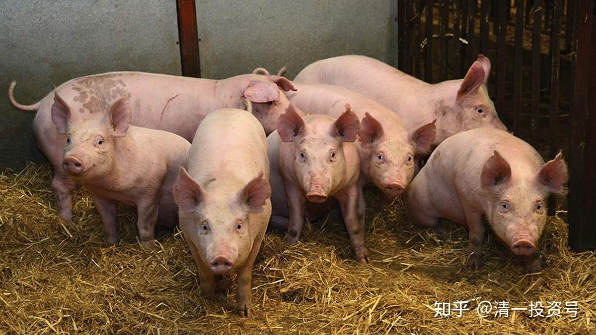
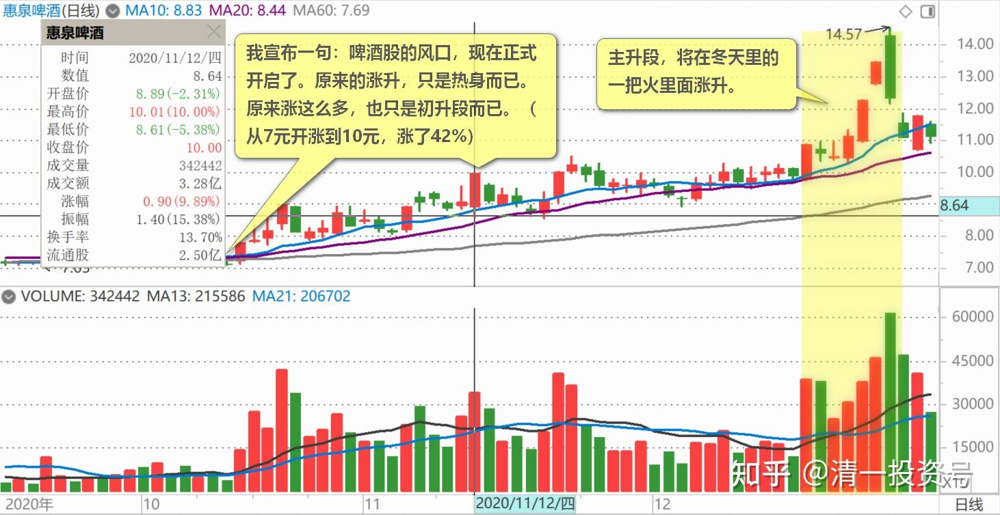
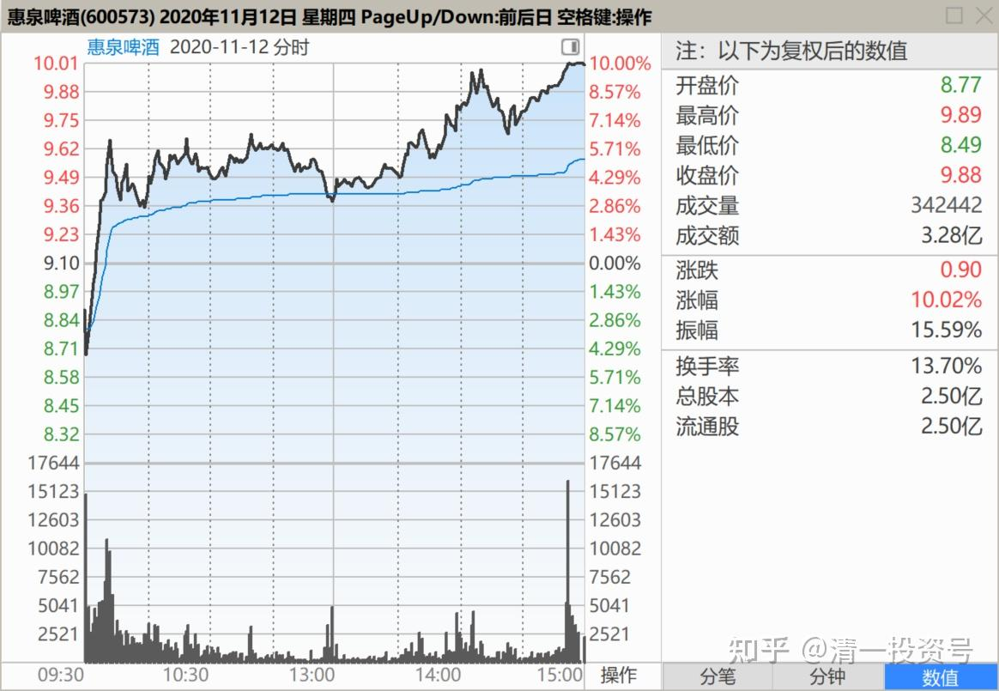
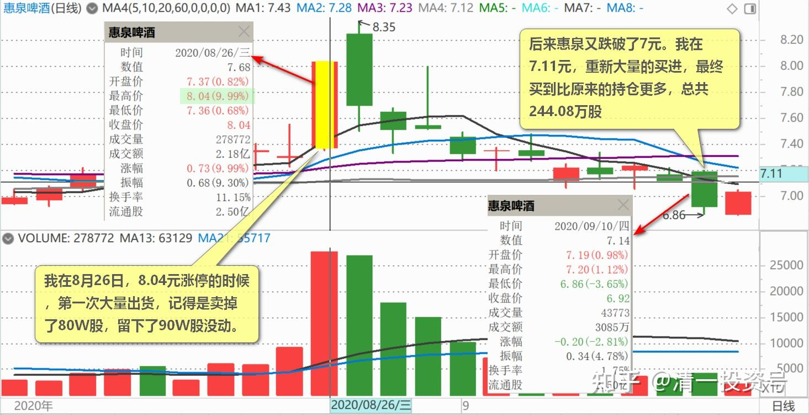
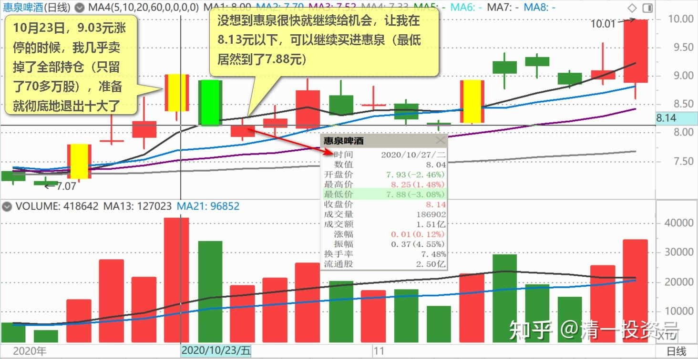
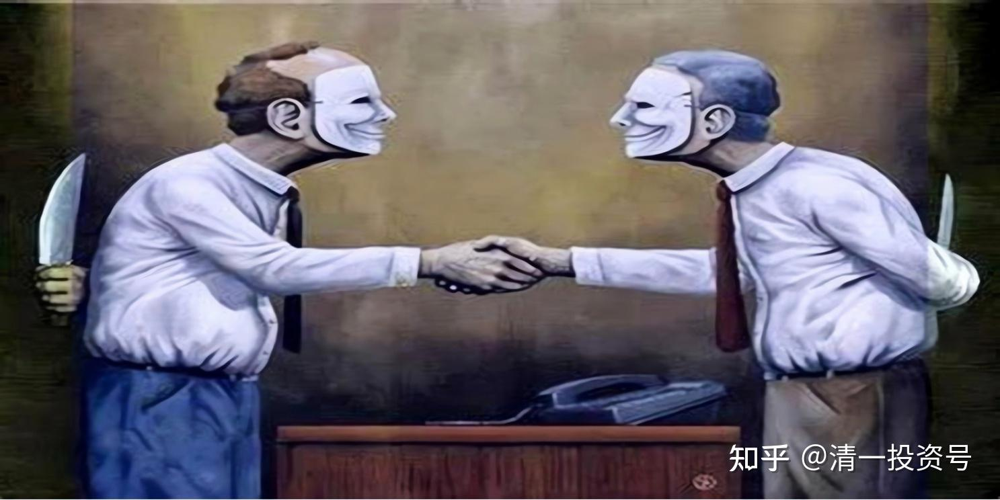
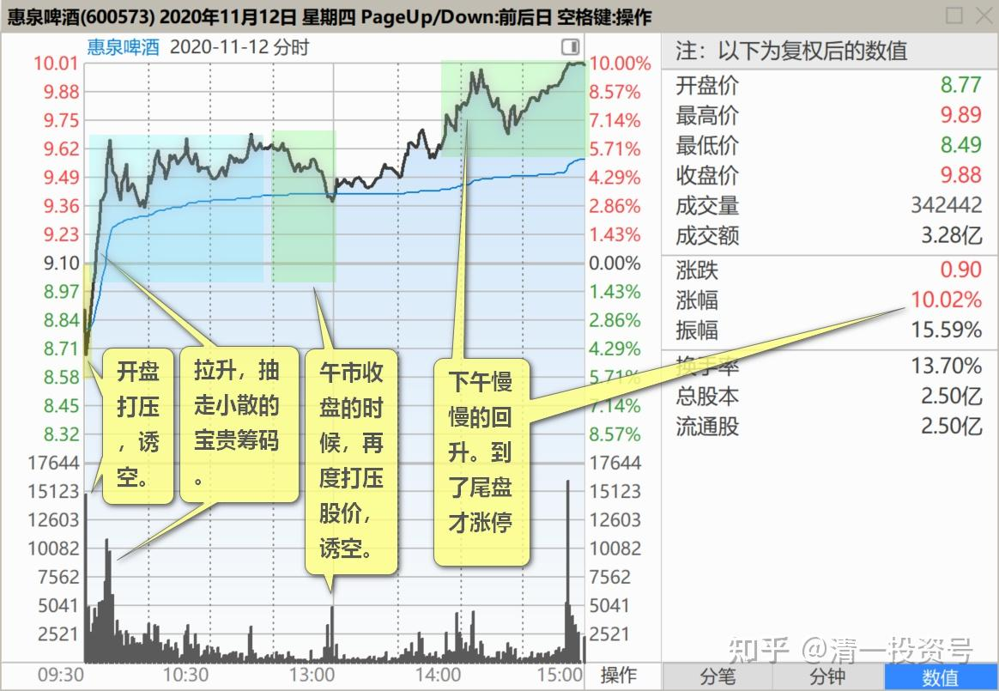

61篇.养人、养股的阶段

清一山长2020-11-12 16:45

$惠泉啤酒(SH600573)$ **我宣布一句：啤酒股的风口，现在正式开启了。**原来的涨升，只是热身而已。原来涨这么多，也只是初升段而已。主升段，将在冬天里的一把火里面涨升。

主升段到来之后，我也到了要逐步从啤酒股中消失的程度了。至少我对啤酒就不说什么好好坏坏的，更不继续解析盘面技术问题了。**原来听我的人，信任我的人，已经获得了大量的利润。现在才跟风进来的人，我就不想多说了。**多说无益！想知道我的投资逻辑，就去翻我原来的帖子去。我不删除帖子的。一切奥秘，都在这些帖子里面。

今天的惠泉，正好收在10元。到底应该盘后点评，还是不点评呢？[大笑]。

惠泉对我很友好。我在8月26日，8.04元涨停的时候，第一次大量出货，记得是卖掉了80W股，留下了90W股没动。如果后来没有买回这些筹码，当时看起来很聪明的操作，今天看上去就像傻瓜一样。当然，后来惠泉又跌破了7元。我在7.11元，重新大量的买进，最终买到比原来的持仓更多，总共244.08万股，成为三季度的三大，我提前一个多月，公示了我的持股数量（反正也瞒不住人）。

不过，10月23日，9.03元涨停的时候，我几乎卖掉了全部持仓（只留了70多万股），准备就彻底地退出十大了。因为我发现燕京当时的价格很低残，就把惠泉卖出的钱，全都用于买7元多的燕京了，还有9元多，看上去快要死去的珠江。没想到惠泉很快就继续给机会，让我在8.13元以下，可以继续买进惠泉（最低居然到了7.88元）。满血复活，再度满仓持有两百多万股，恢复三大身份。

今天的涨停，我就没机会这样玩了。虽然也卖了一点，但只卖了40万股，我本来是挂出去50万股的。因为封单就没多少，我看才20多万股的封单。显然今天主力不想给我一把梭哈再做一次的机会[吐血]。我这十大，就继续勉为其难的当下去吧！就是有点怀疑：惠泉还会跌回9元的价格吗？会让我继续有买回卖掉的持仓机会吗？不给机会也不要紧，10元的惠泉，用来换8元多的燕京，肯定是不吃亏的。坐等燕京超过惠泉，再换回惠泉？只要在燕京惠泉之间，不断切换，这跨品种做T的策略，显然不会吃亏的。它们两个，似乎总是在你追我赶的，互相谦让着前行。同一笔资金，使用两次，甚至三次，效果良好。

感谢主力慷慨的赏赐！惠泉老大真够土豪的，真是大方、聪明，很照顾小散的，愿意大把撒钱的大富豪！[很赞]。未来的惠泉，大概率会疯长的。为了避免误导他人，我以后就不说了。主力原来，都给了我这么多的“封口费”，送了我几次涨停的卖货价，还让我跌停价买货。以后我应该乖巧一点，也配合配合市场，不多说主力的是是非非了。以后，高处不胜寒。

**各位小心：原来赚的钱，只是小钱。真正赚大钱的时候，就是这些啤酒冲过10元的时候。**会有大把的数钱，啤酒会激发很多V跑来唱赞歌，股价也会高飞猛进，创造你们想不到的财富奇迹。但是，也很可能你们会把我带你们赚到的钱，未来就全部被主力洗光掉。**只要你贪心，现在你赚多少都没关系，以后会全部还给主力的。**他们才不怕你现在赚钱，就怕你将来不玩了。只要你还在市场上，总有一天你们会被主力抓住，杀掉的，这就是金融界——一个光彩照人，却杀人不见血的地方。

未来的几个月，你们有人一定会看到这个场景的。我负责地说：我会陪他们一直玩下去，我也会一直赚下去的。将来涨到天上，我也敢跟，因为我只会用零成本的筹码来陪主力练手。但我就不分享这“更高潮阶段”的，更有趣，也更赚钱的看盘技术了。因为：这个阶段，是很敏感的。主力是最恨被人点破游戏秘诀的。我现在出面点评。主力其实没啥意见的，因为我在低位唱多，会吸引一些参与者，激发人气，这也是他们希望的局面。

**过去的这段时间，啤酒这一行，实话实说，是“养人，养股”的阶段。**主力必须要给出一些好处给跟风者。主力其实账面上赚钱并不多，但股数在不断的增加，已经逐步控制了筹码和市场节奏。目前只是啤酒牛市的初期。**未来，等冲破10元以上之后，才是最精彩的，牛股第三阶段了——大涨大回。特别刺激精彩。对散户，未来也是“套”和“杀”的阶段了，手段更高强，**也是各路大V出来秀本领的时候了。为了不误导大家，我就悄悄的赚钱，我就不跟这些散户过不去了，也更不敢跟主力过不去。我已经不断地收到一些佰生人的私信，要跟我合作，分享资源，还要高价来买我手上的“资源”。不知道是要我让股，还是让粉丝，让账户。留了电话、微信等，让我跟他们联系。但我不想拿这种钱，这种钱拿得轻松，但内心我不想出卖自己。但我也不想得罪人。更不想得罪主力。所以，我以后就对惠泉、珠江啤酒都闭嘴了。燕京我看也快到闭嘴的时候了。

未来大批闯入，来大买啤酒的人，将是一大批新的，市场上最勇敢的韭菜。原来一直跟我做啤酒的人，很多会被置换掉的。只要涨起来后，你们很多人，会被颠下车去的。新来的人，也不了解我，但又充满了赚钱的激情。会很盲目的地跟进的。但我很不想跟这些人说话，也不想教这种浮躁的人。也很可能，我将来赚的钱，就是这些人拿出来的钱。未来，我将尽量与主力一起跳舞，“会猎于中国啤酒战场”！我现在拥有我投资历史上最大的持仓，从来没有买过这么多股，也没有买过这么多的啤酒。将来，我一定会在啤酒上，拿走我入市以来最大的一笔利润。然后悄然退出啤酒股，再去找其他冷冷清清的，没人光顾的股票上，守住一点小小的股息，三年甚至五年之后，坐等新的风口来到，再大赚一笔！祝福各位老友，惠泉10元以后，彼此就再不见了！[大笑]

贴一个今天的走势图做纪念：惠泉今天完美的做势图形。开盘打压，诱空。拉升，抽走小散的宝贵筹码。午市收盘的时候，再度打压股价，诱空。下午慢慢的回升。到了尾盘才涨升，慢悠悠的，不急不忙的冲涨停，秀秀肌肉给人看实力，表示主力想拉就拉。但主力志在长远，不急不忙的，也不希望把小散的筹码都拿光。而是吃吃吐吐，愿意与大家一起分享食物。所以，**一旦把涨停单子吃掉后，主力就放弃护盘，任由散户杀跌。甚至可能涨停的时候，主力也出了一点货。也是给更多的人上车的机会。**

好庄[很赞]！手法一流！值得敬佩！

(标题、图片为编者所加)

**文章音频**：

[442篇.养人、养股的阶段_清一投资号文章同步音频](http://link.zhihu.com/?target=https%3A//www.ximalaya.com/sound/728358470)

**参考链接：**

[55篇.啤酒行业，已经有大鳄进来了](https://zhuanlan.zhihu.com/p/689415289)

[56篇.高明的人，会用真实的事实来误导你的决策](https://zhuanlan.zhihu.com/p/690672420)

[57篇.持仓，减仓，长期持有](https://zhuanlan.zhihu.com/p/691822907)

[58篇.看股票就是跟人性作对](https://zhuanlan.zhihu.com/p/693094564)

[59篇.是主力换庄，还是野蛮人抢筹](https://zhuanlan.zhihu.com/p/694396823)

[60篇.跌破5元的可能和上涨破10元的可能](https://zhuanlan.zhihu.com/p/695644758)
