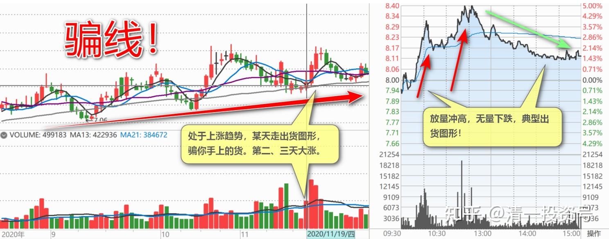
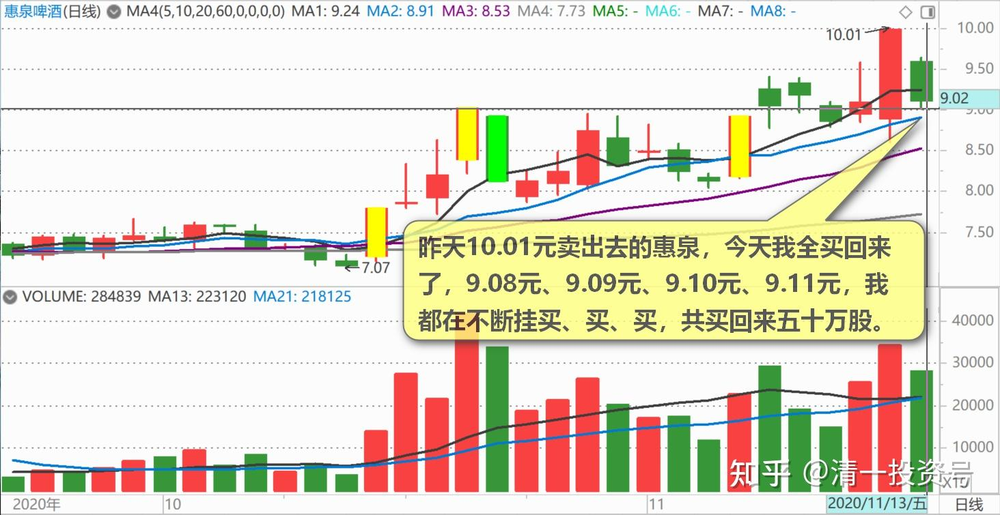
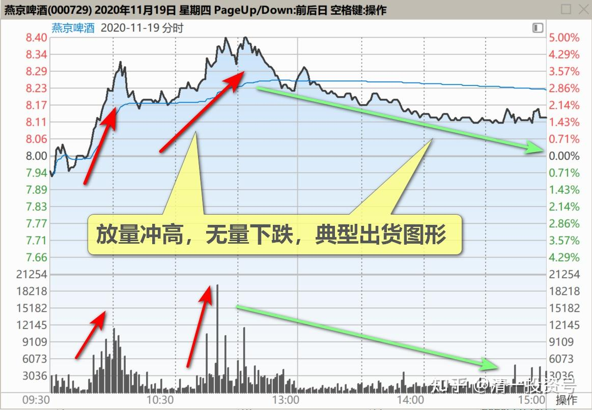
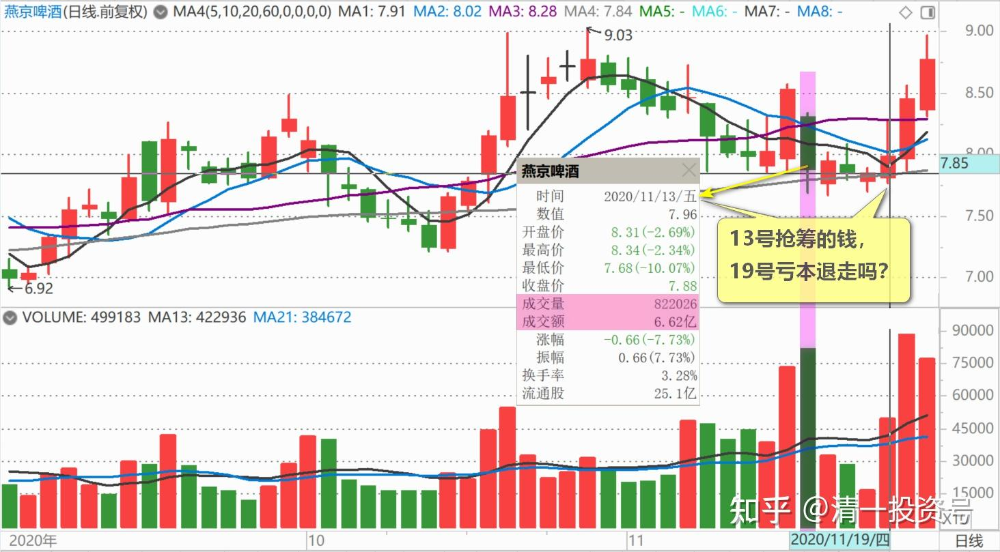
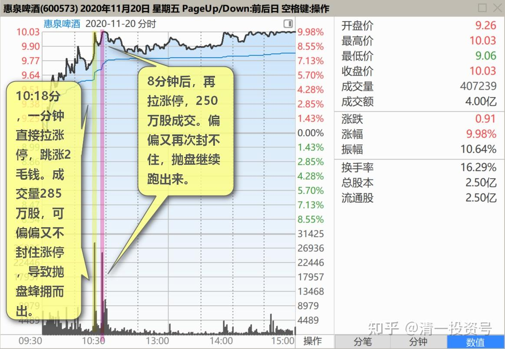
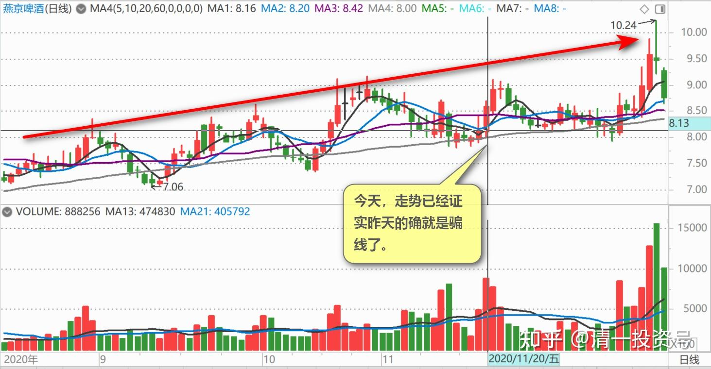

62篇.看一看典型的骗线

清一山长 2020年11月3日～20日

清一山长2020-11-13 10:44

$惠泉啤酒(SH600573)$ **昨天10.01元卖出去的惠泉，今天我全买回来了，**共买回来五十万股，因为昨天总共卖出了这么多股数的啤酒。**9.08元、9.09元、9.10元、9.11元，我都在不断挂买、买、买。**实在是大出我的意料之外——天底下还有这么大方的人，专门拉升，让人赚钱后又把高价买的筹码低价卖给我？到底是啥套路[为什么]。会不会再跌？我也不知道。反正再跌我就不管了，我就当昨天就没卖股票。账上还白送了几十万资金，就当帮我支付利息的。账面上，我的惠泉百万级仓位，持仓成本只是0.826元，我就不相信惠泉会破产清盘。

清一山长2020-11-19 22:42:40

$燕京啤酒(SZ000729)$ 这走势，就是出货的图形[吐血]。真不知道这价位出啥货。这么急钱用！13号抢筹的钱，亏本退走吗？

清一山长2020-11-20 10:54

$惠泉啤酒(SH600573)$ 好奇怪的主力：10:18分，一分钟直接拉涨停，跳涨2毛钱。成交量285万股，差不多成交了一个第二大股东的量。可偏偏又不封住涨停，导致抛盘蜂拥而出。8分钟后，再拉涨停，250万股成交。偏偏又再次封不住，抛盘继续跑出来。

主力是真没实力，还是假装示弱？跟昨天的燕京一样，故意示弱的？**如果想让市场沸腾，让小股民兴奋，封住涨停，才是最佳决策呢！还可以让更多人跟风，自己也不用买进过多筹码。**这种玩法，明显就是让别人快卖啊？当然，也可能还是要让它跌下来，让卖掉的人高兴——我冲高就卖就对了！强化这种信念，显然对主力有好处。其实，**昨天燕京啤酒，我已经看出来，虽然K线图就是出货的图形。但结合基本面来看，绝对是不应该出货的。**其实也不出掉，**也许只是几个账户换仓玩儿的，顺便洗出浮筹。**所以是典型的骗线，我就贴出来让大家看了。不过，别人毕竟是用了几个亿画出来的线，做得很不容易，我也不说破，免得被人恨。

**今天，走势已经证实昨天的确就是骗线了。**所以，我今天公布真正的答案。昨天的，需要大家思考。昨天出来说要跌到6元、5元的人，今天出来走几步看看？这就叫打脸。不懂没关系，别一张嘴就乱说话。各位今天，知道我告诉你们的炒股秘诀：“看空不做空”有多重要的了？**看空，你跟着做空，你就正好上当了。看空，不做空，反而做多，忍住内心的煎熬，你就赚了。“反者道之动。”**各位好好领悟去。

惠泉马上就要到我的止语区了。感谢惠泉来来回回地帮助我赚钱，这次下跌，我又补进了更多的数量。再次恢复原高，我的仓位也早已恢复原高，只是成本又降低了不少。全体持仓，正在等待最佳的卖出机会。今天涨停，也未必是最佳卖出机会。只是可以卖出上次卖出的相同头寸，算是平仓，赚了两次，该满足了。向资本市场的大佬们致敬！我这三大算什么。你们这些才是“看不见的上层”，一笔成交买入，就超过我的全部持仓了。[俏皮]

(标题、图片为编者所加)

**文章音频**：

[444篇.看一看典型的骗线_清一投资号文章同步音频](http://link.zhihu.com/?target=https%3A//www.ximalaya.com/sound/728939128)

**参考链接：**

[55篇.啤酒行业，已经有大鳄进来了](https://zhuanlan.zhihu.com/p/689415289)

[56篇.高明的人，会用真实的事实来误导你的决策](https://zhuanlan.zhihu.com/p/690672420)

[57篇.持仓，减仓，长期持有](https://zhuanlan.zhihu.com/p/691822907)

[58篇.看股票就是跟人性作对](https://zhuanlan.zhihu.com/p/693094564)

[59篇.是主力换庄，还是野蛮人抢筹](https://zhuanlan.zhihu.com/p/694396823)

[60篇.跌破5元的可能和上涨破10元的可能](https://zhuanlan.zhihu.com/p/695644758)

[61篇.养人、养股的阶段](https://zhuanlan.zhihu.com/p/696677954)
