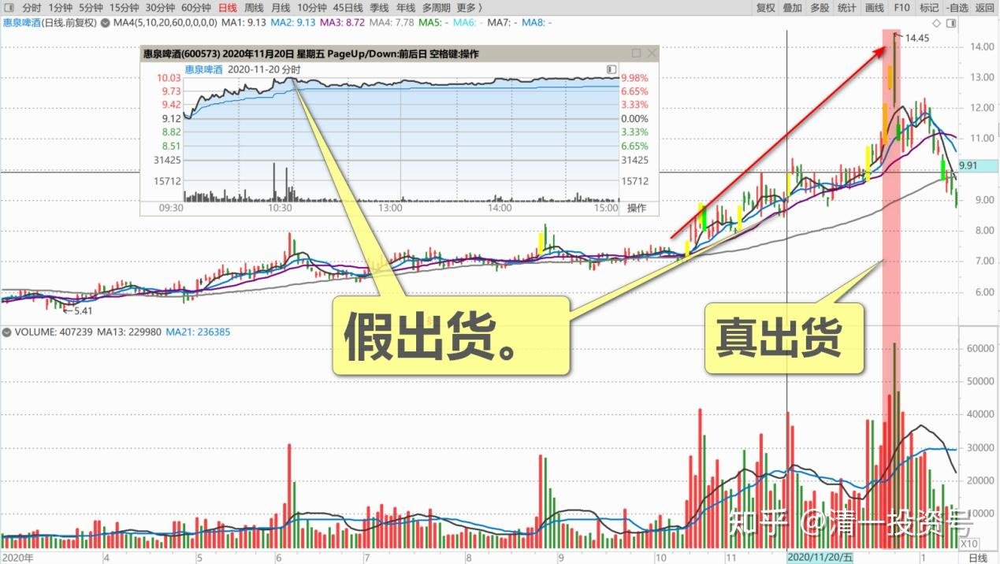
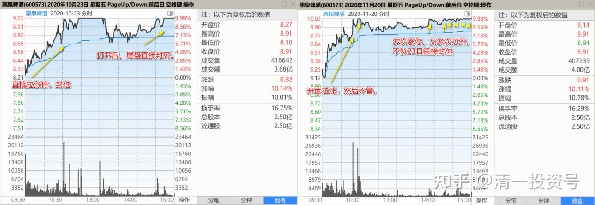
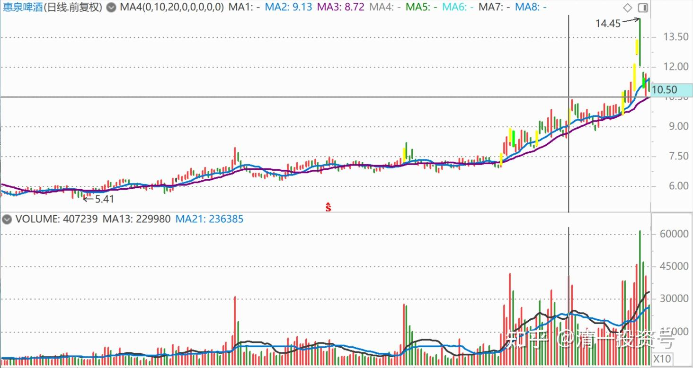
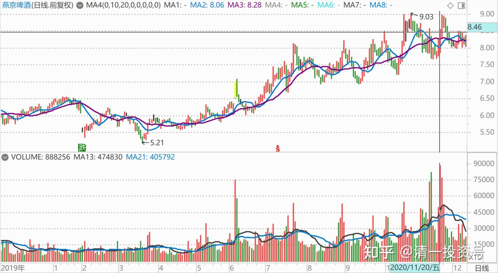
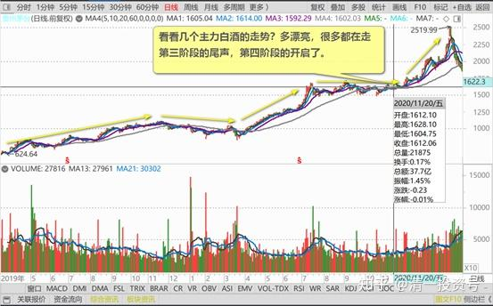
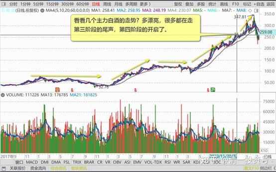
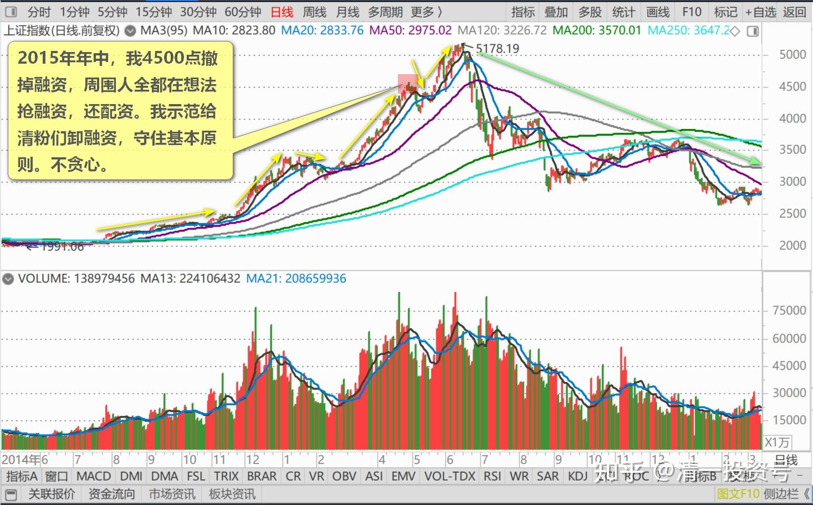
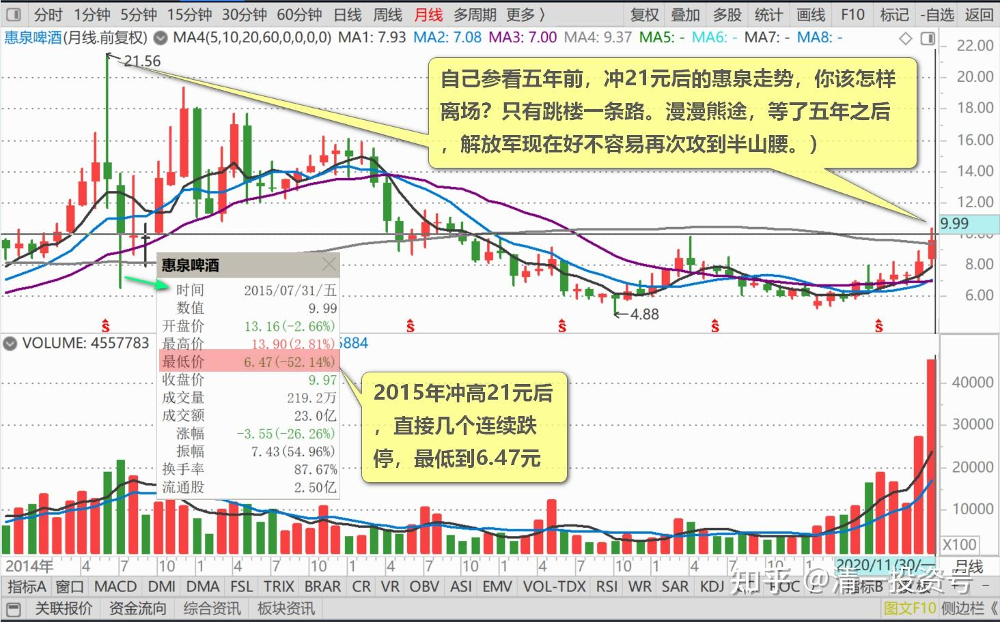

63篇.为啥我认为是假出货

清一山长2020年11月20日

$惠泉啤酒(SH600573)$ 今日解盘：由于惠泉已经超过10元，我不再示范操作了。只告诉大家一声：惠泉持仓利润再创新高，暂时列名啤酒股第二利润股。不过燕京虎视眈眈，很快就有超过的迹象。惠泉正常情况下，只能当老三。燕京当大佬的可能性正在增加。

**今日盘面解析：主力送钱。**跟10月23日的涨停不同。主力这次不再自己来接盘，而是打掉压力位的压盘之后，让积极参与的散户们积极接盘，互相多空对战，提升股票热度。但主力并没有出手抛售，没有玩大欺小的游戏。而**主要是观战，关键点花钱拉升一下**（别问我怎么知道的，花了钱买的消息[俏皮]）**。**今日冲涨停7～8次了吧？尾盘勉勉强强地收在涨停价，但接盘只有778手，看上去很可怜，很小气，可能主力是怕我这样的人，一单子砸两百多万股给它拿着，所以盘面上接盘都不多。我想跑还没这么容易的。不过，盘面也反应了主力没有主动参战情况下，真实的交易情况，散户们积极接盘，已经很了不起了。主力把大资金都腾出来，不跟散户抢了，等大家不敢冲涨停的时候，冲给大家看[大笑]。

与燕京啤酒不同，**燕京现在似乎还有骗筹的怀疑，还处在第一阶段的尾期。惠泉主力已经进入了第三阶段：与散户共舞，庄散目标一致。**现在是大家最好的蜜月期，他这时候，愿意与散户们分享利润，大家一起赚钱，制造赚钱效应，并扩散消息出去。真是一个长庄，善庄。吃相很端正。（**坐庄的第一阶段是收集筹码，第二阶段是拉升股价，秀身材，吸引跟风盘）。**现在离第四阶段看来还早，因为散户交投还不热络，想走也走不掉。所以要培养一下人气。主力已经这样做了。赞一个！**（第四阶段是高位派发，套牢散户，这时候谁能及时离开宴席，谁就是最后的赢家，如果没能及时离场，之前赚到的，全都要赔回去的）。**

了解一只个股，主力坐庄的四个阶段，是很重要的。**燕京为啥我认为是假出货？因为它的第二、第三阶段都没开始走，还在第一阶段的尾声阶段，怎么可能直接走第四阶段？主力一出货，就会砸到自己的成本线以内，刚刚走出成本区的股票，是根本出不了货的。**只能自己憋死自己。

什么是真的主力庄股？看看几个主力白酒的走势？多漂亮，很多都在走第三阶段的尾声，第四阶段的开启了。现在天天网上都在嚷嚷什么要买赛道股，别的都是神马。**这就是第四阶段的迹象。如果各位有一天，雪球上的各种议论，热点都是“啤酒才代表炒股的品味”。你手上没有啤酒股，你都不好意思见人**（就像现在手上没白酒股，你都不好意思说自己是炒股的一样）。这时候，可能就是第四阶段了。

不过，**要主动地离开第四阶段很难，这是完全逆反人性的。**因为利润太丰厚了，赚钱太容易了，真舍不得离场的。可能三天就是两个涨停。你舍得走吗？我们都想吃到最后，最甜最美的那一口，吃饱之后慢慢的再离开宴席。然后，可能你就再也走不动了[俏皮]（2015年年中，我4500点撤掉融资，周围人全都在想法抢融资，还配资。**我示范给清粉们卸融资，守住基本原则，不贪心。**却被一群人笑话说：老师都老了，现在要看年轻一代了。他们半年就赚了五倍、十倍，真比我牛！**这就是第四阶段的特征，诱惑力极强。**当年我要没这定性，退场，也不要老师的面子，不去跟他们比拼赚钱的倍率，只想守住胜利成果，被人笑话也无所谓。不然我现在就是穷光蛋一个，有多少钱，再就是几十年的积累，全都要被打光的）。

总结：我为啥一年前会看中惠泉？我为啥一直说惠泉的股性，比燕京更活？是一个良好的价值投机股？**就是因为惠泉是主力容易驯服的马。**燕京这匹马太强悍，不易驯服。惠泉要容易得多。所以游资容易看中惠泉。如果您也看中了惠泉，自然也可以与主力一起分享大宴。**只是别太贪了，吃相别太难看了。别挤到主力的嘴边抢食吃，别主力顺嘴就把你直接吞了！**（自己参看五年前，冲21元后的惠泉走势，你该怎样离场？只有跳楼一条路。漫漫熊途，等了五年之后，“解放军”现在好不容易再次攻到半山腰）。

本人负成本持有超过百万股级的惠泉！均来自于主力的赏赐！继续与惠泉主力、散户一起共舞。再次感恩主力，感恩一切参与惠泉交易的伙伴们、对手们！

[何适投资](http://link.zhihu.com/?target=http%3A//xueqiu.com/n/%25E4%25BD%2595%25E9%2580%2582%25E6%258A%2595%25E8%25B5%2584)回复[清一山长](http://link.zhihu.com/?target=http%3A//xueqiu.com/n/%25E6%25B8%2585%25E4%25B8%2580%25E5%25B1%25B1%25E9%2595%25BF)：

比胆子大的时候！千万别价值投资[捂脸]

清一山长回复[何适投资](http://link.zhihu.com/?target=http%3A//xueqiu.com/n/%25E4%25BD%2595%25E9%2580%2582%25E6%258A%2595%25E8%25B5%2584)：

**买这个，不是比的胆子大，是比的眼光，比你是否看懂了盘面语言。**我很胆小的。看懂了才做，看不懂，给钱都不要。

[Kk的仓](http://link.zhihu.com/?target=http%3A//xueqiu.com/n/Kk%25E7%259A%2584%25E4%25BB%2593)回复[清一山长](http://link.zhihu.com/?target=http%3A//xueqiu.com/n/%25E6%25B8%2585%25E4%25B8%2580%25E5%25B1%25B1%25E9%2595%25BF)：

哎！重仓套两年多，七月回本清仓了。

清一山长回复[Kk的仓](http://link.zhihu.com/?target=http%3A//xueqiu.com/n/Kk%25E7%259A%2584%25E4%25BB%2593)：

**散户的理想就是解套。**您这种人挺多的。主力会感谢您的，替他拿了两年的筹码没收利息。如果你们愿意5～6元割点肉，主力就更喜欢了[献花花]7元你就跑了，我9元还在买入呢！当然，**是先卖，后买。**是主力给我的机会[笑]

(标题、图片为编者所加)

**文章音频**：

[446篇.为啥我认为是假出货_清一投资号文章同步音频](http://link.zhihu.com/?target=https%3A//www.ximalaya.com/sound/730309610)

**参考链接：**

[61篇.顺鑫农业记录七——机构坐庄三招：养、套、杀](https://zhuanlan.zhihu.com/p/556331421)

[2篇.庄家入住操盘四个阶段](https://zhuanlan.zhihu.com/p/477773067)

[54篇.坐庄幻想：20亿家产荡尽换来的教训（配图版）](https://zhuanlan.zhihu.com/p/639500681)

[5篇.四大最庄家评比：最佳，最傻，最阴险，最无为](https://zhuanlan.zhihu.com/p/520593354)

[20篇.燕京啤酒的庄家是谁？](http://link.zhihu.com/?target=http%3A//xueqiu.com/9310099567/99998923)
