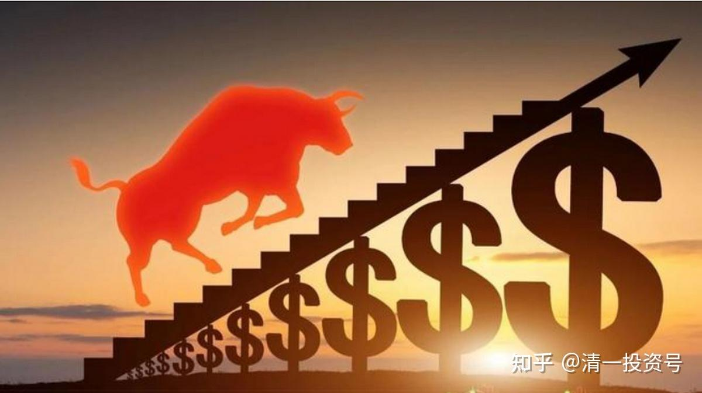
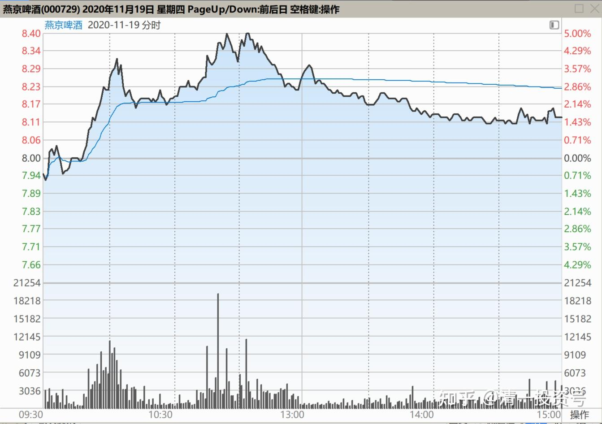
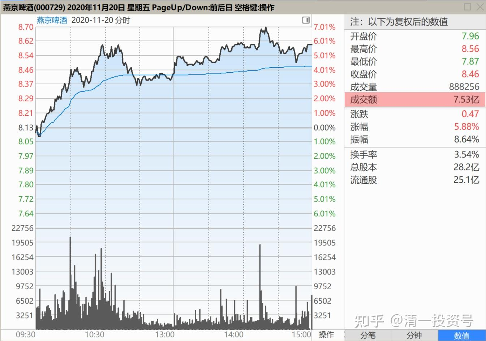
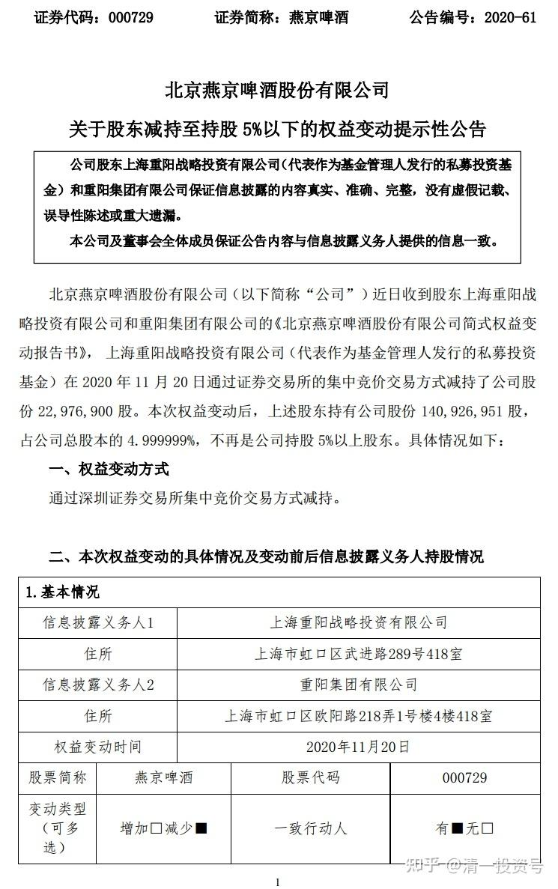
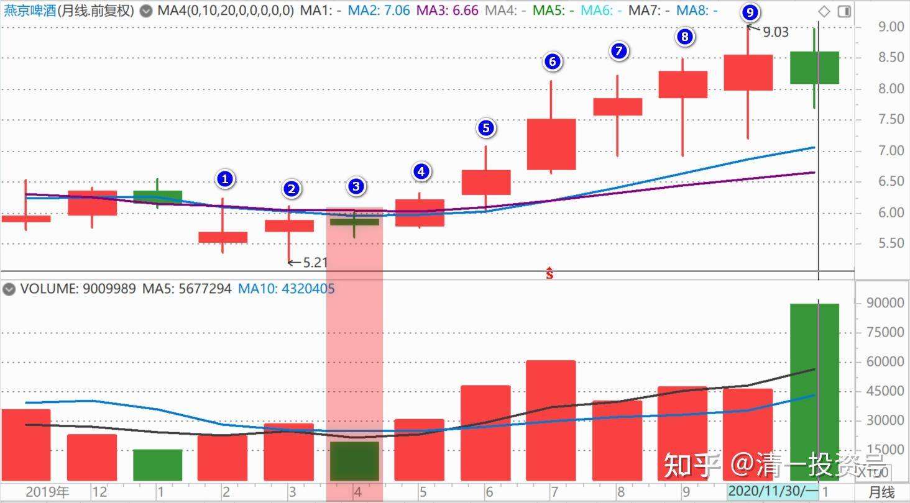

64篇.看懂长牛股的走势

清一山长2020年11月20日

引子——

清一山长2020-11-19

$燕京啤酒(SZ000729)$ 这走势，就是出货的图形[吐血]。真不知道这价位出啥货，这么急钱用！13号抢筹的钱，亏本退走吗？

正文——

清一山长2020-11-20 11:25

$燕京啤酒(SZ000729)$ 昨天的走势是出货图形。今天证明是假的。今天的走势是啥呢？明说，是收货的图形（看帖子，居然有人说今天还是出货图形[吐血]。这种看图水平，就别在股市混了。明牌都看不清，还有很多暗牌呢！）今天上涨放量，没有明显的出货痕迹，下跌量缩（昨天是下跌放量，所以是出货图形）。**今天一上午的成交量，比昨天的全日成交量还高，所以今天的收货很成功，也可以说，是昨天的出货图，吓坏了很多人，今天刚解套就跑掉了。**今天主力是真收货？假收货？我就不知道了。这个主力，实力过于雄厚，想干啥就干啥。我们惹不起，也不去猜。只认一个死理——给钱我就走，不给钱就是死不走。承认我脑子笨，没主力聪明，但也没笨到算不清赔赚的地步。想知道主力的真实意图吗？等看下午和明后天的走势，就会告诉你了[大笑]

[草原雄鹰队](http://link.zhihu.com/?target=http%3A//xueqiu.com/n/%25E8%258D%2589%25E5%258E%259F%25E9%259B%2584%25E9%25B9%25B0%25E9%2598%259F)回复[aji88](http://link.zhihu.com/?target=http%3A//xueqiu.com/n/aji88)：天地板，鉴定完毕。以后远离垃圾公司。

清一山长2020-11-20 13:16回复草原雄鹰队：

你真好心。换了我，根本就不理这种人！一群追涨杀跌的，以为他是爹！股市就是该孝敬他的人。

自己买的票，却连自己都不知道为啥买？赚了就得意，亏了到处问，装无辜，找人背锅。这种蠢货是来炒股的吗？就是来当韭菜被灭的！被关了是活该。

**作为一个人，就应该有人的基本的理性，有人的思考！判断错误没关系，慢慢来。**根本就没判断力，还是人吗？

如果只会跟动物一样，无脑进出，没理性，没脑子的人，我内心里根本不拿这种动物当人看！

当然，我也很感谢他们[干杯]。我相信我的账户里面，肯定是赚了这种人的钱的。

清一山长2020-11-20 19:58

$燕京啤酒(SZ000729)$ 重阳再度减持了4000多万股。重阳真的是决心要把自己的品牌毁到底呀！不可思议！**看重阳减持期间的这十来天就知道：他是低位减持的。**我强烈地认为，11月12日的走高，惠泉和珠江涨停，燕京成交量大增，但最终涨幅落后的原因，就是有市场资金进来抢筹，但重阳用“狂减持”来试图打压股价。结果是自伤，丢掉了大量的筹码。甚至13日直接跌回原地，应该也有重阳减持的“功劳”，积极打压燕京。**今天燕京刚涨了，赶快又出来一个减持的公告，明显就是不想让燕京涨。**一家大名鼎鼎的私募公司，就不怕这样公然的跟市场反向做，特别打自己的脸吗？我绝对不相信燕京有啥“巨雷”要爆，这种企业，想要去故意破坏都很难的。而且，就算是燕京的工厂全部被火烧了，它很快就可以东山再起的。这就是品牌企业，快消品的特性，不可能像科技成品一样被代替的。

[《北京燕京啤酒股份有限公司简式权益变动报告书》](http://link.zhihu.com/?target=http%3A//mysql.yanjing.com.cn/upload/newsfile/202011/16062941653r2qgca8.pdf)

**重阳三年前，7元多进入燕京，现在8元多高调出让燕京。**只有疯子，或者故意要搞事的阴谋家，才会这样做。背后一定有不正常的私下交易！今天的上涨，也是很奇怪的。涨五个点，并不多。也是因为惠泉，珠江上涨，燕京被动跟涨的。但奇怪的是：**燕京上涨似乎特别吃力，成交量特别的大，比燕京涨停还大，今天七个多亿。**要么就是抢筹，要么就是换庄。而且很可能重阳今天还减持了。今天的一些单子特别大，一分钟成交中，100万股的大单子很多，下午14:14分，一单拉7分钱，190万股，但也被打下来，典型的多空分歧很严重的样子。

重阳真的想要减持，无论在12日的走高中，还是今天的走势中，都可以借做多的力量顺势上攻，再顺势调整，比如惠泉的走势。现在这种走法，就是把市场当弱智儿童看了，明目张胆地耍小股民，吃相太难看了。留此贴为证：**未来燕京跌惨了，算是重阳英明，提前知道内幕，提前走人，高明，我佩服！并为今天对重阳的不敬道歉！如果未来燕京涨了，重阳现在所做所为，就是小人的行为，是吃相特别难看的操盘行为。是故意影响市场价格的操纵行为。**孰是孰非？看未来的燕京走势来判断吧！

清一山长 2020-11-20 20:54

$燕京啤酒(SZ000729)$ **给大家看看燕京的月线图：最近十个月，不算还没有结束的这个月，燕京是连续9个月上涨。**从春节崩盘后，燕京一直在稳步上涨。这十个月中，只有一个月是绿盘，也才跌了1.3%，成交量还因此降到了十个月的最低位。**稳步上涨十个月，关键是还没有放量。也就说筹码换手锁定良好，市场成本逐步上移，获利盘出逃并不明显，**没有多空分歧。**懂看线的人，都知道这种走势，就是未来的大牛股，长牛股的走势**。

重阳却很奇怪，已经走出牛股形状了，却拼了命的，要在月线图已经完全揭示牛股路线的时候，来真心减持这家公司？所以我说他是自己打脸的举动。就算真心要减持，利用燕京K线已经走牛的机会，拉高减持，不是最符合重阳的利益吗？偏偏是每次要涨了，就出来“减持”一通。明显跟市场反向做。我不是因为燕京没涨，所以不高兴，出来叫让大家抬燕京。没这个意思的。因为燕京越不涨，我的股份会越多。真的，越来越多了。因为我把别的股票赚到的利润，全都投入过来了。惠泉赚了一千多万，不就白白送我一百多万股燕京吗？何乐而不为？它真涨了，我要另外找股票去呢！真累。所以，燕京不涨我没意见的。我只是教大家怎样看线！

(标题、图片为编者所加)

**文章音频**：

[448篇.看懂长牛股的走势_清一投资号文章同步音频](http://link.zhihu.com/?target=https%3A//www.ximalaya.com/sound/731723876)

**参考链接：**

[57篇.持仓，减仓，长期持有](https://zhuanlan.zhihu.com/p/691822907)

[58篇.看股票就是跟人性作对](https://zhuanlan.zhihu.com/p/693094564)

[59篇.是主力换庄，还是野蛮人抢筹](https://zhuanlan.zhihu.com/p/694396823)

[60篇.跌破5元的可能和上涨破10元的可能](https://zhuanlan.zhihu.com/p/695644758)

[61篇.顺鑫农业记录七——机构坐庄三招：养、套、杀](https://zhuanlan.zhihu.com/p/556331421)

[62篇.看一看典型的骗线](https://zhuanlan.zhihu.com/p/698011435)

[63篇.为啥我认为是假出货](https://zhuanlan.zhihu.com/p/699291708)
