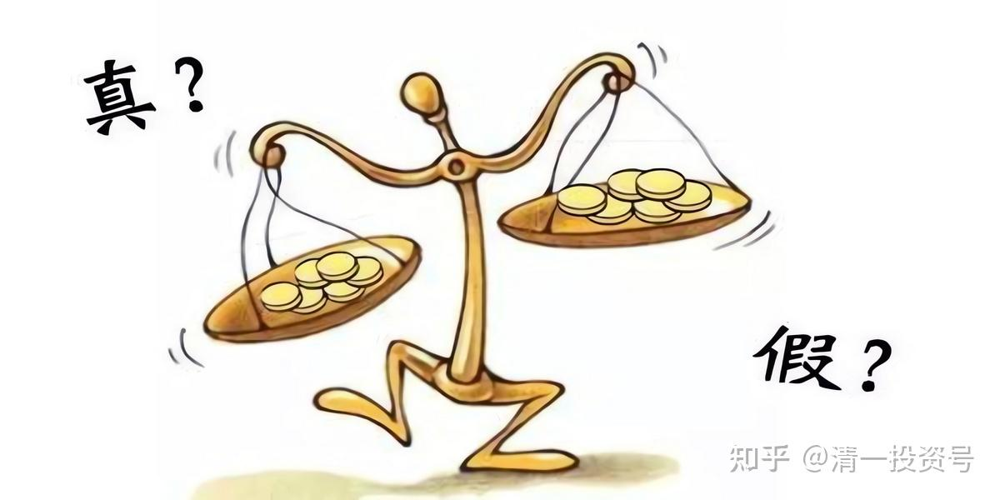
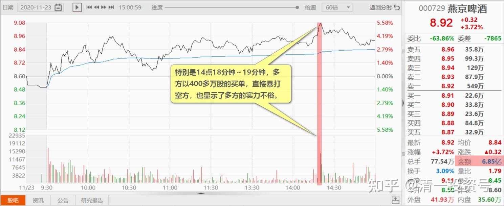
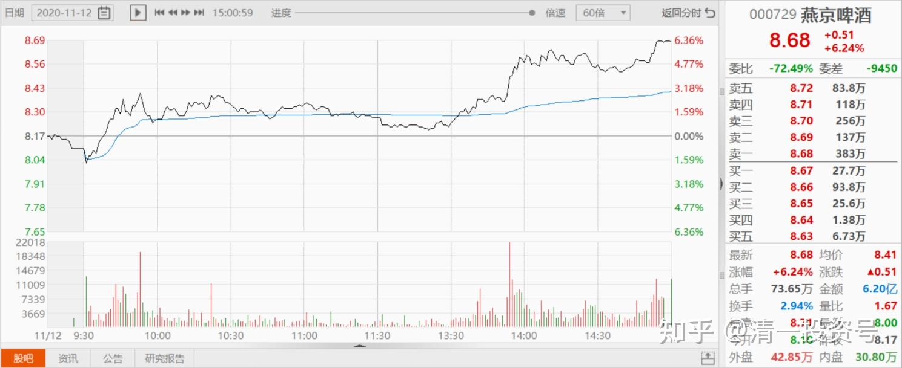
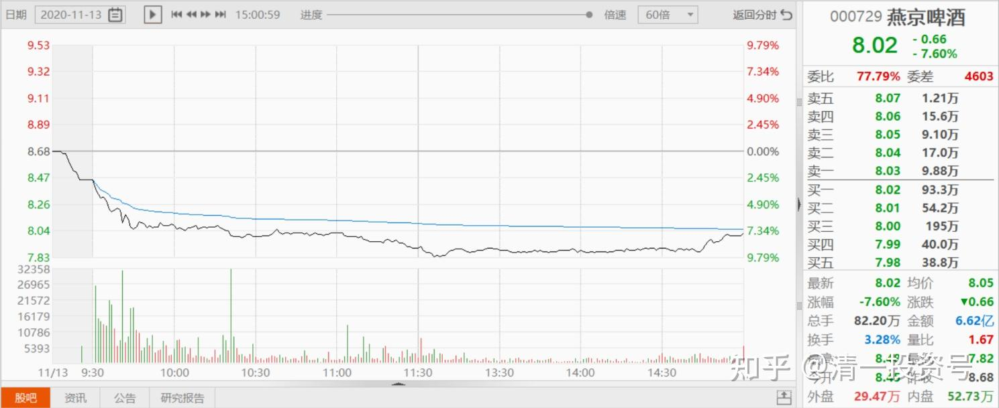
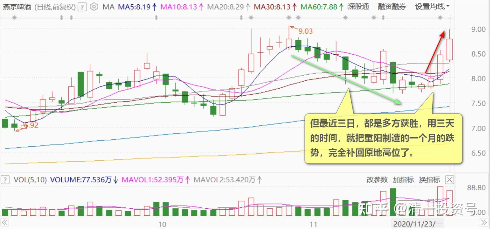
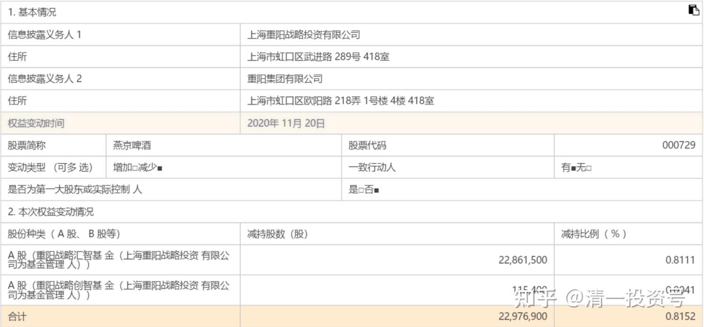
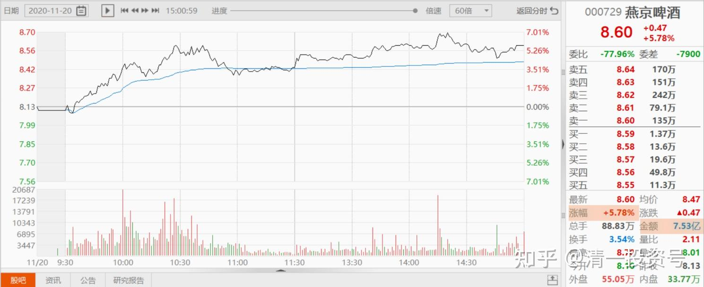
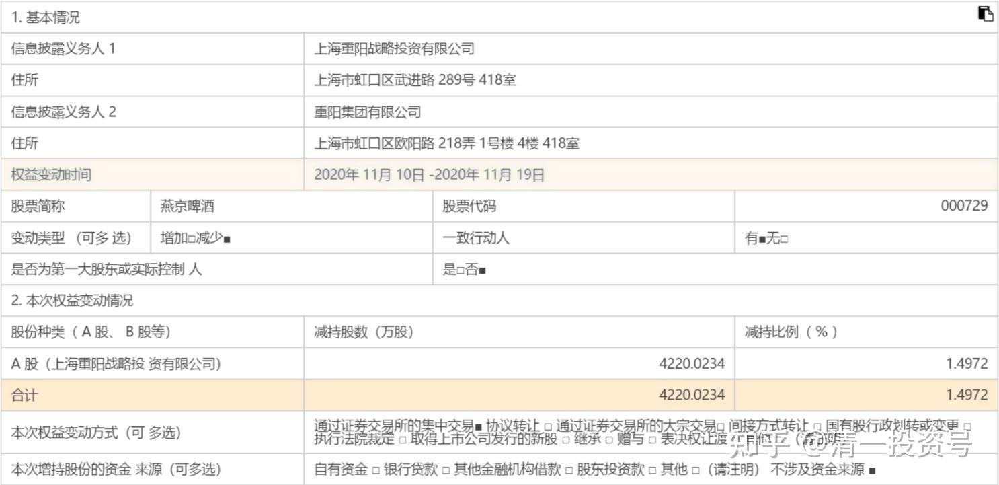
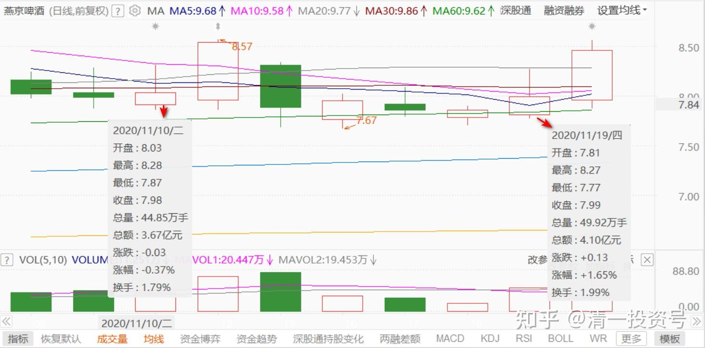

66篇.讲鬼故事还是真减持

清一山长2020年11月23日

**一、新主力是股海老手**

[$燕京啤酒(SZ000729)$](http://link.zhihu.com/?target=http%3A//xueqiu.com/S/SZ000729) 今天认真看了盘面交战，而不是简单看看K线，过程好精彩，好激烈。今天，重阳脸打肿了没？昨天发的减持消息根本就没起到作用。上午双方争夺控制权，空方节节败退。特别是14点18分钟～19分钟，多方以400多万股的买单，直接暴打空方，也显示了多方的实力不俗。就只有一分钟时间，被抢走了400多万股，心疼不？

新主力是股海老手，也不恋战，得手后不急不慢的观望。2:40分，空方挂出60多万股卖单在8.95元，结果被悄悄的几个相对小的单子全吃掉了，连骨头都没吐。盘面上压盘空虚，9元前后都没啥像样的敌军守护。但主力并未借机上攻，反而悄然下行至8.88元，让人感觉多方实力不济，小散也纷纷杀跌。主力不断吞吃8.87元至8.93元的卖单后，退回8.87元，任由杀跌盘不断抛出卖单**。K线图上看，却是正在下跌的样子。多方实力不济，但盘面上，一旦有大卖单出现，就会很快被多方分单吃掉，但就是不上攻。**8.88元这个价位，空方多次放出千手大单，试图压制，总数超过百万股级了，都在放出来的第一时间，就被多方悄然吸走。似乎双方在配合默契的跳舞。最终收盘在8.92元。多方不再进攻，给空方一点面子。

今天最高价格是9.11元，今天是谁的“911”？重阳的吗？[俏皮]

今天成交6.85亿。显然空方依然没有放弃。双方胶着在一起了。

与11月12日的进攻不同，第二天多方见势头不对，就撤退了，重阳“减持方”获胜。

但最近三日，都是多方获胜，用三天的时间，就把重阳制造的一个月的跌势，完全补回原地高位了。最打脸的就是：重阳周五郑重发出的减持消息，居然换来的是今天这个结果。重阳甘心吗？

**总结：新庄的实力在重阳之上，看起来是老手，老江湖。**操盘手法一流。比惠泉的操盘手更老到。手法更隐蔽。甚至比珠江的更厉害。所以，是个狠角色，也许是上次12日被闷的主力，去找来的援兵？请的高手？反正，现在的燕京盘面，总算有的看了**。原来的盘面，就是没啥内容，死气沉沉的。现在到了精彩时候，有故事的时候了。好玩！**[赚大了]

真弄不懂，重阳为啥就是要压着燕京，不让燕京上涨？他在等什么？新主力介入不是坏事，双方一起合作拉上去，至少他可以袖手旁观，不要去打压主力，自己悄悄赚钱，何乐而不为？我就是这样：看惠泉涨了，我刻意打压一下也不是不可以，但我就是只悄悄的卖货、买货，不去影响市场，不去惹主力讨厌。这才是好跟班的样子。[俏皮]

重阳想走就走，我们不送了。欢迎新主力入住燕京！不知你是谁[献花花]。未来小心点，新主力也不是善茬，你们跟不好，就会被踢的。所以，小心一点跟庄，**别被踢下车，也别被晾在高山上**[大笑]。

**二、全天成交三分之一的股份被谁拿了？**

[$燕京啤酒(SZ000729)$](http://link.zhihu.com/?target=http%3A//xueqiu.com/S/SZ000729) 2020年11月20日减持了公司股份2297.69万股（占总股本的0.82%）。本次权益变动后，该股东持股比例降至4.999999%，不再是公司持股5%以上股东。

不知道你们看到啥了。我看到的，是满满的笑话。

这些股，是20日卖的。也就是说：20日他跳出来宣布减持的时候，其实当天的减持，并没有说出来。20日，大幅拉升，重阳还在试图打压。我已经分析了当天的盘面，说肯定在出货打压，但节节败退。当天成交量是近两年来的新高，他没出手才怪。我相信还不止这个数字呢！因为可能他还有暗盘。

**关键是：重阳减持了占全天成交三分之一的股份，不但没跌，还涨了不少。这股被谁拿了？绝对不是散户吧？**这么多股，散户早压趴下了。

联想起来，上一次，减持的四千多万股，恐怕也是多空交战最激烈的一天，被这样抢走的吧？

今天有没有继续减持呢？从盘面上看，的确有主力在有意的抛售。但低于4.99%之后，法律上，重阳以后就不会跑出来，大声宣告它有减持了。真可惜，以后无法用宣言减持来威胁影响市场了。只好用真减持来真的，实际地打压市场了。**新主力资金实力，肯定在20亿以上，只剩下10个亿多点燕京的重阳，恐怕有心无力了。**

当然，也许是重阳自己换庄。明庄换暗庄，这样操作更容易一些。不然进出都要公示，也蛮累的[大笑]。

也许，今天这一步，就是主力早就布局好的步骤。珠江啤酒，你们知道谁是主力吗？不知道。根本就不在十大里面。惠泉你们知道谁是主力吗？肯定不是我。**上一天，一笔就拿了两百多万股的主力，一天就买入比九大股东都多的股票。但我们居然都不知道是谁，只能猜猜。肯定不是一个账户，而是N个账户来做的。**

所以，燕京重阳的退出，也许就是燕京开始走向牛股的开端了。不知名的主力，要上场了。

我说了，**燕京减持，如果伴随股价节节下行，就是真减持**。否则——就是讲鬼故事，故意吓人的。玩这些东西，真无聊！

[金一鑫](http://link.zhihu.com/?target=http%3A//xueqiu.com/n/%25E9%2587%2591%25E4%25B8%2580%25E9%2591%25AB)回复[清一山长](http://link.zhihu.com/?target=http%3A//xueqiu.com/n/%25E6%25B8%2585%25E4%25B8%2580%25E5%25B1%25B1%25E9%2595%25BF)：

老看盘能力确实高。请教重阳出燕京，复星出青岛，这样看行业上会不会有什么问题？比如会不会受到韩日清酒、啤酒的冲击？

清一山长2020-11-23 21:52:41回复[金一鑫](http://link.zhihu.com/?target=http%3A//xueqiu.com/n/%25E9%2587%2591%25E4%25B8%2580%25E9%2591%25AB)：

您问的这个问题，是怎样做好啤酒的生意，怎样应对国外竞争。我真的不懂。您似乎问错人了。您应该去问青啤、燕京的老总吧？或者他们的市场总监？[俏皮]

(标题、图片为编者所加)

**文章音频**：

[452篇.讲鬼故事还是真减持](http://link.zhihu.com/?target=https%3A//www.ximalaya.com/sound/734479292)

**参考链接：**

[61篇.顺鑫农业记录七——机构坐庄三招：养、套、杀](https://zhuanlan.zhihu.com/p/556331421)

[62篇.看一看典型的骗线](https://zhuanlan.zhihu.com/p/698011435)

[63篇.为啥我认为是假出货](https://zhuanlan.zhihu.com/p/699291708)

[64篇.看懂长牛股的走势](https://zhuanlan.zhihu.com/p/700510263)

[65篇.多空交战依然没有完成](https://zhuanlan.zhihu.com/p/701863047)
