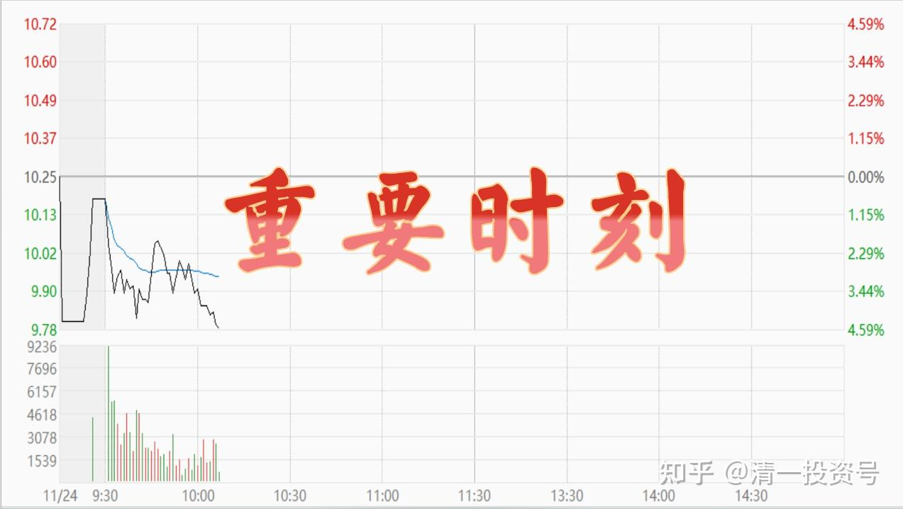
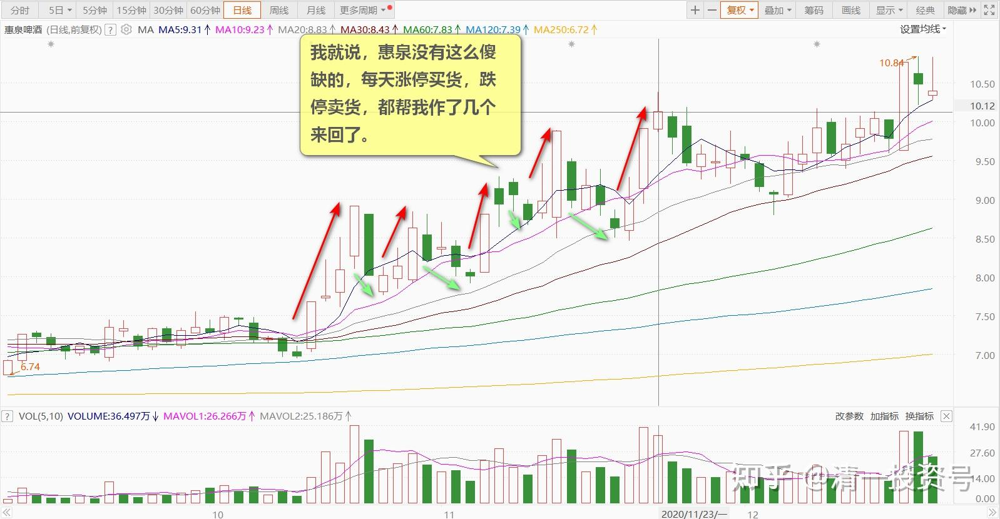
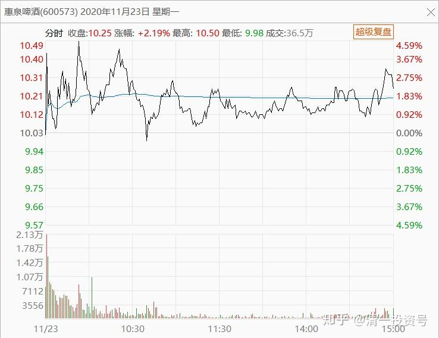
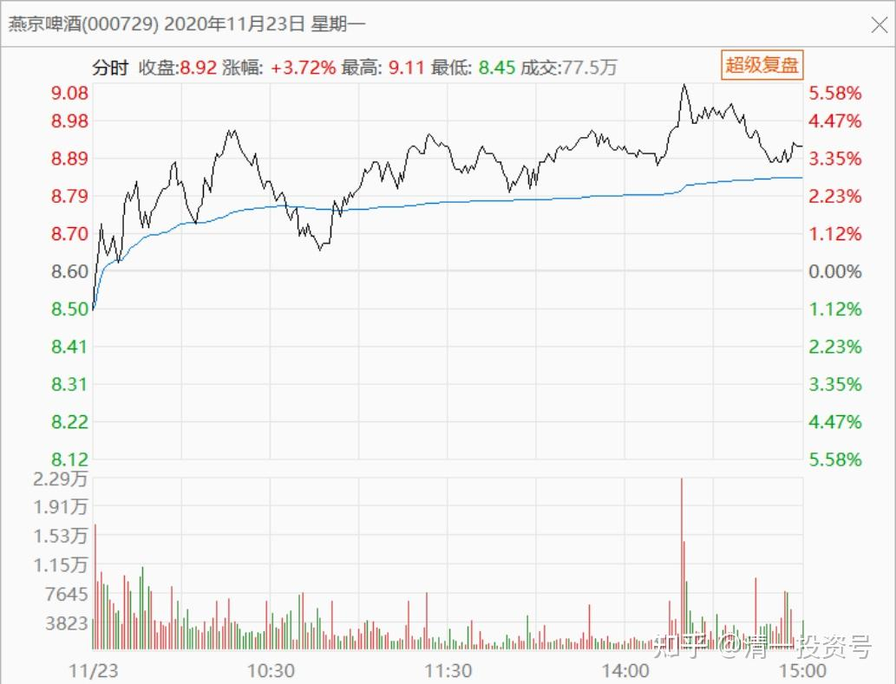
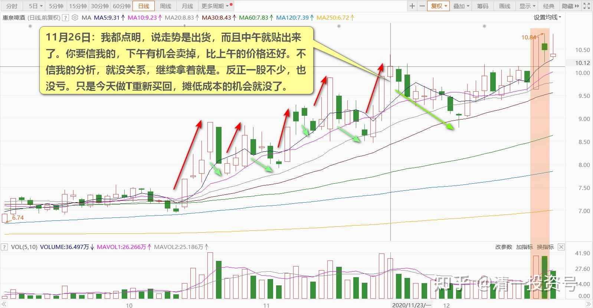
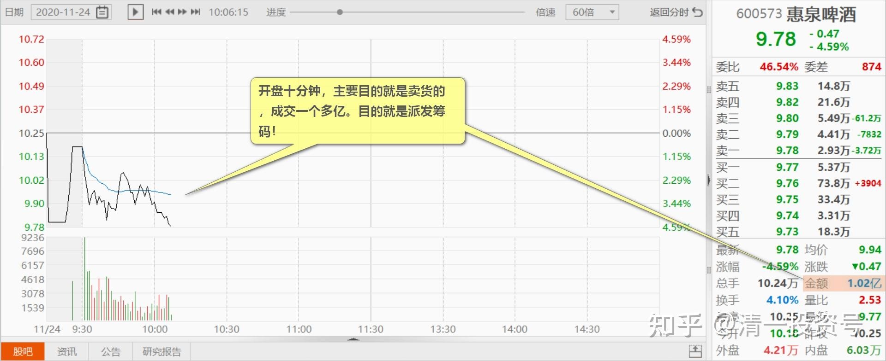
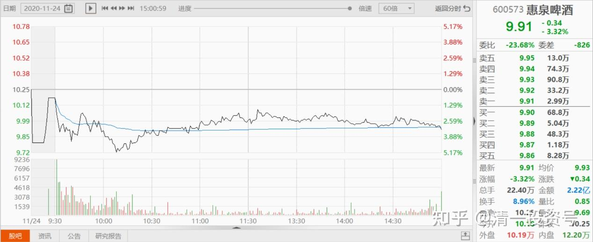
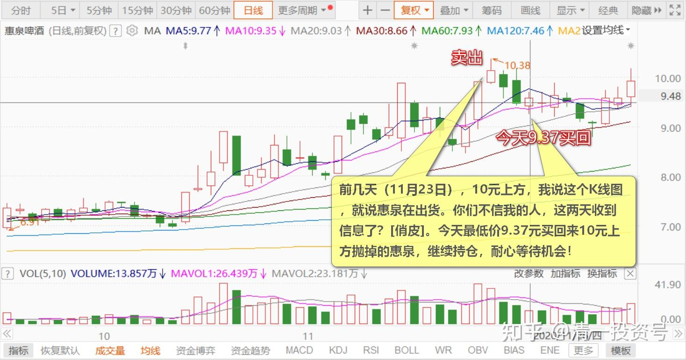
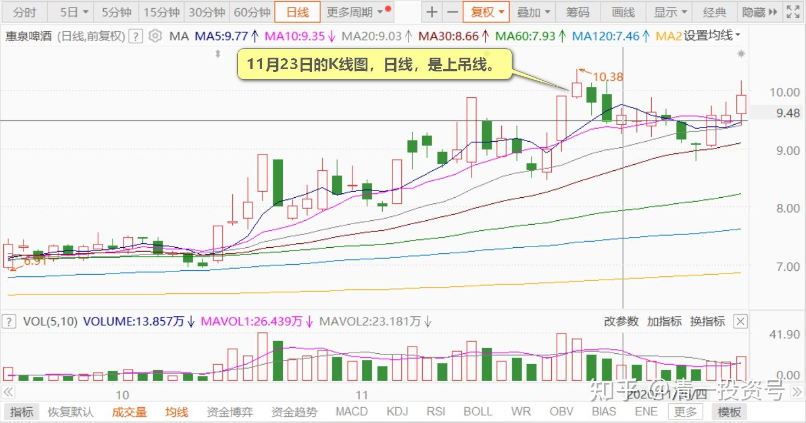

67篇.开盘这十分钟，才是最重要的时刻

清一山长2020年11月23日～26日

**一、震荡派货的图形**

清一山长2020-11-23 13:18:13（主贴1）

[$惠泉啤酒(SH600573)$](http://link.zhihu.com/?target=http%3A//xueqiu.com/S/SH600573) 今天走得漂亮。我就说，惠泉没有这么傻缺的，每天涨停买货，跌停卖货，都帮我作了几个来回了。钱多了专门送人的吗？前一天再冲涨停，我就猜不会这么重复历史的，不敢指望惠泉今天来个跌停。果然，涨了。让涨停买进的人高兴高兴。这样就正常了。

不过，友情提醒一下：仅仅纯从图形来看。**今天上午的走势，是“震荡派货”的图形**。利用快速的上涨，吸引一些跟风盘，然后派一些货出去。跟燕京的走势不一样。**燕京是主力强势上攻收货的图形，上涨可能性更大。**不过，从图像来看，主力出货，并不太顺利，跟风盘量太小了，量能放不出来。所以，无法在这个点位顺利出货。未来，继续震荡，是必须的。方向是向上震荡，还是向下震荡，就看惠泉主力喜欢了。我们猜不着的。

至于我看到了空，是否自己会做空？我就不说了。我说了，惠泉超过10元，我不再示范我的买入卖出的操作。来江湖上混，不要讨人嫌。我要遵守诺言[笑]

[ant9js7](http://link.zhihu.com/?target=http%3A//xueqiu.com/n/ant9js7)回复[清一山长](http://link.zhihu.com/?target=http%3A//xueqiu.com/n/%25E6%25B8%2585%25E4%25B8%2580%25E5%25B1%25B1%25E9%2595%25BF)：（跟评主贴1）

我新手，想做中长期，今天刚买，留着惠泉会赔吗？

清一山长回复[ant9js7](http://link.zhihu.com/?target=http%3A//xueqiu.com/n/ant9js7)：

别说屁话！什么“想做中长期投资”，明摆着就是追涨杀跌的小少爷！啥叫做中长期？我这种6元买惠泉的才是做中长期。你的中长期，一天算短期，三天就算是中期了吧？一周就是长期了吧？

最讨厌你们这种言行不一致的人！买进卖出没逻辑的人。我拉黑了，你就别来看我的帖！你也不是看我帖的人！一看就知道原来没看帖的，才会说这种傻话！

[许志宏bnr](http://link.zhihu.com/?target=http%3A//xueqiu.com/n/%25E8%25AE%25B8%25E5%25BF%2597%25E5%25AE%258Fbnr)回复[ant9js7](http://link.zhihu.com/?target=http%3A//xueqiu.com/n/ant9js7)：（跟评上贴）

是你这家伙不认真看山长的帖，找骂活该！

清一山长回复[许志宏bnr](http://link.zhihu.com/?target=http%3A//xueqiu.com/n/%25E8%25AE%25B8%25E5%25BF%2597%25E5%25AE%258Fbnr)：

[献花花]被根本不尊重我，甚至跟我反着做的人叫老师，是在侮辱老师这个词。这种人，居然把侮辱我，以为是来抬举我[吐血]，他的“我”真够大的。

清一山长2020-11-26 16:02:15（跟评上贴）

看到了没？这一天，一个跟风买进的家伙，被我骂了一顿。我骂他，是提醒你们注意风险。而且我几乎已经点明了这时候我在做什么，我说他是在跟我反着做。懂得用心看的人，就知道我传递了什么信息了。
至于傻瓜们，只会说山长今天脾气不好，别人来请教还被骂。这个人真没修养。你要这样想，也随你。但瞧不起我，跟我反向做，主力会给你一嘴巴的。
不过别担心：这个价也不是啥高价，耐心等，会回来的。我帖子里也说了，量放不出来，主力走不掉的。等什么时候放大量了，就要小心了。主力走了，就只剩你们一群散户在这里坐庄了。散户最自私了，都只想赚钱，不想赔钱，就只好往下杀了。主力愿意赔钱往上拉，所以主力才是我们的大救星。散户根本就靠不住！虽然散户的总资产实力更大。但散户不团结。只会当愤青。

清一山长2020-11-26 13:23:52（评论主贴1）

这个帖子的价值高吧？我都点明，说走势是出货，而且中午就贴出来了。你要信我的，下午有机会卖掉，比上午的价格还好。
不信我的分析，就没关系，继续拿着就是。反正一股不少，也没亏。只是今天做T重新买回，摊低成本的机会就没了。
我当时也没卖完，还留了好几十万股坐电梯。不怕的，反正都是负成本。今天重新买回三大的位置。
10元以上我不示范买卖操作，再次说明一下。这一天的帖子里面，就暗示了一些信息，看懂的就有福了！

[风雨恰逢](http://link.zhihu.com/?target=http%3A//xueqiu.com/n/%25E9%25A3%258E%25E9%259B%25A8%25E6%2581%25B0%25E9%2580%25A2)回复清一山长：（评论主贴1）

心态不够，玩的就是心态，借势，所谓弄潮高手，顺势借力，这个功夫背后有高手的思维认知，膜拜山长！

清一山长2020-11-26 16:18:04回复[风雨恰逢](http://link.zhihu.com/?target=http%3A//xueqiu.com/n/%25E9%25A3%258E%25E9%259B%25A8%25E6%2581%25B0%25E9%2580%25A2)：

不是心态而已，是算计。我算过：如果惠泉回撤的话，最大会回到什么位置。9.7元的空间太小了一点，不合胃口。要回的话，应该是9.5元左右，极限9.3元。下手前就算好的，不过时间算错了，以为要两三天后才到达。也知道达到这个价位，时间也不会长，所以到了就要抓紧时间下手。

**二、开盘十分钟派发筹码的图形**

清一山长2020-11-24 10:12:54（主贴2）

[$惠泉啤酒(SH600573)$](http://link.zhihu.com/?target=http%3A//xueqiu.com/S/SH600573) 如果我说，下面这个图形是出货走势，您相信吗？**开盘十分钟，主要目的就是卖货的，成交一个多亿。目的就是派发筹码！**

惠泉的走势，真是笑死我了。好玩，真好玩！又回到我的发言空间了[俏皮]

大家也不用太担心。惠泉主力，昨天吃了很多货，成本也不低。今天卖一点，也是资金回笼的要求。手上有钱了，还会继续拉的。耐心等，就行了。

补充一个收盘的图作为纪念：收市的成交量，也很有意思：刚好是上午10分钟成交量的一倍。也就是说，**后面一整天的时间，成交只是上午十分钟的量。可见：开盘这十分钟，才是最重要的时刻！**

[猫柳春眠](http://link.zhihu.com/?target=http%3A//xueqiu.com/n/%25E7%258C%25AB%25E6%259F%25B3%25E6%2598%25A5%25E7%259C%25A0)回复[清一山长](http://link.zhihu.com/?target=http%3A//xueqiu.com/n/%25E6%25B8%2585%25E4%25B8%2580%25E5%25B1%25B1%25E9%2595%25BF)：（跟评主贴2）

长得像出货，但是没啥量啊？

清一山长2020-11-24 10:30:18回复[猫柳春眠](http://link.zhihu.com/?target=http%3A//xueqiu.com/n/%25E7%258C%25AB%25E6%259F%25B3%25E6%2598%25A5%25E7%259C%25A0)：

**惠泉的一个多亿，相当于燕京、珠江的十个亿**[微笑]。因为他的盘子，只有燕京珠江的十分之一。

**十分钟，就一个多亿成交**。这量难道还少了吗？真有眼力[俏皮]。昨天那个抢惠泉的“中长期投资”的家伙，今天实现理想了。跌了，就只能中长期拿着了。

不过，这个价位倒也不危险。只是要知道，惠泉主力可不是笨蛋，往往都是出其不意攻其不备的。散户哪里是对手。

昨天的走势，就是说：10元上方高地，两次攻守，昨天正式宣布，突破防线上攻，空方一败涂地，高地已经稳住了。前方12元、15元。大家伙们，一起冲呀！

结果今天，多翻空。把昨天抢进来的人，全都套住了。所以，我才说，笑死我了！这游戏玩的，专门来套这些自以为聪明的投机客[大笑]

清一山长:2020-11-26 13:18:27(评论主贴2)

前几天（11月23日），10元上方，我说这个K线图，就说惠泉在出货。你们不信我的人，这两天收到信息了？[俏皮]。今天最低价9.37元买回来10元上方抛掉的惠泉，继续持仓，耐心等待机会！

清一山长2020-11-24 11:59:01（主贴3）

[$惠泉啤酒(SH600573)$](http://link.zhihu.com/?target=http%3A//xueqiu.com/S/SH600573) **昨天的K线图，日线，是上吊线。**我下午盘中就看到了，本来想说一下的。又想名字不好听，影响大家的心情。另外，万一下午收市收上去了，就变成“红三兵”，上攻线了。所以昨天下午就没说。没想到，今天上午果然下跌了，果然让一些人上吊了。[俏皮]

惠泉的K线，主力画图画得很好。水平很高！赞一个！

(标题、图片为编者所加)

**文章音频**：

[454篇.开盘这十分钟，才是最重要的时刻](http://link.zhihu.com/?target=https%3A//www.ximalaya.com/sound/735875273)

**参考链接：**

[61篇.顺鑫农业记录七——机构坐庄三招：养、套、杀](https://zhuanlan.zhihu.com/p/556331421)

[62篇.看一看典型的骗线](https://zhuanlan.zhihu.com/p/698011435)

[63篇.为啥我认为是假出货](https://zhuanlan.zhihu.com/p/699291708)

[64篇.看懂长牛股的走势](https://zhuanlan.zhihu.com/p/700510263)

[65篇.多空交战依然没有完成](https://zhuanlan.zhihu.com/p/701863047)

[66篇.讲鬼故事还是真减持](https://zhuanlan.zhihu.com/p/703026413)
