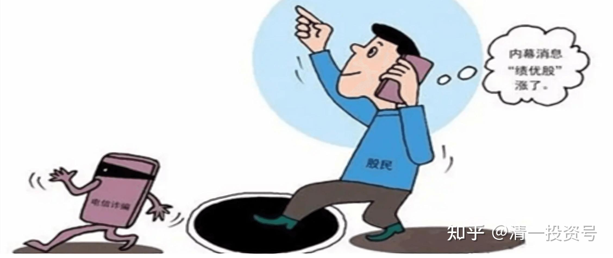
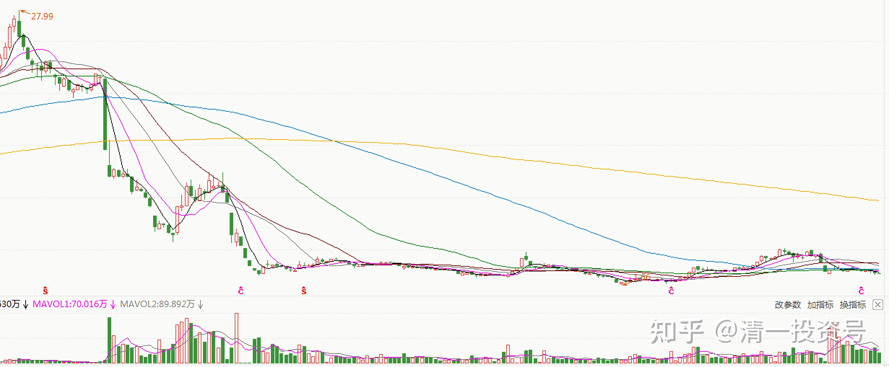
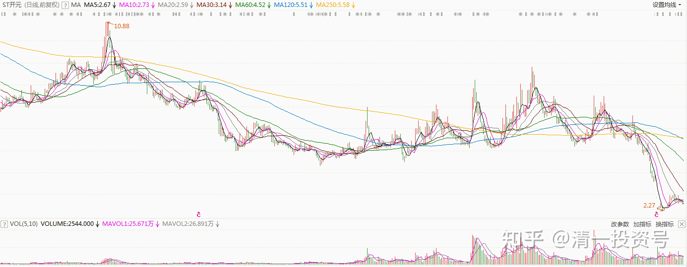
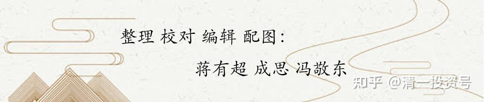

6篇.投资靠内幕消息，真的可行吗？

清一山长 2019年5月8日～2020年8月30日

[清一山长](http://link.zhihu.com/?target=https%3A//xueqiu.com/9310099567) 2019-05-08 20:49

[$康美药业(SH600518)$](http://link.zhihu.com/?target=http%3A//xueqiu.com/S/SH600518)一年多前，有人好心，私下推荐这个股给我，估计是觉得我选股老买些没前途的老大难股吧，看得着急。推荐人很神秘的样子，告诉我有**绝对可靠的内幕消息**，这个股未来前途无量，要冲50、100之类的。当时价格在20元左右，我打开K线图，技术上看，此股已经是“明牌”，哪有啥“内幕资讯”的事。如果我做庄，这个价格已经是可以慢慢派货的了。再看基本面，也没啥惊艳的东西，估值高高在上。不明白为何有人钟情。今天无意中看到，居然连续跌停。现在才6元多了,看来还要继续向下突破。

结论就是：在中国，**炒股千万别“相信朋友”。就算是朋友不骗你，但朋友被人骗了，你也不知道。**所以——**还是相信自己，相信常识吧！**买些身边看得见的股，如牛栏山、燕京、珠江之类的。起码你知道你买的公司是干嘛的[俏皮]。康美这种公司，干啥的你不知道，股价已经在高位了，你还去接盘，脑子有病才会这样干。现在，居然把几百亿现金弄丢了，真的很有创意！我只是知道原来的上市公司会把扇贝丢掉，现在更直接了，直接丢失现金[笑]。这些钱，用重型卡车来也拉不完的，不知道这么多钱，怎么会突然失踪的。就像扇贝会走路一样不可思议[滴汗]。

PS：东方金钰的老板，真的想象力有限。库存了很多毛石，用来当玉石，抵押给银行用。转了几个弯来套现。康美可好，直接套现走了,连点毛石都不留。手段真高[滴汗]!

*(ST康美 2018-2022周K线）*

[清一山长](http://link.zhihu.com/?target=https%3A//xueqiu.com/9310099567) 2019-05-23 23:27

[$ST康美(SH600518)$](http://link.zhihu.com/?target=http%3A//xueqiu.com/S/SH600518)这个公司的300亿到何处去了——居然是去用来坐庄，偷偷炒自己的股炒亏掉了。这故事真好玩。

说实话：一年多前，有朋友告诉我该股多么有潜力，未来前景如何好之类的，还告诉我身边的一些老板，都集体“悄悄潜伏”进去了，特别看好它的未来。我打开K线，看了一眼之后就直接放弃掉了，我连多研究一下的兴趣都没有——一只已经从2014年涨了三倍的股票，你还告诉我多么有潜力？我把基本面抛开不谈，我想的担忧就是：万一这个股是有托儿的，是忽悠人的（因为一看就知道，这个股肯定有庄的，我相信我还是看得出这点来的）。它当然有可能继续涨。但是，万一庄家想用这个价卖给市场（当时它已经账面上赚死了），可我这种新买入者咋办？结论是没办法。现在事实说明，当时来忽悠好朋友买股的人，就是已经被庄家“绝密内幕消息”忽悠的人。相信内幕消息，不如相信盘面语言。

所以，**我的投资原则，是绝对不追高，绝对不要成为庄家的牺牲品，我只买价格在庄家成本线附近，甚至以下的股票**，比如顺鑫，这个庄其实是很恶心的庄，德行很不好。它是很有耐心的，花了两年多时间来做盘，整人手法一流。我19元买入都吃套，拿了一年多也只能坐电梯，摆出一副完全与白酒股涨跌无关的样子，甚至还打到16元去，吓走了很多散户。**但我相信我拿货的价格，跟庄家的成本是差不多的，所以我就不怕，稳稳地坐在车上不动**，最后的一点顺鑫，是60元卖掉的。这时候，已经涨了三倍的顺鑫，无论是谁来吹它未来多么有潜力，我都是死也不再进场的——我**宁肯错过，也不愿做错**。它涨到100元，也跟我无关了。账上留上几手，做做纪念就可以了。我宁肯去买十年也不涨的黄酒，愿意再等十年，也不要去买这些高大上的名酒了。起码我知道现在的价格，庄家也是不赚钱的。我就敢买了。

其实坐庄真的很可怜，很不容易的，并不是大家想象的，坐庄就一定赚——很多庄，操盘手法不好，常常不小心就被老鼠仓吃了（我相信康美的老鼠，一定超级多，300亿的集体大餐喔！很多老鼠一起吃才吃得完的），被散户吃了。跟庄有技巧的，只能跟悄悄低位入场的庄，别去跟高位起舞作秀的庄。20多元的康美，几乎是路人皆知的“好股”,很多大V在推的好股，你居然还用真金白银去跟庄，你就太傻了。

看不懂K线，看不懂庄怎么办？**一句话，价值投资去。买个靠谱的股票，睡觉去，就行了，其实最简单。巴菲特、段永平的炒股方法，是最靠谱的投资方法，就是不炒股！**

[@清醒的精神病人](http://link.zhihu.com/?target=http%3A//xueqiu.com/n/%25E6%25B8%2585%25E9%2586%2592%25E7%259A%2584%25E7%25B2%25BE%25E7%25A5%259E%25E7%2597%2585%25E4%25BA%25BA)回复[清一山长](http://link.zhihu.com/?target=http%3A//xueqiu.com/n/%25E6%25B8%2585%25E4%25B8%2580%25E5%25B1%25B1%25E9%2595%25BF):

不能用涨几倍去判断。

[清一山长](http://link.zhihu.com/?target=https%3A//xueqiu.com/9310099567)2019-05-23 21:16回复[@清醒的精神病人](http://link.zhihu.com/?target=http%3A//xueqiu.com/n/%25E6%25B8%2585%25E9%2586%2592%25E7%259A%2584%25E7%25B2%25BE%25E7%25A5%259E%25E7%2597%2585%25E4%25BA%25BA):

比如茅台这样的？涨几倍还是可以买？可惜我就是不买。因为——我相信茅台涨到2000元的时候，我能够找到的其他股，也能翻倍，甚至涨更多。何必买茅台。

我会后悔100多元没买茅台，但不会后悔900元没买茅台。即使茅台股价是2000元。对不起茅粉了，我就这么傻的[笑]。

[清一山长](http://link.zhihu.com/?target=https%3A//xueqiu.com/9310099567)2020-08-29 16:53

[$西水股份(SH600291)$](http://link.zhihu.com/?target=http%3A//xueqiu.com/S/SH600291)比乐视更乐视的公司出现了，奇文大观：半年亏掉市值的3倍，市净率是负值。看看大股东，也就10%持股。没有实质性的控股股东。这种公司，居然有人敢买。前段时间，居然还从6元多股价涨到15.99元。真不知啥人会买这种股[滴汗][滴汗][滴汗]。

想赚大钱的小股民，不愿意买稳定可靠的大蓝筹，却去追这种莫名其妙的股。前一天周四的成交还有1.79亿，昨天封死的跌停板，居然还有7200万的成交。都是敢死队吗？炸弹都爆炸了，昨天还敢去抢筹？跌停版出货原来真的会有[俏皮]。

国人的疯狂，实在难以预期。我等胆小的人，就拿着啤酒、建筑，这些肯定亏不掉的公司好了。涨不涨，不期待。起码知道不会这样跌得没边。

另外，大胆设想：赚钱可以做假账，会不会亏钱也可以作假？把真实的资产吞了，说是亏了就完了。买单的，还是小屁民。

**十点半回复[清一山长](http://link.zhihu.com/?target=http%3A//xueqiu.com/n/%25E6%25B8%2585%25E4%25B8%2580%25E5%25B1%25B1%25E9%2595%25BF):

低调说一只股开元股份，要不是主力总是在打压偷偷吸货，吃相太难看，我也不想推荐出来，其实逻辑可以简单概括一下，就是原本搞煤炭检测仪器的，后来创始人眼见发展已经不行了，就谋求转型。于是找到了一家教育企业，两者各有所取，开元老板想套现，而教育老板则想借资本市场做大做强，于是谈拢了，但是创业板当时禁止借壳，所以玩起了狸猫换太子的游戏，曲线借壳，三年过去了，终于双方达成所愿，开元老板也已套现过半，由大股东变成了二股东，教育老板江勇也实现了入主开元股份，随着定增完成，未来将巩固大股东地位，然后会进行下一步，那就是把体外资产注入到开元里面来，以实现更高的持股比例，有望超过40%。这体外资产最值钱的是其控股80%的黑格力斯，搞健身教练培训的，发展特别快。江勇为了实现低位入主开元，不惜借疫情把业绩做得最差，并在二级市场暗地打压股价，最低打了6.66元，这个没有长期关注它的人是察觉不出来人为故意打压的痕迹。如今，江勇已经基本上完成了开元的控制目的，所以对于股价，已经没有继续打压的诉求。随着疫情的影响消失殆尽，开元的业绩也已经触底回升，二季度减亏很明显，三季度单季将实现盈利，个人认为有望达到三千万以上，四季度业绩将进一步回升到七千万以上，明年全年有望达到三亿净利润，所以股价目前正处在转折点。开元现在是纯粹的职业教育股，制造业去年也早已剥离，类比中公教育这个职业教育股，中公教育市值已经超2300亿，开元却三十亿不到，中公教育的成长证明了职业教育赛道的优质，随着江勇夺得控制人后，对业绩将会有诉求，所以未来开元将进入快速发展期，股价必然追随中公教育而去，起码做到中公教育的零头三百亿，不难吧？三十亿到三百亿，也就是十倍空间。长线此时不买，何时买？

*（ST开元2020-2022日K线）*

[清一山长](http://link.zhihu.com/?target=https%3A//xueqiu.com/9310099567)2020-08-30 16:06:49回复**十点半:

**来来来，大家瞧，大家看：这就是“吹股手”，到处找人垫背的。到处到热帖跟帖，把八杆子打不着的“绝密消息”，拿来到处忽悠人。**要真有这事，也轮不到你们这些素不相识的小股民去得到内幕消息。什么大股东不断卖出，二股东早就悄悄吸筹，也不会跌成这样子。假装装进教育培训，让你想象可以飞天。说穿了，无非是：快来抢呀！有钱赚，翻倍的！

越是吆喝和厉害的，就越是要你钱、要你命的，专门让一些贪婪而缺乏思考能力的傻瓜上当的。好股票，就没有见过这样吆喝的，出来使劲吆喝的，都全是骗子。**我怎么没见茅台170元的时候有人出来吆喝说快买？倒是看见一大堆人说茅台现在不行了，快垮掉了。我买五粮液的时候，才14块钱买的，还战战兢兢的，研究半天——这公司不会倒闭吧？珠江啤酒五元的时候，有人跑出来让你快买吗？**

说不定，以后还有消息传出来：惠泉的三当家，要接手做大股东了。以后就把惠泉换成教育股。他要把三语大学的优质资产都装进去。然后——股票要至少连涨20个板。现在惠泉不涨，就是三当家要压着股票不让涨，迫使燕京低价让股份出来，要低价吸筹的。你居然相信了，脑子就是有病！别以为是我背后操盘的，这事肯定跟我没半点关系！

附录：参考文章

[清一投资号：5篇.四大“最庄”评比：最佳，最傻，最阴险，最无为](https://zhuanlan.zhihu.com/p/520593354)?

