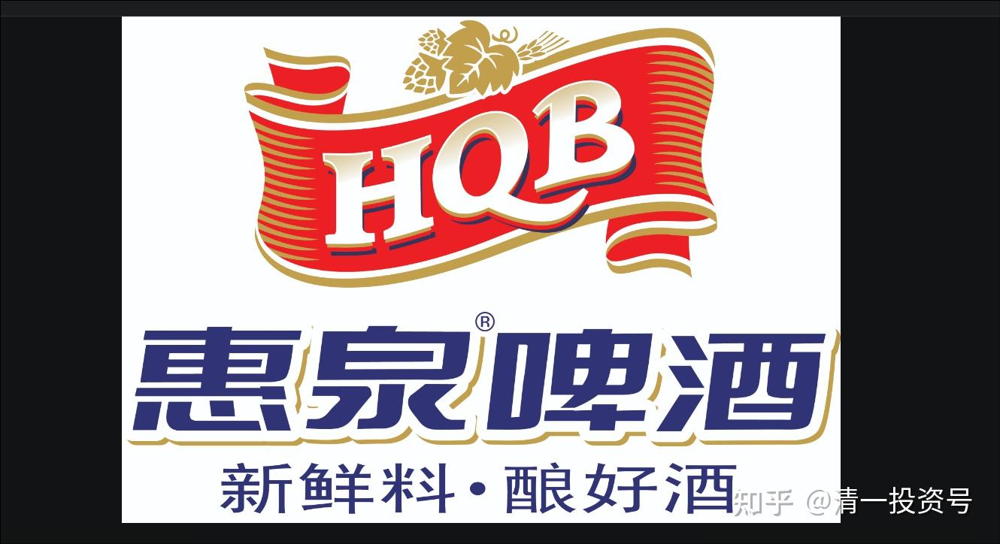
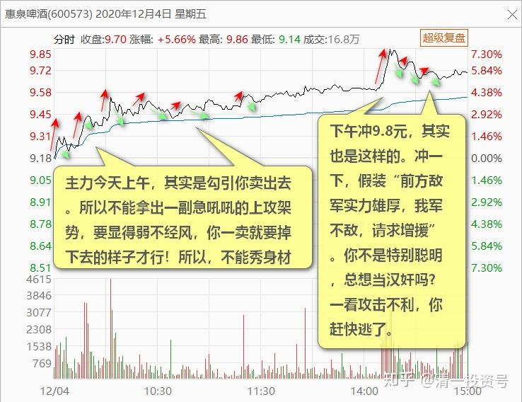
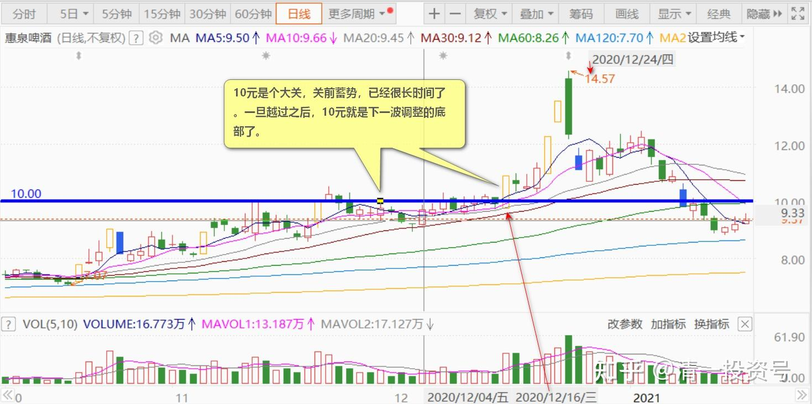

72篇.为什么不要冲过9.60元收午盘

清一山长2020年12月4日

[https://zhuanlan.zhihu.com/p/709411110](https://zhuanlan.zhihu.com/p/709411110)

“**如果中午趴在9.5元下面，不发力，下午就好看了。**拜托不要冲过9.60元收午盘，现在还有9分钟，**看它上午怎么收盘，就知道下午怎么走了。**”

[$惠泉啤酒(SH600573)$](http://link.zhihu.com/?target=http%3A//xueqiu.com/S/SH600573) 今天这样收盘不错。跟我上午的判断差不多。**我认为应该下午攻破9.6元防线的。果然，攻击了9.8元上方。如果上午攻破9.60元的话，就有急功近利之嫌了。**勾引人冲进来，就不是主力的意思了。**主力今天上午，其实是勾引你卖出去。所以不能拿出一副急吼吼的上攻架势，**要显得弱不经风，你一卖就要掉下去的样子才行！所以，不能秀身材。**下午冲9.8元，其实也是这样的。**冲一下，假装“前方敌军实力雄厚，我军不敌，请求增援”。你不是特别聪明，总想当汉奸吗？一看攻击不利，你赶快逃了。本人还是讲点义气的，与主力共进退，不会在主力实力不济的时候落井下石的。我只在主力表示不差钱的时候，才轻轻的把筹码还给他，拿走主力不在乎的钱。主力表示想要钱，不要股票的时候。我又乖乖地拿出钱来买股票，配合主力的需要。你们有些人，总想“控庄”，良心不好。所以赚不到钱的。[赚大了]

冲9.86元的时候，我在观察盘面的。其实上方压盘不多，直接冲涨停，一点问题也没有。**但主力放弃进攻，示弱，引诱抛盘涌出**。甚至主力有意抛出一些筹码。**说明主力志在长远，未来可期**。如果今日就冲个涨停，就太浮躁了。**10元是个大关，关前蓄势，已经很长时间了。一旦越过之后，10元就是下一波调整的底部了。**我看下周，这个关就要过了。周一应该会调整一下的，不会直接涨。周一买货的话，应该比今天下午买便宜一些。但时间不会太长的，估计就是回踩确认底部后，就要开始涨破10元了。过了10元，也就没我啥事了，我也不说话了，闷声大发财就行了。**今天一股没出，觉得没必要，尽管我判断下周会有回踩。但“看空不做空”**，是我的习惯。**以后大涨了，涨停了，我也看多不做多。**今日上午我就看多，判断下午会涨。但我也没做多，一股没买（做了也就两毛钱的T，没意思，瞎乱精神）

[波段的艺术](http://link.zhihu.com/?target=http%3A//xueqiu.com/n/%25E6%25B3%25A2%25E6%25AE%25B5%25E7%259A%2584%25E8%2589%25BA%25E6%259C%25AF)回复[清一山长](http://link.zhihu.com/?target=http%3A//xueqiu.com/n/%25E6%25B8%2585%25E4%25B8%2580%25E5%25B1%25B1%25E9%2595%25BF)：

我还以为下周一会来个涨停，还是山长分析深入透彻。

清一山长2020-12-04 15:29:58回复[波段的艺术](http://link.zhihu.com/?target=http%3A//xueqiu.com/n/%25E6%25B3%25A2%25E6%25AE%25B5%25E7%259A%2584%25E8%2589%25BA%25E6%259C%25AF)：

今天没说吗？我说了不算，主力说了才算[俏皮]。我都是瞎猜的。如有巧合，纯属意外！

[欣怡baby](http://link.zhihu.com/?target=http%3A//xueqiu.com/n/%25E6%25AC%25A3%25E6%2580%25A1baby)回复[清一山长](http://link.zhihu.com/?target=http%3A//xueqiu.com/n/%25E6%25B8%2585%25E4%25B8%2580%25E5%25B1%25B1%25E9%2595%25BF):

几天没有山长分析，昨天上午惠泉拿了几天卖了一大半在最低点[哭泣][哭泣][哭泣]，还有小半仓不动了，下周找机会加回来，每次一割肉就涨，上次燕京也是割在最低点[哭泣][哭泣]！

清一山长2020-12-04 15:38:42回复[欣怡baby](http://link.zhihu.com/?target=http%3A//xueqiu.com/n/%25E6%25AC%25A3%25E6%2580%25A1baby)：

您实在是太有本事了。原来，您真是把自己当主力了[很赞][很赞][很赞]。原来，主力拉升，你也拉升。主力打压，你更卖力打压！还要制造最低点。您比主力更狠呀！膜拜中！I 服了YOU!主力您好[献花花]。我是惠泉小“三大”，特别向您致敬！您是燕京和惠泉的联合双打主力！[大笑]

[金牛座战士r68](http://link.zhihu.com/?target=http%3A//xueqiu.com/n/%25E9%2587%2591%25E7%2589%259B%25E5%25BA%25A7%25E6%2588%2598%25E5%25A3%25ABr68)回复[清一山长](http://link.zhihu.com/?target=http%3A//xueqiu.com/n/%25E6%25B8%2585%25E4%25B8%2580%25E5%25B1%25B1%25E9%2595%25BF):

事实证明惠泉、珠江、燕京等小庄都被山长撸光腚了！

清一山长2020-12-04 15:27:05回复[金牛座战士r68](http://link.zhihu.com/?target=http%3A//xueqiu.com/n/%25E9%2587%2591%25E7%2589%259B%25E5%25BA%25A7%25E6%2588%2598%25E5%25A3%25ABr68)：

[吐血]。你口气真大。小庄[为什么]。**燕京的主力，资金实力至少是30亿以上**，小吗？你有多大呢？给我们看看？

惠泉庄小吗？我这“三大”，也就200多万股，多少钱？最初的投资成本，才一千万而已。你看动静大的时候，惠泉庄一分钟，就直接拉升，一根线买进两三百万股。成交额两三千万。小吗？你以为你的钱是美金，庄家拿的是日元？

来股市上混，别这么大口气的，动不动就贬低别人。就算你有几十个亿，也谦虚一点。惠泉庄比我实力强多了，你看别人一声不吭。我这“三大”，还被人误以为是“主力”，实在是眼光太差。都是瞧不起庄的人，才会这样误判！

**惠泉主力的净利润，已经过亿了**。**本金多少？**你们猜去吧！反正我也是猜的。盘面上，看得出来资金动向有多少的。

(标题、图片为编者所加)

**文章音频**：

[464篇.为什么不要冲过9.60元收午盘](http://link.zhihu.com/?target=https%3A//www.ximalaya.com/sound/743560307)

**参考链接：**

[66篇.讲鬼故事还是真减持](https://zhuanlan.zhihu.com/p/703026413)

[67篇.开盘这十分钟，才是最重要的时刻](https://zhuanlan.zhihu.com/p/704358659)

[68篇.中国的啤酒迟早会赚钱](https://zhuanlan.zhihu.com/p/705635827)

[69篇.炒股惠泉，长持燕京，珠江居中](https://zhuanlan.zhihu.com/p/706901073)

[70篇.隔山观火，不投入情感](https://zhuanlan.zhihu.com/p/707564067)

[71篇.从不缺乏热闹，只缺乏理性](https://zhuanlan.zhihu.com/p/709411110)
