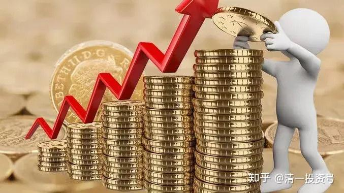
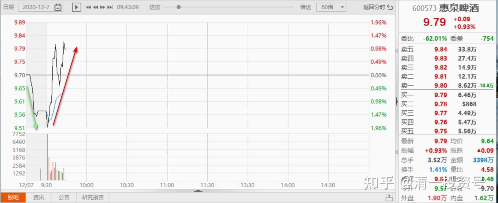
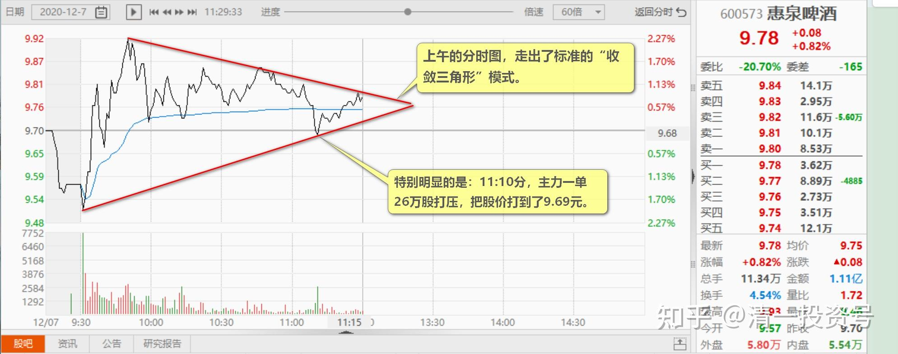
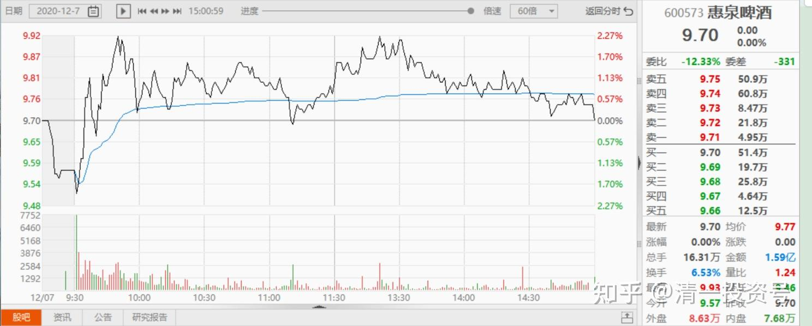
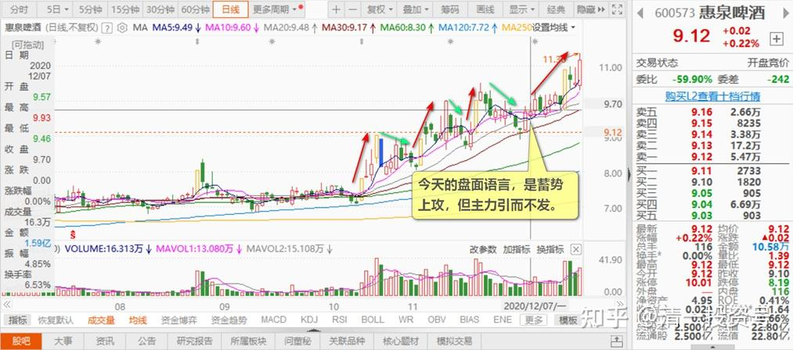

73篇.蓄势上攻，引而不发

清一山长2020年12月7日

[$惠泉啤酒(SH600573)$](http://link.zhihu.com/?target=http%3A//xueqiu.com/S/SH600573) 今天这个图形走势，就是公开地告诉你：我今天要涨的。

下午我就不说话了[俏皮]

[$惠泉啤酒(SH600573)$](http://link.zhihu.com/?target=http%3A//xueqiu.com/S/SH600573) 今天开盘急跌，我就说惠泉今天要涨了。反正我也不怕打脸，下午跌了我认错。

**开盘相对大幅的涨跌，都是主力出来秀的动作，刻意用来影响早盘的市场心理的。**急跌自然让小散心情不好，想骂人，想逃走。惠泉主力，知道你想逃走，只是跌了有点舍不得卖（因为你想前一天卖掉就好了，多赚一点），又赶快拉涨上来，给你机会，比上周五更高的价格出手。你这不就高高兴兴地卖掉了[大笑]。因为你怕又跌下去了。所以，我一看上午一个起落，主力动作很急迫，意图很明显，就判断主力今天要拉涨了。不过，基于看多不做多的原则，我没有追买。追一点小钱没意思，就算了。万一我看错了被打脸呢？**而且，今天普跌，惠泉涨了，我也没必要追。有余钱，我可以买别的跌的股去。**我上周末就说了：今天开盘A股要对美股创新高“鞠躬”的，果然应验。我就去买点“鞠躬股”不好吗？这就是我“看空不做空，反而做多”的怪脾气。惠泉看多、看涨的好处和机会，就让给你们了。我持仓不动看多空。说错了，打脸倒是不怕，就怕打翻了账户[俏皮]。

今天开盘后面上午的走势，的确走得就像教科书一样准确。所以特别贴图留下来纪念一下今天这个特别的日子（我认为应该是真正破10元的日子，原来破10，都是假破）。**上午的分时图，走出了标准的“收敛三角形”模式。**这表示主力通过震荡洗筹，已经把浮筹洗刷比较干净了。做好了拉升的准备。**特别明显的是：11:10分，主力一单26万股打压，把股价打到了9.69元。**

正好比昨天收盘低一分钱。我认为这个动作，**是最后的起跳深蹲动作。**下午应该不会出现比这个价格更低的价格了。**下午应该是拉升时间。**如果我所料不差，下午开盘一两分钟内，股价就会突破今天上午的高点9.93元。今天收盘，应该在10.01元以上。**为什么是这个价？因为这是这一个月来的高压线，今天必须突破，惠泉才会走上上升通道，K线图才有好看。**否则就还要震荡磨叽一段时间的。**突破以后，未来10元会成为新的“9元区”。**至于会不会在“10元区”来来回回地磨上一个多月？我看不一定。但我也不多说了。说多了不好。

已经说好了，10元之后，我就不说惠泉了，悄悄的发财就是了。主力不喜欢我剧透精彩剧情，您只要拉过10元就行了。10元以上，如果冒我名字，出来说惠泉，买惠泉的，就是假的。大家直接拉黑就行了。[俏皮]

下午看主力不想表演，我就睡觉去了。刚起来看看盘：居然收到了昨天的收盘价上[吐血]。好吧！承认再度被主力打脸，今天我说错了。本来就是，你想拉就拉，我想跟就跟的。反正我也不急，我一股不少，一股不多，判断错误，我也没损失。

**今天的盘面语言，是蓄势上攻，但主力引而不发**。这种盘面，**吸引了一些右侧交易的跟风客进入。**实际上，坦率一点说，今天下午的盘面，主力已经派了一些货出来，就是主力自己做T了。今天不拉，继续关前蓄势。

**上午的盘面是拉升的盘面，主力拿货的。**很奇怪下午就改了，变成了主力小派发的场面。估计是改了主意？还是要故意做点反向，进一步迷惑人？

这个主力看样子是上海人（不是说上海的实力不行，而是操盘的主力，应该是上海人，精明，会算计，短线也做，长线也做。手上资金就算不多，也可以做得像模像样的，不乱秀肌肉。跟老白干这种喜欢秀，资金实力又大的主力，很不一样）。

有人猜主力十个亿资金，我说应该没有，**大约是3个多亿左右**。其中一个亿，还是白赚来的[大笑]。不过加上可以动用融资，他们可以动用的资金翻个倍吧（惠泉不可以用融资，但基金户可以抵押股份换融资的）！乱猜的，没有查别人的账户，也不知道咋查！

[双钱树那个娃](http://link.zhihu.com/?target=http%3A//xueqiu.com/n/%25E5%258F%258C%25E9%2592%25B1%25E6%25A0%2591%25E9%2582%25A3%25E4%25B8%25AA%25E5%25A8%2583)回复[清一山长](http://link.zhihu.com/?target=http%3A//xueqiu.com/n/%25E6%25B8%2585%25E4%25B8%2580%25E5%25B1%25B1%25E9%2595%25BF)：

怎么看待王德良的离职？董事里面唯一懂技术的。教授级人物，各研究中心主任，各协会会员。

清一山长回复[双钱树那个娃](http://link.zhihu.com/?target=http%3A//xueqiu.com/n/%25E5%258F%258C%25E9%2592%25B1%25E6%25A0%2591%25E9%2582%25A3%25E4%25B8%25AA%25E5%25A8%2583):

我买惠泉，看的是K线图，技术走势。我才不管谁当技术员呢！你那派，叫基本面分析之管理人员基本分析。我才没这闲心弄这些花头呢！我也不懂啤酒的技术，更不懂谁才是专家。我还不喝啤酒。我只知道教育行业谁是专家，因为我的主业是教育[俏皮]。

(标题、图片为编者所加)

**文章音频**：

[466篇.蓄势上攻，引而不发](http://link.zhihu.com/?target=https%3A//www.ximalaya.com/sound/745180443)

**参考链接：**

[66篇.讲鬼故事还是真减持](https://zhuanlan.zhihu.com/p/703026413)

[67篇.开盘这十分钟，才是最重要的时刻](https://zhuanlan.zhihu.com/p/704358659)

[68篇.中国的啤酒迟早会赚钱](https://zhuanlan.zhihu.com/p/705635827)

[69篇.炒股惠泉，长持燕京，珠江居中](https://zhuanlan.zhihu.com/p/706901073)

[70篇.隔山观火，不投入情感](https://zhuanlan.zhihu.com/p/707564067)

[71篇.从不缺乏热闹，只缺乏理性](https://zhuanlan.zhihu.com/p/709411110)

[72篇.为什么不要冲过9.60元收午盘](https://zhuanlan.zhihu.com/p/710752420)
