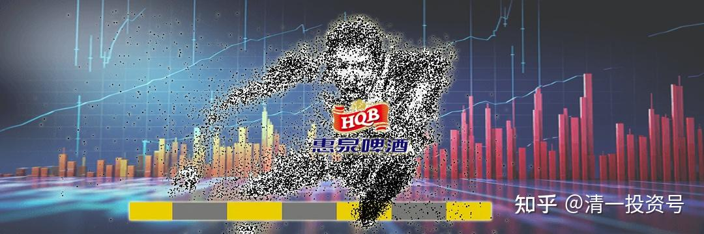
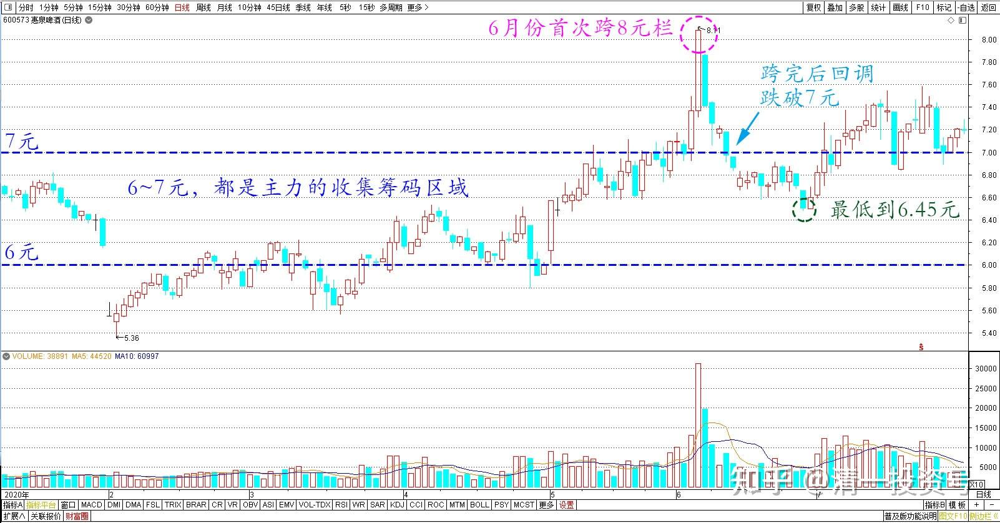
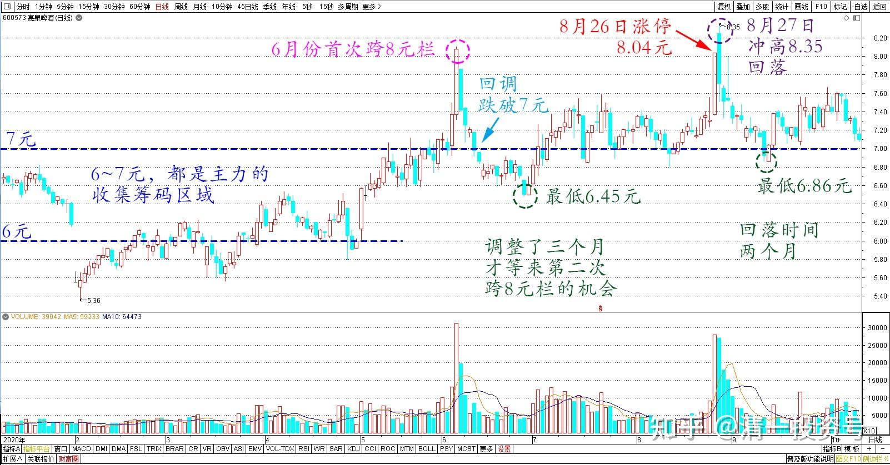
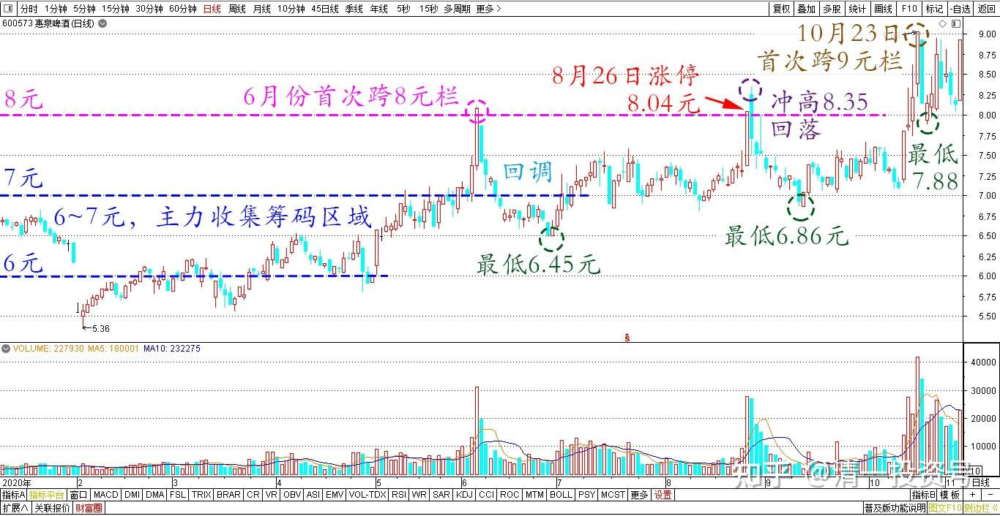
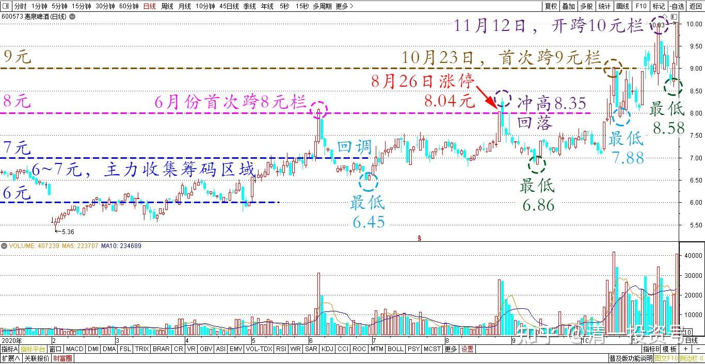
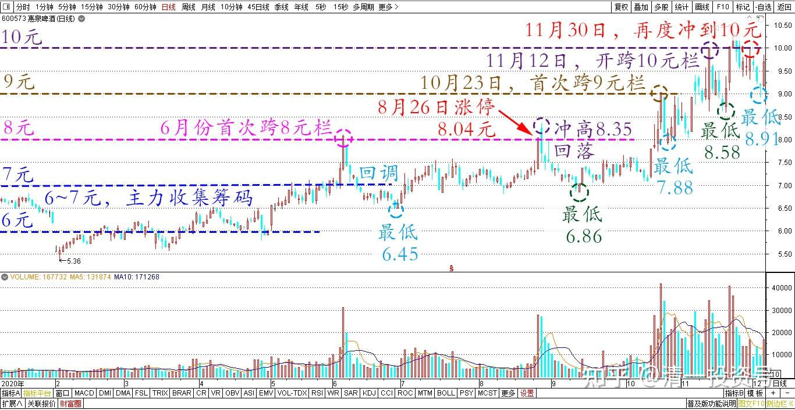
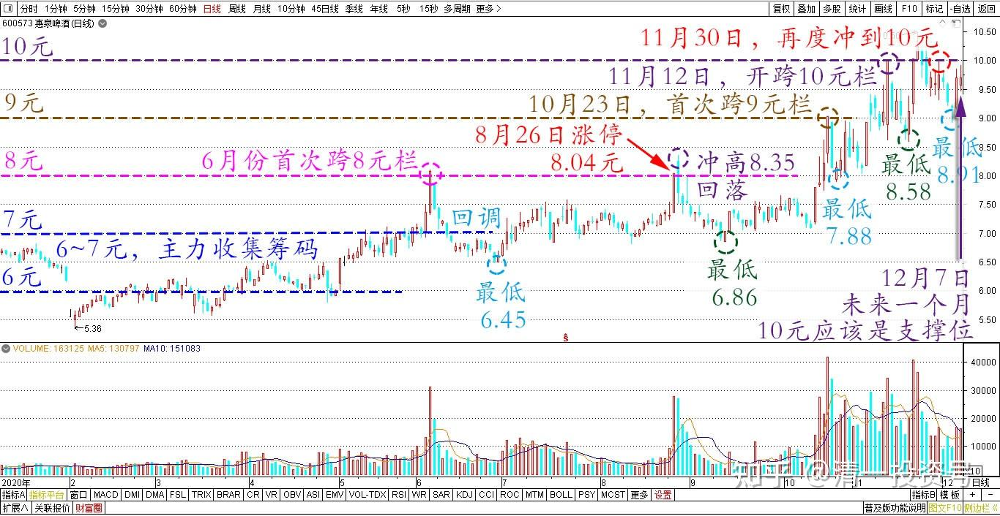
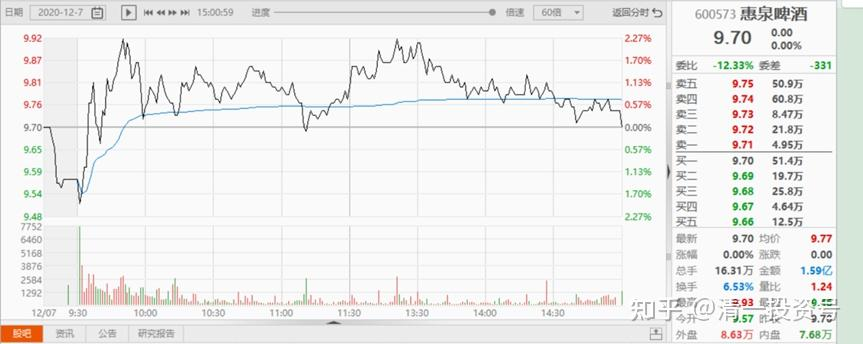
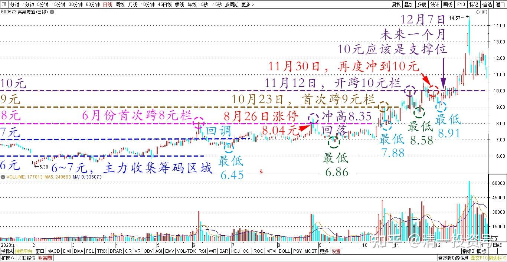

74篇.惠泉跨栏历史记录回顾

清一山长 2020年12月7日

[$惠泉啤酒(SH600573)$](http://link.zhihu.com/?target=http%3A//xueqiu.com/S/SH600573) 今年年初，从2月份的底部开始上升的惠泉，跨栏历史记录回顾：

**8元区栏：6～7元，都是主力的收集筹码区域。**

**6月份首次跨8元栏，**跨完后回调，跌破7元，最低到6.45元。

差不多调整了三个月，才等来了第二次跨8元栏的机会，8月26日涨停8.04元，第二天冲高8.35元回落，回落时间两个月，回落空间最低点6.86元。这一次，我出掉50%左右的仓位，但多买了100万股，各位已经从10大的持仓量上看出来了。为啥我多加了仓位？因为回调后我买入的价格（7元左右），就是主力的成本区，成本区加仓，没啥危险的，我感觉惠泉的主力已经出动，快涨了，所以多加了一百万股。这个月的底部，略略抬高了三毛钱**。跨8元栏的总周期长度，超过半年多（加上热身时间）。**

**

**

**10月23日，首次跨9元栏。**

最低回落到7.88元。调整幅度依然很大，但时间缩短了很多。这一次，我是收获最大的，因为我几乎卖出了全部的持仓，又几乎全部重新买回来了。

**11月12日就开跨10元栏了。**

跟8元栏需要半年的蓄势相比，明显主力加快了进程。10元栏跨过后，回调空间，时间都超过9元栏。最低回落到8.58元。

11月30日再度冲到10元，四天后快速下杀到8.91元，这应该是10元的最后一次大幅回调了。

这一轮，我没有卖光，只卖了150万股，现在已经重新全部买回来了，略超一点卖出的总量。11月30日这次冲高，因为没有放量，**即使是下杀破9元的确认回踩，也依然没有放量。说明9元的底部已经夯实，**可以往上多盖一层楼了。我认为：今天就是过10元，确认盖新一层楼的时间起点。目前依然没有放量。（这里的图片，是否是12月7日的价格走势和成交量）

10元区域的压力比较大，如果本次突破10元上方，**需要花费超过3亿元的成交来才能实现的话，**未来就还要调整一段时间的，破10元还无法最后确认。如果跨十元栏，**总成交量不高于2个亿元**，跨栏就算成功了。可以视10元为下一步的支撑价（**支撑价位，不是一定不会破，而是破了很快就收回，**就像3天前的9元支撑位，一破就回去了。所以这一个多月的时间，证明了9元就是支撑位。

**未来的一个月，10元应该是支撑位。**

**

**

除非盘子很轻，主力快速通过，就会不回踩10元，直接过11元。向长期阻力位12元发起进攻。但我认为：**12元阻力位，不是这么容易过的。可能会像现在的10元一样，一波三折吧？**

当然，我说了不算，主力说了才算。我原说下午开盘就要拉破9.93元了，结果主力吃完中饭，居然睡午觉去了。9.93元的当日高点，只有9万股的压单。不就是想吃就吃吗？它就是不吃，放在哪吊人的胃口。我也没办法，我现在不想吃这个单。一周后，再要给我这个价，我就吃[大笑]，我一口就把你吃掉。上次9元区调整的时候，我看到这种阻力位压单，就吃掉了。我认为大概率是主力压盘的单子。所以，我现在的仓位中，有不少是别人的压舱石[俏皮]。

[jakeangus](http://link.zhihu.com/?target=http%3A//xueqiu.com/n/jakeangus)回复[清一山长](http://link.zhihu.com/?target=http%3A//xueqiu.com/n/%25E6%25B8%2585%25E4%25B8%2580%25E5%25B1%25B1%25E9%2595%25BF)：

这是打脸了吗？

清一山长回复[jakeangus](http://link.zhihu.com/?target=http%3A//xueqiu.com/n/jakeangus)：

对呀！今天再度被打脸，您开心吧？可见，千万别预测短期走势，分分钟打脸的。
我经常被打脸的，我置顶的帖子，不是说了我是反向指标吗？你们该怎么办呢？很简单：跟我说的相反做，就行了。比如今天我说会涨的，您就当会跌的，赶快卖出，就对了[大笑]，至少跟我说的时候相比，现在您已经赚了一毛钱。而我说错了，我账上“损失”了二十几万。（实际上我想卖也卖不掉这么多，所以我这二十几万是拿不到的。但您的一毛钱肯定拿得到[俏皮]）！

(标题、图片为编者所加)

**文章音频**：

[468篇.惠泉跨栏历史记录回顾](http://link.zhihu.com/?target=https%3A//www.ximalaya.com/sound/747016014)

**参考链接：**

[66篇.讲鬼故事还是真减持](https://zhuanlan.zhihu.com/p/703026413)

[67篇.开盘这十分钟，才是最重要的时刻](https://zhuanlan.zhihu.com/p/704358659)

[68篇.中国的啤酒迟早会赚钱](https://zhuanlan.zhihu.com/p/705635827)

[69篇.炒股惠泉，长持燕京，珠江居中](https://zhuanlan.zhihu.com/p/706901073)

[70篇.隔山观火，不投入情感](https://zhuanlan.zhihu.com/p/707564067)

[71篇.从不缺乏热闹，只缺乏理性](https://zhuanlan.zhihu.com/p/709411110)

[72篇.为什么不要冲过9.60元收午盘](https://zhuanlan.zhihu.com/p/710752420)

[73篇.蓄势上攻，引而不发](https://zhuanlan.zhihu.com/p/712057223)
