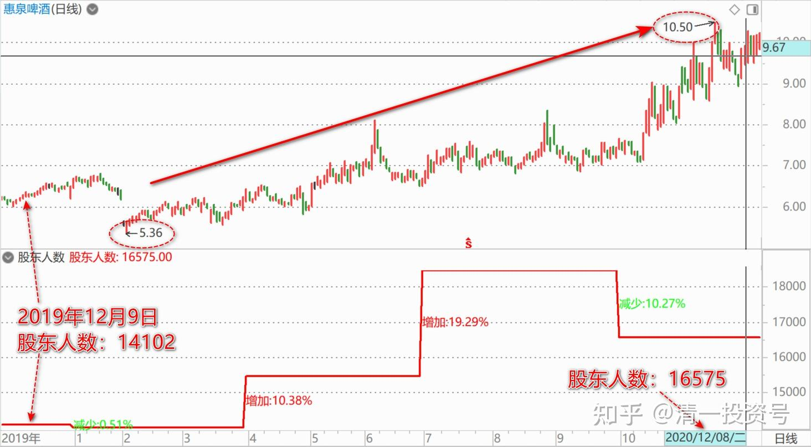
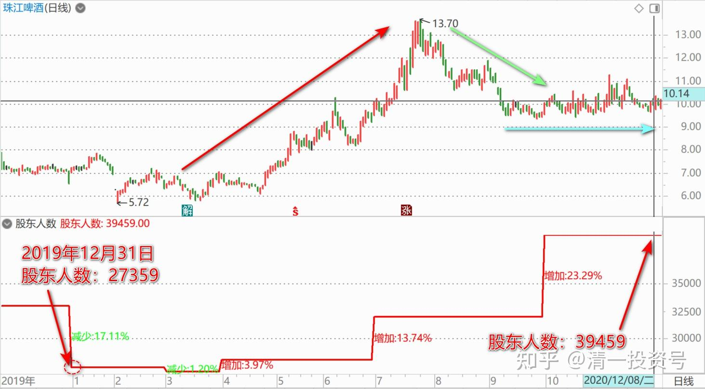
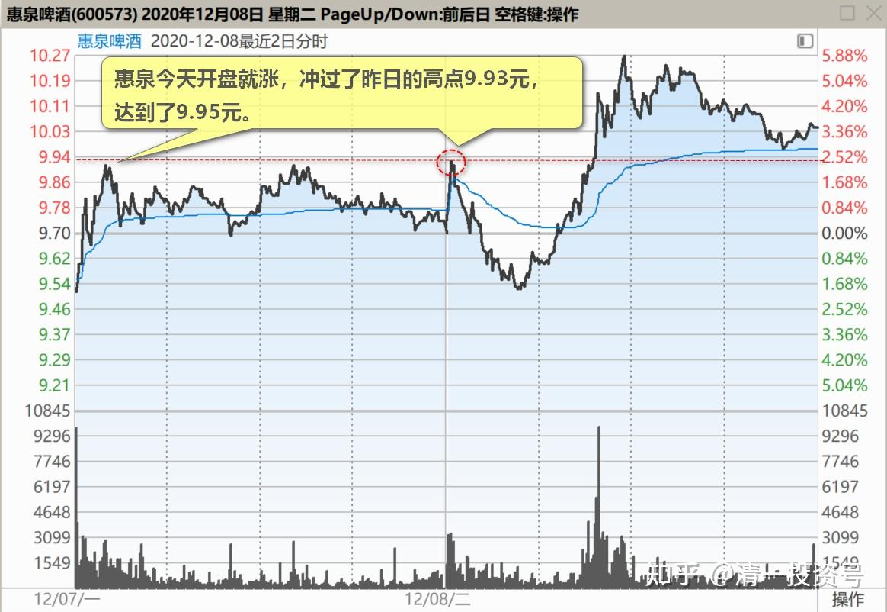
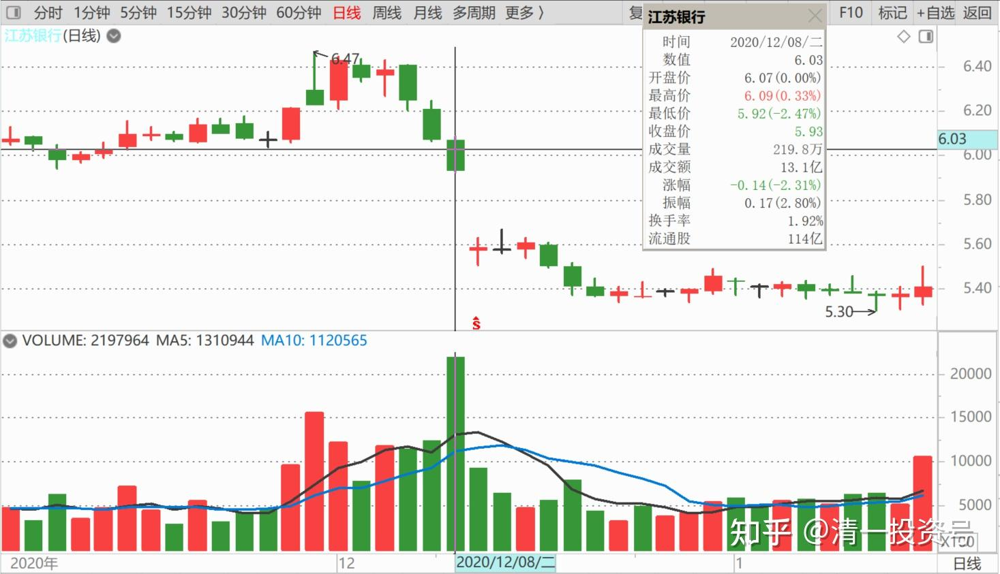
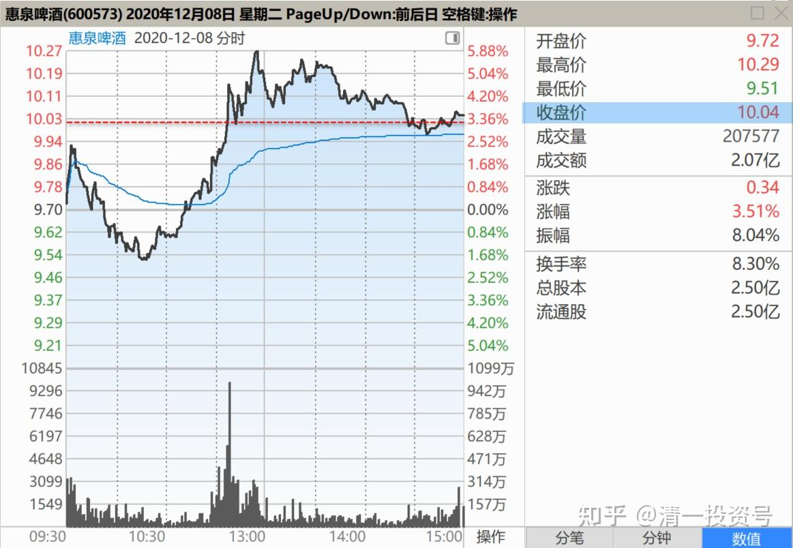

75篇.惠泉最成功的地方

清一山长2020年12月8日

[$惠泉啤酒(SH600573)$](http://link.zhihu.com/?target=http%3A//xueqiu.com/S/SH600573) **惠泉最成功的就是：股价涨了不少，但股东人数也增加不多。**去年年底我买入的时候，股东人数一万四，今年一万六。但浮动筹码并没有增加，我认为反而减少了。

**只有珠江的股东人数涨幅最大，从去年年底的两万七，涨到了今年三季度的三万九，珠江的筹码，的确是拉高让散户们接走了，所以现在股价低迷是有道理的。**还需要调整一段时间。

关于珠江：其实珠江的流通股，要比惠泉多多了，起码多五倍吧！（市值差距是十倍）。相对持股人数，还不如惠泉呢！

惠泉今天开盘就涨，**冲过了昨日的高点9.93元，达到了9.95元。一般来说，这种走势，就是今天要洗盘的，今天就别指望涨了**（当然，我说了不算，主力自有主张，涨跌由他定），我走了，锻炼身体去了。

关于江苏银行。今天是配股除权日，一些人会被迫卖出，应该会出现相对低点。准备下午开仓买一点参与配股，试试水。由于除权后，没有被动卖出的压力，股价应该不会跌了，除非跟随大势而跌。

[$惠泉啤酒(SH600573)$](http://link.zhihu.com/?target=http%3A//xueqiu.com/S/SH600573) 破10了——居然。主力原来一点也不喜欢拉高呀？还是看我没说话想我了？跌回我的发言区了？

要我说，我就不客气了：今天的走势与昨天一样的，上午是拉升，下午是洗盘。**说明现价主力还不是想涨的时候。自己做做T，赚点小钱，就满足了，也不破坏人气**。庄散其乐融融，都能赚钱。更能够吸引看好的跟风进入，做得不错，未来有前途。

今天冲过10元，估计原来跟我做的很多人跑掉了[大笑]。反正你们也不知道这钱咋来的，有钱赚已经不错了。就别指望过10元之后，我再指点你们跟庄揩油了。更别以为，可以用我原来示范的老方法来对付庄家，空手套利，白吃白喝。**未来的惠泉利润，会更加的丰厚，盘面会更复杂，走势会更精彩。**如果我原来的公开示范，都跟不上，还经常跟我反着做的小散，未来你更适应不了的。我就算公开示范，你们跟不上，可能还赔钱。你赚钱的时候一分钱没给我，赔钱了跑出来找我骂街，骂我是庄家的托，等等，我实在划不来。我就在惠泉最美好的时刻，彻底地离开惠泉，也免得有人猜疑我的动机，害你恶意猜疑、谩骂，犯下重罪，我也不忍心。所以我过10元就不示范操作了。**但我依然会积极地与庄家共舞，就算庄家拉到200亿，我也会用负成本来陪着一路前行的。只是不一定满仓，几十万股是必须的[大笑]。**感谢这几天庄家额外打赏的200万红包。

[穿云盘](http://link.zhihu.com/?target=http%3A//xueqiu.com/n/%25E7%25A9%25BF%25E4%25BA%2591%25E7%259B%2598)回复[清一山长](http://link.zhihu.com/?target=http%3A//xueqiu.com/n/%25E6%25B8%2585%25E4%25B8%2580%25E5%25B1%25B1%25E9%2595%25BF)：

你不是说过了10元你就不说了吗？

清一山长回复[穿云盘](http://link.zhihu.com/?target=http%3A//xueqiu.com/n/%25E7%25A9%25BF%25E4%25BA%2591%25E7%259B%2598)：

谢谢您的提醒，我会记住我不分析惠泉，不示范惠泉操作的诺言的[献花花]。

可是，我今天说了啥？我说了惠泉的技术？趋势？涨跌？下午走向？还是示范了我的操作，提示了进出？

我只是说：我感谢一直以来惠泉主力让我赚了钱。我没有技术分析，没有接盘、读盘，只有感恩之情。您的意思，就是要我啥话都不能说？连感谢惠泉主力的话也不能说吗？

我还想说：感谢惠泉的跟风小散呢！庄、散、粉、黑，我都统统感谢！[干杯]

(标题、图片为编者所加)

**文章音频**：

[470篇.惠泉最成功的地方](http://link.zhihu.com/?target=https%3A//www.ximalaya.com/sound/748494722)

**参考链接：**
[69篇.炒股惠泉，长持燕京，珠江居中](https://zhuanlan.zhihu.com/p/706901073)
[70篇.隔山观火，不投入情感](https://zhuanlan.zhihu.com/p/707564067)
[71篇.从不缺乏热闹，只缺乏理性](https://zhuanlan.zhihu.com/p/709411110)
[72篇.为什么不要冲过9.60元收午盘](https://zhuanlan.zhihu.com/p/710752420)
[73篇.蓄势上攻，引而不发](https://zhuanlan.zhihu.com/p/712057223)
[74篇.惠泉跨栏历史记录回顾](https://zhuanlan.zhihu.com/p/713488711)
