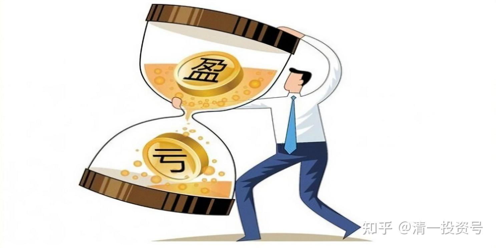
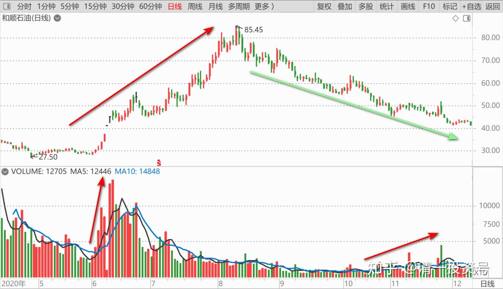
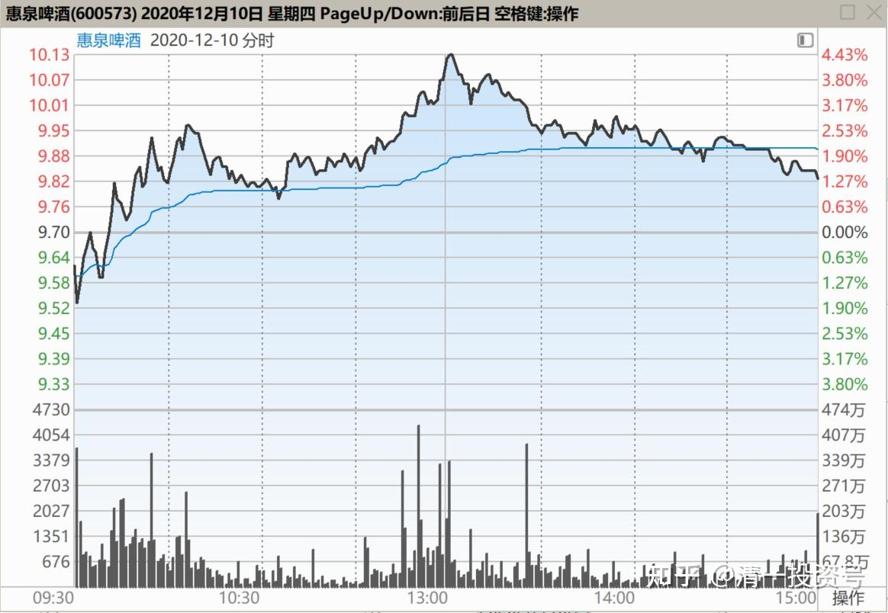
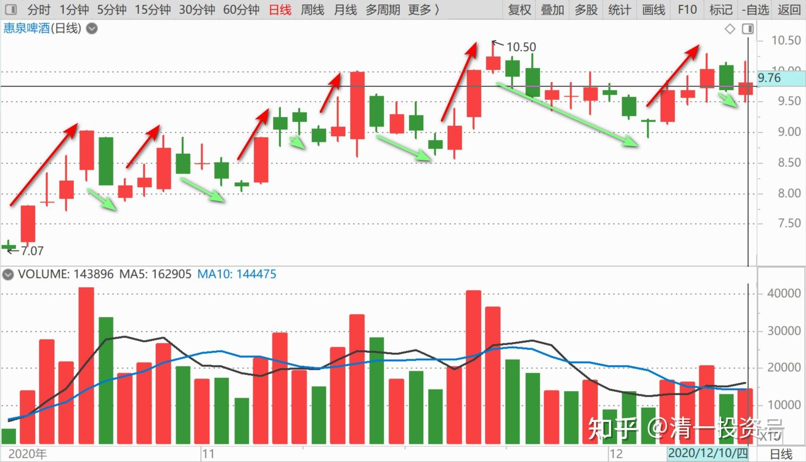
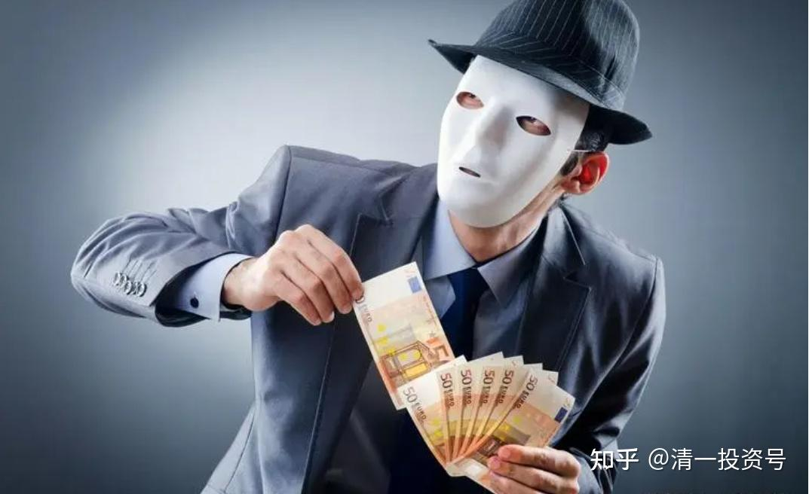

76篇.聪明人赚钱，傻人赔钱

清一山长2020年12月10日

[$惠泉啤酒(SH600573)$](http://link.zhihu.com/?target=http%3A//xueqiu.com/S/SH600573) 敬佩惠泉主力[很赞]。好庄、聪明庄[献花花]。让看得懂、跟得上的聪明人一起赚钱，让看不懂、瞎忙活的笨蛋赔钱，这就是好庄。股市上，没有慈善家，没有圣母，这里只有两种人：赢家和输家！

无论庄，还是散，进入赌局，结果都一样：**聪明人赚钱，傻人赔钱。**不管你是钱多钱少，不是钱多多就多赚钱，钱少少就不赚钱的。而是**聪明、懂事、有眼色、会让钱越来越多；没脑子、没眼色、自以为是的傻瓜，会让钱越来越少的。**

和顺石油，就是傻庄、笨庄。**会动脑子的聪明庄赚钱，不会动脑子的傻庄赔钱。**这个道理，大家深思。**连有钱的庄，都会套牢，而且比散户还不如，他连割肉都割不掉。**散户一旦认错，就可以割肉走了，一切重新开始。和顺这种庄，连认错的机会都没有，割肉都割不掉。所以，上帝爱穷人，是有道理的。

我们小散，钱不多，影响不了市场，其实也没关系。如果居然脑子也不够用，不想动脑子，总以为自己一点小钱，就可以买入就上涨，卖出就下跌，跟个大V就包赚不赔，不就是脑子有病找抽吗？只有看穿了市场的动向、主力的动静，你才会赢[献花花]。

再次感谢惠泉主力的打赏！**没有您的慷慨之举，大幅的拉高打低，我就不可能拿到这么多的筹码，也赚不到这么多的利润！**多谢！多多谢！[干杯][干杯][干杯]

[就是小白菜](http://link.zhihu.com/?target=http%3A//xueqiu.com/n/%25E5%25B0%25B1%25E6%2598%25AF%25E5%25B0%258F%25E7%2599%25BD%25E8%258F%259C)回复[清一山长](http://link.zhihu.com/?target=http%3A//xueqiu.com/n/%25E6%25B8%2585%25E4%25B8%2580%25E5%25B1%25B1%25E9%2595%25BF)：

山长神机妙算[鼓鼓掌]可惜以后就难看到山长惠泉啤酒的解盘了……

清一山长回复[就是小白菜](http://link.zhihu.com/?target=http%3A//xueqiu.com/n/%25E5%25B0%25B1%25E6%2598%25AF%25E5%25B0%258F%25E7%2599%25BD%25E8%258F%259C)：

正好锻炼你们的独立思考、判断的能力[献花花]。我已经示范了这么久，证明这是可以做到的。不难[笑]

[奔向2021](http://link.zhihu.com/?target=http%3A//xueqiu.com/n/%25E5%25A5%2594%25E5%2590%25912021)回复[清一山长](http://link.zhihu.com/?target=http%3A//xueqiu.com/n/%25E6%25B8%2585%25E4%25B8%2580%25E5%25B1%25B1%25E9%2595%25BF)：

长老，和顺走势很有艺术、很美，庄家不纠结是性格爽快之人。6月到8月涨一波顺溜，8月跌至今天顺溜，上生下死起码不折磨人。[大笑][大笑][大笑]以后也一样，这庄估计生活中也不会干苟且偷生之事。

清一山长回复[奔向2021](http://link.zhihu.com/?target=http%3A//xueqiu.com/n/%25E5%25A5%2594%25E5%2590%25912021)：

不是您说的这样，真正的庄家应该没有这么傻的，但凡有点操作的常识、买卖股票的常识，就知道不能这样玩儿的，这是直接找死的。我怀疑，**这是一个很大的局。但目标不是散户，而是金主（出钱的人），中了金融界狼群专门订制的套了。**现在很多土包子企业家，实业上赚了钱，二代也接班了，手上钱多多。也想赚点“聪明钱”，以为花钱聘用一堆“专家”操盘手为他们打工，就可以比父辈更轻松、容易地赚钱。这种二代，（也可能是一代转型来玩的），自然就成了金融猎人们的猎取对象。谁让你以为有钱就能坐庄的？**有钱不稀奇，有脑子的人迟早会有钱，而有钱没脑子的人，迟早会没钱。**

告诉各位，这不是我乱猜的，我经历多了。比如我自己，**就有不少人，专门设局来让我钻的。我想做什么事，想要什么，都有人“主动出来帮我”，以“合作”的名义，来做我“不懂”的事情。**

比如，最近我发了要办大学的心愿，就有人专门来找我的助理，拿了一个很不错的办大学的成熟方案，表示有人正在办一个跨国大学，“湄公河六国大学”。已经通过了政府的支持等等，如果我们愿意，可以一起参与进去，是个好机会。我的助理信以为真，觉得机会甚好，就转资料给我看了。我看了一眼，就告诉助理：这个局，是专门为我们定制的专门产品，就为了套我们的。这套资料，是专门定向为我们编写的。我看得出漏洞，专门针对我们的需求来做的。目标是什么？少说一点，可以骗吃骗喝，骗点代办费。往深处做，可以骗走我们几亿、几十亿资金，就看我们想投多少了。而且，这是一个群体，背后各种人物都会出现，真的、假的各种身份，纷纷冒头。我说完，把我的助理惊得一身冷汗。我说没关系，你看戏就行了，长长见识。[大笑]

这是真事。骗子来找我，分分钟显原型。但还是不断有骗子来找我。所以，我特别不爱见人，深居简出。不认识的人找我，只能见我的助理，免得天天跟骗子浪费时间。但是，中国富二代，根本就没江湖经验，未来就惨了。家长没教育好他们，几十年创业的财富，就要泡水里了。几年就可以弄光掉，手段多多的，别看他们现在风光！

[归于朴](http://link.zhihu.com/?target=http%3A//xueqiu.com/n/%25E5%25BD%2592%25E4%25BA%258E%25E6%259C%25B4)回复[清一山长](http://link.zhihu.com/?target=http%3A//xueqiu.com/n/%25E6%25B8%2585%25E4%25B8%2580%25E5%25B1%25B1%25E9%2595%25BF)：

山长，这很像《[我是个算命先生](http://link.zhihu.com/?target=https%3A//book.douban.com/review/13993972/)》里说的扎飞啊！

清一山长回复[归于朴](http://link.zhihu.com/?target=http%3A//xueqiu.com/n/%25E5%25BD%2592%25E4%25BA%258E%25E6%259C%25B4)：

没错。这行当，不会因为祖爷死了，就消失了。这是几千年的传统行业，现在依然代代相传。我在泰国，也有遇到对我施展“扎飞术”的。都是华人，特别的精于此道。**你们出国，最要防范的，是靠近你“帮忙”的华人。**（这绝对不是说海外的华人都是骗子，而是**华人中的正经人，都在忙自己的事情，没空理你的。出国后，主动跟你套近乎的华人、华裔后代，很多都是骗子，“扎飞”专业的[俏皮]**）。

[海3d0](http://link.zhihu.com/?target=http%3A//xueqiu.com/n/%25E6%25B5%25B73d0)回复[清一山长](http://link.zhihu.com/?target=http%3A//xueqiu.com/n/%25E6%25B8%2585%25E4%25B8%2580%25E5%25B1%25B1%25E9%2595%25BF)：

庄家和散户一样，一直做T，高抛低吸，不像有些老庄锁住下方筹码不动，拿小部分筹码拉升，惠泉的庄家基本拿出全部筹码在做T，人气搞起来了，成本也降低了，这也说明惠泉的庄家本金不大。按照庄家性格，估计连续拉十几个大阳线到一定区域再出货，现在9.5元左右大胆进，别T飞就行。

清一山长回复[海3d0](http://link.zhihu.com/?target=http%3A//xueqiu.com/n/%25E6%25B5%25B73d0)：

瞎说一气，好像您是庄家的小弟一样[吐血]。

(标题、图片为编者所加)

**文章音频**：

[472篇.聪明人赚钱，傻人赔钱](http://link.zhihu.com/?target=https%3A//www.ximalaya.com/sound/750347907)

**参考链接：**
[70篇.隔山观火，不投入情感](https://zhuanlan.zhihu.com/p/707564067)

[71篇.从不缺乏热闹，只缺乏理性](https://zhuanlan.zhihu.com/p/709411110)

[72篇.为什么不要冲过9.60元收午盘](https://zhuanlan.zhihu.com/p/710752420)

[73篇.蓄势上攻，引而不发](https://zhuanlan.zhihu.com/p/712057223)

[74篇.惠泉跨栏历史记录回顾](https://zhuanlan.zhihu.com/p/713488711)

[75篇.惠泉最成功的地方](https://zhuanlan.zhihu.com/p/714477508)
