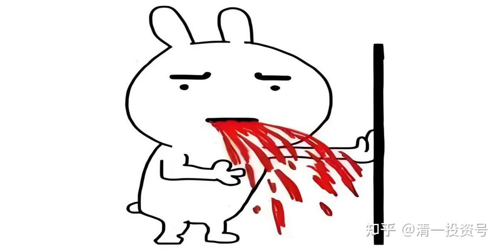
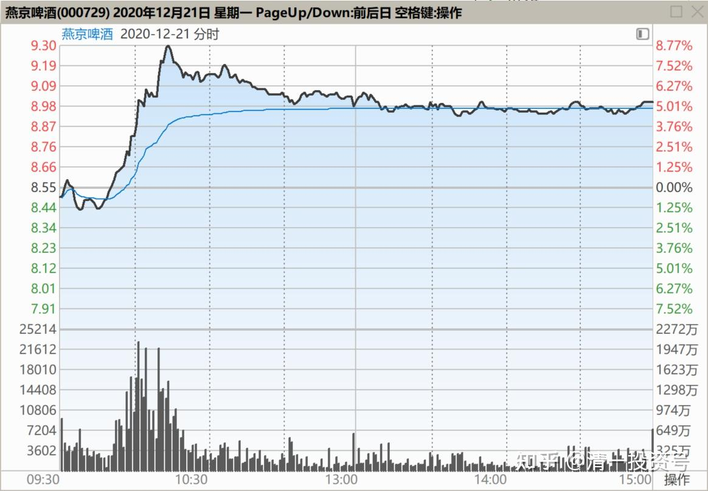
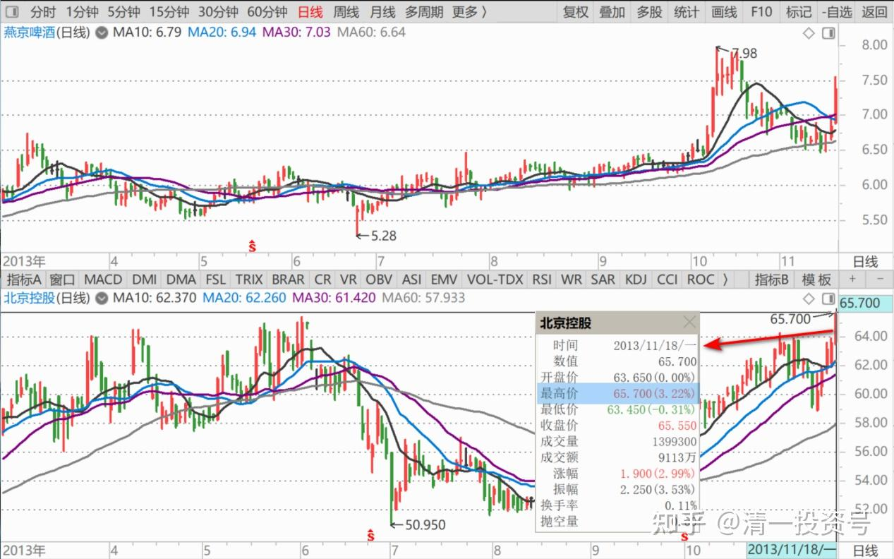
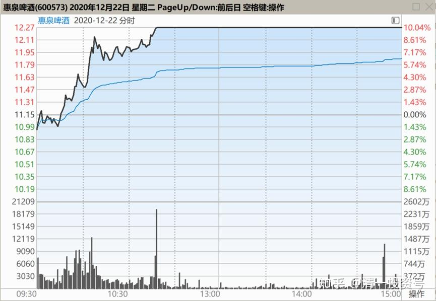
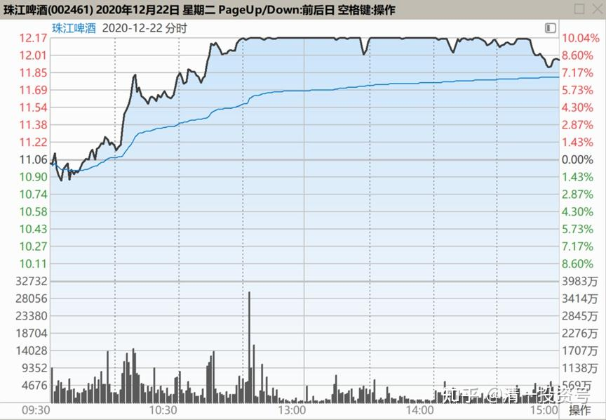
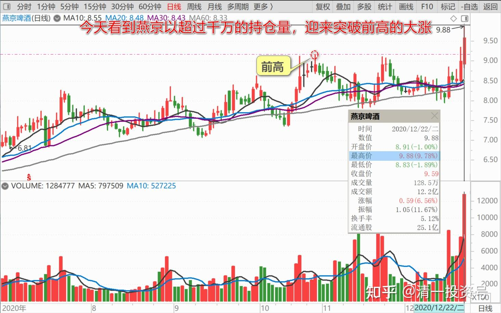
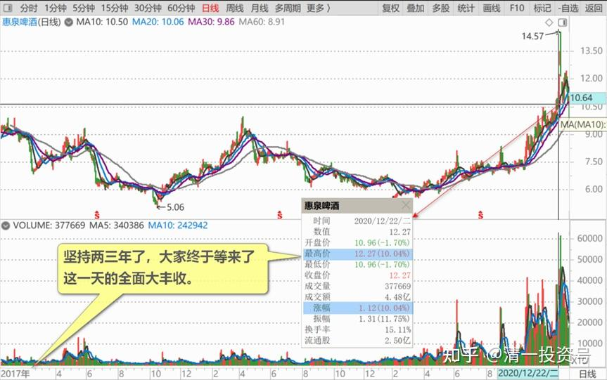
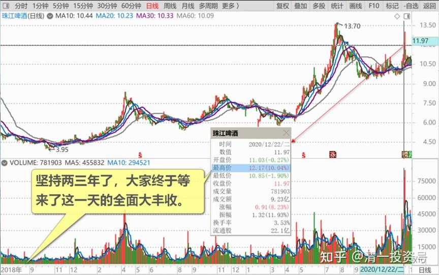

78篇.你这样做，庄家会吐血

清一山长2020年12月21日～22日

**一、没涨过10元死拿不卖，敢跌破8元使劲买2020-12-21**

[$燕京啤酒(SZ000729)$](http://link.zhihu.com/?target=http%3A//xueqiu.com/S/SZ000729) 这几天我没出来说啤酒。因为惠泉已经涨过了10元，我不敢说了。珠江也一直在10元以上游荡，我有啥可说的？于是就有人总问我，让我说说燕京，其实燕京有啥好说的？**没涨过10元，你就死拿，就是不卖，你看是谁耗得住。敢跌破8元，你就使劲买，**看他舍得卖多少给你。**你就做好打8年抗战的准备，至少准备打三年解放战役。**做好坚壁清野，别让燕京庄家上上下下地吃到你了。说不定，有一天不小心就看到：燕京无惊无险的就终于过十元了。想走，你就拿了钱就走，不想走，继续等15元。勇敢地再拿三年，看他敢给你跌回5元不？

我保证，你这样做，庄家会吐血的。我猜看到这帖子，庄家就开始气到要吐血了。谁让你们唧唧歪歪的，一直不拉燕京过10元？我只好让你不痛快了。

**二、燕京超越北控**

[$北京控股(00392)$000729燕京啤酒市场正式超越北控。燕京当下收9.76元，275亿人民币市场，人民币兑港元汇率是1.1835.即燕京的市值是325亿港元，而北京控股自身却只](http://link.zhihu.com/?target=https%3A//xueqiu.com/1026721405/166376454)

清一山长2020-12-22评论上文

母子公司，不同步很正常。有时母贵，有时子贵，说不清逻辑的。当初（2013年），北控涨到65元的时候，燕京啤酒才多少钱？5元多而已。当时持有燕京啤酒的人，看母公司这么红火，都在盼望北控来拉一把呢！
啤酒现在进入“赛道”了，母公司还在场外候选。不过，**都明牌了，需要更多耐心。**北京的股都很磨人，我被顺鑫磨过好久，上上下下的折磨，结果还算好。也许，想追燕京追不上的人，就会跑来追北控了。

**三、惠泉涨停、珠江涨停、燕京突破前高2020-12-22**

[$燕京啤酒(SZ000729)$](http://link.zhihu.com/?target=http%3A//xueqiu.com/S/SZ000729) 祝贺各位一起买啤酒的朋友们。惠泉啤酒涨停，珠江啤酒涨停。

**坚持两三年了，大家终于等来了这一天的全面大丰收。**最近两年，我押宝啤酒，重仓啤酒，今天看到燕京以超过千万的持仓量，迎来突破前高的大涨；看到珠江以负成本持有的超过百万级持仓迎来涨停；**看到我的啤酒股投资，创造了我持股利润的新纪录，而且，主升浪还刚刚开启。**我们度过的，仅仅是最艰难的，也最重要的“总攻前奏”阶段。**真正的甜头，利润最丰厚的阶段，现在才刚刚开始。**今天一天，我的账户就获得了超过千万的利润，这种日子，在今后会常常发生的。当然，也会一天之内，就会有超过千万损失的账户记录。这些都是以后的常态了。真是感叹万千。

前不久，我还压上了能够动用的全部融资额度，大量的买买买啤酒：8元前后的燕京，9.5元前后的珠江。不断买入。**死死拿住“就是不涨”的燕京，艰难地度过了“重阳减持退出”的冷笑话，坚持下来，的确殊为不易。**我知道有很多买啤酒的人，都倒在了黎明前。特别是燕京，被干掉的人太多了。珠江最近这几个月的调整，也让很多人望而却步，全然忘记了珠江有着最好的基本面，价格才9元多的珠江，就是送你的摇钱树。**但因为不涨，还因为大股东减持，让人心中惶惶。但我坚持认为：这就是珠江必将大涨的症状，所以9元多不断买入。**去年，我说今年是我的啤酒年，去年我买成了两家啤酒上市公司的十大股东。但今天，已经到了年底，啤酒才开始真正的兑现诺言，兑现利润，才开始真正地进入主升浪。而我现在的啤酒持仓，要比去年年底的啤酒持仓还多一倍，我是且战且进。也因为去年我的融资额是零，今天是满融，大多数是啤酒仓。所以今天以比去年多一倍以上的啤酒仓位迎来大涨，我很高兴抓住了这一次历史的机会。如索罗斯所言：如果你明确自己拥有最大的把握，为啥不持有最大的头寸？我实现了这一点——大量的专注投入，而不是浅尝辄止。**因为8元以下的啤酒，几乎没有风险，只有利润。当然要不断地买买买。**

终于等到了现在：**最精彩，利润最丰厚，也是风险最大，追涨杀跌最具威胁性的时刻，现在终于到来了。连续涨停，让人欢呼雀跃的时刻，也终于要来到了。比如惠泉的示范！**

特别幸运的是：昨天一大早，还没开市，我还挂单10.41元买入几十万股惠泉啤酒，居然还成交了。今天再度大仓位迎来惠泉的涨停。惠泉的活力，将在未来大大的激发，将比原来的惠泉玩得更加的精彩，大家拭目以待吧！

为了庆祝今天啤酒大面积涨停，我决定出掉百万股以上的仓位，庆祝一下，也让想买啤酒却因为涨停而着急买不到的朋友们高兴一下，大家一起共同分享啤酒的盛宴。**我不是觉得以后啤酒就不会涨了，我说了，主升浪还在后面。**但我有纪律要求：很多啤酒仓位，我是用融资开仓买入的，我这段时间买了好几百万股珠江和燕京，现在，我该还掉一部分融资了。**我用5%多一点的年利息买入，现在已经换到了30%的收益，是白赚的一笔钱，该满足了。还剩下不少融资仓位，我就慢慢还，涨一点，卖一点。**反正我今天这一次还融资，已经把未来五年的融资利息都全赚回来了，再坚持几年持仓不赚钱，也没问题——这话是给中建、江苏银行的仓位说的。（我算过，每年我贡献的融资利息和红利税，都是大几百万上千万了，我是光荣的纳税人[大笑]）

[干杯][干杯][干杯]各位朋友，敬酒三杯，喝了我们的三大啤酒！[赞成]

(标题、图片为编者所加)

**文章音频**：

[476篇.你这样做，庄家会吐血](http://link.zhihu.com/?target=https%3A//www.ximalaya.com/sound/754092310)

**参考链接：**
[70篇.隔山观火，不投入情感](https://zhuanlan.zhihu.com/p/707564067)

[71篇.从不缺乏热闹，只缺乏理性](https://zhuanlan.zhihu.com/p/709411110)

[72篇.为什么不要冲过9.60元收午盘](https://zhuanlan.zhihu.com/p/710752420)

[73篇.蓄势上攻，引而不发](https://zhuanlan.zhihu.com/p/712057223)

[74篇.惠泉跨栏历史记录回顾](https://zhuanlan.zhihu.com/p/713488711)

[75篇.惠泉最成功的地方](https://zhuanlan.zhihu.com/p/714477508)

[76篇.聪明人赚钱，傻人赔钱](https://zhuanlan.zhihu.com/p/715051514)

[77篇.在确定企业价值的基础上进行金融投机](https://zhuanlan.zhihu.com/p/717031167)
