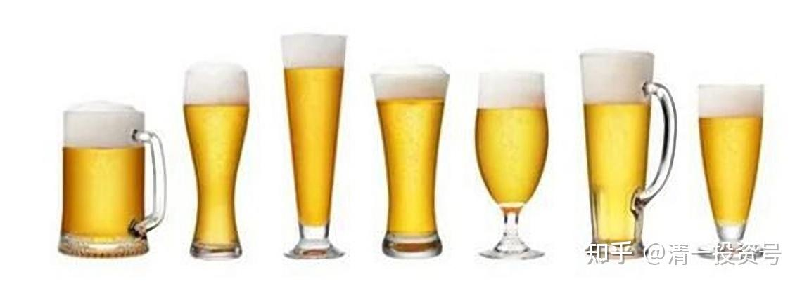
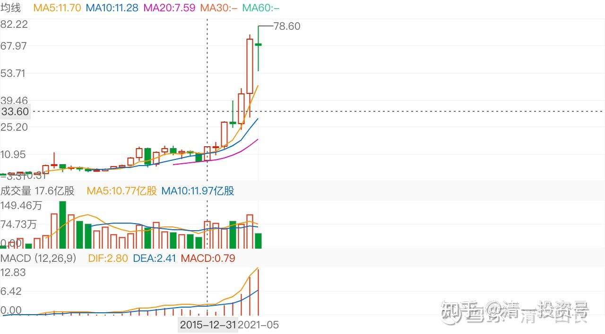
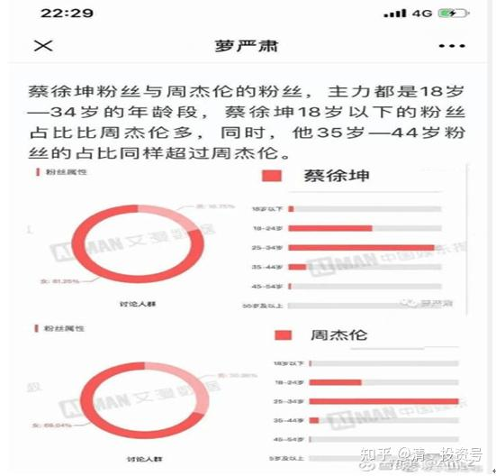
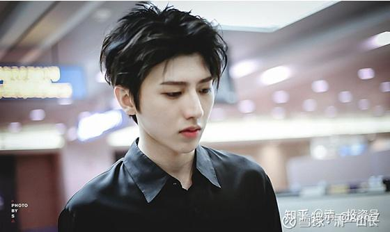
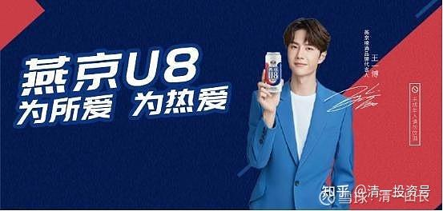
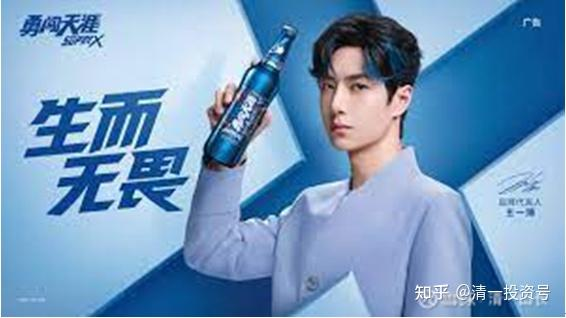
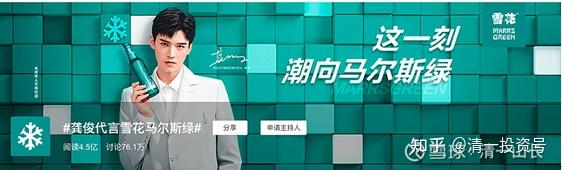
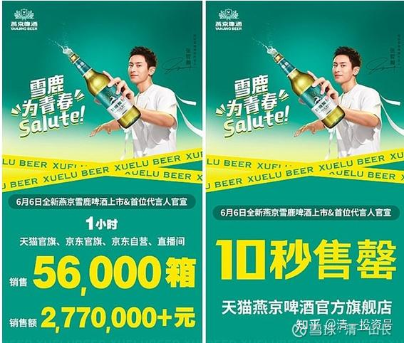

7篇.痛失华润，买入持有中国女人最爱喝的潮酒的逻辑

清一山长 2019年5月8日～2021年6月8日

**一、痛失华润**

[蓝莓财经](http://link.zhihu.com/?target=https%3A//xueqiu.com/1191990433)[2019-05-07 21:31](http://link.zhihu.com/?target=https%3A//xueqiu.com/1191990433/126261521)

**后劲不足的燕京啤酒，能否打赢翻身之战？**

[https://xueqiu.com/1191990433/126261521](http://link.zhihu.com/?target=https%3A//xueqiu.com/1191990433/126261521)

[清一山长](http://link.zhihu.com/?target=https%3A//xueqiu.com/9310099567)[2019-05-08 10:37 评论上贴：](http://link.zhihu.com/?target=https%3A//xueqiu.com/9310099567/126288461)

有数据显示，2016年我国啤酒产量达到4562.71万千升，占全球总量1.93亿千升的24%，超出第二名美国近一倍之多。

啤酒中国产量世界第一，利润呢？连零头都不到。只要有一天恢复正常的利润，中国啤酒成为利润世界第一，啤酒股市值世界第一，将来是毫无悬念的。茅台可以市值万亿，啤酒未来市值万亿也未必不可能。所以，**我投资啤酒股，就是买困境反转的行业。至于燕京是否龙头倒是不重要。因为我错过了买入16元港币的华润，一直耿耿于怀。只好找珠江和燕京了，吃点啤酒的鸡肋，总比吃鸡毛好**[大笑]。

[清一山长](http://link.zhihu.com/?target=https%3A//xueqiu.com/9310099567)[2021-05-18 18:36](http://link.zhihu.com/?target=https%3A//xueqiu.com/9310099567/180185622)

[$华润啤酒(00291)$](http://link.zhihu.com/?target=http%3A//xueqiu.com/S/00291) 分享一下，这是我错过的牛股，也是我心头一直的痛，痛失良机的痛[哭泣]。在它原来还不叫华润啤酒的时候，其他的非啤酒资产还没有剥离的时候，我就在关注它，关注啤酒赛道了。我最先研究的是华润，却没有买到。我在2016年就开始研究华润，12元到20元之间，一直想买入，却因为不断上涨，没有给我时间买入（因为我的惯性是不追涨）。但总觉得——我的持仓，失去啤酒的资产，很可惜。所以，2017～2018年，就买了处于10年底部的珠江啤酒，以及2019年成为惠泉、珠江双十大。**20年重仓燕京啤酒，原因就是认为啤酒的同质性很高。不像白酒，有稳定的顾客群。其实啤酒主要是收到地域的销售半径的限制，以及经销商对于地区的控制权、专销权。但随着易拉罐，以及网上销售的崛起，将打破地域壁垒限制。**这些原本是小厂的不利地位，就慢慢变成了大厂的噩梦。对花了不少代价，才获取的护城河，被对手绕过去了。燕京啤酒的**“大单品、网络化”**战略，就是破局华润最有力的利器。找到了华润的薄弱环节。未来华润最大的敌人，不仅仅是青岛，也是燕京。所以，当看到PB1倍多的珠江，十年不涨的燕京，自然成了我的首选替换标的。华润的PB，我一直嫌太高，它有领先上涨，结果现在越来越高。我失去了华润的机会，不想再失去珠江和燕京的机会。

如今的燕京啤酒，靠着**独一无二的【小鲜肉】**切入点，必将大大扰动啤酒行业的江湖，我认为它是未来最有可能弯道超车的啤酒企业，华润大概率无法保持现在的优势。当然，不是说华润会下跌，而是燕京未来五年的上涨幅度，会超过华润的。我坚信这一点，就用今天这个帖子来作证吧：燕京今天的收盘价是7.88元，一个有点意思的数字,华润的收盘价，是68.3元。五年后，看看谁涨得更多？

希望未来的燕京啤酒，未来的五年，也走出下图中华润的上涨图形，下面是华润的季线图，你看看年线图，更明显。我会静候花开的。重阳在涨升之前就走了，也许，这是重阳的一个历史性大笑话。我难以想象老谋深算的重阳系，会犯这种低级的错误。我更愿意相信，燕京啤酒，会是唐建华的第二个上海电力。他在2007年12月建仓，到2015年三季度清仓[上海电力](http://link.zhihu.com/?target=https%3A//xueqiu.com/S/SH600021%3Ffrom%3Dstatus_stock_match)，持股时间长达8年，获利4～5倍。资产总值从一个多亿，陡然上升至5亿左右。他从上海电力出来之后，两年内，都没有看到动静。在2017年年报，就进入了燕京，首期就买入了4000多万股，持仓市值3个多亿。接下来一直买到5千多万股。持仓市值接近五亿。一直潜伏至今。应该是他在上海电力上获得的全部资产都打进来买燕京了。目前，他已经坚持持有了四年，期间多次冲高9元，10元而后回调到5-6元。但唐建华连仓位变动的动作都看不到。目前的价格，依然在唐建华的成本价附近，没有多少获利的空间。我相信，这又是唐建华的一个8年抗战。我将与他进入同一条战壕。这个坑，我看确定性，比上海电力要好得多！

华润，在2007年的峰值是14元，燕京当时的价格是12元。华润后面跌到最低价4元多，燕京也跌到5元左右，跌幅都很大。如果您当年一直持有华润，甚至不断做T。你等它冲过历史高峰，就走了，现在它的价格已经到了78元。您会不会气死？

我说过：燕京20元不是梦。因为，华润已经作了示范，它们两很相似。华润是北京国资委管理，燕京也是。别低估了北京国资委的智商，他们绝对是聪明人。燕京主要品牌一直亏，其实就是这两大品牌一直在拼市场，两家咬得很紧的。华润今年捡漏，把王一博要过去当代言人了。其实已经输给燕京一招了。我不要求燕京涨到78元，这可能太不现实了，但涨到20元，基本是起码的目标。唐建华10元不走，你以为给他12元，他就会走吗？肯定不会的。区区8元就走的，是眼光短浅的裘国根，是重阳，不是他。我自己对20元钱的燕京不会松口的（一些做T的融资案会卖掉），再拿五年我都不放手。主仓位，我会一直等燕京20元以上的时候再考虑放不放手。

燕京啤酒和中国建筑，最近这五年，都是最折磨人的股。未来五年，也许就是回报最丰盛的股票，我们期待未来的丰盛，并忍受现在的寂寞吧！

（华润啤酒 2015～2021年K线图）

[还是种地踏实](http://link.zhihu.com/?target=http%3A//xueqiu.com/n/%25E8%25BF%2598%25E6%2598%25AF%25E7%25A7%258D%25E5%259C%25B0%25E8%25B8%258F%25E5%25AE%259E)回复[清一山长](http://link.zhihu.com/?target=http%3A//xueqiu.com/n/%25E6%25B8%2585%25E4%25B8%2580%25E5%25B1%25B1%25E9%2595%25BF):

山长兄不愧是山长兄，股市最美逆行者。佩服归佩服，坦率地说山长兄这个本事别人是学不来的，至少我做不到，主要是北京控股坑怕了。燕京我每天喝两罐，清淡爽口，酒是好酒，但股票一直没敢买，最后祝山长兄大赚！

[清一山长](http://link.zhihu.com/?target=https%3A//xueqiu.com/9310099567) 2021-05-18 19：41回复[@还是种地踏实](http://link.zhihu.com/?target=http%3A//xueqiu.com/n/%25E8%25BF%2598%25E6%2598%25AF%25E7%25A7%258D%25E5%259C%25B0%25E8%25B8%258F%25E5%25AE%259E):

[北京控股](http://link.zhihu.com/?target=https%3A//xueqiu.com/S/00392%3Ffrom%3Dstatus_stock_match)是在还13年之前欠的债务。股价从区区从3元多，年年涨不停，一路上涨到66元左右，多少机构都赚饱了。最近这些年，年年下跌，也不奇怪的。不过，我认为应该快到极限了。你们这些铁粉都撑不住了，它就快反转了。也许[燕京啤酒](http://link.zhihu.com/?target=https%3A//xueqiu.com/S/SZ000729%3Ffrom%3Dstatus_stock_match)涨了，我会换一点去买北京控股的[大笑]。

北京股，似乎有个特点：要么死不涨，要么死涨不停。就是不正常，涨跌都让你掉下巴。[顺鑫农业](http://link.zhihu.com/?target=https%3A//xueqiu.com/S/SZ000860%3Ffrom%3Dstatus_stock_match)，我拿它两年也被折磨死，最终赚了酒股第一盈利王。所以——对北京的股票，也别太悲观，需要唐建华一样的死守精神。

[蛰伏2020](http://link.zhihu.com/?target=http%3A//xueqiu.com/n/%25E8%259B%25B0%25E4%25BC%258F2020)回复[清一山长](http://link.zhihu.com/?target=http%3A//xueqiu.com/n/%25E6%25B8%2585%25E4%25B8%2580%25E5%25B1%25B1%25E9%2595%25BF)：

没想到山长也关注起了我们粉嫩粉圈粉出了花儿的Z世代文化了，哈哈。昨晚为了进入这个圈一头钻进B站，跟这个Z世代年纪的小妹妹们了解这两对CP的文章，简直让我脑洞大开，凌晨两点都没合上 [捂脸]。

[清一山长](http://link.zhihu.com/?target=https%3A//xueqiu.com/9310099567)2021-06-08 09:50回复[蛰伏2020](http://link.zhihu.com/?target=http%3A//xueqiu.com/n/%25E8%259B%25B0%25E4%25BC%258F2020)：

很可怕的潮文化。所以，我要求我儿子，绝对不能娶圈外的、体制学校的女孩子回家做老婆，我们家实在是无法适应。也许她们互相适应还不错。

**二、买入持有中国女人最爱喝的潮酒的逻辑**

[清一山长](http://link.zhihu.com/?target=https%3A//xueqiu.com/9310099567)2021-03-05 12:13:12

[$华润啤酒(00291)$](http://link.zhihu.com/?target=http%3A//xueqiu.com/S/00291) 2020年利润超50%提升，但并不是销量大幅提升，只是裁员带来的利润增加。《五谷财经》注意到，截止2020年上半年末，[华润啤酒](http://link.zhihu.com/?target=https%3A//xueqiu.com/S/00291%3Ffrom%3Dstatus_stock_match)聘用约2.8万人，其中超过99%在中国内地雇佣，其余的主要驻守中国香港。

而2019年上半年末，[华润啤酒](http://link.zhihu.com/?target=https%3A//xueqiu.com/S/00291%3Ffrom%3Dstatus_stock_match)聘用约3.5万人，其中超过99%在中国内地雇佣，其余的主要驻守中国香港。

看完这个消息，我在想：是不是再筹点钱，再多买一点[燕京啤酒](http://link.zhihu.com/?target=https%3A//xueqiu.com/S/SZ000729%3Ffrom%3Dstatus_stock_match)？啥？不是华润？

各位多想想，**华润裁员，对谁才是最大的利好？我以为是燕京[大笑]。**理由？你们想去吧？

[清一山长](http://link.zhihu.com/?target=https%3A//xueqiu.com/9310099567) 2021-05-10 12：01：58

[$燕京啤酒(SZ000729)$](http://link.zhihu.com/?target=http%3A//xueqiu.com/S/SZ000729) 新代言人，蔡徐坤。我根本不知道何方大圣。上网查了一下，只知道他的粉丝，远远超过周杰伦的女生粉丝比例，大概率，也跟王一博一样，是女生杀手吧？拿来配U8，真的很不错。**燕京定位，是未来的小鲜肉啤酒吗？[大笑]。这个品牌定位相当符合U8的口味。所以，别拿水啤来嘲笑燕京了，这就是中国女人最爱喝的啤酒，定位清晰，好喝不醉。女生才不想像男生一样喝酒，喝到桌子下面，才算够正味。喝到微醺，点到为止，就是最佳状态。**这样看，U8不是最好的吗？而且，**这个定位，全国唯一。**雪花们想来追，已经落后了。模仿也是跟随者。[华润啤酒](http://link.zhihu.com/?target=https%3A//xueqiu.com/S/00291%3Ffrom%3Dstatus_stock_match)据说把王一博抢去了，问题是配套的女性啤酒有没有？如果没有弄出来（燕京是在漓泉多年蹚出来啤酒成功道路上选出来的U8），女生们看了华润的代言人喝啤酒，去超市依然是买U8来喝。因为她们的第一印象太强了，U8，是女人们对啤酒初恋的感觉，轻易换不掉的。跟华润一比，说不定华润被骂不会做啤酒、用王一博，其实风险巨大，会让自己置于非常不利的拼酒地位。仰攻燕京，自降档次，胜率超低。华润这次被迫当燕京的跟随者，苦苦去捡拾燕京丢弃的代言人，显然已经感到了阵阵寒意。从对手无奈的这种动作，打落牙齿往肚里咽，也看得出燕京的竞争力正在提高，给他们造成了不小的压力。如果行内巨头都感到畏惧，显然，燕京，今天再一次走在逆袭的道路上！

真的难以想象：重阳守了燕京三年多，居然倒在黎明前！[捂脸]，不可思议。

[@莉莉酱牛肉丸](http://link.zhihu.com/?target=http%3A//xueqiu.com/n/%25E8%258E%2589%25E8%258E%2589%25E9%2585%25B1%25E7%2589%259B%25E8%2582%2589%25E4%25B8%25B8)回复[@清一山长](http://link.zhihu.com/?target=http%3A//xueqiu.com/n/%25E6%25B8%2585%25E4%25B8%2580%25E5%25B1%25B1%25E9%2595%25BF):

周末老爸把我买的U8喝掉了，我就想该涨了[加油]。

[清一山长](http://link.zhihu.com/?target=https%3A//xueqiu.com/9310099567) 2021-05-10 12:23回复[莉莉酱牛肉丸](http://link.zhihu.com/?target=http%3A//xueqiu.com/n/%25E8%258E%2589%25E8%258E%2589%25E9%2585%25B1%25E7%2589%259B%25E8%2582%2589%25E4%25B8%25B8):

男人是烂酒鬼，很多男人是啥酒都喝，有酒就成[捂脸]。

男人还是烂色鬼，啥女人，只要有机会都上，都合口味[大笑]。

**其实最难伺候的是女人。女人要挑剔得多。女人酒？米酒吗？女人很挑酒的，大多数男人喜欢的酒，女人都讨厌，比如茅台！**

**现在有女人喜欢的啤酒了，还有果酒！燕京的果酒系列，似乎也很受女人欢迎。**

**犹太人专做女人生意，利润丰厚。祝贺燕京成为全世界第一家特别为女人打造啤酒的公司！U8，女人最爱，男女通杀！（这个创意和形象，值多少钱？不会是珠江的市值吧？）**

**V10，应该才是燕京的男人酒！高端酒！燕京绅士风度，先照顾女人，然后——以后再考虑男人的偏好。**

[清一山长](http://link.zhihu.com/?target=https%3A//xueqiu.com/9310099567) [2021-06-08 09:27](http://link.zhihu.com/?target=https%3A//xueqiu.com/9310099567/182101131)

[$燕京啤酒(SZ000729)$](http://link.zhihu.com/?target=http%3A//xueqiu.com/S/SZ000729) 我认为，**新一轮的年轻偶像大战，雪花应该会输给燕京的。原因：雪花的定位比不过燕京，燕京更加老谋深算。招数目前看，还是燕京更高明——玩暧昧，玩得更高。**

**看燕京的一博：为所爱，为热爱！**

到了雪花这里，就变成了：生而无畏。小甜甜变硬汉了？

可见雪花的广告定位不明。

今年双方都是双形象代言人：雪花的是龚俊

雪花的广告，强调潮。

燕京今年的代言人，依然强调爱。很暧昧的爱。

燕京三天后推出的新代言人：强调青春（也算潮）。不过，据说在年轻人眼里，燕京的代言人，是雪花代言人的“老婆”。依然是强调——女性气质。

挺有趣的。燕京的女性啤酒形象，应该被锁定了。我认为燕京精明的选定了一条不断深化的路线。如果万宝路由女性烟草变身西部硬汉的形象代言人，带来了滚滚钱潮。燕京的女性牌、小鲜肉牌，会不会把雪花拍于马下？

过去的巨头之争，是市场和成本之争。看谁能活下去之争。**现在开始的啤酒市场争夺战，很明显已经转化为“品牌形象”之争了。正在向真正的高端化努力，也开始打破原来的地域限制。由于互联网的存在，渠道的扁平化，过去传统时代，因为拥有最多资源的雪花华润，恐怕日子不会太好过了。**

选老大的好处，就是强者恒强。

选老三的好处，就是可能弱者逆袭。燕京如果有这一天，大赚。没有这一天怎办？反正我买入的价格，是十年的低价。无非就是不赚钱。（现在的持仓中，燕京已经是啤酒第一利润单股。超过了珠江啤酒和惠泉啤酒的收获，不过惠泉啤酒利润，依然在增加中。珠江已经锁定利润了）。

参考链接：

[清一投资号：1篇.涨停之际，谈我的啤酒股投资逻辑](https://zhuanlan.zhihu.com/p/477911616)

[清一投资号：2篇.庄家入住操盘四个阶段](https://zhuanlan.zhihu.com/p/477773067)

[清一投资号：3篇.基本面判断：抱住不放](https://zhuanlan.zhihu.com/p/507194954)

[清一投资号：4篇.中国啤酒业将迎来困境反转？](https://zhuanlan.zhihu.com/p/517340065)?

[清一投资号：5篇.四大“最庄”评比：最佳，最傻，最阴险，最无为](https://zhuanlan.zhihu.com/p/520593354)?

[清一投资号：6篇.投资靠内幕消息，真的可行吗？](https://zhuanlan.zhihu.com/p/523724090)

