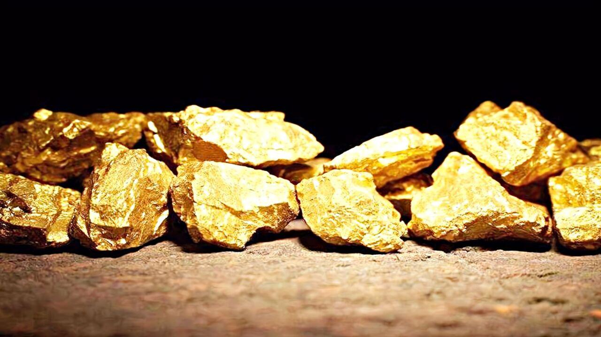

80篇.燕京是一座金矿

清一山长2020年12月23日

一、强势上攻

[$燕京啤酒(SZ000729)$](http://link.zhihu.com/?target=http%3A//xueqiu.com/S/SZ000729) **开盘不到20分钟，成交量已经达到了4.08亿。证明燕京现在是强势上攻。**与原来温嘟嘟，慢悠悠，有点障碍就退的样子，完全就不是一个了。昨天差两分钱就涨停了，就是不拉，最后随大盘回落，以涨6%多一点收盘，是不是为今天过10元大关蓄力的？

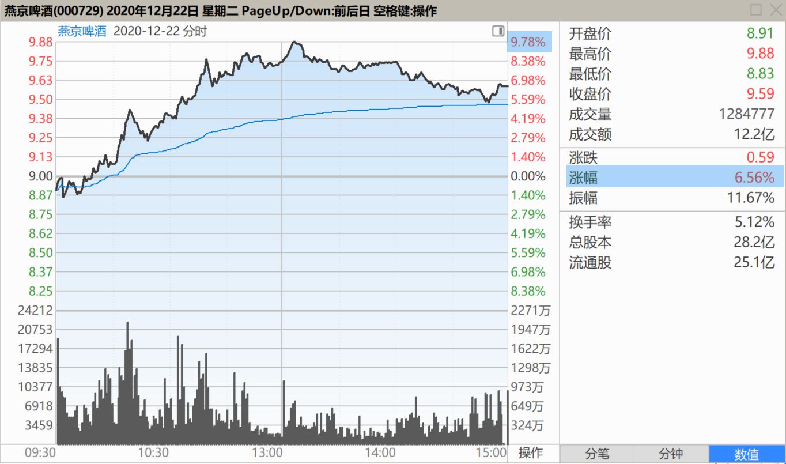

珠江、惠泉，都在10元关口，磨叽了很长的时间，特别是珠江，时间超长。燕京会轻松过关，一路绝尘吗？还是会展开一段时间的拉锯战？我们就拭目以待好了。一颗（待涨的）红心，两种准备。

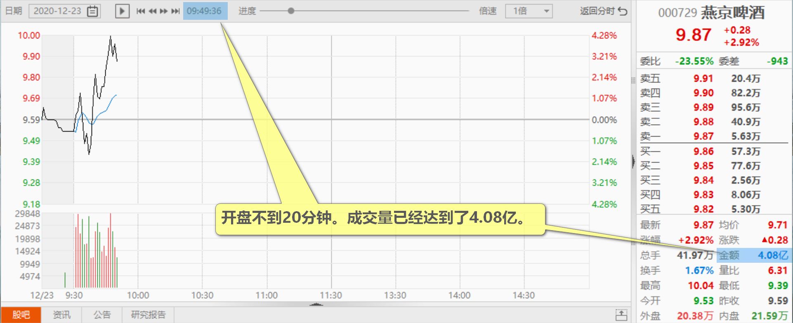

[$燕京啤酒(SZ000729)$](http://link.zhihu.com/?target=http%3A//xueqiu.com/S/SZ000729) 燕京创新高了。看样子，是回不去原地了。我很想问重阳的掌门裘大爷：您8元的时候，来玩啥大规模减持，是如何体现您的“投资专业性”的？您玩私募，名誉最重要。您却在解放战争快胜利的时候，去投降GuoMinDang了。您还带走了一大批相信您，跟随您的淳朴的士兵，一起“叛变燕京闹革命”？您害了这么多人，心安吗？关键是，您的行为，严重损害了业界对重阳投资专业性的信任和尊重。您觉得值吗？

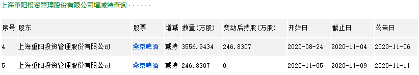

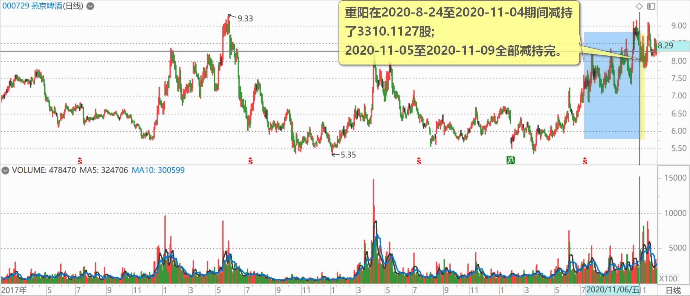

相反：**我们看重阳，应该看唐建华作为榜样，这才是真正的高手。持仓5000多万股，不动如山**，今天开始迎来高额的回报！

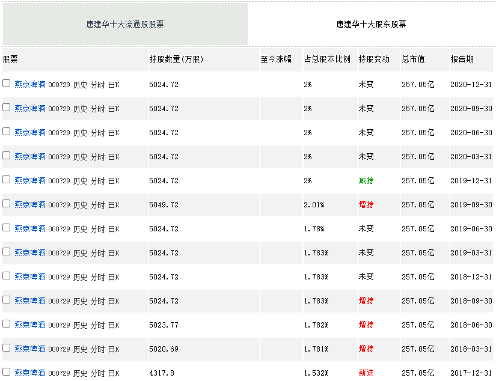

当重阳掀起减持巨浪，闹得燕京持有人都人心惶惶之时，我一个人站出来，表示与重阳的FanGeMing行为要反着干。我们要相信燕京，坚决捍卫燕京，我还不断用融资，大量地买入燕京股票，甚至卖掉爱股中建来买入燕京。用微薄之力承接重阳的抛单。导致我超仓持有燕京，这种示范、担当、稳住了我军的燕京团队，今天大家都赚到了不少的钱。**这种敢于逆流而动的示范，冒险呼吁各位稳住的担当，价值多少？**

被我拉黑，以及拉黑我的人，跟我反向而行的人，损失了多少？你们就自己算账好了[大笑]。

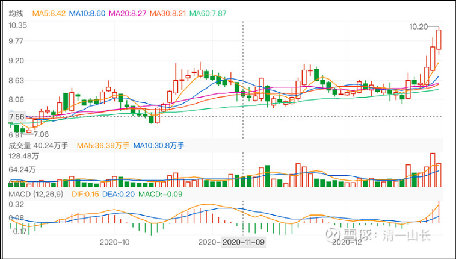

[NETC](http://link.zhihu.com/?target=http%3A//xueqiu.com/n/NETC)回复[清一山长](http://link.zhihu.com/?target=http%3A//xueqiu.com/n/%25E6%25B8%2585%25E4%25B8%2580%25E5%25B1%25B1%25E9%2595%25BF)：

没有山长的逻辑分析，这大冬天的，真不敢喝这么多啤酒！

清一山长回复[NETC](http://link.zhihu.com/?target=http%3A//xueqiu.com/n/NETC)：**反者道之动。**别人都是你这样想的，市场都是这样想的，都认为冬天啤酒没行情。冬季啤酒的业绩很差，燕京每年冬季还要大亏本的。所以买啤酒只能夏天拉一波就走了。**如果大家都相信了这个“常识”。你就要反过来想，总是反过来想，你就慢慢懂道了。**（不是教你做喷子啊[大笑]）。

**“正复为奇，善复为妖！”**学不到我教的这个本事，你就是“妖怪”。学好了，就是出奇兵的高手，可以赚到**“奇钱”（安稳无风险，却利润丰厚的钱）**！

**二、重仓、持仓、减仓、清仓**

[nowhere2018](http://link.zhihu.com/?target=http%3A//xueqiu.com/n/nowhere2018)回复[清一山长](http://link.zhihu.com/?target=http%3A//xueqiu.com/n/%25E6%25B8%2585%25E4%25B8%2580%25E5%25B1%25B1%25E9%2595%25BF)：

山长是定心丸，我几年前拿了一些股票比如再保险，信达之类不管怎么跌，我只要心里想着山长也有，我也不融资，我就死拿着。[加油][加油]跟着买的别的股票涨了的我就卖了，中国宏桥我换中车了，燕京还死拿着，看山长卖我就卖[加油][加油][加油]。中车我有感情，以前跟着山长2块多买的南车、北车，后来涨到快30，我看山长卖我就跟着卖。后来贪心留了一点以为还涨又跌回去最后清了[笑][笑]。

清一山长回复[nowhere2018](http://link.zhihu.com/?target=http%3A//xueqiu.com/n/nowhere2018)：

**看山长卖我就卖——您有麻烦了。**燕京我持仓一千多万股，我卖多少股，就算卖了？很可能我永远也卖不完。宏桥我持仓550万股，也许永远也不会卖掉。

**我的重大持仓，涨了，就算没涨到我的期待价格，我也会不断地卖出，换其他没涨的股。只有涨到我忍无可忍，高得离谱，我才会全部清仓**。比如一些白酒，涨了十几倍，我当然要全跑了。

所以，跟我也不好跟的。你明明看我到卖了，发现更高位我还持有。你咋办？

我知道你们会困扰，所以，10元以下，我是持仓，做T，不减持的。10元以上，我是慢慢减持仓位，重新配置的。所以，我10元以上不示范，就是避免你们困惑。但相信我：**就算啤酒涨到20元，我依然会持有相当部分的重仓，至少百万股级不会少。只有超过30元？估计我才会真的全部走掉。**

**三、燕京是一座金矿**

[$燕京啤酒(SZ000729)$](http://link.zhihu.com/?target=http%3A//xueqiu.com/S/SZ000729) 今天的燕京走势，是不是让大家失望了？冲高不成，大幅回落。是吗？

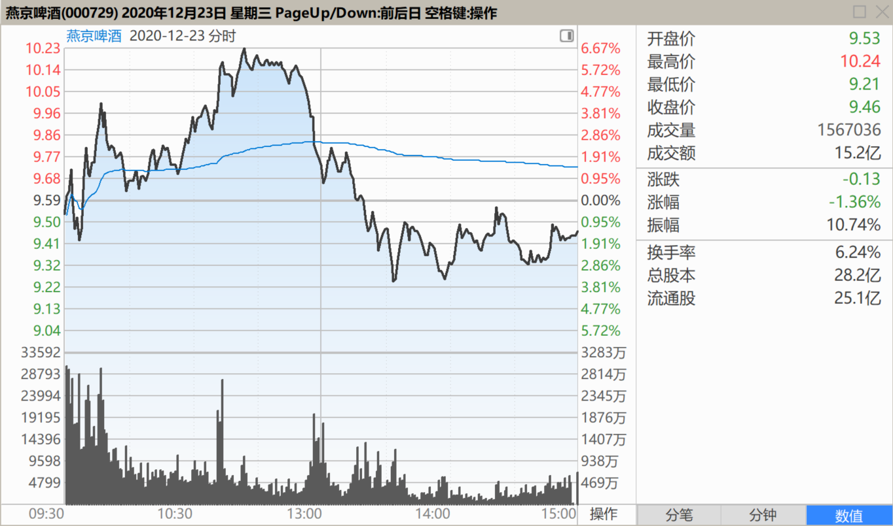

别这么短视，你打开周线图，月线图看看，是什么走势？

燕京啤酒周线图：

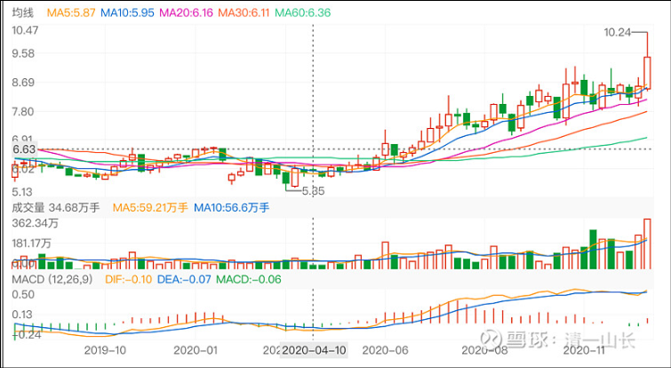

妥妥的慢牛走势！再看燕京啤酒月线图，是不是大牛股的架势？

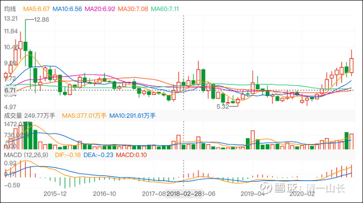

懂看图的，一眼就知道：**燕京是一座金矿，未来的空间很大！而且时间会很长。**

刚打开我的一个老账户看看，这个账户我很少操作的。发现其中的燕京仓位，已经贡献了超过千万的利润。燕京的总利润，目前已经是所有股的第一了。主要得益于燕京总是不涨。要是像珠江、惠泉一样涨，估计我也拿不住了。我的这个老账户，持有的燕京并不多，也就300多万股。账户的总市值，也新高了。“中国牛”还没来呢！我计划做一点调仓的工作，准备“中国牛”的到来。这个账户里面，我还买得有青岛啤酒港股，是26元买进的[大笑]，一直放着不动。所以我手上有四家啤酒公司。

为啥10元之前，这些股走得艰难痛苦的样子，不断磨叽？上一个台阶都很不容易？为什么10元后就会畅快地拉升？好像脱离了地心引力的作用？就像惠泉的示范一样？涨停，再涨停，都不需要换手一样？因为10元之前，是主力与散户博弈，双方斗智斗勇，各不相让。**10元以后，就是庄家已经控盘，散户的目标已经凝聚，关键是共同看好未来。**以后的路，就是庄散一起跳舞，双方合作共进，一起高歌猛进猛拉涨停，大家都大赚特赚。10元之后，您再用10元前的老思路来炒股，做T，就不行了。这些过于精明的散户，主力分分钟就把你甩下车的，换一批胆子大，胃口大的散户一起吃肉了。当然，吃到最后的人要负责埋单！**第四阶段，就是庄家要钱不要货，不计成本出货了。**现在的燕京，依然在第二阶段，惠泉已经进入美好的第三阶段了，庄散共赢阶段。

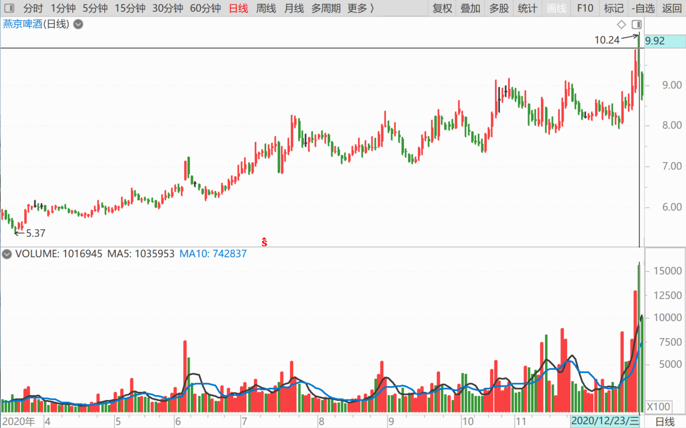

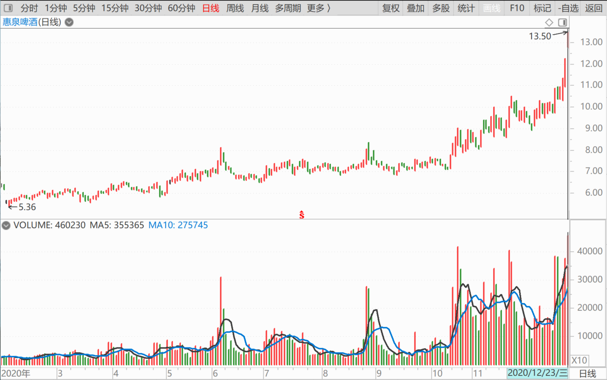

**四、什么时候燕京走向二阶段末尾**

趁燕京还没过10元，我就透露这点秘密给你们。**未来的燕京，什么时候走向第二阶段末位，开始启动第三阶段呢？就是出现涨停，就是第二阶段末尾了，不断涨停，像惠泉一样，就是第三阶段了**。你们慢慢熬吧！[大笑]，你们想象一下：如果燕京一直连个像样的涨停都没有，却也走到了10元上下。惠泉用了多少个涨停才来到10元的？未来燕京的空间，相比惠泉，是大？是小？你们就去好好琢磨一下吧！

不管你们怎么想，我会一路陪着你们的，原来的老人，知道我说过一些什么。燕京的新人进来，连我说啥都不知道的。他们只关心涨停，不关心投资逻辑！他们只吃第三阶段的痛快饭，不愿意熬过艰难的第一和第二阶段。其实他们赚的也是小钱。从第一阶段走起来的人，才是赚大钱的。

(标题、图片为编者所加)

**文章音频**：

[480篇.燕京是一座金矿](http://link.zhihu.com/?target=https%3A//www.ximalaya.com/sound/757633436)

**参考链接：**
[70篇.隔山观火，不投入情感](https://zhuanlan.zhihu.com/p/707564067)

[71篇.从不缺乏热闹，只缺乏理性](https://zhuanlan.zhihu.com/p/709411110)

[72篇.为什么不要冲过9.60元收午盘](https://zhuanlan.zhihu.com/p/710752420)

[73篇.蓄势上攻，引而不发](https://zhuanlan.zhihu.com/p/712057223)

[74篇.惠泉跨栏历史记录回顾](https://zhuanlan.zhihu.com/p/713488711)

[75篇.惠泉最成功的地方](https://zhuanlan.zhihu.com/p/714477508)

[76篇.聪明人赚钱，傻人赔钱](https://zhuanlan.zhihu.com/p/715051514)

[77篇.在确定企业价值的基础上进行金融投机](https://zhuanlan.zhihu.com/p/717031167)

[78篇.你这样做，庄家会吐血](https://zhuanlan.zhihu.com/p/718319738)

[79篇.卖出涨停股，买入跌惨了的股](https://zhuanlan.zhihu.com/p/719002613)
