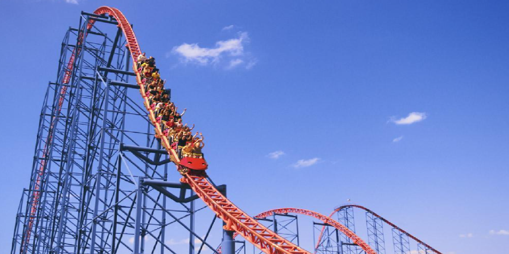
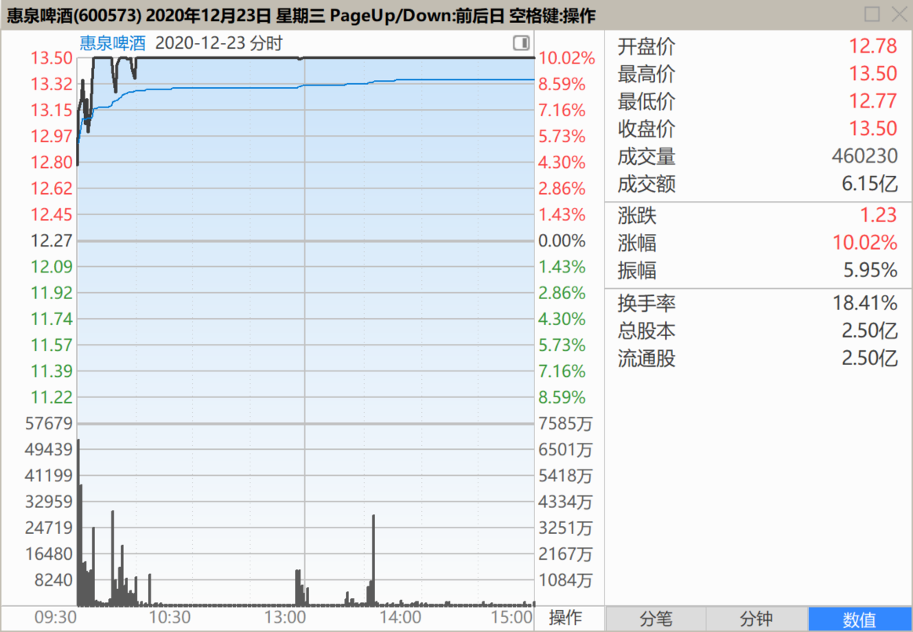
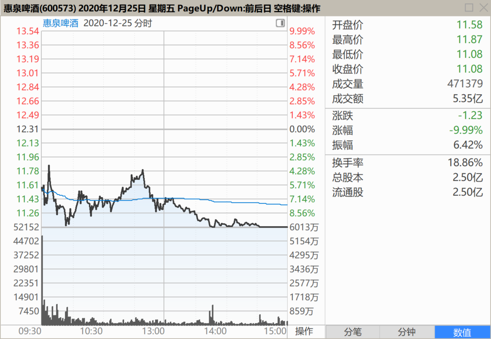
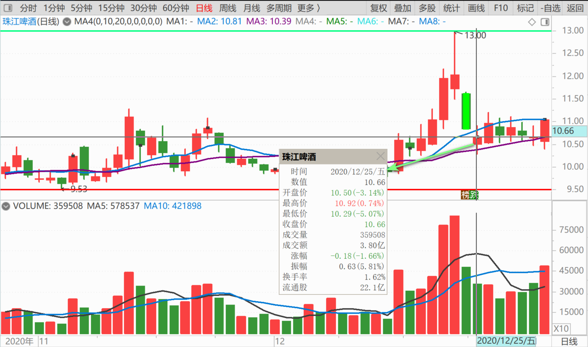
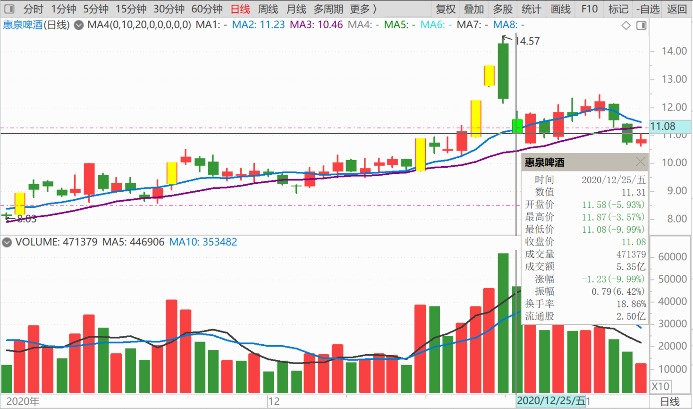
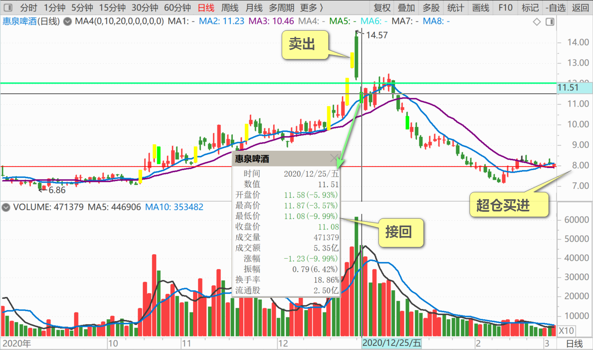

83篇.第一天涨停第三天跌停

清一山长2020年12月23日～27日

**一、开启疯狂模式2020-12-23**

[$惠泉啤酒(SH600573)$](http://link.zhihu.com/?target=http%3A//xueqiu.com/S/SH600573)[献花花]，果然开启疯狂模式，跟我说的一样：不要用10元以前的眼光来看惠泉。惠泉的走势，也会是燕京和珠江突破10元后模仿的榜样吗？

**二、感谢惠泉的跌停2020-12-25**

[$惠泉啤酒(SH600573)$](http://link.zhihu.com/?target=http%3A//xueqiu.com/S/SH600573) 感谢惠泉，我已经在跌停价11.08元，重新买回了我前两天高价卖出的惠泉仓位。说实话：昨天之前，我账上只剩下20多万股惠泉了。都不好意思告诉大家我逃跑太快，这三大的持仓太少，很不够意思。因为我说了：过了10元不分享操作和进出的，我要恪守诺言。所以我卖出了惠泉，就没吭气。要怪就怪惠泉涨得实在太猛，我跟着出动作也就猛了一点。出顺手了，最后一看手里只剩下20多万股了，才勉强刹住车子的。实在舍不得卖了，留一点负成本的仓位，看惠泉演出的。我正在遗憾，我的三大地位再度失去，正在难过呢！昨天的价格我不满意，所以根本一股都没买，以为从此退出三大了。这个月，我都退出好几次三大了。**没想到您每次都让我有机会重新归队。感恩[献花花]**！我就努力不让您失望吧！真的不好意思。**您已经给到了这个价，我已经很满足了，如果明天再跌，我也认了。就算再弄一个跌停，我也感激您过去几天的付出，不会怪您的，**只会再多买一点。祝福您圣诞快乐，大吉大利！

[Flyzw4](http://link.zhihu.com/?target=http%3A//xueqiu.com/n/Flyzw4)回复[清一山长](http://link.zhihu.com/?target=http%3A//xueqiu.com/n/%25E6%25B8%2585%25E4%25B8%2580%25E5%25B1%25B1%25E9%2595%25BF)：（跟评主贴1）

明明十元以上不分享买卖进出，明明要恪守诺言，那你这条发言是要表达什么啊？不是告诉别人你买进了吗？

清一山长回复[Flyzw4](http://link.zhihu.com/?target=http%3A//xueqiu.com/n/Flyzw4)：

您别生气！我是说了10元以上不分享操作了。但今天我不是公开说了吗？今天，这三大啤酒公司，谁跌停，我买谁，还要买一百万股吗？这是救市，不是股灾了，国家队都要出来救一下吧？我们匹夫不是也有责的吗？我总不能说了不做吧？谁想到昨天跌停的珠江，昨天这么惨，珠江今天就不爱多跌了。但是，昨天还大涨了一把，后来也没多跌的惠泉，更没跌停的惠泉，今天偏偏要来玩跌停。您要怪，就怪操盘手不争气呀？怪我干啥？

再说了：为了不影响您操盘的利益，不影响市场，我这不是买了后就一直忍住，等惠泉收市了我再说的吗？您要不满意，就下周用大阴线，给我打个大大的耳光就行了。您再弄一个跌停，让我彻底套牢，名声尽毁。然后，您就逼我出来公开道歉，误导大家了，好不？

同时，也提醒各位粉丝们：大家千万别看我买了，你也跟着买11元的惠泉。我是啥成本买的？**我其实没买，我只是把12元以上出货低价再接回来罢了。不是买股，我一股也不多买，我严格执行纪律。只收自己的逃兵，不收别家的散兵。除非跌到8元，我才会真正的超仓买进，否则我都是补仓，啥意思：就是自己种的菜自己吃！没成本的。跌到零也伤不着我。**

所以，大家都别学我呀！您就看热闹就行了。然后你们自己找个庄跟去。

[舒缓](http://link.zhihu.com/?target=http%3A//xueqiu.com/n/%25E8%2588%2592%25E7%25BC%2593)回复[Flyzw4](http://link.zhihu.com/?target=http%3A//xueqiu.com/n/Flyzw4)：（跟评主贴1）

眼红了，看到别人挣钱。山长是怕你跟错了，才不说。只要你跟了就对，说又何妨？明日开盘再跌，大家是否可以买点？

清一山长回复[舒缓](http://link.zhihu.com/?target=http%3A//xueqiu.com/n/%25E8%2588%2592%25E7%25BC%2593)：

说得对。欢迎大家下周抄我的底！

[火蚁投资](http://link.zhihu.com/?target=http%3A//xueqiu.com/n/%25E7%2581%25AB%25E8%259A%2581%25E6%258A%2595%25E8%25B5%2584)回复[清一山长](http://link.zhihu.com/?target=http%3A//xueqiu.com/n/%25E6%25B8%2585%25E4%25B8%2580%25E5%25B1%25B1%25E9%2595%25BF)（跟评主贴1）

山长兄，你卖出是对的，但是买回来就错了。

清一山长回复[火蚁投资](http://link.zhihu.com/?target=http%3A//xueqiu.com/n/%25E7%2581%25AB%25E8%259A%2581%25E6%258A%2595%25E8%25B5%2584)：

谢谢提醒。错了就认了。总得有人站岗吧？就让我站好了，去年入惠泉坑的，站了一年，想走不让走。就接着再继续站一年吧！

[火蚁投资](http://link.zhihu.com/?target=http%3A//xueqiu.com/n/%25E7%2581%25AB%25E8%259A%2581%25E6%258A%2595%25E8%25B5%2584)回复[清一山长](http://link.zhihu.com/?target=http%3A//xueqiu.com/n/%25E6%25B8%2585%25E4%25B8%2580%25E5%25B1%25B1%25E9%2595%25BF)：（跟评主贴1）

山长兄，即使以前做对了，不等于现在就有理由可以做错或者随便浪费之前的盈利。这不符合一个认真做投资的操盘手的严谨和实事求是的态度。我的投资账户，一直保持增长，且基本上不参与大幅度的回撤。

市场风格正在悄然转换。前期获利丰厚的白酒、啤酒股，绝对不可以轻碰，好不容易胜利逃亡了，何必又重新进去买单？！

保证金无论多少，都是十分宝贵。如果在这里被套，即使你有信心将来解套，但是会错失很多投资其他好股的机会。沉没成本巨大，不值当。我当你是略有共鸣的朋友，所以提醒。别跟保证金过不去。

清一山长回复[火蚁投资](http://link.zhihu.com/?target=http%3A//xueqiu.com/n/%25E7%2581%25AB%25E8%259A%2581%25E6%258A%2595%25E8%25B5%2584)：

我刚打赏了这条评论￥10.00，也推荐给你。同意您的观点，谢谢良言。以后也多提醒，我武人一个，有时候性情中人，不够专业！

[蛰伏2020](http://link.zhihu.com/?target=http%3A//xueqiu.com/n/%25E8%259B%25B0%25E4%25BC%258F2020)回复[清一山长](http://link.zhihu.com/?target=http%3A//xueqiu.com/n/%25E6%25B8%2585%25E4%25B8%2580%25E5%25B1%25B1%25E9%2595%25BF)：（跟评主贴1）

不奢求抄底，不指望逃顶。跌了有子弹，涨了有好票。不错过一次难得的大危机，不贪图每一次危机都是机会，背靠大山，手握矛盾，游刃有余，此心境我用毕生也难以触及。感谢山长分享[@清一山长](http://link.zhihu.com/?target=http%3A//xueqiu.com/n/%25E6%25B8%2585%25E4%25B8%2580%25E5%25B1%25B1%25E9%2595%25BF)[￥200.00]

清一山长回复[蛰伏2020](http://link.zhihu.com/?target=http%3A//xueqiu.com/n/%25E8%259B%25B0%25E4%25BC%258F2020)：

[献花花]多谢打赏[干杯]。你的悟性会让你投资越来越成功的[很赞]。祝你开心每一天！

[价值投机牌](http://link.zhihu.com/?target=http%3A//xueqiu.com/n/%25E4%25BB%25B7%25E5%2580%25BC%25E6%258A%2595%25E6%259C%25BA%25E7%2589%258C)回复[清一山长](http://link.zhihu.com/?target=http%3A//xueqiu.com/n/%25E6%25B8%2585%25E4%25B8%2580%25E5%25B1%25B1%25E9%2595%25BF)：（跟评主贴1）

要到十元么[为什么]我要不要先割肉，十元在接回来。

清一山长[价值投机牌](http://link.zhihu.com/?target=http%3A//xueqiu.com/n/%25E4%25BB%25B7%25E5%2580%25BC%25E6%258A%2595%25E6%259C%25BA%25E7%2589%258C)：

一看就知道，您根本就看不懂别人在说啥，您是不是小时候语文不及格？我对您的建议就是：你就买入中国建筑，睡觉去，做个睡美人，睡个五年再起来看看，保证是赚钱的。至于啤酒，就算了。也许您喝啤酒容易上头，容易醉。为了保护您，我替您拉黑我自己了！

[陆大少](http://link.zhihu.com/?target=http%3A//xueqiu.com/n/%25E9%2599%2586%25E5%25A4%25A7%25E5%25B0%2591)回复[清一山长](http://link.zhihu.com/?target=http%3A//xueqiu.com/n/%25E6%25B8%2585%25E4%25B8%2580%25E5%25B1%25B1%25E9%2595%25BF)：（跟评主贴1）

山长兄，燕京您的操作我很认可，但惠泉这种操作有点欠妥吧？毕竟惠泉缺乏价值和逻辑，只是市场跟风炒作而已，您觉得呢？

清一山长回复[陆大少](http://link.zhihu.com/?target=http%3A//xueqiu.com/n/%25E9%2599%2586%25E5%25A4%25A7%25E5%25B0%2591)：

恐怕不能说惠泉缺乏价值吧？光“权威机构”评估的品牌价值都远超市值。如果燕京愿意出让控股权，想买的其他啤酒行业的公司，绝不止一家。给出的转让价，也不可能比用目前市值来衡量的低吧？真没价值的是兰州黄河，并购的愿望都没有。

至少，我在惠泉上赚到的钱，比顺鑫还多。所以对我来说，惠泉比顺鑫更有价值[大笑]。当然，纯说笑话。我的意思是：**企业的价值，有很多角度。**您的判断，只是自己的一种角度。用另外的角度来看，燕京都是没有价值的。比如跟青岛的价值来比的话。

**三、不需要维护价格VS珍惜筹码**

清一山长（跟评主贴1）

申明：今天的确不是买点。下周会出现比今天更低的价格。我因为承诺了跌停就买，想安慰一下依然在坚守的战友们，所以才主动入坑了。但我还准备了资金，下周继续买的。这是我的看空不做空，反而做多的表现。因为今天的风险，明显不如昨天买入大。昨天我虽然惠泉的持仓最少，但我一股未买。买珠江最多。今天买惠泉和燕京最多。

**为啥今天不是买点？因为今天开盘就大跌，显然是庄家故意跳空低开打压的。**但因为今天根本没有必要这样低开，特别是跳空低开这么多，还直奔跌停。说明主力这段时间高位出货是很成功的，筹码基本上都到散户手里去了。**所以庄家现在根本就不需要维护价格，不用考虑出货的需要，只管使劲打压**。你们比较珠江的走势就知道了。**珠江为啥今天不太跌？因为主力珍惜筹码，怕被抢走了。**但惠泉走势正好相反。所以，下周继续跌的可能性很大，跌到多少是底？我认为不会破10元。接近10元，可以尽量买就是。所以，我最多就套10%，我也认了，反正我一股也不卖，拿着死扛就行了。这个股，迟早要回来的。

本来不想说的，看惠泉的吃相有点贪了，仍忍不住多说一句，以后尽量少说！祝福大家！

(标题、图片为编者所加)

**文章音频**：

[486篇.第一天涨停第三天跌停](http://link.zhihu.com/?target=https%3A//www.ximalaya.com/sound/763549701)

**参考链接：**
[76篇.聪明人赚钱，傻人赔钱](https://zhuanlan.zhihu.com/p/715051514)

[77篇.在确定企业价值的基础上进行金融投机](https://zhuanlan.zhihu.com/p/717031167)

[78篇.你这样做，庄家会吐血](https://zhuanlan.zhihu.com/p/718319738)

[79篇.卖出涨停股，买入跌惨了的股](https://zhuanlan.zhihu.com/p/719002613)

[80篇.燕京是一座金矿](https://zhuanlan.zhihu.com/p/720733084)

[81篇.做人，做事，都必须有“道”](https://zhuanlan.zhihu.com/p/722042320)

[82篇.投资必须依赖自己的投资系统、有效的原则、纪律](https://zhuanlan.zhihu.com/p/783923357)
