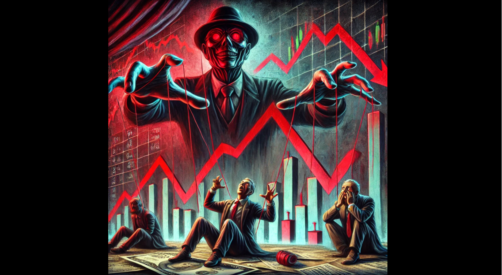
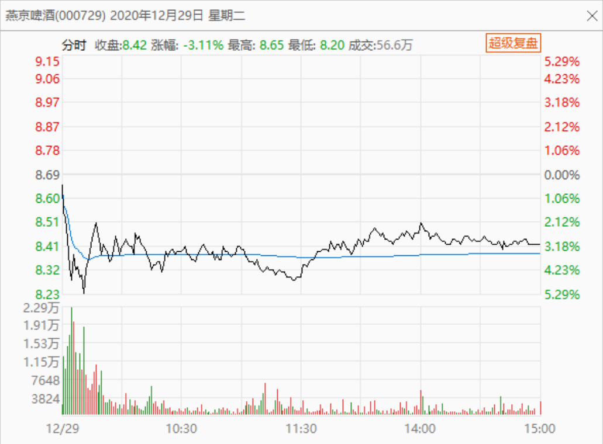
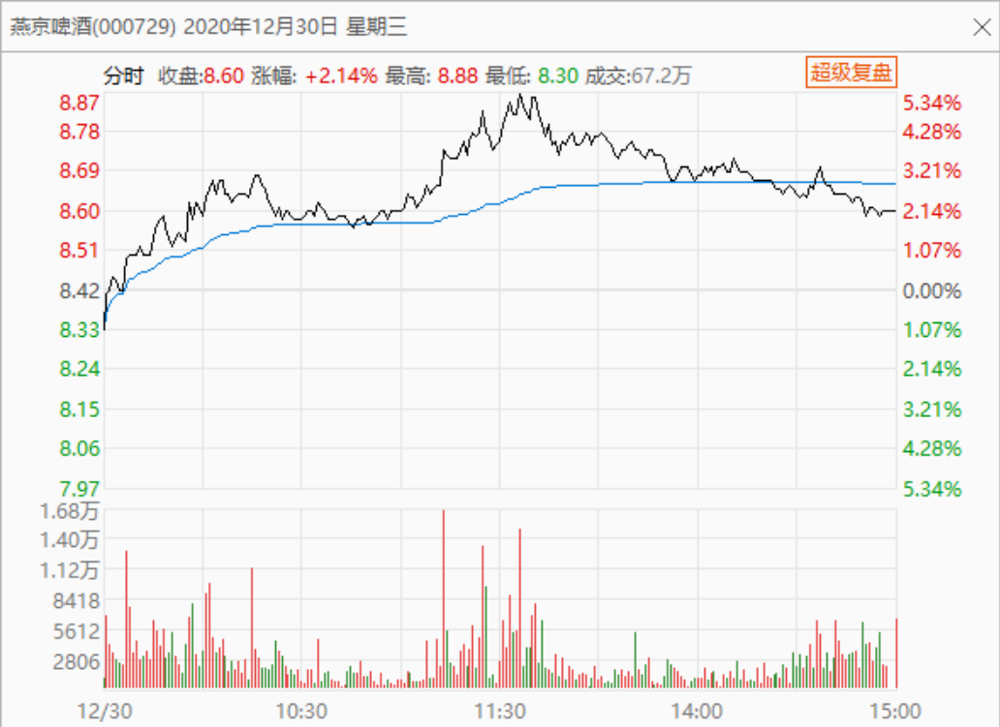
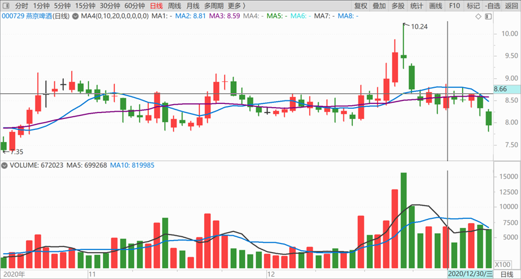
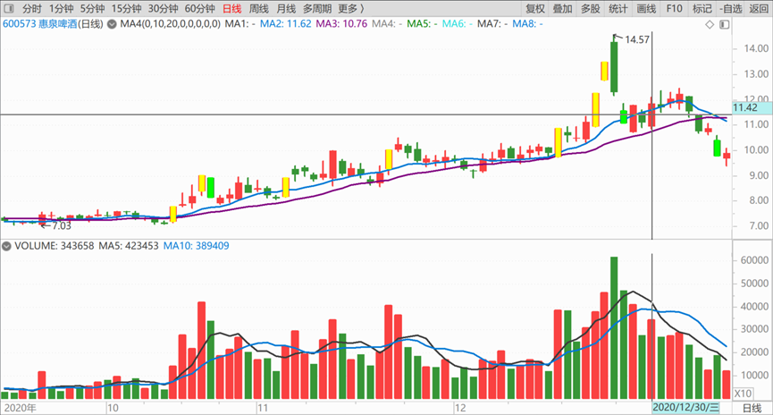
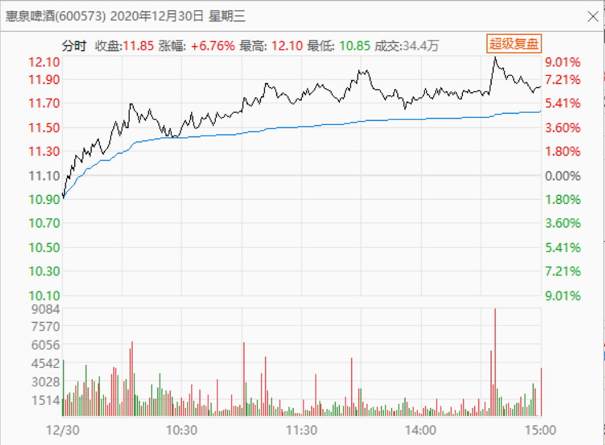
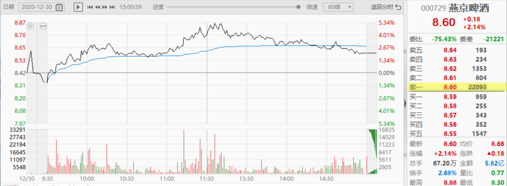
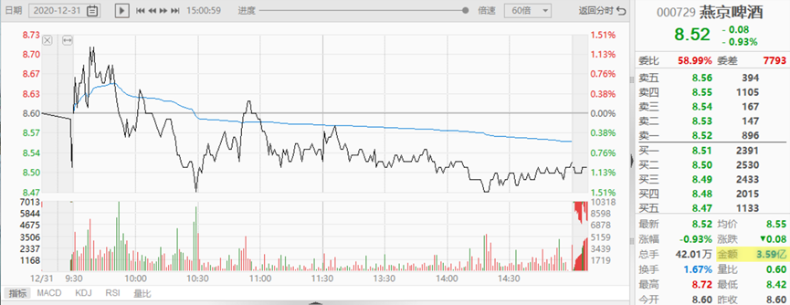
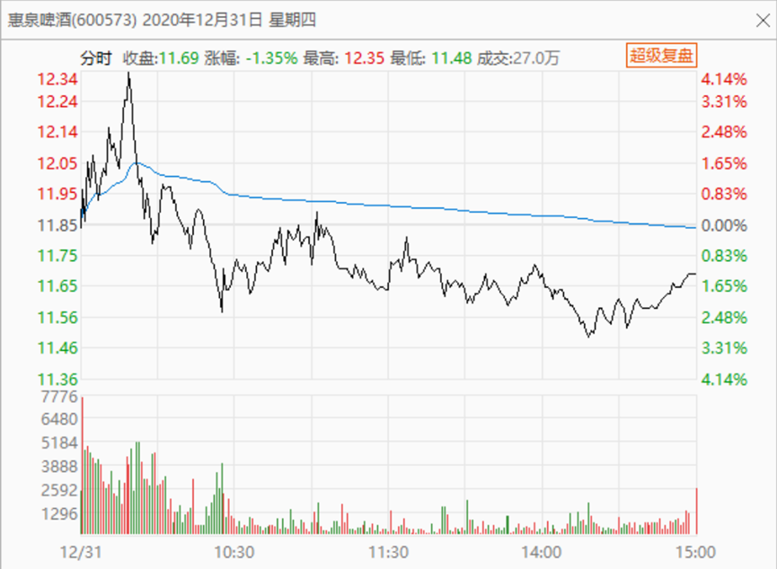

86篇.吓人的目的是让你卖掉快逃

清一山长2020年12月29～31日

**一、吓人的目的是让你卖掉快逃**

清一山长2020-12-29

[$燕京啤酒(SZ000729)$](http://link.zhihu.com/?target=http%3A//xueqiu.com/S/SZ000729) 今天在8.30元附近，最低价8.24元，买进了燕京，其他过十元的就不多说了。今天增加了M级的啤酒股，与啤酒一起苦熬冬天。

清一山长2020-12-30跟评上贴

原来不需要苦熬呀？才一天燕京就拉升了？不磨叽了？我已经做好计划跟你玩持久战的，就等你一起苦熬三个月。你想错过酒股的冬季行情，我没意见，等你三月份之后玩春季行情好了。你们夏天喝啤酒，我也没问题。现在就涨，幸福是不是来得太快了？[大笑]

清一山长2020-12-30跟评上贴

[$燕京啤酒(SZ000729)$](http://link.zhihu.com/?target=http%3A//xueqiu.com/S/SZ000729) 燕京这主儿，真拿他没办法。今天明看是拉升，其实是跟惠泉一起被动涨升，现在的盘面，明显就是出货的走势。这个主力真的很坑！好像有出不完的货一样。磨磨唧唧的自己反复做T，守自己的持仓天天赚小钱。大钱就是不要，因为他不想让别人跟。关键是：他喜欢吃独食！真不是好庄！[吐血]

等明儿，惠泉主力大发了，回过头来把燕京庄的货全给收了！[俏皮]

今天，我对燕京，看空不做空！

惠泉啤酒我补一句：今天要冲涨停的实力是有的，刚才冲了一下12元，再拉两毛钱就涨停了。这还让我紧张了一下，因为今天就冲涨停，就不是好事，它的长期走势就破坏了，我都会吓得出货的。但目前看样子，没有冲涨停的计划，所以各位不用太担心，**它的走势很好，很健康!。健康的意思，不是一定会涨，甚至可能会跌。**健康的意思，就是主力的脑子正常，操作手法正常，没超出我的预期！[俏皮]

发个惠泉今天的图，给你们对比一下：什么是出货的K线，什么是主力拉升的K线？

清一山长2020-12-30

[$燕京啤酒(SZ000729)$](http://link.zhihu.com/?target=http%3A//xueqiu.com/S/SZ000729) 尾盘用两百多万股压住，就是不让涨？这庄家真够赖皮的。可惜现在手上没这多钱了，不然。我一口全吃了，吃吐掉算了！

今天盘面，的确是出货行情。但我们反过来想：主力是真打算出货吗？出货的主力，会拿这么多的筹码来压盘吗？就算我想出货，我会把所有的单子尾盘堆在一起抢着出吗？只能说他们是为了吓人。但是，**吓人的目的是什么？不就是让你卖掉快逃吗？**

所以，我看见了空，不做空，可能还做多！。今天我没做多，也没做空，昨天买了一个M多。

燕京你就这样子死耗下去吧！反正我的股数是越耗越多了。燕京真要死的话，我愿意来陪葬，因为我傻一些。我就是不跑路！没超过10元，我就是不交出筹码，一股都不交，越跌越买！主力有股就使劲卖吧！

**二、演得很像出货，但成交量没有放大**

原标题：赵晓东“出事”发酵仨月 燕京啤酒频遭机构“敲门”后减筹）《电鳗快报》文/高伟2020-12-30

燕京啤酒(000729.SZ)在整个第四季度都很郁闷，先是曝出董事长、总经理赵晓东因涉嫌职务违法被立案调查，接着便是机构不断调研，随后便是明星私募等......[网页链接](http://link.zhihu.com/?target=https%3A//stock.stockstar.com/IG2020123000000293.shtml)

清一山长评论上文：

高级粉黑呀[献花花]！写手太不认真了，很不专业。难道是钱拿得不多？有点混日子的样子。要黑，也要黑得专业一点，别黑得像粉一样，越黑让人越想买。所以我只能叫你“粉黑”了！文章的逻辑线条，只有超级蠢瓜才看不出毛病。难道主力只能找到这种级别的“粉黑”来写东西吗？这个庄太差了，手中无人。是不是您除了钱，就啥都没有？眼光没有，良心也没有。你用过的人，直接就扔了？真不够意思。中国人，这叫缺德。

清一山长2020-12-31

[$燕京啤酒(SZ000729)$](http://link.zhihu.com/?target=http%3A//xueqiu.com/S/SZ000729) 走得不错，赞一个！[献花花]。**配合黑文，走出一波抵抗式下跌出货的图形来，很逼真。唯一有点遗憾的，就是成交量没有放大。**如果主力把成交放大到4～5个亿，就更像出货了[大笑]。当然，这种要求太高了，现在演的都已经很像出货了。演技已经很不错了，应该表扬！

清一山长2020-12-31

[$惠泉啤酒(SH600573)$](http://link.zhihu.com/?target=http%3A//xueqiu.com/S/SH600573) 今天主力用钱画出的这幅山水画，错落有致，峰峦起伏，很见作者功力。早盘的冲高动作，干净利落，积极进取。下午的回落，随波逐流，给出明显的落差空间，跌宕有序。赞一个！[献花花]。

祝福惠泉新年新气象，年年好，步步高。惠泉吉祥如意，取得更大进步！

(标题、图片为编者所加)

**文章音频**：

[511篇.吓人的目的是让你卖掉快逃](http://link.zhihu.com/?target=https%3A//www.ximalaya.com/sound/778762162)

**参考链接：**

[78篇.你这样做，庄家会吐血](https://zhuanlan.zhihu.com/p/718319738)

[79篇.卖出涨停股，买入跌惨了的股](https://zhuanlan.zhihu.com/p/719002613)

[80篇.燕京是一座金矿](https://zhuanlan.zhihu.com/p/720733084)

[81篇.做人，做事，都必须有“道”](https://zhuanlan.zhihu.com/p/722042320)

[82篇.投资必须依赖自己的投资系统、有效的原则、纪律](https://zhuanlan.zhihu.com/p/783923357)

[83篇.第一天涨停第三天跌停](https://zhuanlan.zhihu.com/p/846758124)

[84篇.我的啤酒股票，绝对不会“出清”](https://zhuanlan.zhihu.com/p/6035500140)

[85篇.这一轮珠江的底部和惠泉的底部](https://zhuanlan.zhihu.com/p/7361102270)
