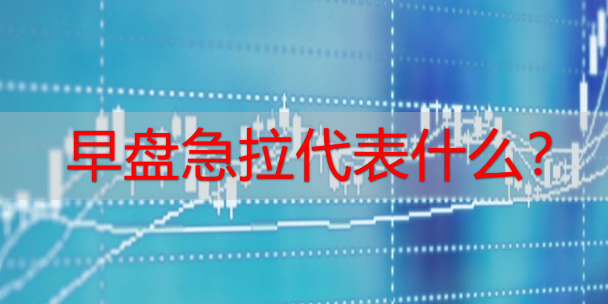
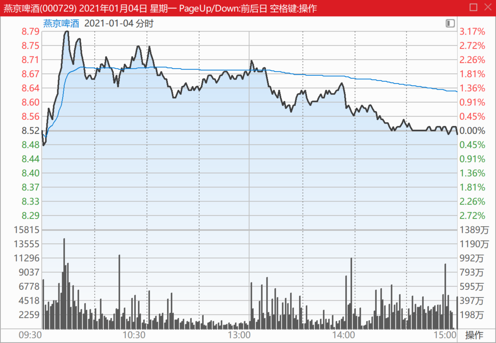
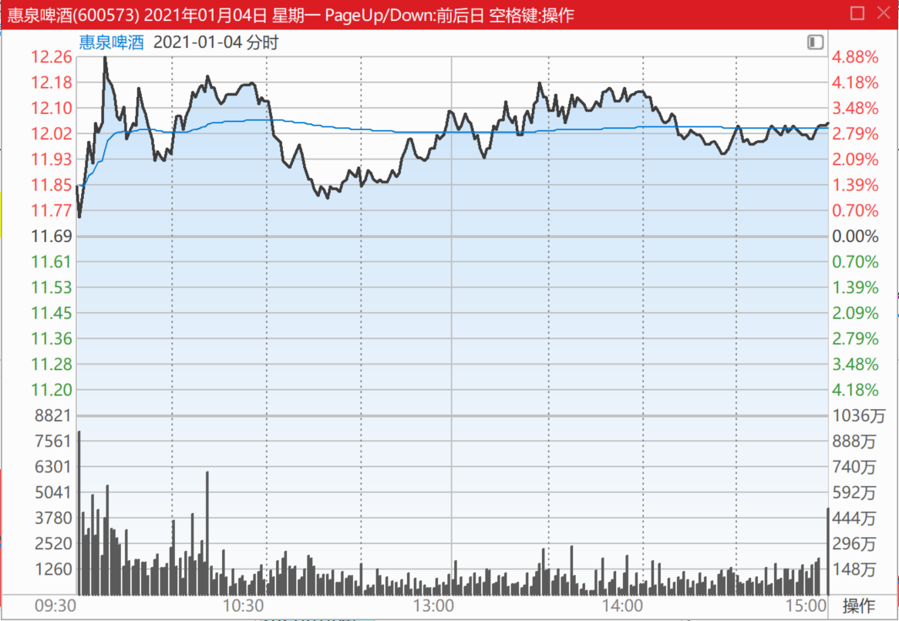
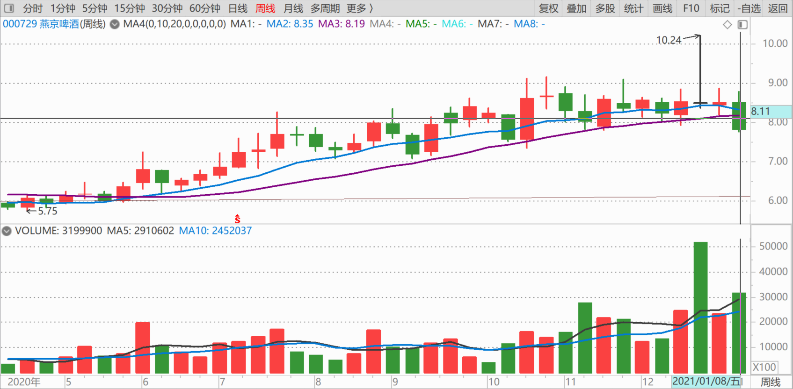
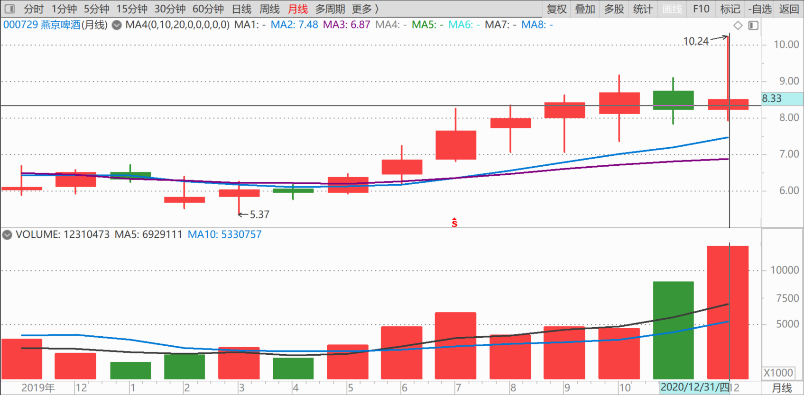
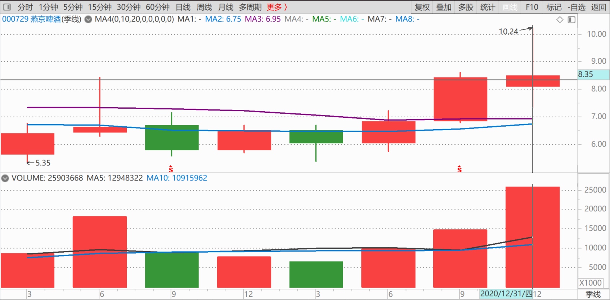
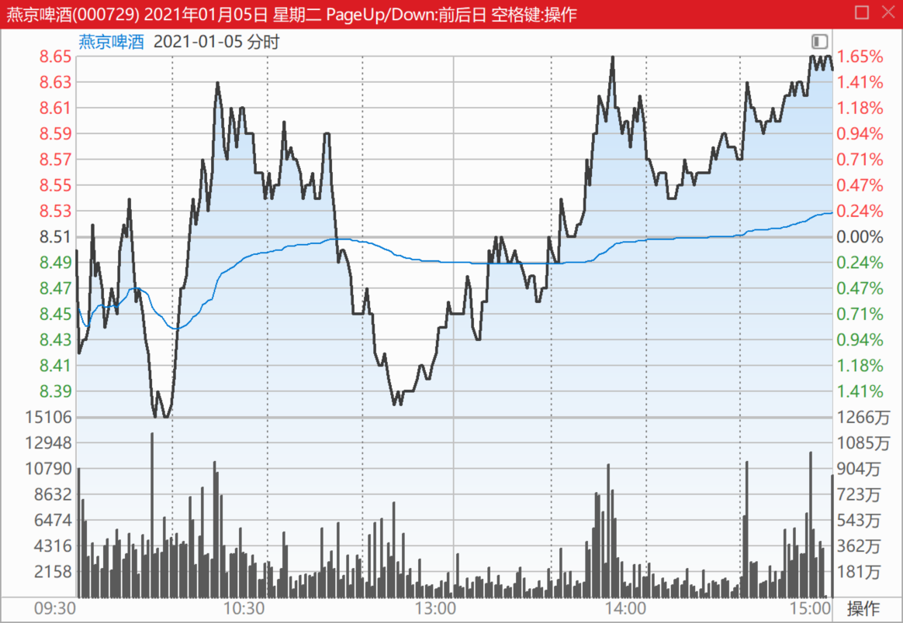
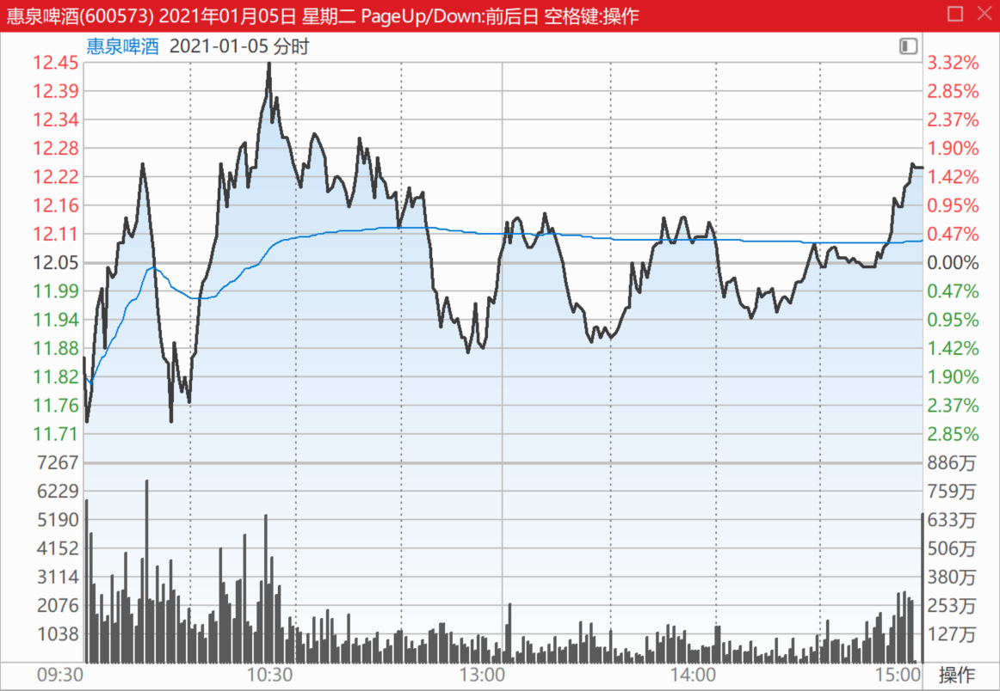

87篇.早盘急拉代表什么？

清一山长2021年1月4日～6日

**1.假拉升和真拉升**

[清一山长](http://link.zhihu.com/?target=https%3A//xueqiu.com/9310099567)2021-01-04 11:21:38(主贴1)

[$燕京啤酒 (SZ000729)$](http://link.zhihu.com/?target=http%3A//xueqiu.com/S/SZ000729) **早盘这样急拉的，基本上今天就不需要看盘了，还是在洗盘，不会拉升的。**它只是做一个拉升的动作，吸引跟风盘，说不定还故意套你一下。这种动作，会在出货的时候出现，让人以为起飞了，正好卖给你。

**如果是高位出现今天这样的开盘拉升，就最好马上卖出，离场观望，**避免被套。不过，**燕京现在的价位并不高，离主力的成本价很接近，所以还没到出货的时候，不用太担心**。只是这种图形出来，证明燕京主力还在洗盘，没准备拉升的。**真拉升，你们多去看惠泉的动作，早上一个猛子扎下去，破位，吓得趋势交易者赶快逃走。等你跑掉了，回头一下，冲上去涨停了。**这种走势，跟《道德经》上说的非常的符合，欲取先予，欲扬先抑！

既然继续磨叽，就不看燕京了。我看书去！惠泉已经过12元，我不说了[大笑]

[龙腾coc](http://link.zhihu.com/?target=http%3A//xueqiu.com/n/%25E9%25BE%2599%25E8%2585%25BEcoc)回复[清一山长](http://link.zhihu.com/?target=http%3A//xueqiu.com/n/%25E6%25B8%2585%25E4%25B8%2580%25E5%25B1%25B1%25E9%2595%25BF)：（跟评主贴1）

[笑哭]燕京啤酒亏损中！只有越跌越买了！

[清一山长](http://link.zhihu.com/?target=https%3A//xueqiu.com/9310099567)[2021-01-04 11:54](http://link.zhihu.com/?target=https%3A//xueqiu.com/9310099567/167514337)回复[龙腾coc](http://link.zhihu.com/?target=http%3A//xueqiu.com/n/%25E9%25BE%2599%25E8%2585%25BEcoc)：

买燕京，赚钱不多是正常人。被磨叽得有点郁闷，也可以理解。但买燕京的人，今天居然是亏的，这种人，更是稀有！你们自己去看看燕京的周线、月线、季度线，全在高位，上影线有点长，也不影响向上的走势，**是典型的步步高升走势。**你买燕京，凭啥亏？好意思亏吗？

长得丑，也没关系，就别出来到处亮相了。起码出来前化化妆，对得起人了，再出来晃悠。这是对人的尊重，也是对自己的尊重。您没本事，亏钱还喜欢到处秀，乱发言，就是制造垃圾了，这是我最烦的人，我很想拉黑你。

但，这次先警告一下算了。你看了我的这些文字，不喜欢，你就提前拉黑我算了。免得我以后看到你胡说八道的，就拉黑你，还一元打赏都不给[俏皮]

**2.大力洗盘，最终是拿货模式**

[清一山长](http://link.zhihu.com/?target=https%3A//xueqiu.com/9310099567)[2021-01-05 22:48（主贴2）](http://link.zhihu.com/?target=https%3A//xueqiu.com/9310099567/167722559)

[$燕京啤酒 (SZ000729)$](http://link.zhihu.com/?target=http%3A//xueqiu.com/S/SZ000729) **今天的图形，是大力洗盘，最终是拿货模式。**跟上次的图形，我说是出货模式不一样。上次10元的图，我已经看是出货的走势，但我没有大量卖出的原因，是觉得这个出货太明显了，会不会是骗线？结果真的是出货了。**今天K线是典型的扫货模式，低开震仓，最终几乎是走上了全天最高价，**把今天的套牢盘全解救了。吃进的货，比卖出的货多得多，所以是扫货。正常情况，明天应该是涨的。留此贴坐等打脸！[俏皮]

今天燕京跟惠泉啤酒的震荡走势，也不一样。惠泉的筹码控制良好，走势是收敛模式，比燕京更漂亮的图形。

发一张惠泉啤酒今天的走势图，各位对照一下庄家的手法的不同之处！**看了这张图，你就知道惠泉跌破11元的时候，我公开出来示范你们加仓，就是送钱给你们的。**居然还有人傻等它破10、破8的，就是贪心不足，要不就是脑子进水了。10元，是不可能破的。主力没这么傻的，破了，他的筹码会被洗走很多的。我唯一不解的就是燕京，这种走法，其实主力的筹码应该丢了不少。不知道他打的什么主意。看不懂！

[**爵士](http://link.zhihu.com/?target=http%3A//xueqiu.com/n/%25E7%2589%25A1%25E8%259B%258E%25E7%2588%25B5%25E5%25A3%25AB)回复[清一山长](http://link.zhihu.com/?target=http%3A//xueqiu.com/n/%25E6%25B8%2585%25E4%25B8%2580%25E5%25B1%25B1%25E9%2595%25BF)：（跟评主贴2）

感觉你的水平一般，这种行情整天还在这里吹啤酒，而且还是短线，不明白你的用意。

[清一山长](http://link.zhihu.com/?target=https%3A//xueqiu.com/9310099567)[2021-01-05 23:24](http://link.zhihu.com/?target=https%3A//xueqiu.com/9310099567/167725794)回复[**爵士](http://link.zhihu.com/?target=http%3A//xueqiu.com/n/%25E7%2589%25A1%25E8%259B%258E%25E7%2588%25B5%25E5%25A3%25AB)：

您的感觉真好[献花花]，奇怪您怎么还关注我，太没眼光了。建议取关！[俏皮]

[罗米1](http://link.zhihu.com/?target=http%3A//xueqiu.com/n/%25E7%25BD%2597%25E7%25B1%25B31)（针对**爵士的跟评内容）回复[清一山长](http://link.zhihu.com/?target=http%3A//xueqiu.com/n/%25E6%25B8%2585%25E4%25B8%2580%25E5%25B1%25B1%25E9%2595%25BF)：

我来分析下：他的逻辑错误。

“感觉”这个词，靠谱吗？你是靠感觉活的吗？第一点，水平是否一般，要用事实说话，山长20多年的股市生涯，年回报率高过巴菲特（别问我怎么知道的），山长在啤酒股做到了成本极低，甚至是负数，您能做到？庄家都做不到，当然庄家基数大，不代表庄家没水平。第二，要懂得尊敬高人，才可能学习到他们的优点，山长不会因为回报率高而鄙视巴菲特，相反很尊敬巴菲特。

看你估计是两类人：

1、不知所谓的小散。

（1）看不得别人好，比如山长出来分享，帮助到了很多人，可你觉得他在作秀；

（2）攻击比自己厉害的人，来掩盖自己的无能，这是你的劣根性。

2、庄家系的小号

被山长看透了操盘思路，赚得没有想象中多，恼羞成怒，用个小号来发表阴阳怪气的话。

PS：发现这个小号已经注销，看来大有可能是庄家系的小号，和庄家是一伙的，跟着庄家喝汤。

[清一山长](http://link.zhihu.com/?target=https%3A//xueqiu.com/9310099567)[2021-01-06 14:08](http://link.zhihu.com/?target=https%3A//xueqiu.com/9310099567/167793897)回复[罗米1](http://link.zhihu.com/?target=http%3A//xueqiu.com/n/%25E7%25BD%2597%25E7%25B1%25B31)：

我没拉黑他，刚看，这个号真的“不存在”了。也许真是庄家的小号。他来说话，就是证明我的水平差，别跟我[大笑]。挺好的。

**3.买啤酒股，是买行业的困境反转**

[爱玛生活笔记](http://link.zhihu.com/?target=http%3A//xueqiu.com/n/%25E7%2588%25B1%25E7%258E%259B%25E7%2594%259F%25E6%25B4%25BB%25E7%25AC%2594%25E8%25AE%25B0)回复[清一山长](http://link.zhihu.com/?target=http%3A//xueqiu.com/n/%25E6%25B8%2585%25E4%25B8%2580%25E5%25B1%25B1%25E9%2595%25BF):（跟评主贴2）

**请教山长，我看您买股票经常提到股息，但是燕京的股息这么低，几乎没有，您是怎么看待它的呢？**

[清一山长](http://link.zhihu.com/?target=https%3A//xueqiu.com/9310099567)[2021-01-06 11:38](http://link.zhihu.com/?target=https%3A//xueqiu.com/9310099567/167776616)回复[爱玛生活笔记](http://link.zhihu.com/?target=http%3A//xueqiu.com/n/%25E7%2588%25B1%25E7%258E%259B%25E7%2594%259F%25E6%25B4%25BB%25E7%25AC%2594%25E8%25AE%25B0)：

这是两种不同的投资逻辑。**买啤酒，是买行业的困境反转。**这种股，是不能谈股息的，但可以谈价格预期的反转，会带来更多的收入。

**我买股息高的，是买保险一样的股票，**用来保护我的资金净值的，不至于被我赌行业反转的冒险而伤害资产。

**啤酒在反转吗？的确是。啤酒行业的人，告诉我：现在一瓶酒的利润，是原来的十倍。这很惊人吗？其实不惊人。**原来一瓶酒，可能只能赚一毛钱，5分钱。现在涨价了，可以赚5毛钱。一块钱一瓶了，其实并不夸张，但利润就会快速地上升。这就是我买啤酒的理由。不要静态地看过去的账务历史，这叫呆会计！[俏皮]

[希望在明早](http://link.zhihu.com/?target=http%3A//xueqiu.com/n/%25E5%25B8%258C%25E6%259C%259B%25E5%259C%25A8%25E6%2598%258E%25E6%2597%25A9)回复[清一山长](http://link.zhihu.com/?target=http%3A//xueqiu.com/n/%25E6%25B8%2585%25E4%25B8%2580%25E5%25B1%25B1%25E9%2595%25BF)：（跟评主贴2）

请教山长老师，您好！您说啤酒利润是原来的十倍。我喝了十几年的啤酒了。这啤酒的价格没见有涨过价啊！反倒是人工成本增加了，人民币的购买力下降了啊！求赐教！[献花花][献花花][献花花]

[清一山长](http://link.zhihu.com/?target=https%3A//xueqiu.com/9310099567)[2021-01-06 17:26](http://link.zhihu.com/?target=https%3A//xueqiu.com/9310099567/167819844)回复[希望在明早](http://link.zhihu.com/?target=http%3A//xueqiu.com/n/%25E5%25B8%258C%25E6%259C%259B%25E5%259C%25A8%25E6%2598%258E%25E6%2597%25A9)：

等您喝的啤酒发现已经涨价了，股价就该涨了。要不要再多等等[俏皮]

(标题、图片为编者所加)

**文章音频**：

[513篇.早盘急拉代表什么](http://link.zhihu.com/?target=https%3A//www.ximalaya.com/sound/781008625)

**参考链接：**

[80篇.燕京是一座金矿](https://zhuanlan.zhihu.com/p/720733084)

[81篇.做人，做事，都必须有“道”](https://zhuanlan.zhihu.com/p/722042320)

[82篇.投资必须依赖自己的投资系统、有效的原则、纪律](https://zhuanlan.zhihu.com/p/783923357)

[83篇.第一天涨停第三天跌停](https://zhuanlan.zhihu.com/p/846758124)

[84篇.我的啤酒股票，绝对不会“出清”](https://zhuanlan.zhihu.com/p/6035500140)

[85篇.这一轮珠江的底部和惠泉的底部](https://zhuanlan.zhihu.com/p/7361102270)

[86篇.吓人的目的是让你卖掉快逃](https://zhuanlan.zhihu.com/p/8712468814)
