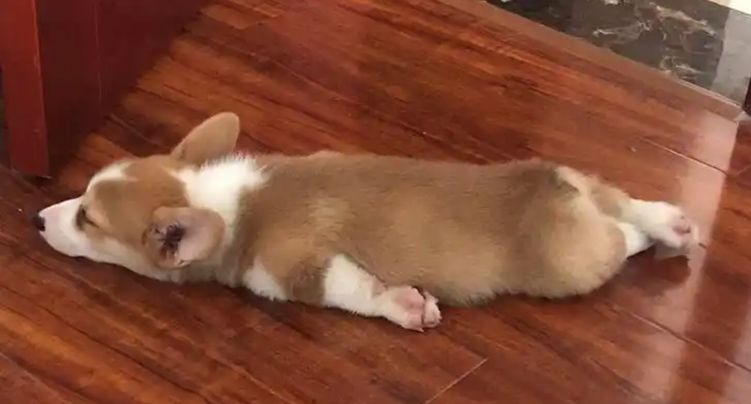

88篇.燕京还要趴多久？

清一山长2021年1月6日

**一、真的是“出货”图形吗？**

[$燕京啤酒(SZ000729)$](http://link.zhihu.com/?target=http%3A//xueqiu.com/S/SZ000729) 昨天说了坐等打脸，您今天果然就真打脸呀？好吧！反正我是反向指标，已经习惯了。不然我怎么会说，看多不做多呢？

今天这图形，真的是“出货”图形，也许主力只是把昨天进的出掉了。但要把你吓死应该是没问题的。如果主力真想出货，起码拉一拉，再出货。这段时间不断调整，拉都没拉，你出个鬼？再出，把底裤都出掉了。差评！

好的，我说了，今天是出货图形。节节低，就是出货。今天还跳空低开，不就是自己打压自己的出货空间吗？所以走得真差劲，真差评！

我今天继续坐等打脸！来吧！我穿草鞋的还怕你们穿皮鞋的吗[大笑]？

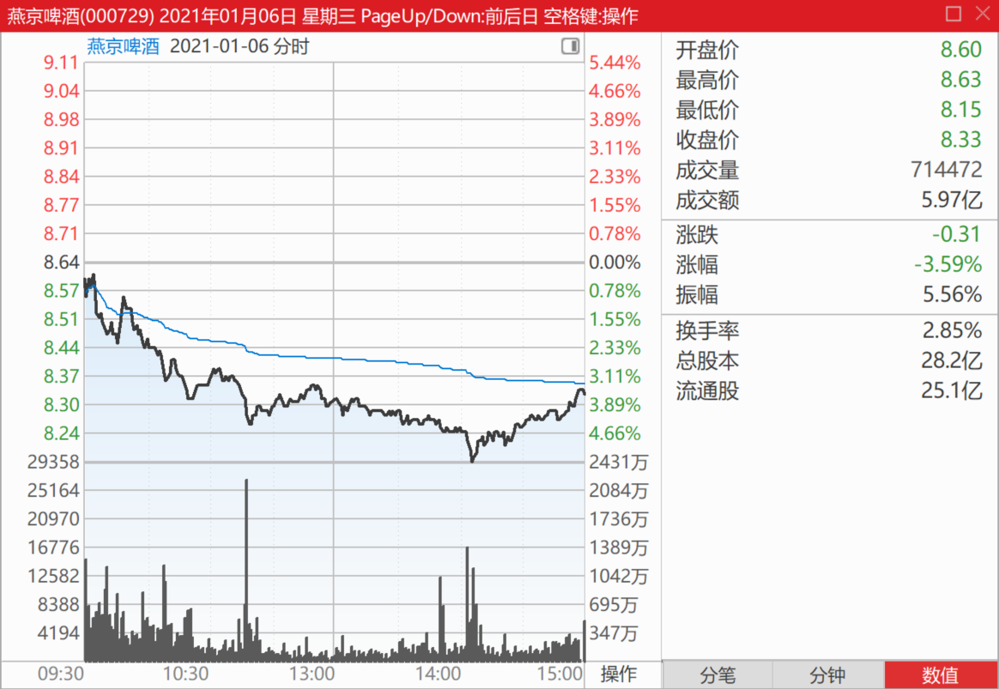

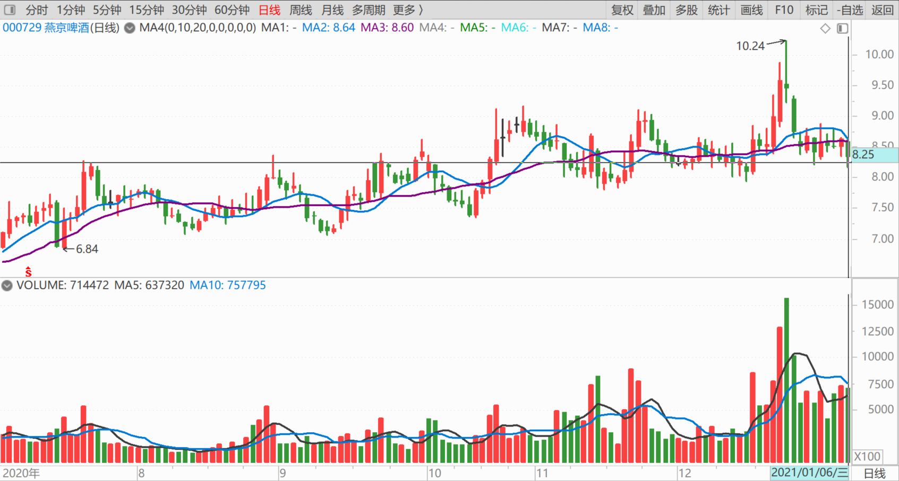

**二、庄家走了吗？**

[$燕京啤酒(SZ000729)$](http://link.zhihu.com/?target=http%3A//xueqiu.com/S/SZ000729) 股东人数从9月份的5万多，涨到快9万了。糟糕了，显然是主力一路派发，散户一路接盘。这个股的未来很不妙，肯定要亏惨了！[哭泣]。大家还不快逃命去！看谁抢先出逃。逃慢了，酒股的风没了，就要被燕京埋了。

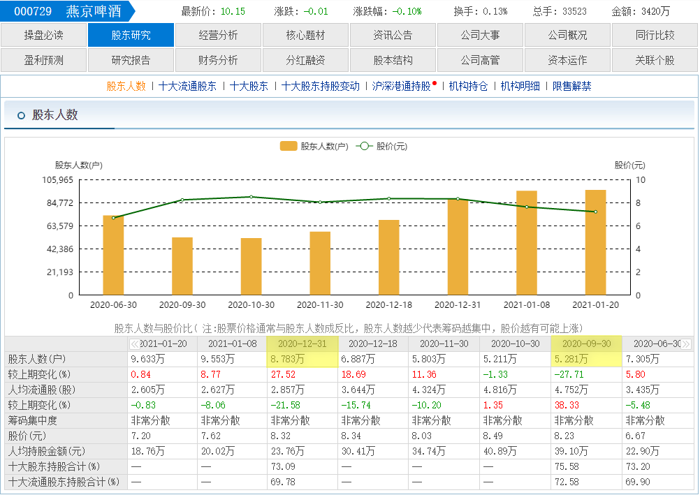

且慢，再查一下其他啤酒的股东信息怎么样了。嗯？我看珠江啤酒，怎么股东人数更新是9月30日最新？

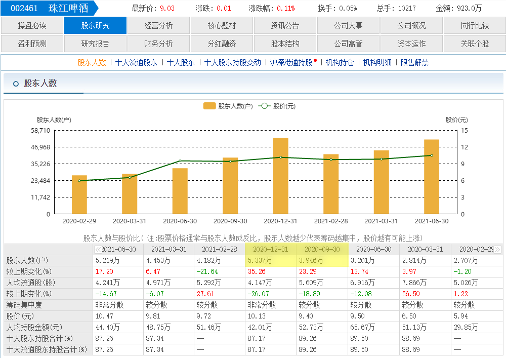

惠泉啤酒，也是更新日期9月30日？

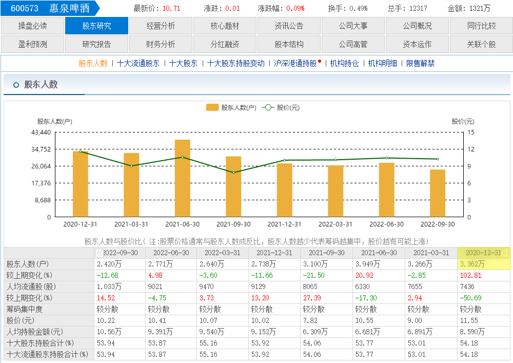

青岛啤酒，股东增加更吓人，9月底37%的增加。但是别人的股价一直在涨。啥情况！股东人数更新，也是9月30日！喔，最近散户跑了反正也看不见。是不是燕京跟青岛一样？散户增加是低价？现在相当于青岛9月份？

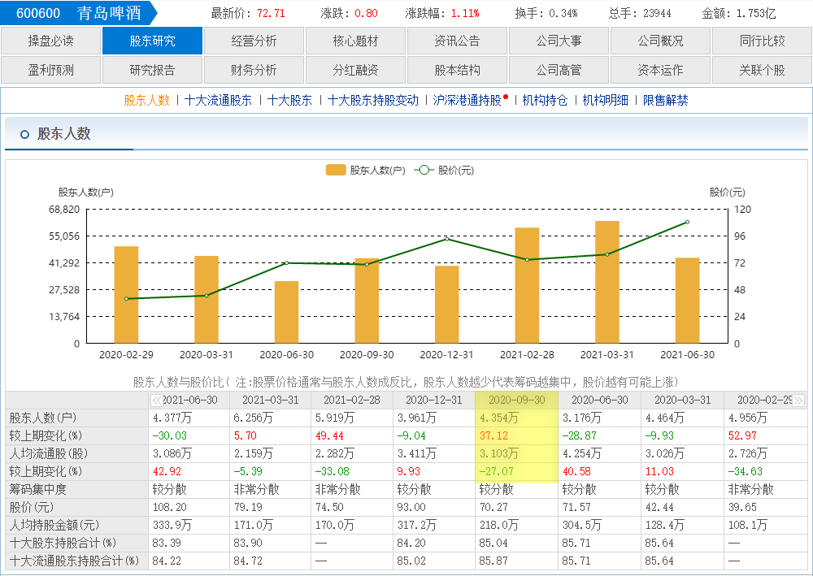

纳闷的是：这些股东数据，燕京这个根本不关心股民死活的国企，反而非常积极地公布出来，这个季度就给了四次更新信息。这么贴心地给数据，急急忙忙的充分“证明”：燕京的庄家，的确已经走了，别留在这里浪费时间了。这真的吓死宝宝了！感谢燕京的关心、爱护、体贴！我这就卖股去，不是燕京还赚了点钱的吗？虽然赚的不多，辛苦钱。但总比亏了的好，总比买中国建筑不涨的好。算是自我安慰吧！

别，再等等，让我再想想：燕京的管理层，我又不是你家爹，也没给你工资，你如此主动，积极地公布内部数据给我看，你咋就这么贴心呢？这么关心我们散户的安危呢？

于是，我就不卖了！因为我肯定不是燕京的爹，别自以为我多重要。

心想：庄家走了，就算了。重阳我们留也留不住。还是我来坐庄吧——就是坐等庄家的意思。我辈就学重阳，再死拿7年，耐心等待新庄家的到来，我不入坑，谁入坑呀？等新庄家来了，我辈坚守燕京战场的老游击队员，会放鞭炮迎接的，欢迎主力庄家，再次回来[加油]！

**三、世界上最好的生意就是吃的生意**

据说，世界上最好的生意，就是吃的生意。

可口可乐的历史，大家都知道了。现在看看中国的一些吃货们，走势如何？

这是洽洽食品的走势图，70元的价格。

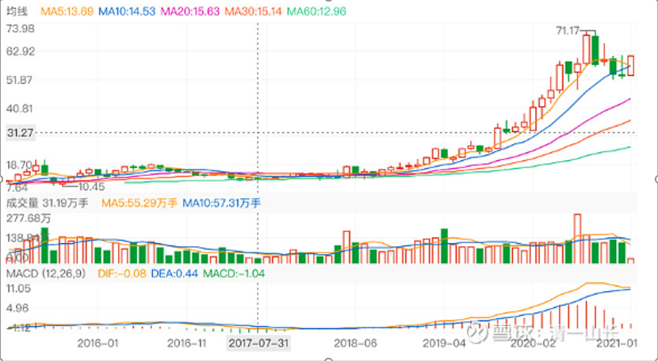

下图是伊利股份的走势图：

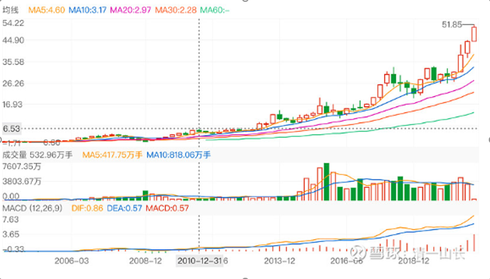

下面是海天味业的走势图：

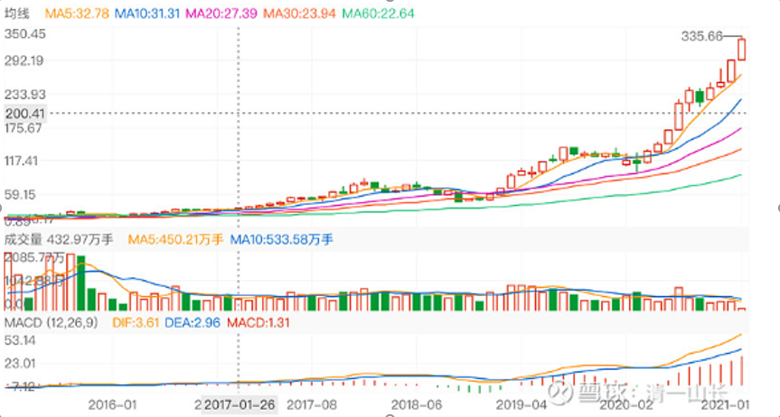

下图是五粮液的走势图：

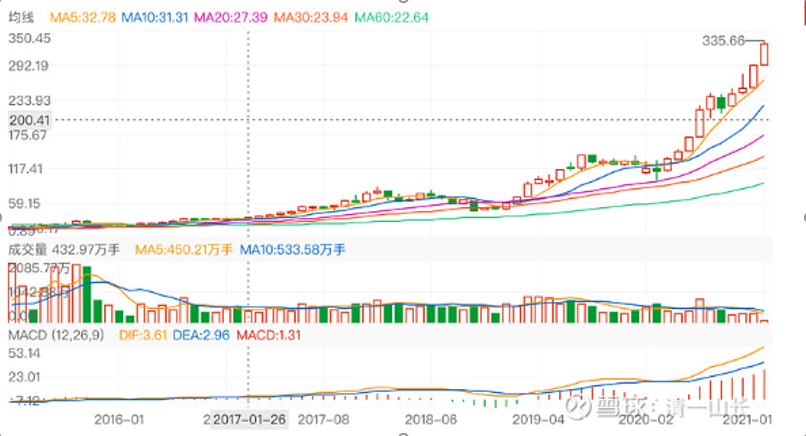

接下来是燕京啤酒的走势图。这样趴下已经有20年了。您认为，燕京还要趴多久？继续趴在地上20年呢？还是像某些东西一样，突然就“热”起来了？

答案我不知道。也许您会选择去追上面的股。我选择抱着冷门股睡觉！

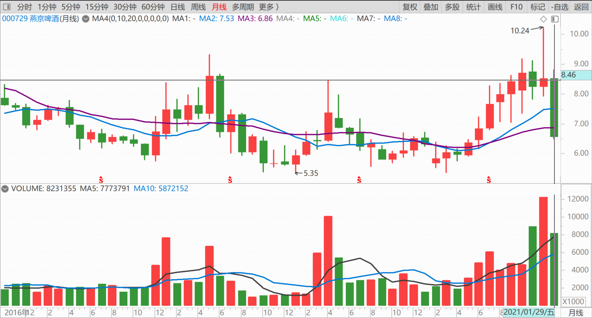

(标题、图片为编者所加)

**文章音频**：

[515篇.燕京还要趴多久？](http://link.zhihu.com/?target=https%3A//www.ximalaya.com/sound/783233480)

**参考链接：**

[80篇.燕京是一座金矿](https://zhuanlan.zhihu.com/p/720733084)

[81篇.做人，做事，都必须有“道”](https://zhuanlan.zhihu.com/p/722042320)

[82篇.投资必须依赖自己的投资系统、有效的原则、纪律](https://zhuanlan.zhihu.com/p/783923357)

[83篇.第一天涨停第三天跌停](https://zhuanlan.zhihu.com/p/846758124)

[84篇.我的啤酒股票，绝对不会“出清”](https://zhuanlan.zhihu.com/p/6035500140)

[85篇.这一轮珠江的底部和惠泉的底部](https://zhuanlan.zhihu.com/p/7361102270)

[86篇.吓人的目的是让你卖掉快逃](https://zhuanlan.zhihu.com/p/8712468814)

[87篇.早盘急拉代表什么？](https://zhuanlan.zhihu.com/p/10710257712)
