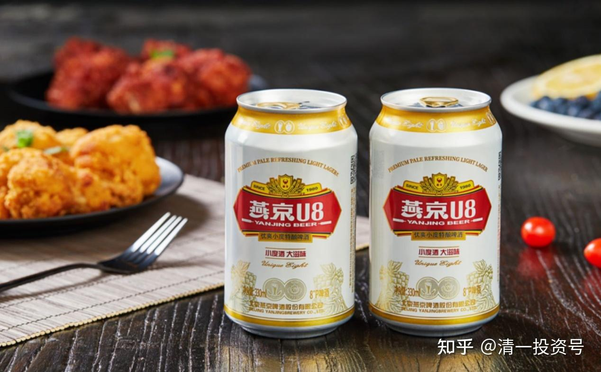
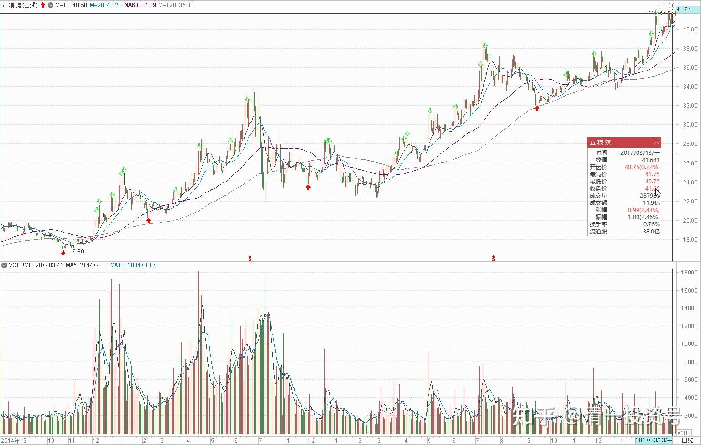
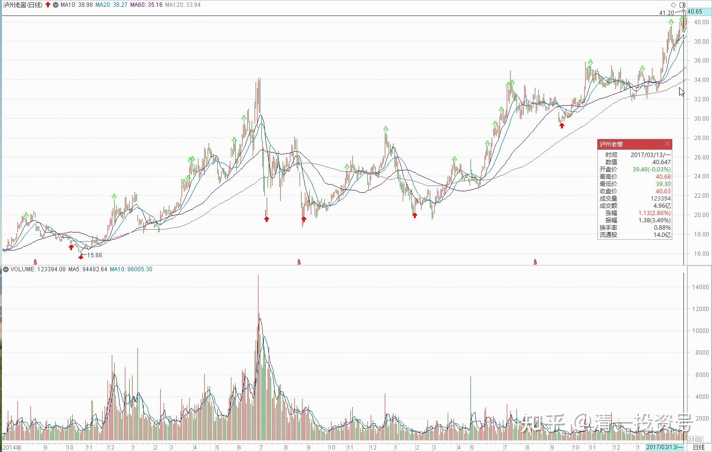
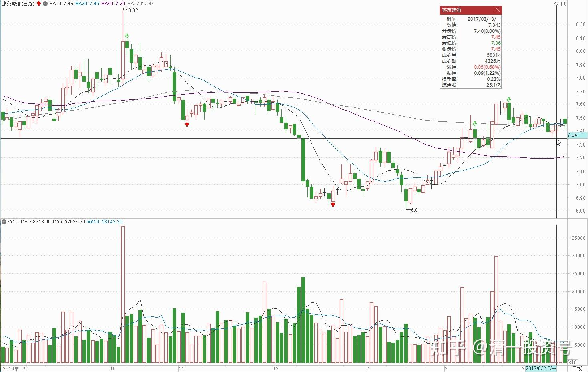
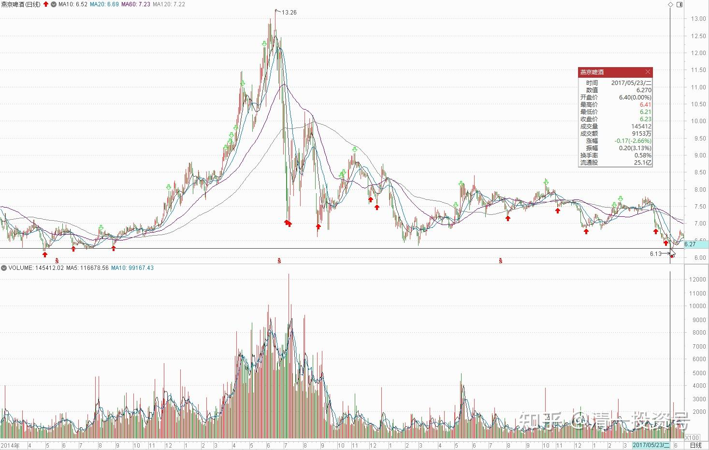
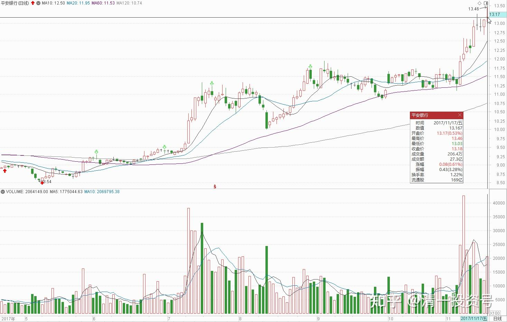
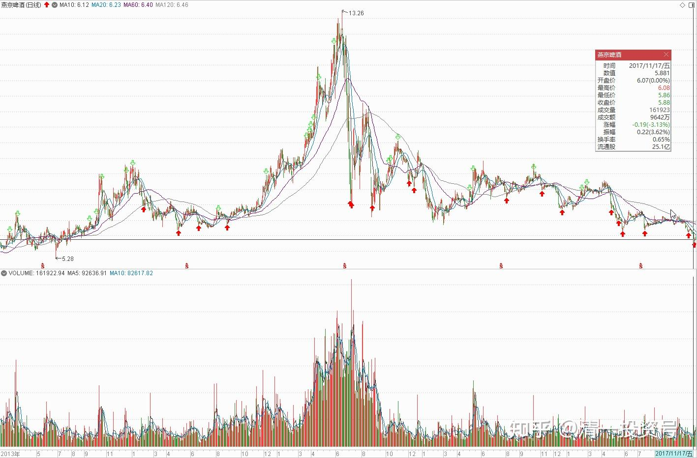
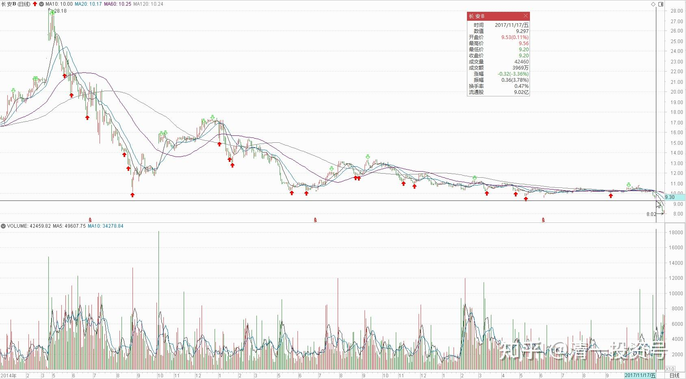
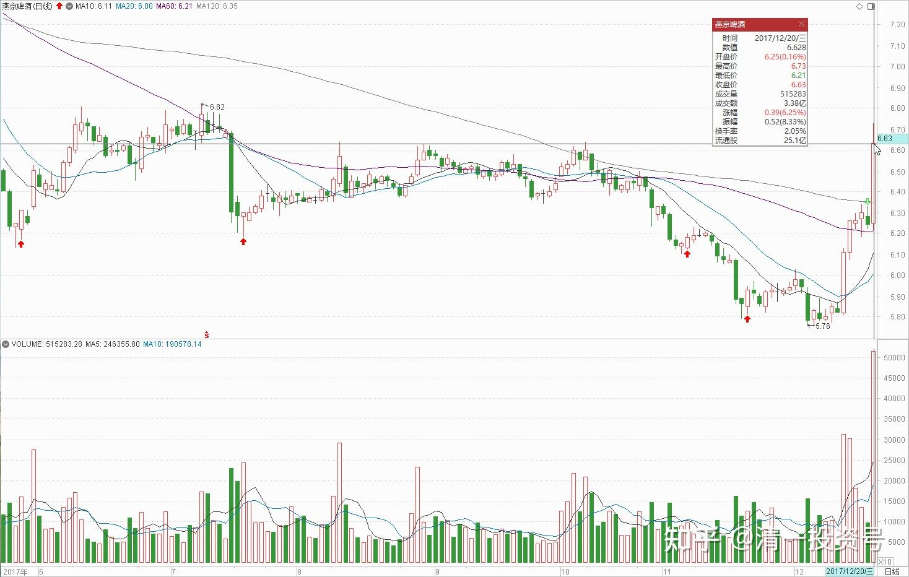

8篇.初谈燕京

清一山长 2016年8月～2017年12月

一、初谈燕京

清一山长2016-08-04 17:13:46

我刚刚关注了股票$燕京啤酒(SZ000729)$，当前价￥7.38元。

清一山长2017-03-13 17:22:43

$泸州老窖(SZ000568)$ 今天开始换股了。

涨了一倍多的泸州、五粮液，我换了还没涨的啤酒股。41.6元卖掉一半的五粮液。40.27元卖掉一半的泸州老窖。**换了才7元出头的燕京啤酒喝。**不知道这样胡乱换酒喝，会不会醉掉。[大笑]

反正：我看到涨100%股票，都有想卖的冲动。这种个性不好，不配拥有高大上，不搞庆功宴。总在捡垃圾中度过我的投资生涯。

这两个好酒，我都是在它们最垃圾的时候买的。五粮液2013年15元就买到了手，比老窖（16元多买入）还便宜，实在让人不好意思。2016年年初，20元左右又用其他赚钱的资金加仓买进两种酒（当时26元港币还买了青啤H）。这么快就给回报了，中国人还是应该买白酒。我的啤酒，等上三年，总能涨一倍吧？

我脑子简单，心想：都是我的消费类酒水投资配置，一个涨了一倍多，一个还站在原地不动。市场给的价格，肯定有一个是给错了。谁是错呢？我不知道。**涨的酒类，如果是错的，以后就会跌，所以涨了要卖掉。如果酒类就是该一直涨下去，其他酒，如啤酒业，也应该跟涨的，所以现在该买进。所以，我就卖掉涨了一倍多的酒水，买了不涨的酒类。**这种换股，从概率上来说，是不太会赔本的。不过现在看起来是笑话。

有人说我买股票不看财务报告，笑话我。也许吧，不过我今天是不看报告的。我只看“博弈学”。

二、加入“拯救燕啤”计划

51nxp 2017-05-23 15:05

$燕京啤酒(SZ000729)$ 跌得如此惨烈，还是茅台03说得好，买入前多考虑负面的。

燕啤义无反顾地在机构的砸盘下，收到3年的下轨。

再怎样多虑，我也不会想到它会跌到这么低。

深思熟虑只能让自己安心，别的交给时间和市场吧！我对这一战能赢利依然充满信心。

原文链接：[https://xueqiu.com/9203843585/85965492](http://link.zhihu.com/?target=https%3A//xueqiu.com/9203843585/85965492)

清一山长2017-05-23 22:24:11 （评论上贴）

不看盘的好处就是：有人告诉我前期买入的燕啤跌惨了，看我的笑话。我才来看看盘面，收拾残局。方法就是：再买一点！[笑]，只能等明天了。正好手上有些余钱，更有一些余股（涨太高的股就是应该卖掉的余股，跌惨了的股，就是应该买进的股）

51君的坚持精神令人佩服。**我也一起加入“拯救燕啤”计划，打算买到一百二十万股就停手**[笑]。

原帖已被作者删除:

[https://www.yicai.com/news/1288565.html](http://link.zhihu.com/?target=https%3A//www.yicai.com/news/1288565.html)

[https://www.163.com/dy/article/CTTBGITN05198R91.html](http://link.zhihu.com/?target=https%3A//www.163.com/dy/article/CTTBGITN05198R91.html)

[http://finance.66wz.com/system/2011/12/26/102930809_01.shtml](http://link.zhihu.com/?target=http%3A//finance.66wz.com/system/2011/12/26/102930809_01.shtml)

[神秘马仁辉鼓吹重啤至1000元 高位出逃](http://link.zhihu.com/?target=http%3A//finance.66wz.com/system/2011/12/26/102930809_01.shtml)

清一山长2017-09-08 21:06:01 （评论上贴）

我刚打赏了这篇帖子 ￥100，也推荐给你。写这种文章，一直要支持！江湖水深，感谢作者披露出来。我当年在大户室，实际经历过重啤的疯狂历程。看到周围人，券商经理等对重庆啤酒的疯狂热捧。但我笨，看不懂，没介入。“个人投资者”马仁辉，何以影响全国的公私募基金的集体决策？如何防范无处不在的骗子？

**三、买入5元多的燕京，先当“股疯，股傻”**

清一山长2017-11-17 15:07:37 （主贴1）

$平安银行(SZ000001)$ 今天卖出20%的平安银行持仓，卖出价13.18元，挺吉利的。这是半年多前以8.99元买进来的银行股，我也弄不清为啥就它涨了很多，否则当初应该把兴业全换成平安的。反正，涨了就卖掉吧！赚得也不少了。主要要用这些资金，去挽救一个还停留在2005年价格的“失足”股票[加油]。

**今天买入60万股燕京啤酒，价格是5.87元。**价格似乎不太吉利。燕京啤酒，是我A股目前唯一的亏损股。就不换银行了。减一点金融的仓位，万一我换了个黑马呢？万一又回到2005年，燕京从五元多冲上30元，也许我就可以封“股神”了。**现在先当“股疯，股傻”。**

sml寒韩 回复@清一山长: （主贴1续评）

老大，可以点评下长安汽车吗？重仓买了他们B股，真是苦透苦透。

清一山长 2017-11-17 15：31：17回复@sml寒韩:

看了长安汽车一路下跌的K线图，再看了长安B市盈率才三倍多的诱惑力，我感叹：投资,真不是只会看市盈率，市净率,就能做的事情。过去不能说明未来。价值投资，也不是简单买入“好公司”，一直等，就会赚钱的。我决定不碰汽车，看来还是很英明的。贾会计弄汽车，结果身败名裂。假如他不碰汽车，也许也不会这么倒霉的。

不过，我的燕京啤酒也一直跌，好不到哪去。但我持有燕京要比持有汽车要安心得多，因为我知道10年后，北京人还是会继续喝燕京啤酒，而且价格绝对不是今天的价格。但今天如果我买入的汽车，十年后恐怕就是一堆废铁。

mengxiang188回复@清一山长: （主贴1续评）

老师，您能不能点评一下吉艾科技[合十]被套了[哭泣]:

清一山长2017-11-17 15:52:59 回复@mengxiang188:

你们这些人，真是有毛病[抠鼻]。吉艾科技，这个股我不懂，也没买。你买了，证明你懂。你可以告诉我，为啥它比我持有兴业更好？至于你不懂，你跟随大V买了这股，他赚你就赚，他赔你也赔。要赔钱，起码别人比你赔的多，还要赔名誉。你有啥好纠结的？来问我，有啥好问的？你们这些体制学校培养出来的，只知道抄标准答案的学生，还不肯好好抄。你想偷懒，要抄别人的作业，干嘛不17元跟着抄？涨到22元还被套，活该！脑子拿来是干嘛的，准备以后死的时候，带一个全新的，没用过的脑子去见上帝吗？

跑来找我问无脑问题的，会被我骂。我最讨厌无脑人，无脑问。不满意就无脑拉黑！！！。

清一山长2017-11-17 16:15:50（主贴1续评）：

刚看了盘后新闻【金融股护盘 上证50指数逆市创新高】原来我的银行卖给国家队了[大笑]。早知道是他们护盘，我就多卖一点。在用钱去帮他们护盘，买跌的惨的股去。跟国家队共进退，协作精神嘛[笑]！

鲟投资 回复@清一山长: (主贴1续评)

决策错误？

清一山长2017-12-23 20:28:15回复@鲟投资：

回头来看，这是一笔很漂亮的切换套利喔！你给我打了红叉叉，市场给我打绿勾勾[大笑]。证明在市场面前，我们的大脑其实啥都不算，别当巫师了。（申明：我不知道燕京要涨，我以为我会继续打脸，没想到这么快就涨了。

清一山长2017-12-20 21:03:22

$燕京啤酒(SZ000729)$ 终于涨了，你们要追吗？这段时间一直不断的跌，弄得我莫名其妙的。**没见基本面有啥坏消息呀。结果就害我一直买啤酒，吃到饱，都饱到快吐了。居然还给了我买5元多价格买燕京的机会。**我当时就想了，谁疯了，要以这个价格卖燕京？会不会就是传说中的黄金坑？绝对不正常。

其实，现在股价也只回到了前期平台。我的账面今天还是亏的[哭泣]。（我没去看账户，估计应该这笔投资没赚钱。我再拿两年，看你还敢亏[加油]。）

只是我猜测，很多原来“坚决持股”的人，今天肯定走了。如果直接拉的话，这些人都不会走的。所以要先往下打。谁说中国股市现在没有庄家了？鬼都不信！

参考链接：

[YJ走势果然神鬼难料\[表情\]](https://www.zhihu.com/pin/1604810289215668226)

[发表今天的想法，就是非常的感谢，感谢这…](https://www.zhihu.com/pin/1604504352521158656)

[清一投资号：9篇.啤酒系列2：起码十年不涨就值得一起守候了](https://zhuanlan.zhihu.com/p/596134341)

[清一投资号：10篇.啤酒系列3：顺鑫快速拉升引发的啤酒讨论](https://zhuanlan.zhihu.com/p/597816918)

[清一投资号：11篇.啤酒系列4：连连出台的质疑文让我加紧了买啤酒的行动](https://zhuanlan.zhihu.com/p/598382916)

[清一投资号：12篇.啤酒系列5：早期珠江啤酒、燕京啤酒的换仓记录](https://zhuanlan.zhihu.com/p/602033762)?

[清一投资号：13篇.啤酒系列6：买卖操作后的富足之心](https://zhuanlan.zhihu.com/p/604162057)

[清一投资号：15篇.啤酒系列8：金融市场是考验心态和修为的地方](https://zhuanlan.zhihu.com/p/608010478)

[清一投资号：16篇.啤酒系列9：买入的理由不是因为要涨，而是因为没有多少下跌空间](https://zhuanlan.zhihu.com/p/609653689)

[清一投资号：17篇.啤酒系列10：只记住一件事：低价不卖，高价不买](https://zhuanlan.zhihu.com/p/611574943)

[清一投资号：18篇.啤酒系列11：炒股美德——亏赚两相宜](https://zhuanlan.zhihu.com/p/611564523)

[清一投资号：19篇.啤酒系列12：啤酒是一个难得的大潮](https://zhuanlan.zhihu.com/p/613467605)

[清一投资号：20篇.啤酒系列13：投资啤酒股是买困境反转的行业](https://zhuanlan.zhihu.com/p/615531121)

[清一投资号：1篇.涨停之际，谈我的啤酒股投资逻辑](https://zhuanlan.zhihu.com/p/477911616)

