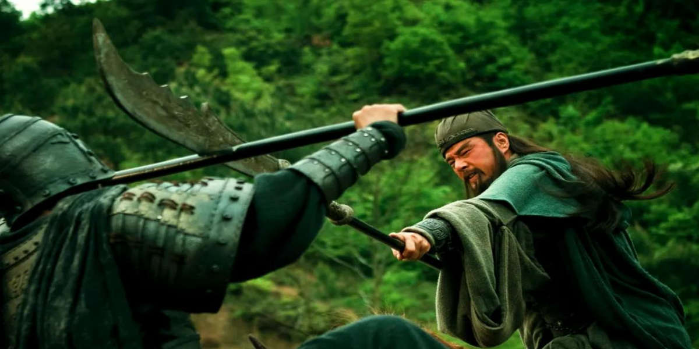

90篇.谁会是市场斩杀的对象

清一山长 2021年1月11日

**一、谁会是市场斩杀的对象**

[$惠泉啤酒(SH600573)$](http://link.zhihu.com/?target=http%3A//xueqiu.com/S/SH600573) 跌停了？真不可思议，居然真的又到了我的发言区了。那就买一点呗[大笑]！我不套牢谁套牢！

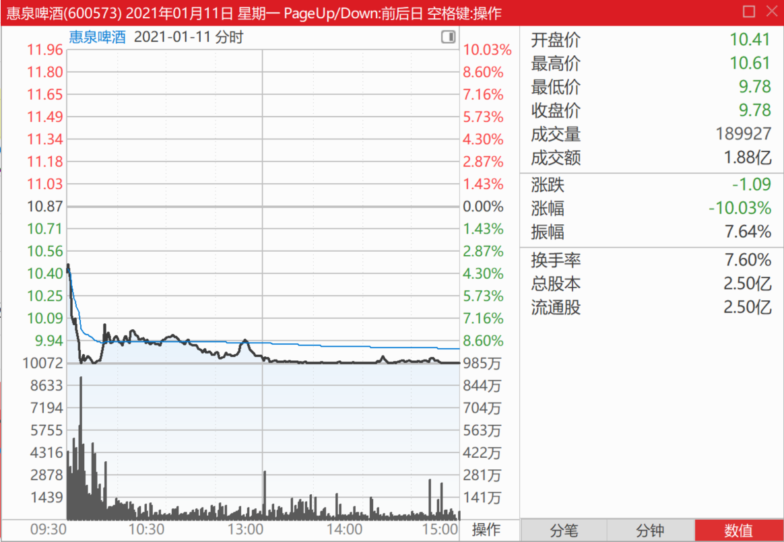

[$惠泉啤酒(SH600573)$](http://link.zhihu.com/?target=http%3A//xueqiu.com/S/SH600573) 不客气地说：**开盘就直奔涨停、直奔跌停的，都是出来收智商税的。**看到这种图形，都需要警惕！

今天三大啤酒大跌，让我“损失惨重”，其实一股没少。**只有天天看账户上的数字起伏而心动的人，才会是市场斩杀的对象。只要心动，你就输了。**

我就傻到每天只数我账户的股数增加了，还是减少了。我就认死理：我一股没少，庄家主力再狠，你能拿我咋办？

（关键点是：你买的企业不能垮，你持仓的成本不能高。账面是赚多，还是赚少，就不要去斤斤计较了）

下图是珠江啤酒的“深V”，看看：性不性感？[俏皮]

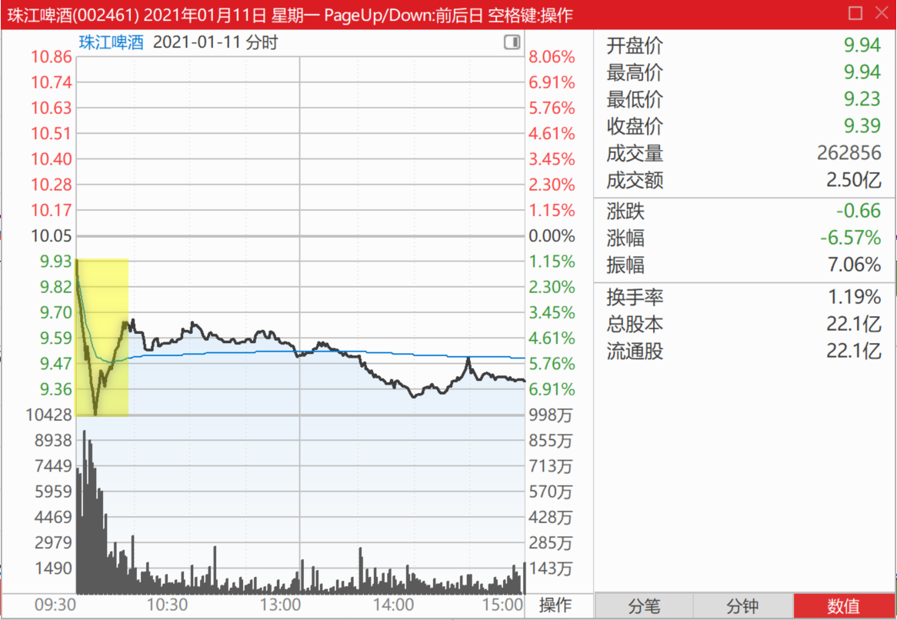

二、目前燕京最有潜力

[$燕京啤酒(SZ000729)$](http://link.zhihu.com/?target=http%3A//xueqiu.com/S/SZ000729) [权益变动报告书显示，2018年1月11日，裘国根的重阳集团买入1348万股燕京啤酒股票，买入均价7.285元。重阳投资及其一致行动人合计持有燕京啤酒股票占比达到5%。）。](http://link.zhihu.com/?target=https%3A//data.eastmoney.com/notices/detail/000729/AN201801151077789525.html)

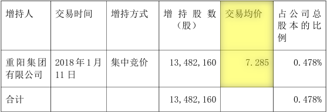

今天的燕京，最低价7.31元。

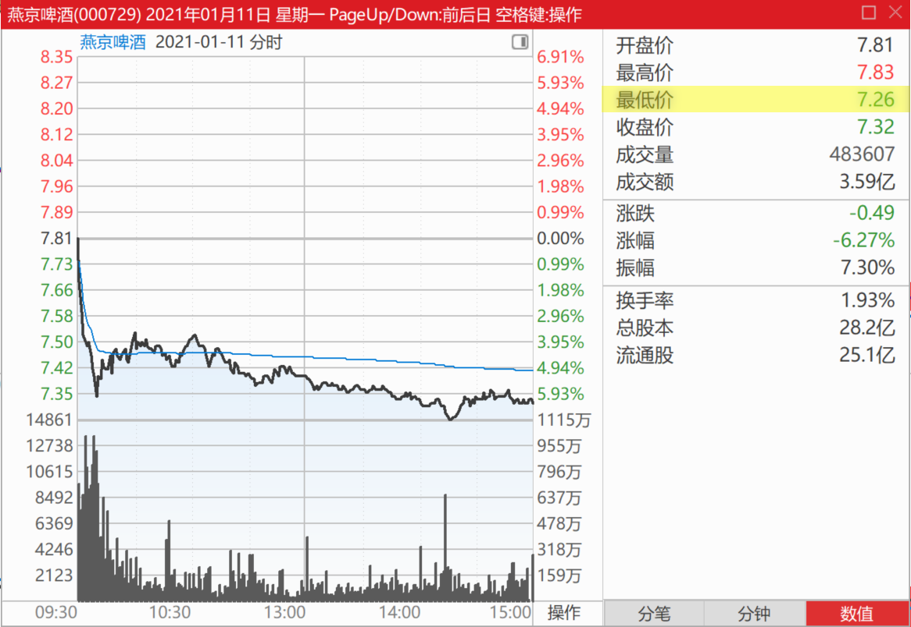

真佩服重阳：拿了三年燕京，赚了每股0.12元。我想问裘总：您的资金利息，够不够支付的？

燕京到底在玩什么？我们真不知道。在燕京啤酒销量和利润，都取得正增长的时候，股价却与3年前燕京根本没有啥好出路，一片茫然的时候相比是一样的。您觉得正常吗？

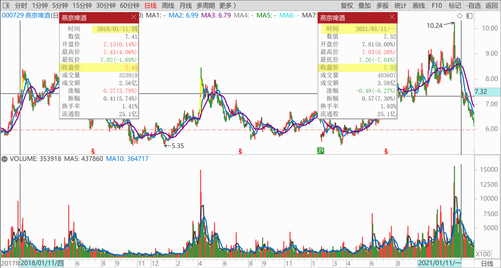

也许，燕京真的会破五？

我不知道，但我决定坚守！我不亏谁亏？你们走吧！我负责善后，只要你们安全就好[加油][大笑]

[51nxp](http://link.zhihu.com/?target=http%3A//xueqiu.com/n/51nxp)回复[清一山长](http://link.zhihu.com/?target=http%3A//xueqiu.com/n/%25E6%25B8%2585%25E4%25B8%2580%25E5%25B1%25B1%25E9%2595%25BF)：

**很多人会非常在乎每一天的账户市值，这个毛病有，你就做不好投资。**

你要真正地看清企业的经营前景，和它共同成长才能够赚到属于你认知能力的钱，这个模式才能复制。

虽然山长更偏向于资产的保值，我更偏向于进攻，但是我觉得山长的投资是很靠谱的。

**燕京啤酒在消费股中绝对低估。**

[清一山长](http://link.zhihu.com/?target=https%3A//xueqiu.com/9310099567)回复[51nxp](http://link.zhihu.com/?target=http%3A//xueqiu.com/n/51nxp)：

**我们都是善于逆势中苦熬的人**[献花花]。顺鑫农业，当年你也一样苦苦守候，面对的是种种的不可思议的低价，打压，以及种种坏消息满天飞。你就守住一条就是坚持不动：牛栏山的每年销量，都在上升中。作为中国销量第一的酒股，不应该是19元这个价格！

最终，坚持的赢了。但很多人，有些人坚持了一两年，都受不了庄家的磨叽，最后跑掉了。我记得，你当时还只有这一只股死拿！别的股都不看[笑]。

啤酒，是我顺鑫创酒股大赚记录后转战的品种。现在看来，不如坚守白酒（比如当时去买入价格与顺鑫差不多的泸州老窖和五粮液更有价值）。但世界上没有后悔药。燕京依然不涨，就只能依然守候了。幸亏惠泉、珠江，都赚了不少。**但目前，燕京是最有潜力的**。

2019年，燕京啤酒四季度，销量已经提升了31%，明显走出低谷。（2019年燕京啤酒年报：2019年，燕京啤酒实现啤酒销量381.16万千升）2020年二季度、三季度的销量提升，也明显提速。四季度应该也在去年大幅提升基数的情况下，2020年还有进一步提升的空间。(2020年燕京啤酒年报：2020年度，公司实现啤酒销量353.46万千升)可惜查不到任何消息，可见封锁严密，就跟当年的顺鑫一样，好消息看不见，坏消息满天飞。

2019年，燕京的下属子公司，一南一北两个控股子公司，漓泉和赤峰，分别取得净利润共计4.81亿，同比分别增加25%和47%，连消费旺季很短的赤峰公司净利润率亦超过10%。

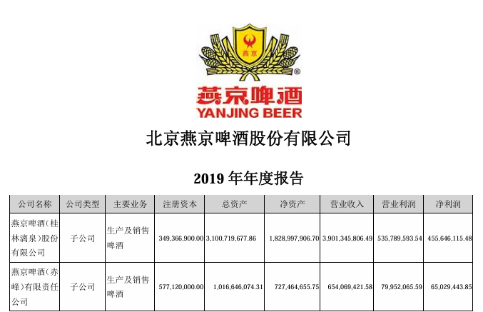

仅此两子公司，净利润就超过[重庆啤酒](http://link.zhihu.com/?target=https%3A//xueqiu.com/S/SH600132%3Ffrom%3Dstatus_stock_match)（4.04亿）和[珠江啤酒](http://link.zhihu.com/?target=https%3A//xueqiu.com/S/SZ002461%3Ffrom%3Dstatus_stock_match)（3.66亿）。

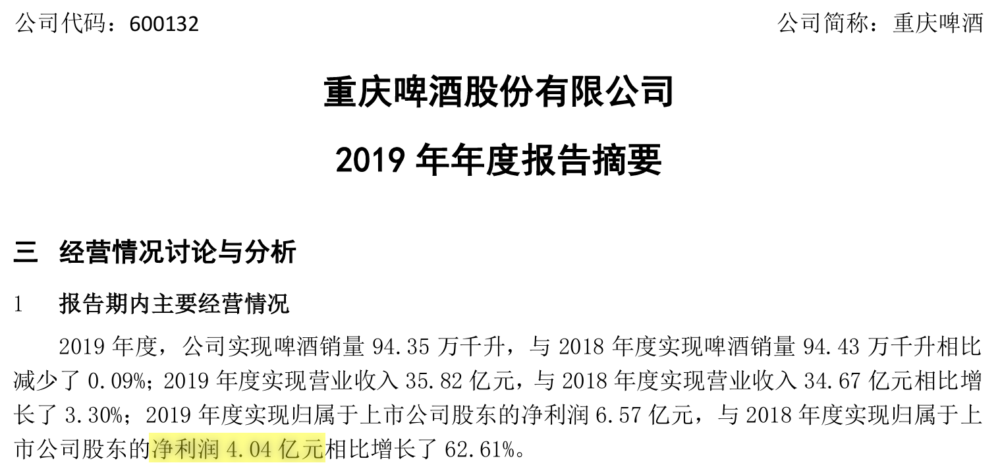

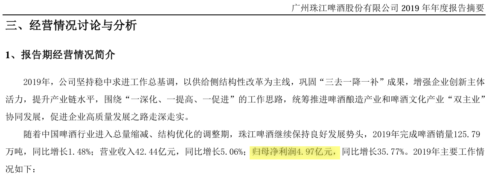

市值却相差巨大，特别是和重庆啤酒相比。燕京主品牌，一分钱不要，也不至于是现在这个价格。

所以，我一直说：**万一燕京主品牌开始亮点出现了，燕京的困境反转，可能是令人吃惊的局面。**我相信啤酒股，会让我获得比顺鑫农业更多的投资利润（不是指股价），珠江目前已经实现了这个目标。惠泉，也基本上实现了这个目标。就是燕京的表现还差一点[笑]

**三、股场大哥的英雄本色**

[$珠江啤酒(SZ002461)$](http://link.zhihu.com/?target=http%3A//xueqiu.com/S/SZ002461) 燕京今天技术上大破位，跌破了所有的技术防守位置。技术上不看好！预后不良！

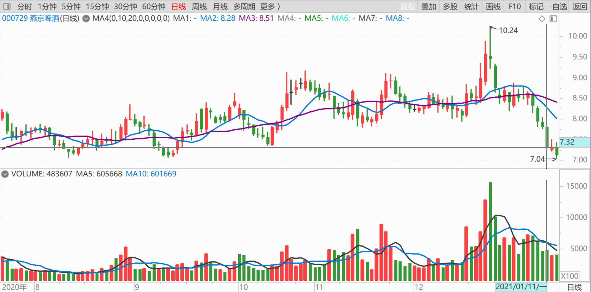

什么叫英雄本色？股市上的英雄啥做派？

就是股票破位，市场悲惨，股价跌停的时候，侠肝义胆，敢下场买股：我不套牢谁套牢！**这就是股场大哥的英雄本色：敢于直面惨淡的人生。**敢于迎着飞刀，去接飞刀。不怕亏，不怕苦，不怕死！当所有人都胆怯退让的时候，勇敢地承担！

**涨停的时候敢卖！不贪钱，不爱钱。讲义气，大气，愿意分享。愿意共赢！当所有人都在欢呼、追捧的时候，留一份清醒，留一份爱！**

这种英雄情怀，抄送给燕京啤酒、珠江啤酒、惠泉啤酒。目前，我依然是惠泉的十大，跌停的时候，我必定与惠泉不弃不离。不会落井下石，赶快撇清自己与惠泉没关系的。

涨停的时候，我愿意把贫困的时候不弃不离的“福建红粉佳人”，送给敢于冲锋陷阵的“中国英雄好汉”！我上季度，在惠泉高歌猛进，连续玩涨停的时候，已经多次“退位让贤”。又被惠泉多次用跌停卖惨，把我重新拉进来站队了。

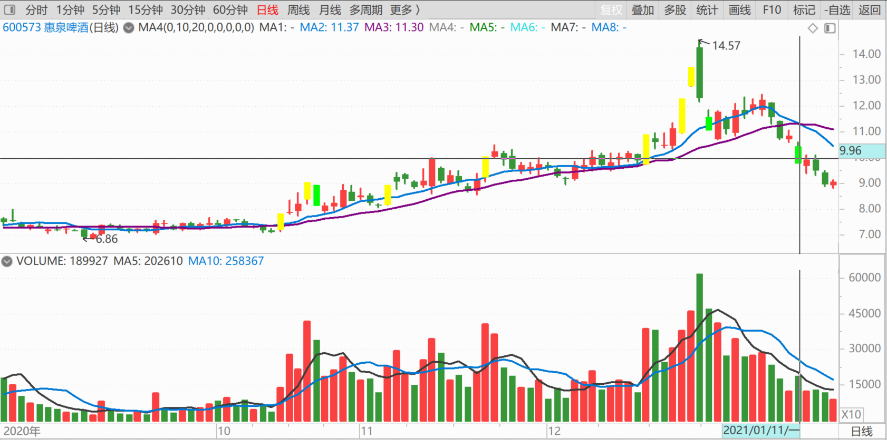

未来的年度报表，你们应该依然能够看得到我的名字的（除非十大的门槛大大提高，就像珠江一样）。去年年底，负成本持有百万惠泉仓位。今年年初，我的惠泉持股，比年底更多了不少。但我不肯定一季报还会有我，关键看惠泉一季度要不要出来浪了。如果惠泉继续低调，贤惠，含蓄，我就依然会是十大，继续当几年的惠泉十大，甚至十年，也没关系的。再跌下去，我甚至进三大，挑战二大，也不是没可能。但如果惠泉继续高调来秀身材，我就转身，让出位置来给“抢亲”的人！退出十大也不一定正式宣布（我退出的时刻，必定是超过10元的价格，所以不会公开高调退出，您只能在财报里面看我的退出动作了）

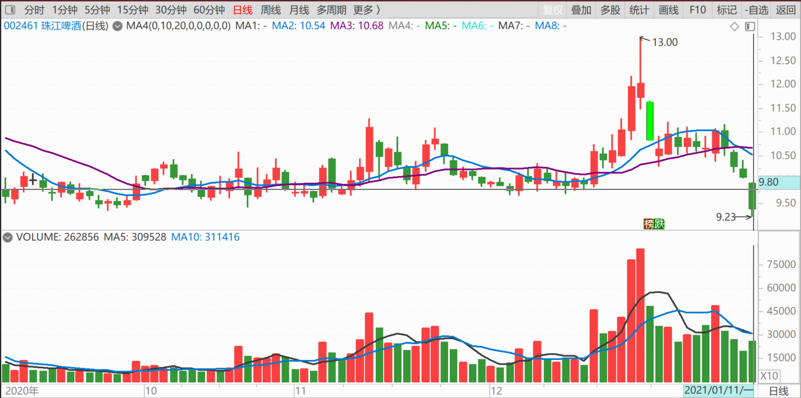

**四、跟惠泉玩，你必须胆大心细**

[$惠泉啤酒(SH600573)$](http://link.zhihu.com/?target=http%3A//xueqiu.com/S/SH600573) 我把舍不得卖的，招商银行的底仓，今天都卖掉了[捂脸]。49元一股卖掉。

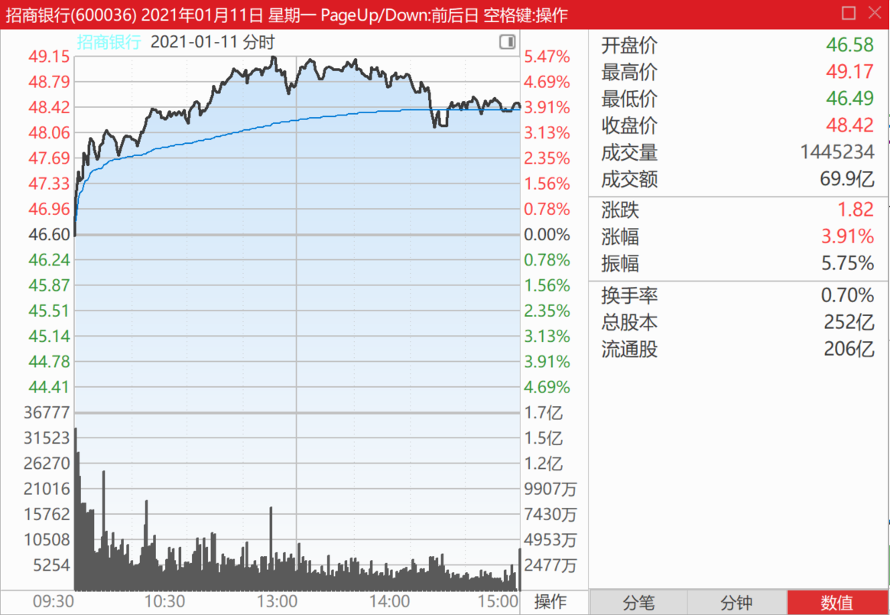

都拿来买跌停价的惠泉了。有一笔十几万股的跌停价单子，是我买的。没钱了，撬不动板子，我再凑凑钱去[加油]

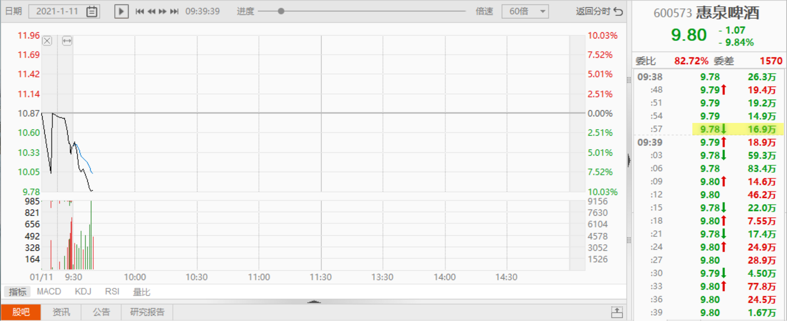

[崔正浩](http://link.zhihu.com/?target=http%3A//xueqiu.com/n/%25E5%25B4%2594%25E6%25AD%25A3%25E6%25B5%25A9)回复[清一山长](http://link.zhihu.com/?target=http%3A//xueqiu.com/n/%25E6%25B8%2585%25E4%25B8%2580%25E5%25B1%25B1%25E9%2595%25BF):

简直喷老血了，上周贷款五千手13元附近进去了。救命啊！！！！！！！！

[清一山长](http://link.zhihu.com/?target=https%3A//xueqiu.com/9310099567)回复[崔正浩](http://link.zhihu.com/?target=http%3A//xueqiu.com/n/%25E5%25B4%2594%25E6%25AD%25A3%25E6%25B5%25A9)：

您的买点，是我的卖点[捂脸]、难道您就是传说中的对手盘吗？[为什么]

各位别看我加仓你们也加惠泉，你们也跟。我没让你们跟随我买卖的。我没有要各位接盘的意思，我无非就是分享我的买入卖出操作而已。不在意你们想做什么的。更没有想让你们来接盘的，我又不坐庄！

**我现在的操作，是把高位卖掉的买回来，不是新开仓。**请不要会错情。

惠泉主力，是操盘高手，特别是10元以上，风险巨大。当然，抓到了涨停，获利空间也大。你看这一轮，**它回调就超过多少幅度了？14元多调回9元多，连我都没料到。**如果我当时卖出的钱，不是去买了港股通的低价港股，我估计早就加满了。我惠泉高位持有的数字是244.08万股，去年底，我只勉强加回100万股（你们会在年报中看到的）。今天，我才加达到了超过200万股。但依然还没有加回我卖掉的股数。除非它跌到8元，我才会加仓超过我的卖出股份。

**跟惠泉玩，你必须胆子大，还要心细，**不然分分钟被坑！敌人太狡猾了[滴汗]

[清一山长](http://link.zhihu.com/?target=https%3A//xueqiu.com/9310099567)回复[崔正浩](http://link.zhihu.com/?target=http%3A//xueqiu.com/n/%25E5%25B4%2594%25E6%25AD%25A3%25E6%25B5%25A9)：

你13元居然加了5000手？650多万资金？说错没？确定不是5000股吧？不然，您完全可以拿个十大去当了。年初的惠泉第十大，只要400万就可以当上了。门槛不高。

有这实力的人，会在13元来大笔加仓惠泉？怪不得惠泉主力今天打得如此之低，原来全都卖给你们这些土豪了。

土豪加油[献花花]。说不定得等你们都割掉了，惠泉才会涨。主力没有拿够筹码，是绝对不会拉升的。燕京已经充分证明了这点！

我低位跟他抢筹码的人，他最不想理了。抢多了，他就不玩了。[捂脸]

[雨点点1](http://link.zhihu.com/?target=http%3A//xueqiu.com/n/%25E9%259B%25A8%25E7%2582%25B9%25E7%2582%25B91)回复[清一山长](http://link.zhihu.com/?target=http%3A//xueqiu.com/n/%25E6%25B8%2585%25E4%25B8%2580%25E5%25B1%25B1%25E9%2595%25BF)：（跟评主贴7）

山长老师11.08元买的惠泉卖了吗？

[清一山长](http://link.zhihu.com/?target=https%3A//xueqiu.com/9310099567)回复[雨点点1](http://link.zhihu.com/?target=http%3A//xueqiu.com/n/%25E9%259B%25A8%25E7%2582%25B9%25E7%2582%25B91)：

10元以上的操作都别问我，不是说过了吗？

[**9gp](http://link.zhihu.com/?target=http%3A//xueqiu.com/n/%25E9%2599%2588%25E9%25B9%258F9gp)回复[清一山长](http://link.zhihu.com/?target=http%3A//xueqiu.com/n/%25E6%25B8%2585%25E4%25B8%2580%25E5%25B1%25B1%25E9%2595%25BF)：（跟评主贴7）

还是不要迷信他，虽然我没有证据，但是总觉得他在骗散户钱。

[清一山长](http://link.zhihu.com/?target=https%3A//xueqiu.com/9310099567)2021-[01-12 11:01](http://link.zhihu.com/?target=https%3A//xueqiu.com/9310099567/168429729)回复[**9gp](http://link.zhihu.com/?target=http%3A//xueqiu.com/n/%25E9%2599%2588%25E9%25B9%258F9gp)：

您非要关注我，就是看我怎样骗你的吗？真有脑子[献花花]。欢迎您跟我反向操作！祝您大吉大利大发。一元打赏就不给了。替您拉黑我自己了，免得您受骗上当[大笑]。

[曾乐天](http://link.zhihu.com/?target=http%3A//xueqiu.com/n/%25E6%259B%25BE%25E4%25B9%2590%25E5%25A4%25A9)回复[清一山长](http://link.zhihu.com/?target=http%3A//xueqiu.com/n/%25E6%25B8%2585%25E4%25B8%2580%25E5%25B1%25B1%25E9%2595%25BF)：

这个社会有这样凭感觉的人，挺好的！

不然，都是有思考的人，我们又要加倍努力很多了。

不明白山长老师，为什么要在他们身上花功夫！让他们去感觉好了，这样的人是拉黑不完的，不在一个层次的人太多了！

[清一山长](http://link.zhihu.com/?target=https%3A//xueqiu.com/9310099567)回复[曾乐天](http://link.zhihu.com/?target=http%3A//xueqiu.com/n/%25E6%259B%25BE%25E4%25B9%2590%25E5%25A4%25A9)：

我干嘛要拉黑全部垃圾人，才去做拉黑的事？我拉黑我看到的垃圾人，就相当于在我自己家里，看到垃圾，就捡起来丢了。您总不能说：反正家里的垃圾永远扫不完的，就不用扫了吧？跟垃圾在一起，多恶心自己呀？

其实我对这些人，还开了一元准备打赏的。因为我很惋惜这种人失去的机会，不仅仅是金钱而已。但我又收回来了。为啥？有些说傻话、蠢话的人，打赏给个一元，算是可怜他们智商低。可是这个人，不是傻，而是满满的恶意。他自己都承认：没有任何证据和理由，但就是要诬陷别人，把人往坏处想。想就想了，也不奇怪。偏还要像疯狗一样出来乱叫，还偏偏来我的帖子上来留帖。而我的规则，是关注我的人才能留帖，就是为了防止一些根本就是路过的人胡说八道的。这人如此做，已经侵犯了多条基本原则。所以，就一元都不给了，只拉黑。

我认为：**雪球上大家都照此办理，雪球会越来越干净的，垃圾人会越来越少的。如果我们都不管，雪球就会越来越脏，爱好清洁的人，就会离开了。损失的是你们这些“不管闲事的好人”。反而让坏人和骗子越来越得意。**

(标题、图片为编者所加)

**文章音频**：

[520篇.谁会是市场斩杀的对象](http://link.zhihu.com/?target=https%3A//www.ximalaya.com/sound/787547623)

**参考链接：**

[84篇.我的啤酒股票，绝对不会“出清”](https://zhuanlan.zhihu.com/p/6035500140)

[85篇.这一轮珠江的底部和惠泉的底部](https://zhuanlan.zhihu.com/p/7361102270)

[86篇.吓人的目的是让你卖掉快逃](https://zhuanlan.zhihu.com/p/8712468814)

[87篇.早盘急拉代表什么？](https://zhuanlan.zhihu.com/p/10710257712)

[88篇.燕京还要趴多久？](https://zhuanlan.zhihu.com/p/11401524818)

[89篇.燕京我只关心两件事](https://zhuanlan.zhihu.com/p/13349235291)
