94篇.短期来说珠江和惠泉的趋势良好，股性更活

[清一山长](http://link.zhihu.com/?target=https%3A//xueqiu.com/9310099567)2021年1月22日

[$珠江啤酒 (SZ002461)$](http://link.zhihu.com/?target=http%3A//xueqiu.com/S/SZ002461) 我是2018年中报进入珠江十大股东的，以后一直在增仓。这个账户并不是我唯一买入珠江的账户，还有其他账户。所以，我买入的实际数额，是高于十大股东显示的股数的。2018年三季度的收盘价是5.08元，此后继续下跌，三季度、四季度最低跌到了3.85元，给我账户造成数百万的浮亏。四季度收盘在4.29元。你们也可以看到十大股东数据，我有明显增仓的动作。2019年一季报我这个账户就增了50万股左右，中间有做T。

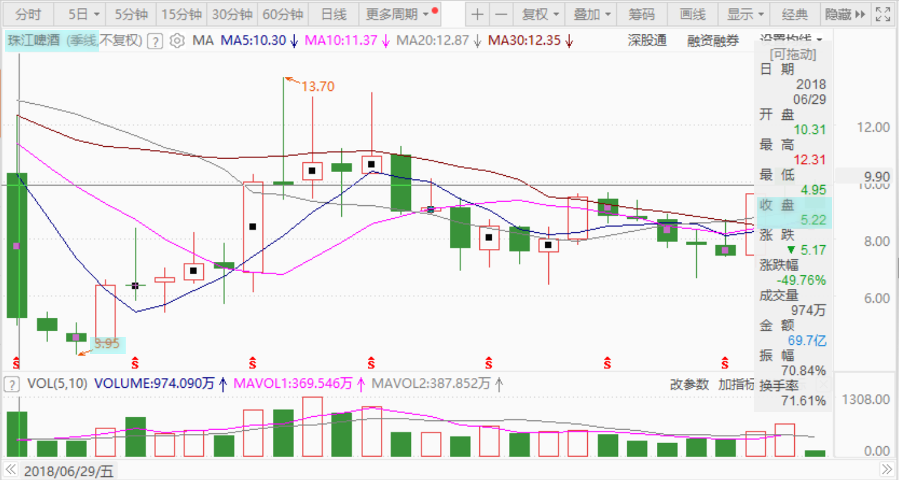

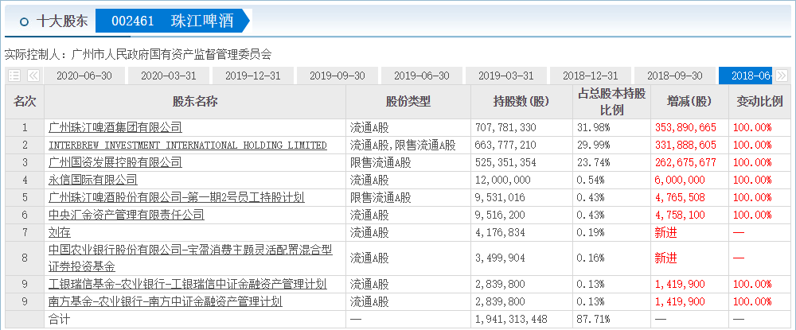

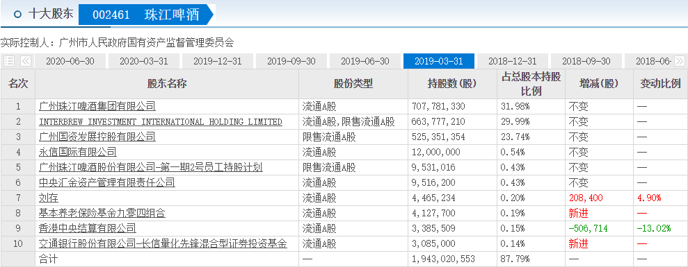

同期，燕京啤酒是啥情况？2018年半年报，收盘价是6.67元，整整比珠江高一元多。年底燕京跌到了5.6元，也比珠江的4.29元价格高1.31元。

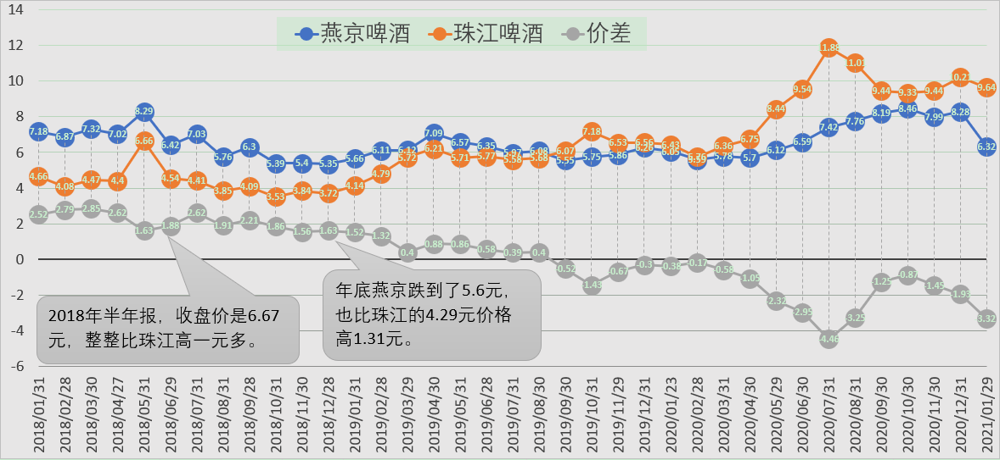

所以，当初我认为珠江更低估，所以主要的持仓就买了珠江。后来是珠江涨了之后，燕京才越换越多的。

也就是**看历史走势，珠江高于燕京其实是“异常”的，正常情况下，是燕京高于珠江的。**直到去年1月份，燕京收盘价是6.29元，珠江6.93元，珠江开始有一点点反超，但两者的股价，还是差不多的。

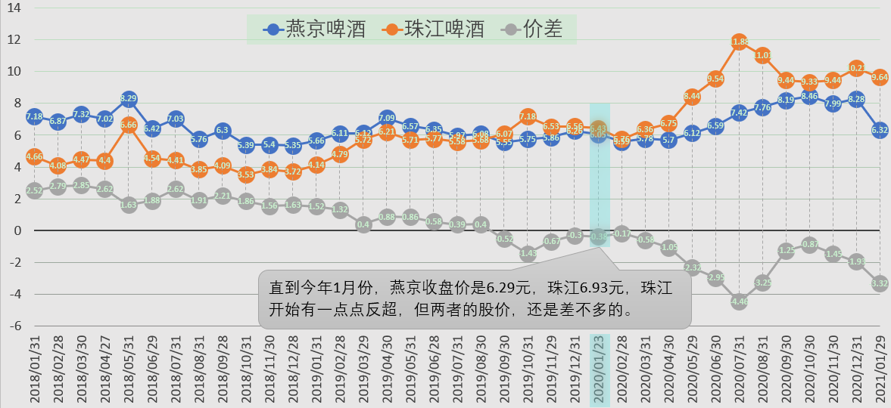

去年的珠江，大家已经看到了，率先上涨，大起大落的。停顿下来修整六个月期间，这几个月，是惠泉表演上涨。而燕京，一直是温吞水一杯。现价跟三年前也差不多。至今，惠泉、珠江，股价均远远超过燕京。坚持持有燕京的人，估计这一年过得很窝火，拿的就是假酒！

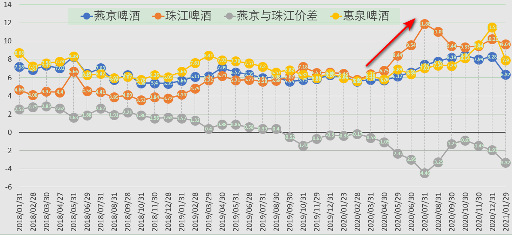

我的运气特别好。2018年开始看中珠江，买入了很多股。2019年年底，看中了惠泉，这一年我成为珠江和惠泉两家公司的十大。今年惠泉还不断增仓，最高到了三大位置。这两只股，均大幅上涨，给了我比上涨幅度更大的回报（因为我做T）。其中我记得买惠泉的相当一部分股票，是因为燕京的价格一度比惠泉高，我卖掉燕京买入的惠泉。惠泉和珠江涨高后，我就卖出了。高点看到燕京依然不涨，所以买了燕京，这部分筹码导致了套牢。但要说起来，也是“黄金套”，相比惠泉、珠江持仓不动跟随下跌的话，可能损失更多。**将来燕京恢复地位，股价高于惠泉、珠江的时候，我的啤酒利润就更精彩了**。因为我的燕京目前持仓，比惠泉、珠江加起来都要多不少。目前是酒类第一持仓股。

算一下账：2018年年中，燕京比珠江高1.3元每股。现在的珠江，比燕京高3.7元每股！如果市场恢复2018年年中的定价估值，燕京的价格跟现价的珠江比价的话，应该相当于13元以上。现价以一股珠江，换一股燕京，你得到的“差价空间”大约是7元！你认为，现价是拿着珠江好，还是燕京好？

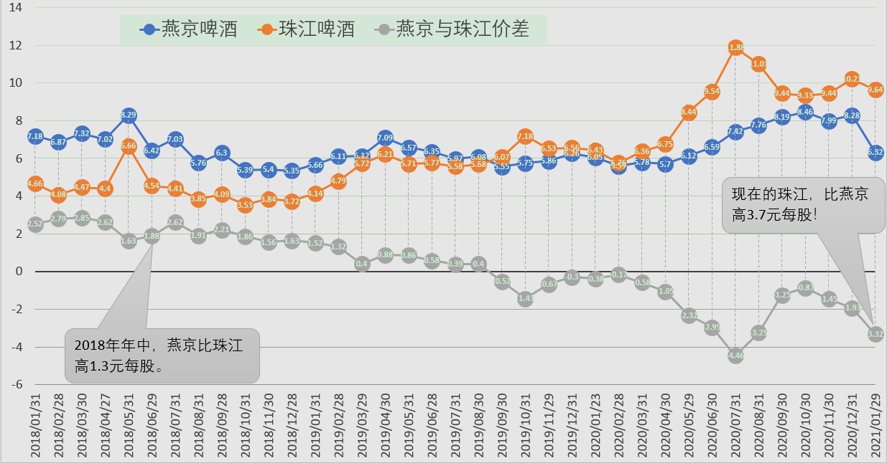

**如果用销量来定价格，燕京销量是珠江的三倍，总市值也应该是三倍吧？**

所以，这就是我拿燕京的逻辑，这就是基本面判断。至于依然持有不少珠江和惠泉啤酒的逻辑，就是：**这两只股，从技术面上来说，是具有上涨的动力，而且主力动作明显。**燕京，技术上是空头排列。所以，短期来说珠江和惠泉的趋势良好，股性更活。要炒股的话，目前是珠江最优，惠泉也不赖。当然，炒股很危险。所以，我只拿一部分资金来玩，反正有厚厚的利润垫底，做T补仓高价买入也不怕。如果我是新资金，估计就是抱住燕京不放了。

[挖地雷](http://link.zhihu.com/?target=http%3A//xueqiu.com/n/%25E6%258C%2596%25E5%259C%25B0%25E9%259B%25B7)回复[清一山长](http://link.zhihu.com/?target=http%3A//xueqiu.com/n/%25E6%25B8%2585%25E4%25B8%2580%25E5%25B1%25B1%25E9%2595%25BF)：

有个问题，买股买龙头，为啥当初不进青岛，山大。第一次提问。

[清一山长](http://link.zhihu.com/?target=https%3A//xueqiu.com/9310099567)回复[挖地雷](http://link.zhihu.com/?target=http%3A//xueqiu.com/n/%25E6%258C%2596%25E5%259C%25B0%25E9%259B%25B7)：

青啤我买了，26元买的，现在手上都还有。但是它涨了，特别是涨多了，我就不说了，这是做人的道德和良心。我只介绍还在底部的股，不吹高高在上的龙头。看我吹过龙头万华吗？我可一路持有呢！已经赚了不少了。

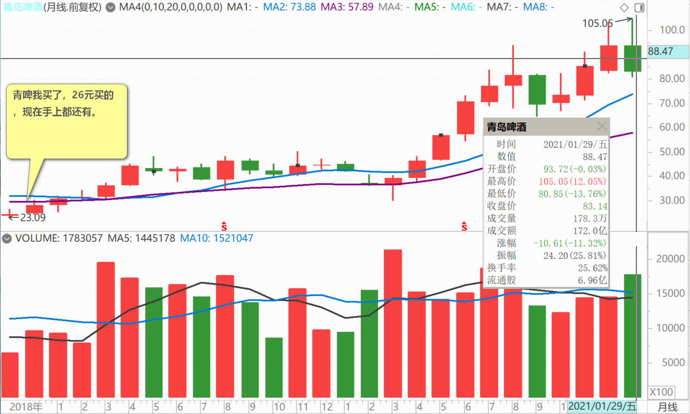

珠江、惠泉，超过10元，我就不多说了，不支持买。但你以为我走了？不会的。**珠江就算20元，我可能都还在的，负成本持有。**

[清一山长](http://link.zhihu.com/?target=https%3A//xueqiu.com/9310099567)2021-[02-10](http://link.zhihu.com/?target=https%3A//xueqiu.com/9310099567/171515139)续评主贴

短期来说珠江和惠泉的趋势良好，股性更活。要炒股的话，目前是珠江最优，惠泉也不赖。我这半个多月前发的帖子，是不是说得很准？珠江昨天涨停，应验了我的判断。当然，也让我走得更坚决，因为**珠江和燕京的差价，拉到了4元。惠泉的差价，拉到了3元。这个价，该换股了，别贪！**

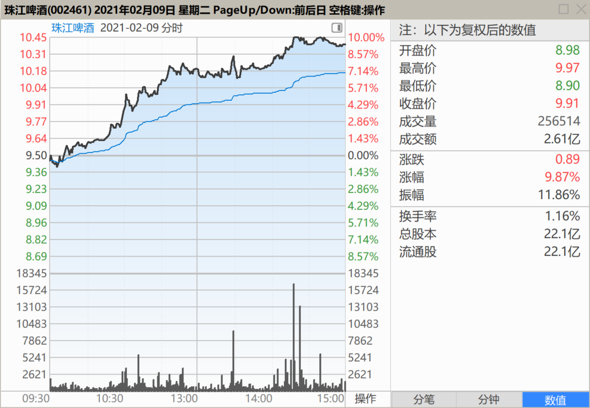

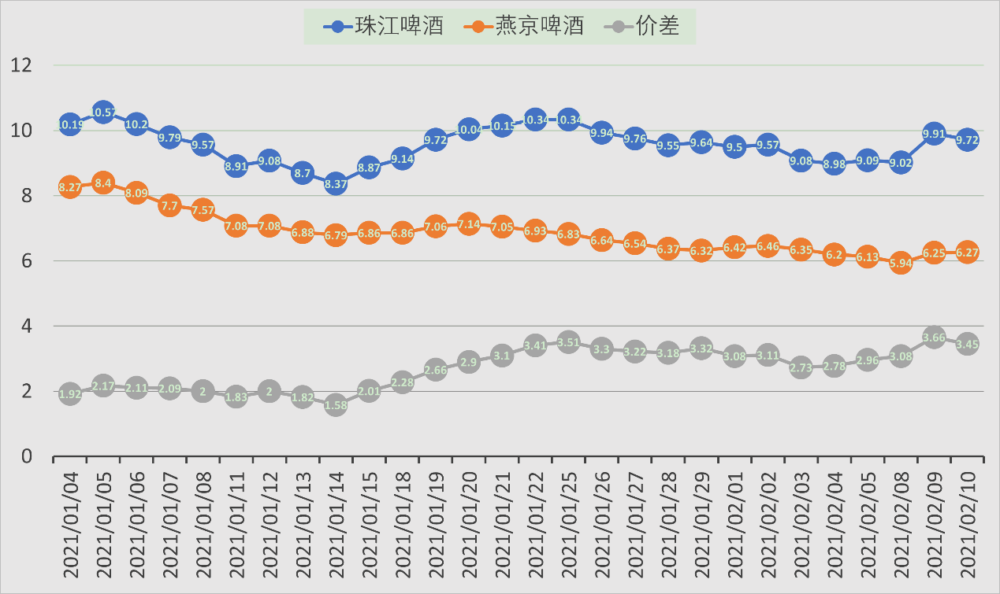

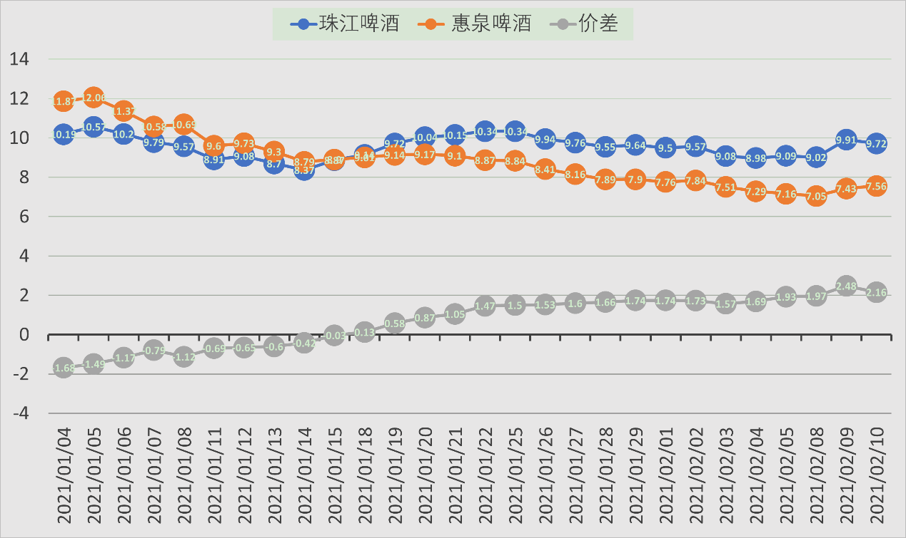

(标题、图片为编者所加)

**文章音频**：

[528篇.短期来说珠江和惠泉的趋势良好，股性更活](http://link.zhihu.com/?target=https%3A//www.ximalaya.com/sound/797714682)

**参考链接：**

[86篇.吓人的目的是让你卖掉快逃](https://zhuanlan.zhihu.com/p/8712468814)

[87篇.早盘急拉代表什么？](https://zhuanlan.zhihu.com/p/10710257712)

[88篇.燕京还要趴多久？](https://zhuanlan.zhihu.com/p/11401524818)

[89篇.燕京我只关心两件事](https://zhuanlan.zhihu.com/p/13349235291)

[90篇.谁会是市场斩杀的对象](https://zhuanlan.zhihu.com/p/14718449608)

[91篇.如何看进出时机？](https://zhuanlan.zhihu.com/p/16488305045)

[92篇.珠江投资的反省总结](https://zhuanlan.zhihu.com/p/17164493123)

[93篇.揭开燕京的奥秘](https://zhuanlan.zhihu.com/p/18185937465)
