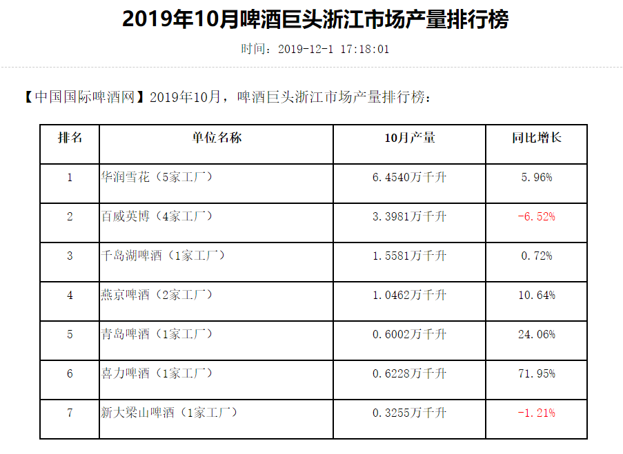

95篇.燕京的经营很稳健

清一山长2021年1月24日

（下文链接）

[公募重仓股轮番创新高，但斌认为机构抱团取暖观点片面](http://link.zhihu.com/?target=https%3A//baijiahao.baidu.com/s%3Fid%3D1687575111058795213)

今早上网，看见某有千万粉丝大V，发了一条这样的微博：“中国股民的惯常思维，比如找热点，想象板块轮动，抱团取暖等等。最近说基金抱团取暖的声音甚嚣尘上，这种说法极其片面，如果企业业绩不好，没有持续增长，抱团能抱得住吗？！垮掉退市的公司还少吗……有些人亏钱了，不自己找原因，尽找借口！”

我当即评论：出不来急了！乐视网当年不是基金抱团炒上去的？康美药业、重庆啤酒、华锐风电、全通教育······哪个不是公、私募基金机构的杰作？苦命的散户有这个能力？

为了给他留一块遮羞布，我打上马赛克截图如下：……

[挑战当今数千万股民的智商绝对没有好下场 今早上网，看见某有千万粉丝大V，发了一条这样的微博：“中国股民的惯常思维，比如找热点，想象板块轮动，抱团取暖等等。最近说... - 雪球](http://link.zhihu.com/?target=https%3A//xueqiu.com/7228103229/167026666)

清一山长2021-01-22 22:18评论上贴：

我是亲历过重啤事件的人。当时我在大户室，看到低迷市道下，重啤一路向上，周围的疯狂，就像是今天茅台一样，没买的人恨自己没眼光。买了的人神气活现，自吹自擂，自己眼光多毒辣，这个股有多牛，多么不可替代。我的专户经理，也对我说这个股有多么的好，多么值得投资，他有基金的内部消息——疫苗一定通过，基金都在拼命买，让我也买一点。当然，我没买。后来——你们知道结果了。

今天偶然看重啤，原来比茅台更“茅”。本文一语中的——这一万多股东，筹码集中度多高？想想就知道猫腻了。高价吹票的人，统统列为居心不良就行了。我的万华化学，30多元买的。涨起来我就不吭、不吹。为啥？现在这价，我真不敢买。但觉得也许有人抬轿，也舍不得下来，就这样混呗！但真心不希望粉丝跟随买。所以我只说要卖！准备卖！这是良心。**好股高价都不敢吹。**

不过，我不认为基金会宣扬让散户来接盘，这种手法太低级了。**基金的做法高明得多，是发新基金，让新基金来接盘。**没看见现在宣传“打不赢就买基”的调调吗？让你直接拿钱给他，他去玩“击鼓传花”的游戏。比忽悠你来买抱团股，要简单多了。

我就是不知道以后咋收场，但我估计应该不会狂跌的。因为：新基金发得太多了！用小基民的钱去抱团，取得“良好业绩”，比辛辛苦苦地发掘价值股简单多了。只要基民不抱团离场，这个游戏就永远不会爆。

（下文链接）

[2019年10月啤酒巨头浙江市场产量排行榜-行业数据--中国国际啤酒网-](http://link.zhihu.com/?target=http%3A//haicent.com/list.asp%3Fid%3D83195)

数据：10月份，在浙各大啤酒集团公司的产量分别为：

华润雪花啤酒（5家工厂）的产量为64540KL，同比增长5.96%，累计产量1035885KL,同比下降5.00％；

百威英博啤酒（4家工厂）的产量为33981KL，同比下降6.52%，累计产量536549KL,同比下降6.46%；

千岛湖啤酒（1家工厂）的产量为15581KL,同比增长0.72%，累计产量179957KL,同比下降1.97%；

燕京啤酒（2家工厂）的产量为10462KL,同比增长10.64%，累计产量136948KL,同比下降6.34%；

青岛啤酒（1家工厂）的产量为6002KL,同比增长24.06%，累计产量96545KL,同比下降15.81%;喜力啤酒（1家工厂）的产量为6228KL,同比增长71.95%，累计产量62643KL,同比增长0.46%；

新大梁山啤酒（1家工厂）的产量为3255KL,同比下降1.21%，累计产量39640KL,同比下降19.42%。

清一山长2021-01-24 22:31评论上文

$燕京啤酒(SZ000729)$ 9月份燕京是同比下降的，10月份销量增长两位数，**仅次于青岛和喜力，数据说明燕京的经营很稳健。**

(标题、图片为编者所加)

文章音频：

[530篇. 燕京的经营很稳健](http://link.zhihu.com/?target=https%3A//www.ximalaya.com/sound/799718979)

**参考链接：**

[86篇.吓人的目的是让你卖掉快逃](https://zhuanlan.zhihu.com/p/8712468814)

[87篇.早盘急拉代表什么？](https://zhuanlan.zhihu.com/p/10710257712)

[88篇.燕京还要趴多久？](https://zhuanlan.zhihu.com/p/11401524818)

[89篇.燕京我只关心两件事](https://zhuanlan.zhihu.com/p/13349235291)

[90篇.谁会是市场斩杀的对象](https://zhuanlan.zhihu.com/p/14718449608)

[91篇.如何看进出时机？](https://zhuanlan.zhihu.com/p/16488305045)

[92篇.珠江投资的反省总结](https://zhuanlan.zhihu.com/p/17164493123)

[93篇.揭开燕京的奥秘](https://zhuanlan.zhihu.com/p/18185937465)

[94篇.短期来说珠江和惠泉的趋势良好，股性更活](https://zhuanlan.zhihu.com/p/1960281323)
