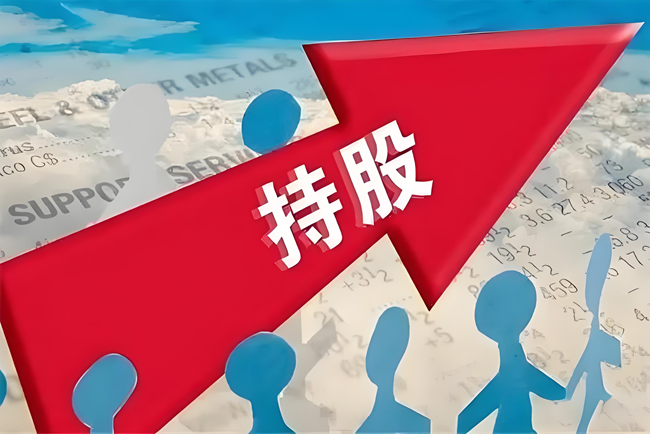
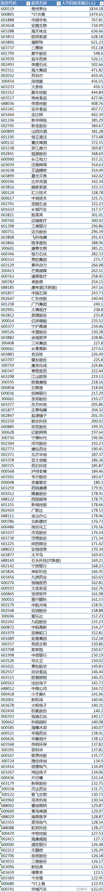
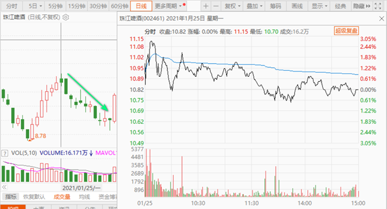
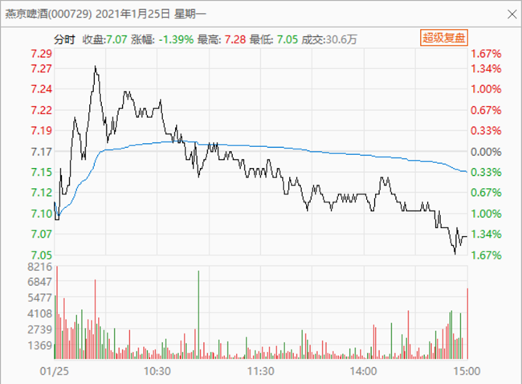

96篇.啤酒的人均持股

清一山长2021年1月25日

**[清一山长](http://link.zhihu.com/?target=https%3A//xueqiu.com/9310099567)**2021-[01-25 10:40](http://link.zhihu.com/?target=https%3A//xueqiu.com/9310099567/169783030)

[$珠江啤酒 (SZ002461)$](http://link.zhihu.com/?target=http%3A//xueqiu.com/S/SZ002461)**珠江啤酒，人均持股55万元。燕京就更低了，人均持股21万元。重庆啤酒，人均持股372万元。**抱团股（散户都走了），股价就会大涨了。所以，大家都去买抱团股吧！燕京啤酒看样子不行了——人均持股太低，最新又公布了持仓人数，今年就已经公布两次了。持股人数再创新高，快10万人了。散户不死，下跌就不止[大笑]。

[欲速则不达1129](http://link.zhihu.com/?target=http%3A//xueqiu.com/n/%25E6%25AC%25B2%25E9%2580%259F%25E5%2588%2599%25E4%25B8%258D%25E8%25BE%25BE1129)回复[清一山长](http://link.zhihu.com/?target=http%3A//xueqiu.com/n/%25E6%25B8%2585%25E4%25B8%2580%25E5%25B1%25B1%25E9%2595%25BF)：（跟评上贴）

山长，是更建议买人均持股多的吗？

[清一山长](http://link.zhihu.com/?target=https%3A//xueqiu.com/9310099567)2021-01-25 10:48回复[欲速则不达1129](http://link.zhihu.com/?target=http%3A//xueqiu.com/n/%25E6%25AC%25B2%25E9%2580%259F%25E5%2588%2599%25E4%25B8%258D%25E8%25BE%25BE1129)：

没有。我建议买这个名单上的第一名，茅台！千万别跟散户在一起混，要跟主力在一起[俏皮]。我原来都做错了，你们别跟我一起错[加油]。

[清一山长](http://link.zhihu.com/?target=https%3A//xueqiu.com/9310099567)2021-[01-25 14:41](http://link.zhihu.com/?target=https%3A//xueqiu.com/9310099567/169822663)

[$珠江啤酒 (SZ002461)$](http://link.zhihu.com/?target=http%3A//xueqiu.com/S/SZ002461)**开盘就急拉的股，一般就是要调整的。除非重大利好出台。**

**开盘就急跌的股，一般后来会涨**。这些动作，都说明老子的智慧：“**反者道之动！”**

**[清一山长](http://link.zhihu.com/?target=https%3A//xueqiu.com/9310099567)**2021-[01-25 15:00](http://link.zhihu.com/?target=https%3A//xueqiu.com/9310099567/169825995)（主贴1）

[$燕京啤酒 (SZ000729)$](http://link.zhihu.com/?target=http%3A//xueqiu.com/S/SZ000729) 走得真好。今天的分时图，是典型的拉升出货手法——主力在出货。量再大一点，就更逼真了。真的要跌到5元呀[捂脸]？

[怎样才能不想你](http://link.zhihu.com/?target=http%3A//xueqiu.com/n/%25E6%2580%258E%25E6%25A0%25B7%25E6%2589%258D%25E8%2583%25BD%25E4%25B8%258D%25E6%2583%25B3%25E4%25BD%25A0)回复[清一山长](http://link.zhihu.com/?target=http%3A//xueqiu.com/n/%25E6%25B8%2585%25E4%25B8%2580%25E5%25B1%25B1%25E9%2595%25BF):（跟评主贴1）

山长您再调戏燕京，还真有可能主力明天就卖5个亿，死给大家看[俏皮]。

[清一山长](http://link.zhihu.com/?target=https%3A//xueqiu.com/9310099567)2021-[01-25 16:17](http://link.zhihu.com/?target=https%3A//xueqiu.com/9310099567/169837813)回复[怎样才能不想你](http://link.zhihu.com/?target=http%3A//xueqiu.com/n/%25E6%2580%258E%25E6%25A0%25B7%25E6%2589%258D%25E8%2583%25BD%25E4%25B8%258D%25E6%2583%25B3%25E4%25BD%25A0)：

没事，主力真要跳楼，我就卖了房子，自己住帐篷去。把卖房子的钱拿来买燕京，填主力的大坑去，救援主力一把。谁让我跟主力都看上了燕京呢？燕京倒霉了，我们就有难同当，主力跳楼死了，我也过不好日子了，也跟他一起流浪街头好了[大笑]。

[涨跌都慌](http://link.zhihu.com/?target=http%3A//xueqiu.com/n/%25E6%25B6%25A8%25E8%25B7%258C%25E9%2583%25BD%25E6%2585%258C)回复[清一山长](http://link.zhihu.com/?target=http%3A//xueqiu.com/n/%25E6%25B8%2585%25E4%25B8%2580%25E5%25B1%25B1%25E9%2595%25BF):（跟评主贴1）

晒晒账户，我不信你重仓燕京。

**[清一山长](http://link.zhihu.com/?target=https%3A//xueqiu.com/9310099567)**2021-[01-25 16:37](http://link.zhihu.com/?target=https%3A//xueqiu.com/9310099567/169840527)回复[涨跌都慌](http://link.zhihu.com/?target=http%3A//xueqiu.com/n/%25E6%25B6%25A8%25E8%25B7%258C%25E9%2583%25BD%25E6%2585%258C)：

您真聪明，您是对的，我的确没重仓燕京，因为我就没卖房。最起码，我占地12000平方，建筑面积4000平方的大房子，还没卖出去呢！有人要不？等我卖掉了，我就拿这些钱来，真的重仓燕京了[大笑]。

[持有股票](http://link.zhihu.com/?target=https%3A//xueqiu.com/u/9311658241) [发布于2021-01-24 18:19](http://link.zhihu.com/?target=https%3A//xueqiu.com/9311658241/169728714)

[人均持股金额排行榜(不包括十大流通股东持股)](http://link.zhihu.com/?target=https%3A//xqimg.imedao.com/177380da7654a0153fc8f3fa.jpeg%21raw.jpg)，统计条件=(股本-十大流通股东持股)/持股人数

[https://xueqiu.com/9311658241/169728714](http://link.zhihu.com/?target=https%3A//xueqiu.com/9311658241/169728714%2520)

[清一山长](http://link.zhihu.com/?target=https%3A//xueqiu.com/9310099567)2021-[01-25 17:52](http://link.zhihu.com/?target=https%3A//xueqiu.com/9310099567/169849606)评论上贴：

打赏66元。因为，我想找啤酒的人均，累死了还没找到。心想博主要做出这个表格，更不容易，虽然有软件帮助。打赏是表示对贴主用心的感谢！我认为：有心人，能够从这些数据中，找到对自己有利的信息。我看到了健康元人均10万，有点低。我想：也许可以研究一下。

(标题、图片为编者所加)

文章音频：

[532篇. 啤酒的人均持股](http://link.zhihu.com/?target=https%3A//www.ximalaya.com/sound/801745062)

**参考链接：**

[91篇.如何看进出时机？](https://zhuanlan.zhihu.com/p/16488305045)

[92篇.珠江投资的反省总结](https://zhuanlan.zhihu.com/p/17164493123)

[93篇.揭开燕京的奥秘](https://zhuanlan.zhihu.com/p/18185937465)

[94篇.短期来说珠江和惠泉的趋势良好，股性更活](https://zhuanlan.zhihu.com/p/1960281323)

[95篇.燕京的经营很稳健](https://zhuanlan.zhihu.com/p/20722962985)
