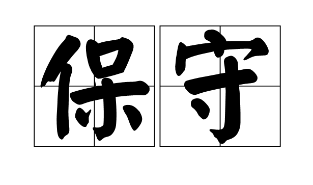
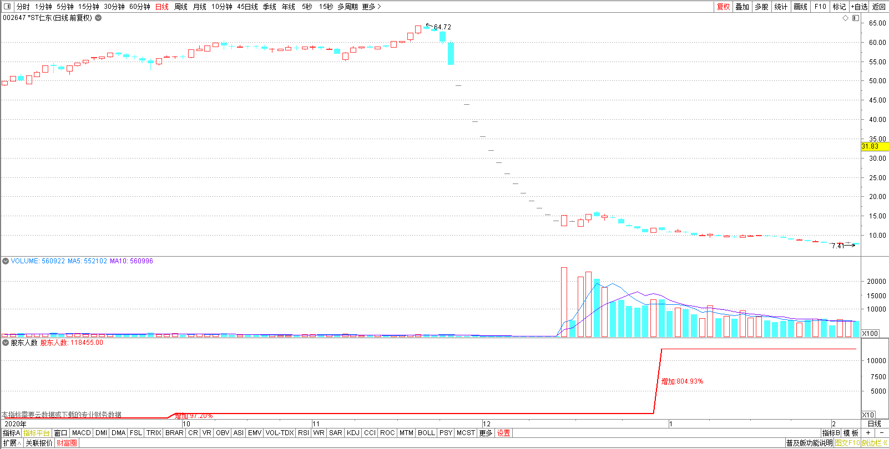
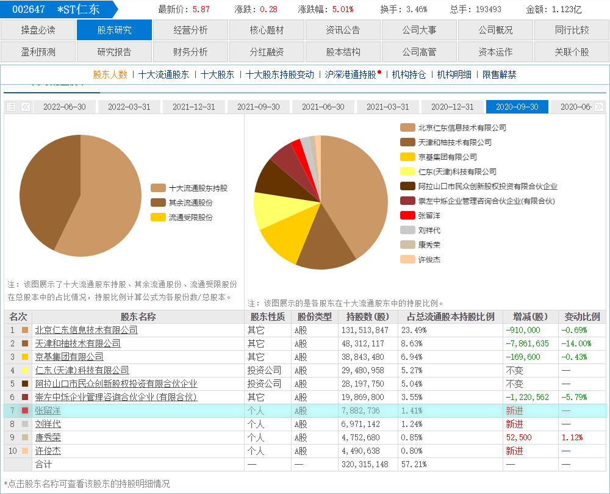
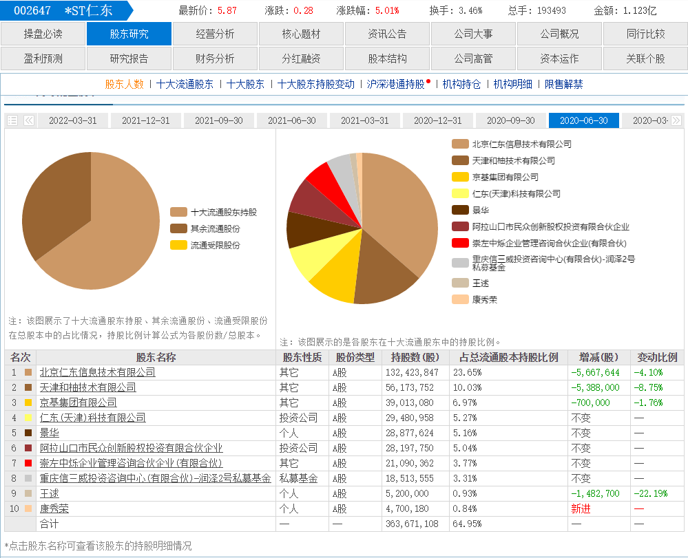
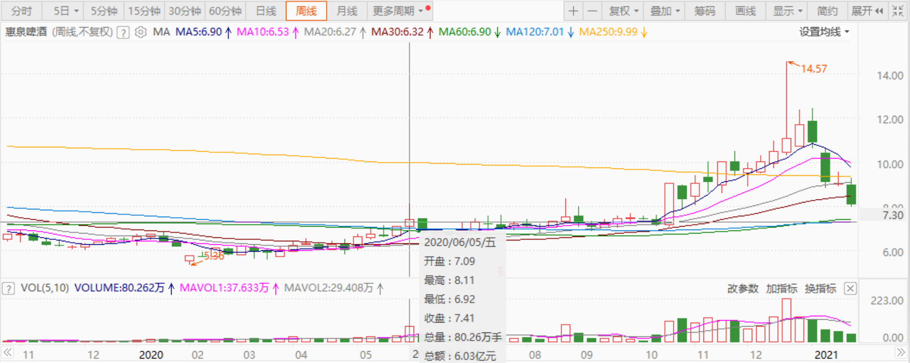
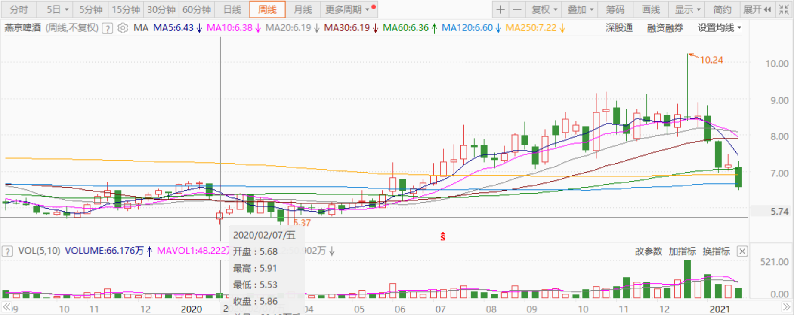
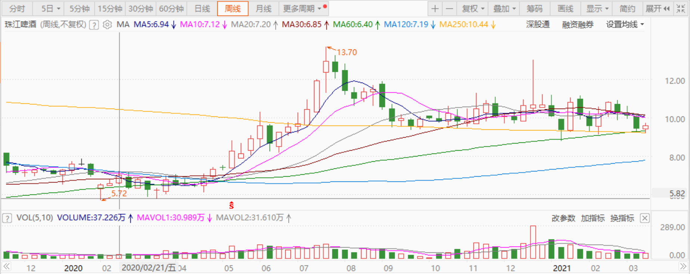

**

**

98篇.我比唐建华还要保守

清一山长2021年1月27日

[清一山长](http://link.zhihu.com/?target=https%3A//xueqiu.com/9310099567)[修改于2021-01-27 13:18](http://link.zhihu.com/?target=https%3A//xueqiu.com/9310099567/170050640)（主贴1）

[$仁东控股(SZ002647)$](http://link.zhihu.com/?target=http%3A//xueqiu.com/S/SZ002647) 看新闻中，[报道曾经的亿万牛散张留洋爆仓变“亿万负翁”](http://link.zhihu.com/?target=https%3A//news.sina.com.cn/o/2021-01-21/doc-ikftpnny0024417.shtml)，倒欠券商近亿元。我查了一下：张留洋是仁东的去年第三季度第七大股东。第三季度持仓788万股，收盘价是56元每股。他持仓的金额超过4个亿！妥妥的亿万牛散！

今天咋样了？个人资产清零，还倒欠券商近亿元，还上了法院。家庭总资产，恐怕也清零了——法院执行。一个轻轻松松的大富豪，从此成为月光族。划得来吗？

我奇怪的是：已经有这么多的资产，犯得着去赌吗？老老实实地拿个高息的大蓝筹，每年分红一千多万，还要赚多少钱才够？

凡是在股市上有点经历，都做到牛散了，不至于这么弱智吧？去追买垃圾股？这就是要找抽的股。

查看了一下：第2季度仁东收盘35元的时候，没见到张留洋的持股记录。也就是说：这个人拿着超过两个亿的自有资产，去豪赌一把庄股，还融资了。这种动静，也太不成熟了。追涨是无知小散的特性，张留洋也这样玩？资金大，未必就头脑好呢！

再查看他的投资历史，查不到了。似乎张留洋来市场上总共就做了这么一次牛散，一个季度的牛散，就爆仓了。他留下的历史，就是一个笑话！

不像唐建华，查得到很多年的持股投资历史，特别的稳健。也基本上算得出他赚的钱。从上一次当牛散退出的资本，看得出这一次基本上全仓了燕京。

张留洋，难道是个富二代，是被庄家的推销员忽悠进来的超级大韭菜吗？很可能！中国的富二代，就是市场大鳄们猎取的对象。

我的商学院，经常提醒学生们注意的，就是：**小心成为猎物。**你们注定是别人的猎物。进入资本市场，别想去猎取别人，别以为自己多牛，首先要保证自己不要成为猎物。所以，**我永远不追高**。宁肯错过大牛股，再去找趴在地上的“垃圾股”，也不去“跑赛道”。**只要抱着吃利息的心来炒股，不贪心，就不会有危险。**

其实，**我比唐建华还要保守，**因为我比他更担心。**不仅仅选择低位才进入，而且就算是重仓啤酒，并没有单选全仓一只，而是四只。**我还买了银行、买了中国建筑等，**这些分散操作，都是避免“爆仓”的保护性措施。**当然，我也知道：如果我全仓珠江或者惠泉，我的利润就太高了，几倍的利润。但万一我全仓了燕京，就很难看了。所以，分散持仓的结果，我得到了一个相对平庸的回报。最大的好处，就是不会爆仓。

如果您不想动脑子，想单选一只A股，还想融资持有，多赚一点，选谁呢？建议您选5元以下的中国建筑。每年10～15%的资产增值，抵消了融资利息的消耗，长期拿着，是不会失败的标的。如果两只？加上江苏银行吧！这个价，应该亏不了。

只要保证你不亏，你就有机会！风一来，你肯定就赚了。

啤酒，其实也亏不了。低位进入，就不用担心。**高位，无论什么好股，包括贵州茅台、万华化学，啥的，全都要警惕，远离。**更别说仁东这样的烂股了！

[股灾亲历者](http://link.zhihu.com/?target=http%3A//xueqiu.com/n/%25E8%2582%25A1%25E7%2581%25BE%25E4%25BA%25B2%25E5%258E%2586%25E8%2580%2585)回复[清一山长](http://link.zhihu.com/?target=http%3A//xueqiu.com/n/%25E6%25B8%2585%25E4%25B8%2580%25E5%25B1%25B1%25E9%2595%25BF)：（跟评主贴1）

我现在满仓满融单一个[格力电器](http://link.zhihu.com/?target=https%3A//xueqiu.com/S/SZ000651%3Ffrom%3Dstatus_stock_match)，也有点像赌。不会像他没成富翁，变负翁吧？

**[清一山长](http://link.zhihu.com/?target=https%3A//xueqiu.com/9310099567)**2021-01-27 11:15回复[股灾亲历者](http://link.zhihu.com/?target=http%3A//xueqiu.com/n/%25E8%2582%25A1%25E7%2581%25BE%25E4%25BA%25B2%25E5%258E%2586%25E8%2580%2585)：

爆不爆仓不知道。但20倍的PE，覆盖不掉融资的利息，赚不赚就很难说了。一两年前，格力冲56元我就跑了，换了40元的[万华化学](http://link.zhihu.com/?target=https%3A//xueqiu.com/S/SH600309%3Ffrom%3Dstatus_stock_match)，因为我认为万华的赛道更好！你融资持有，理由是啥呢？

跟你赌一把！满仓满融格力，我认为跑不过满仓满融5PE的[中国建筑](http://link.zhihu.com/?target=https%3A//xueqiu.com/S/SH601668%3Ffrom%3Dstatus_stock_match)。三年为期！输了打赏1元[大笑]

[早晨之子](http://link.zhihu.com/?target=http%3A//xueqiu.com/n/%25E6%2597%25A9%25E6%2599%25A8%25E4%25B9%258B%25E5%25AD%2590)回复[股灾亲历者](http://link.zhihu.com/?target=http%3A//xueqiu.com/n/%25E8%2582%25A1%25E7%2581%25BE%25E4%25BA%25B2%25E5%258E%2586%25E8%2580%2585)：（跟评主贴1）

市场上又有谁，股票只买不卖。炒股收益远远超过任何长期持股和做T的人？如贵州国资委，每年卖几百亿的茅台股[大笑]。

[股灾亲历者](http://link.zhihu.com/?target=http%3A//xueqiu.com/n/%25E8%2582%25A1%25E7%2581%25BE%25E4%25BA%25B2%25E5%258E%2586%25E8%2580%2585)2021-01-27 11:40回复[早晨之子](http://link.zhihu.com/?target=http%3A//xueqiu.com/n/%25E6%2597%25A9%25E6%2599%25A8%25E4%25B9%258B%25E5%25AD%2590)：

我不知道A股市场上高抛低吸的高手，哪个炒股收益率，超过了[董明珠“只买不卖](http://link.zhihu.com/?target=http%3A//phtv.ifeng.com/a/20160306/41559341_0.shtml)”的收益率？[大笑]

[清一山长](http://link.zhihu.com/?target=https%3A//xueqiu.com/9310099567)2021-01-27 13:39

[$燕京啤酒 (SZ000729)$](http://link.zhihu.com/?target=http%3A//xueqiu.com/S/SZ000729) 查看惠泉啤酒的走势、周线图，是很像是主力已经成功出逃了，是一次完美的出逃记录，赚走了大量的利润。现在大量的筹码涌出来，很多小散高位接盘，换手很充分。目前格局是多杀多，很惨烈，都是套牢的小散自己互相伤害，未见主力有建仓举动。估计8元～9元附近，会盘整很久了。原来的牛气不再，除非主力换庄，重新进入。但这个筹集筹码的过程很长，一般人耐心有限。我就陪着熬吧！反正才两元的成本。教训就是：买早了，如果我现在买入，成本就不到一元了。由于下跌空间也不大，最多跌到6元多吧？我就不动了。不准备减仓了，观望中。

**教训：高位T卖出后，不要急于补回。**导致盈利大幅减少。

感谢：反正也是主力赏饭吃，多多少少，都要感谢。比持股不动强多了。

下图是燕京啤酒的走势，与惠泉相比较，具有实质性的不同。**惠泉拉高出货，主力是赚钱的**。燕京如果是出货，主力是不赚钱的。要出，就要有拉高的动作，燕京完全没有，非常的奇怪。所以，我判断燕京的主力没有走。它的周线图，太平淡了。**珠江啤酒，主力出货后进入平台整理，收集阶段。**现在没有进出的愿望，观望中。

未来：珠江应该是率先拉升的，燕京殿后。现在看样子，主力还没有完成筹码的收集工作，目前还是打压吸筹阶段。所以**别指望燕京会快速上涨，就算涨，也要不断震荡的，很多人会在震荡中下车的。**

(标题、图片为编者所加)

文章音频：

[536篇. 我比唐建华还要保守](http://link.zhihu.com/?target=https%3A//www.ximalaya.com/sound/806758937)

**参考链接：**

[91篇.如何看进出时机？](https://zhuanlan.zhihu.com/p/16488305045)

[92篇.珠江投资的反省总结](https://zhuanlan.zhihu.com/p/17164493123)

[93篇.揭开燕京的奥秘](https://zhuanlan.zhihu.com/p/18185937465)

[94篇.短期来说珠江和惠泉的趋势良好，股性更活](https://zhuanlan.zhihu.com/p/1960281323)

[95篇.燕京的经营很稳健](https://zhuanlan.zhihu.com/p/20722962985)

[96篇.啤酒的人均持股](https://zhuanlan.zhihu.com/p/21559367964)

[97篇.借燕京看粉转黑有多快](https://zhuanlan.zhihu.com/p/23176487676)
